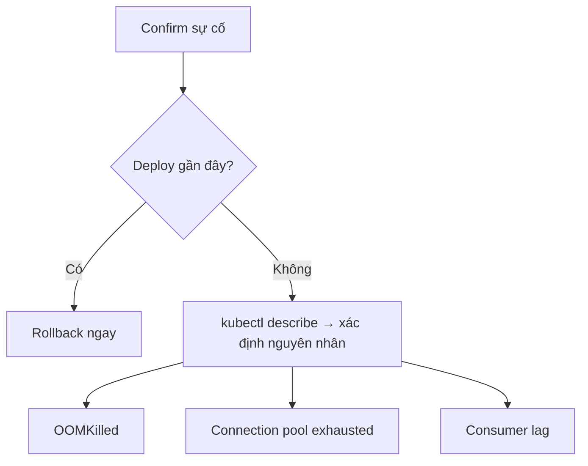

# Fumadocs component syntax for interview-question pages

Only the components relevant to this page shape. For the full component set (Tabs, TypeTable, Files, etc.) see `fumadocs-technical-writer`'s `references/fumadocs-components.md` if that skill is also installed.

## Callout

```mdx
<Callout title="Coi chừng" type="warn">
  Restart theo lịch chỉ là biện pháp tạm, không phải fix thật.
</Callout>
```
Types: `info` (default), `warn`, `error`, `idea`. Use in place of a GFM alert when the project doesn't have GFM alerts configured — see the SKILL.md "Alert syntax" section for when to pick which.

## Cards (for "Xem thêm")

```mdx
<Cards>
  <Card
    title="Heap vs Off-heap memory trong Java"
    href="/docs/java/heap-vs-off-heap"
    description="Cần hiểu heap để debug đúng Kịch bản 2."
  />
  <Card
    title="Connection pool tuning cho Spring Boot"
    href="/docs/database/connection-pool-tuning"
    description="Mở rộng thêm về Kịch bản 1."
  />
</Cards>
```
Requires `import { Card, Cards } from 'fumadocs-ui/components/card';` if the project doesn't auto-register it. Falls back cleanly to a plain markdown bullet list (as shown in the main SKILL.md) if the project doesn't have this component set up — plain links are always a safe default.

## Accordion (only if follow-up questions grow long)

```mdx
import { Accordion, Accordions } from 'fumadocs-ui/components/accordion';

<Accordions type="single">
  <Accordion title="Điều gì xảy ra nếu leadership yêu cầu update mỗi 5 phút thay vì 10-15?">
    Trả lời ở đây.
  </Accordion>
</Accordions>
```
Only reach for this past ~6 follow-up questions; below that, plain `###` headings are more scannable (readers can Ctrl+F / use the sidebar TOC to jump directly, which collapsed accordions hide from).

## Steps (only for a literal ordered checklist)

```mdx
import { Step, Steps } from 'fumadocs-ui/components/steps';

<Steps>
<Step>

### Confirm sự cố thật
Check error rate, pod status trong 1-2 phút.

</Step>
<Step>

### Alert team + assign IC
Tạo incident channel, assign một người coordinate.

</Step>
</Steps>
```
Use this only when a checklist section is meant to be followed strictly in order and benefits from visual step separation — a plain `- [ ]` checkbox list (as in the reference site's "Checklist 2h sáng") is equally valid and often simpler; don't force `<Steps>` onto content that's really just a recap checklist rather than a first-time walkthrough.

## Mermaid (for timelines / decision trees)

```mdx

```
See `fumadocs-technical-writer`'s Mermaid-vs-ASCII decision criteria for when this applies — timelines and "which scenario am I in" branching are exactly the cases that warrant it in this doc format.
