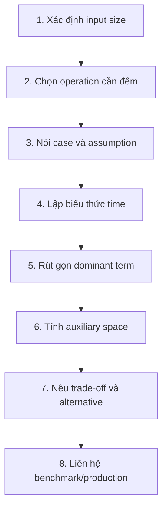

# Độ phức tạp thuật toán: Big O từ cơ bản đến thực chiến

## Câu hỏi

> **Độ phức tạp thuật toán là gì? Hãy giải thích Big O như `O(1)`, `O(log n)`, `O(n)`, `O(n log n)`, `O(n²)`, cách tính time/space complexity, và cách áp dụng khi review code hoặc tối ưu hệ thống thực tế.**

---

## Dành cho level

<Tabs items={["Mid", "Senior", "Staff"]}>

<Tab value="Mid">

Interviewer expect bạn đọc được một đoạn code có loop, nested loop hoặc binary search và suy ra đúng time/space complexity. Bạn cần phân biệt `O(1)`, `O(log n)`, `O(n)`, `O(n²)`, biết bỏ constant/lower-order term, và không nhầm hai loop nối tiếp với hai loop lồng nhau.

Điểm cộng: biết `ArrayList.contains()` là `O(n)`, `HashSet.contains()` thường là expected `O(1)`, và tính cả recursion stack vào space complexity.

</Tab>

<Tab value="Senior">

Interviewer expect bạn bắt đầu bằng việc xác định **input size là gì**, phân biệt worst/average/best case, expected với amortized complexity, và nhìn ra complexity ẩn trong library call, database access hoặc object allocation. Bạn cần giải thích được trade-off như đổi từ nested scan `O(n × m)` sang hash lookup `O(n + m)` nhưng phải trả thêm `O(m)` memory.

Điểm cộng: liên hệ được Big O với production profiling, cache locality, I/O, GC, query plan, data distribution và biết rằng asymptotic complexity không thay thế benchmark.

</Tab>

<Tab value="Staff">

Interviewer expect bạn dùng complexity như một công cụ thiết kế: chọn data structure theo workload, đặt constraint rõ ràng, nhận diện khi hệ thống sắp chạm “complexity cliff”, và biến insight đó thành guideline, benchmark, SLO hoặc guardrail cho team. Bạn cũng cần phân biệt total work với wall-clock latency, hiểu output-sensitive/parameterized complexity, và không dùng Big O để che mất bottleneck thật ở network, storage hay contention.

Điểm cộng: chứng minh được nhận định bằng recurrence/summation khi cần, nhưng vẫn giải thích đủ đơn giản để cả team ra quyết định.

</Tab>

</Tabs>

---

## Cốt lõi cần nhớ

**Big O mô tả tốc độ tăng của chi phí khi input lớn lên, không phải số giây chạy.** Trước khi nói `O(...)`, luôn trả lời ba câu: `n` là gì, operation nào đang được tính, và đang nói worst case, average case, expected hay amortized case.

**Giữ thành phần tăng nhanh nhất, bỏ constant và thành phần bậc thấp — nhưng chỉ sau khi đã lập đúng biểu thức.** `3n + 20` là `Θ(n)`; `n² + 100n` là `Θ(n²)`. Hai input độc lập phải giữ riêng: `O(n + m)` không được tùy tiện rút thành `O(n)`.

**Complexity giúp loại bỏ thiết kế không thể scale; profiling và benchmark mới xác nhận performance thực tế.** Một giải pháp `O(n)` có thể chậm hơn `O(n log n)` ở input nhỏ vì constant, cache miss, allocation hoặc I/O. Trong production, quyết định tốt phải nhìn cả time, peak memory, data distribution, latency tail và độ phức tạp vận hành.

---

## Câu trả lời mẫu

> “Tôi không bắt đầu bằng cách đếm số vòng `for`; tôi bắt đầu bằng việc xác định input nào sẽ tăng và operation nào là bottleneck. Trong một incident tôi từng xử lý, endpoint kiểm tra quyền bị chậm dần theo số user vì code loop qua danh sách user rồi gọi `List.contains()` trên danh sách quyền cho từng user, nên tổng chi phí là `O(n × m)` chứ không phải `O(n)`. Team chuyển danh sách quyền thành `HashSet` một lần với chi phí `O(m)`, sau đó lookup expected `O(1)` cho mỗi user, đưa tổng thời gian về expected `O(n + m)` và đổi lại dùng thêm `O(m)` memory. Khi trình bày Big O, tôi nói rõ `n`, `m`, worst/average/expected case và cả auxiliary space; tôi cũng tính những phần ẩn như sort, hash lookup, recursion stack hoặc database query. Tôi dùng Big O để loại những phương án sẽ vỡ khi data tăng, nhưng không dùng nó thay cho profiling vì cache locality, network, GC và constant factor vẫn quyết định latency thật. Nếu hai phương án có cùng complexity, tôi benchmark trên phân bố dữ liệu gần production và đo cả p95/p99 thay vì chỉ nhìn average. Mục tiêu cuối cùng không phải tìm ký hiệu đẹp nhất, mà là chọn trade-off đáp ứng constraint hiện tại và còn an toàn khi input tăng.”

---

## Phân tích chi tiết

### 1. Bắt đầu bằng một production scenario, không bắt đầu bằng công thức

Giả sử service cần lọc những user có quyền truy cập một feature:

```java
List<Long> userIds = loadActiveUserIds();        // n users
List<Long> allowedIds = loadAllowedUserIds();    // m allowed users

List<Long> result = new ArrayList<>();
for (Long userId : userIds) {                    // chạy n lần
    if (allowedIds.contains(userId)) {           // scan tối đa m phần tử
        result.add(userId);
    }
}
```

Nhìn bên ngoài chỉ có một vòng `for`, rất dễ trả lời nhầm là `O(n)`. Nhưng `List.contains()` tự loop bên trong, nên số lần so sánh trong worst case xấp xỉ:

```txt
n users × m phần tử cần scan cho mỗi user = n × m
```

Time complexity là `O(n × m)`. Nếu hai list cùng có kích thước gần bằng `n`, biểu thức trở thành `O(n²)`.

Khi `n = m = 1.000`, thuật toán có thể thực hiện khoảng một triệu phép so sánh. Khi cả hai cùng tăng gấp 10 lên 10.000, lượng so sánh có thể tăng khoảng 100 lần lên một trăm triệu. Con số này chỉ minh họa **tốc độ tăng**, không dự đoán chính xác thời gian chạy vì mỗi máy, JVM và loại dữ liệu có chi phí khác nhau.

Một cách đổi time lấy memory là tạo hash set:

```java
Set<Long> allowedSet = new HashSet<>(allowedIds); // expected O(m), space O(m)

List<Long> result = new ArrayList<>();
for (Long userId : userIds) {                     // O(n)
    if (allowedSet.contains(userId)) {            // expected O(1)
        result.add(userId);
    }
}
```

Bây giờ:

```txt
Build HashSet: expected O(m)
Scan users:    expected O(n)
Tổng:          expected O(n + m)
Extra space:   O(m), chưa tính output
```

Đây là giá trị thực tế của complexity analysis: không phải để thuộc ký hiệu, mà để nhìn ra vì sao latency tăng nhanh và trade-off nào có thể thay đổi đường tăng trưởng đó.

---

### 2. Big O thực sự đo điều gì?

Big O đo **growth rate** — tốc độ mà time hoặc memory tăng theo kích thước input.

Giả sử ba implementation có số operation gần đúng như sau:

```txt
A(n) = 5
B(n) = 3n + 20
C(n) = n² + 10n + 50
```

Khi `n` lớn:

- `A(n)` gần như không đổi → `O(1)`.
- `B(n)` tăng tỷ lệ với `n` → `O(n)`.
- `C(n)` bị `n²` chi phối → `O(n²)`.

Big O cố ý bỏ qua:

1. Đơn vị thời gian cụ thể như millisecond.
2. Hệ số constant như `3` trong `3n`.
3. Thành phần tăng chậm hơn như `10n` trong `n² + 10n`.
4. Chi tiết hardware/framework khi ta đang so growth rate.

Nhờ vậy, cùng một phân tích vẫn hữu ích dù code chạy trên laptop, EKS pod hay một máy mạnh hơn. Hardware nhanh hơn có thể giảm thời gian mỗi operation, nhưng không đổi việc quadratic work tăng khoảng 100 lần khi input tăng 10 lần.

#### Big O không nói “chương trình này nhanh”

Hai đoạn code đều `O(n)` nhưng có thể khác nhau rất xa:

```txt
Implementation A: n phép cộng integer liên tục trong array
Implementation B: n HTTPS requests nối tiếp tới remote service
```

Cả hai cùng linear theo số phần tử, nhưng cost của một network request lớn hơn cost của một phép cộng rất nhiều. Vì vậy, một câu complexity đầy đủ nên có dạng:

```txt
Đối với n records, method thực hiện n remote calls nối tiếp:
- Số call: O(n)
- Wall-clock latency: phụ thuộc latency từng call, retry và timeout
- Đây có thể là bottleneck nghiêm trọng dù ký hiệu chỉ là O(n)
```

---

### 3. Việc đầu tiên: định nghĩa đúng input size

Ký hiệu `n` không tự có ý nghĩa. Người phân tích phải nói rõ nó đại diện cho gì.

| Bài toán | Input size nên dùng |
|---|---|
| Tìm phần tử trong array | `n` = số phần tử |
| So sánh hai list | `n`, `m` = kích thước từng list |
| Duyệt matrix | `r`, `c` = số row và column |
| Duyệt graph | `V`, `E` = số vertex và edge |
| Xử lý string | `L` = số character/code unit tùy model |
| Đọc file | `B` = số byte hoặc `R` = số record |
| Thuật toán trên integer lớn | `b` = số bit/chữ số, không nhất thiết là giá trị integer |
| Trả kết quả tìm kiếm | `n` = input, `k` = số kết quả output |

#### Hai input độc lập phải giữ hai biến

```java
for (User user : users) {           // n
    validate(user);
}

for (Role role : roles) {           // m
    validate(role);
}
```

Time là `O(n + m)`, không phải `O(n)` và cũng không phải `O(n²)`. Chỉ khi đề bài bảo `n` và `m` luôn tăng cùng nhau hoặc đều bị chặn bởi cùng một biến, ta mới có thể mô tả bằng một biến chung.

Về mặt đại số:

```txt
n + m ≤ 2 × max(n, m)
```

Do đó `O(n + m)` tương đương `O(max(n, m))`, nhưng `O(n + m)` thường truyền tải cấu trúc input rõ hơn.

#### Matrix không mặc định là `O(n²)`

```java
for (int row = 0; row < matrix.length; row++) {
    for (int col = 0; col < matrix[row].length; col++) {
        consume(matrix[row][col]);
    }
}
```

Nếu matrix có `r` rows và `c` columns, time là `O(r × c)`. Chỉ gọi là `O(n²)` khi matrix vuông và cả hai chiều đều là `n`.

#### Giá trị của số khác số bit cần đọc

Một loop từ `1` đến giá trị `x` là `O(x)` theo **giá trị số**, nhưng input integer `x` chỉ cần khoảng `log₂(x)` bit để biểu diễn. Vì vậy thuật toán đó là exponential theo độ dài binary input. Nuance này quan trọng trong cryptography, `BigInteger`, dynamic programming dạng pseudo-polynomial và các bài toán số học lớn.

---

### 4. Big O, Big Omega và Big Theta

Ba ký hiệu cùng mô tả growth rate nhưng trả lời ba loại bound khác nhau.

| Ký hiệu | Ý nghĩa | Cách đọc thực dụng |
|---|---|---|
| `O(g(n))` | Asymptotic upper bound | Tăng không nhanh hơn `g(n)` sau một ngưỡng đủ lớn |
| `Ω(g(n))` | Asymptotic lower bound | Tăng không chậm hơn `g(n)` sau một ngưỡng đủ lớn |
| `Θ(g(n))` | Tight bound | Bị chặn cả trên và dưới bởi cùng growth rate |

Với `T(n) = 3n + 20`:

```txt
T(n) thuộc O(n)
T(n) thuộc Ω(n)
Vì đúng cả hai nên T(n) thuộc Θ(n)
```

Về mặt kỹ thuật, `3n + 20` cũng thuộc `O(n²)`, `O(n³)` và nhiều upper bound lỏng hơn. Nhưng trong interview hoặc review code, ta nên đưa ra **tightest useful bound** là `Θ(n)`, không trả lời `O(n²)` chỉ vì nó không sai về mặt formal.

#### Định nghĩa formal nhưng dễ hiểu

`T(n) ∈ O(g(n))` nếu tồn tại hai constant dương `c` và `n₀` sao cho:

```txt
T(n) ≤ c × g(n), với mọi n ≥ n₀
```

Ý tưởng là: sau một điểm đủ lớn, ta có thể nhân `g(n)` với một constant để nó luôn nằm phía trên `T(n)`. Big Omega đảo chiều bất đẳng thức; Big Theta cần cả hai chiều.

Bạn không cần đọc định nghĩa này trong mọi interview. Nhưng hiểu nó giúp tránh hai nhầm lẫn:

- Big O nói về behavior khi input đủ lớn, không nhất thiết đúng với mọi input nhỏ.
- Constant bị bỏ khỏi ký hiệu, nhưng vẫn có thể rất quan trọng trong production range thực tế.

---

### 5. Big O không đồng nghĩa với worst case

Đây là hai trục khác nhau:

- `O`, `Ω`, `Θ` nói về **loại asymptotic bound**.
- Best, average, worst nói về **nhóm input/case đang xét**.

Ví dụ linear search:

```java
static int indexOf(int[] values, int target) {
    for (int i = 0; i < values.length; i++) {
        if (values[i] == target) {
            return i;
        }
    }
    return -1;
}
```

| Case | Khi nào | Time chặt |
|---|---|---|
| Best case | Target ở vị trí đầu | `Θ(1)` |
| Worst case | Target ở cuối hoặc không tồn tại | `Θ(n)` |
| Average case | Phụ thuộc phân bố target/vị trí | Thường `Θ(n)` dưới assumption hợp lý |

Ta có thể nói “worst-case time là `O(n)`”, nhưng không nên suy ra “mọi Big O đều tự động là worst case”. Hãy gọi tên case đang phân tích.

#### Average case cần một distribution assumption

Muốn nói average, phải biết input nào có xác suất xuất hiện bao nhiêu. Ví dụ “target luôn có mặt và mỗi vị trí có xác suất bằng nhau” cho linear search trung bình khoảng `(n + 1) / 2` lần kiểm tra, vẫn là `Θ(n)`.

Production traffic hiếm khi uniform. Nếu 90% request hit vài hot keys đầu tiên, observed average có thể tốt; nhưng worst-case request vẫn scan toàn list và có thể làm p99 xấu. Đây là lý do Senior engineer quan tâm cả distribution lẫn tail latency.

---

### 6. Các growth rate phổ biến và cách hình dung

Sắp từ tăng chậm đến tăng nhanh:

```txt
O(1)
O(log n)
O(√n)
O(n)
O(n log n)
O(n²)
O(n³)
O(2ⁿ)
O(n!)
```

| Complexity | Khi input tăng gấp đôi | Ví dụ điển hình |
|---|---:|---|
| `O(1)` | Gần như không đổi | Access array theo index |
| `O(log n)` | Chỉ thêm một lượng nhỏ work | Binary search |
| `O(√n)` | Tăng khoảng `√2` lần | Trial division tới căn bậc hai |
| `O(n)` | Khoảng 2 lần | Scan toàn array |
| `O(n log n)` | Hơn 2 lần một chút | Merge sort, comparison sort tốt |
| `O(n²)` | Khoảng 4 lần | So sánh mọi cặp |
| `O(n³)` | Khoảng 8 lần | Ba chiều độc lập cùng tăng |
| `O(2ⁿ)` | Bình phương lượng work cũ | Liệt kê mọi subset |
| `O(n!)` | Tăng cực nhanh | Liệt kê mọi permutation |

“Khi tăng gấp đôi” ở đây là intuition asymptotic, không phải cam kết runtime chính xác.

#### Một bảng operation count để cảm nhận

Bảng dưới dùng log cơ số 2 và chỉ so số lượng tăng trưởng, không phải milliseconds:

| `n` | `log₂ n` | `n` | `n log₂ n` | `n²` | `2ⁿ` |
|---:|---:|---:|---:|---:|---:|
| 10 | ~3,3 | 10 | ~33 | 100 | 1.024 |
| 100 | ~6,6 | 100 | ~664 | 10.000 | cực lớn |
| 1.000 | ~10 | 1.000 | ~10.000 | 1.000.000 | không thực tế |
| 1.000.000 | ~20 | 1.000.000 | ~20.000.000 | 1.000.000.000.000 | không thực tế |

Điểm cần nhớ không phải từng con số. Điểm cần nhớ là: algorithm exponential có thể ổn ở input rất nhỏ nhưng chạm tường nhanh; quadratic có thể ổn cho vài trăm item nhưng trở thành rủi ro khi data tăng nhiều bậc; linear và `n log n` thường scale dễ đoán hơn.

Không nên biến các mức input trên thành luật cứng. Một “operation” có thể là phép cộng nanosecond hoặc remote call hàng trăm millisecond; constraint CPU, memory, timeout và language runtime mới quyết định ngưỡng thật.

---

### 7. Tại sao binary search là `O(log n)`?

Binary search không giảm input từng phần tử; nó bỏ đi **một nửa** search space sau mỗi bước.

```txt
Ban đầu: n phần tử
Sau 1 bước: n / 2
Sau 2 bước: n / 4
Sau k bước: n / 2ᵏ
```

Dừng khi còn khoảng một phần tử:

```txt
n / 2ᵏ = 1
2ᵏ = n
k = log₂(n)
```

Java implementation:

```java
static int binarySearch(int[] sortedValues, int target) {
    int left = 0;
    int right = sortedValues.length - 1;

    while (left <= right) {
        // Tránh overflow có thể xảy ra với (left + right) / 2.
        int mid = left + (right - left) / 2;

        if (sortedValues[mid] == target) {
            return mid;
        }
        if (sortedValues[mid] < target) {
            left = mid + 1;
        } else {
            right = mid - 1;
        }
    }
    return -1;
}
```

Time là `O(log n)`, auxiliary space là `O(1)`. Điều kiện quan trọng bị nhiều người bỏ quên: data phải được sort và structure phải hỗ trợ random access hiệu quả. Nếu phải sort riêng cho một lần tìm, tổng cost là:

```txt
Sort:   O(n log n)
Search: O(log n)
Tổng:   O(n log n)
```

Nếu có rất nhiều query trên cùng một immutable dataset, cost sort một lần có thể được amortize qua nhiều binary searches.

#### Cơ số logarithm không quan trọng trong Big O

Theo công thức đổi cơ số:

```txt
logₐ(n) = log_b(n) / log_b(a)
```

`1 / log_b(a)` là constant, nên `O(log₂ n)`, `O(log₁₀ n)` và `O(ln n)` đều viết gọn là `O(log n)`. Cơ số vẫn hữu ích khi giải thích mechanism: binary search dùng cơ số 2 vì mỗi bước chia đôi.

---

### 8. Quy tắc cộng, nhân và giữ dominant term

Đây là bộ quy tắc dùng nhiều nhất khi đọc code.

#### Rule 1: Các block nối tiếp thì cộng

```java
for (Order order : orders) {     // O(n)
    validate(order);
}

for (Customer customer : customers) { // O(m)
    notify(customer);
}
```

Tổng là `O(n + m)`. Nếu cả hai loop đều chạy trên cùng `n`, ta có `O(n + n) = O(2n) = O(n)`.

#### Rule 2: Các loop lồng nhau thì nhân số iteration

```java
for (User user : users) {             // n
    for (Role role : roles) {         // m cho mỗi user
        check(user, role);
    }
}
```

Tổng là `O(n × m)`. Nếu `n = m`, đây là `O(n²)`.

#### Rule 3: Bound của inner loop có thể phụ thuộc outer loop

```java
for (int i = 0; i < n; i++) {
    for (int j = 0; j < i; j++) {
        consume(i, j);
    }
}
```

Số lần inner operation chạy là:

```txt
0 + 1 + 2 + ... + (n - 1)
= n(n - 1) / 2
= (n² - n) / 2
= Θ(n²)
```

Nó không chạy đúng `n²` lần, nhưng growth rate vẫn là quadratic.

#### Rule 4: Loop nhân/chia biến điều khiển thường là logarithmic

```java
for (int size = 1; size < n; size *= 2) {
    process(size);
}
```

Sau `k` lần, `size = 2ᵏ`. Loop dừng khi `2ᵏ ≥ n`, nên số iteration là `Θ(log n)`.

Ngược lại, loop `i++` từ `0` đến `n` là linear vì mỗi bước chỉ loại một đơn vị.

#### Rule 5: Chỉ bỏ lower-order term ở cuối

```java
scan(values);          // O(n)
pairwiseCheck(values); // O(n²)
```

Tổng ban đầu là `O(n + n²)`, sau đó mới rút thành `O(n²)`. Viết đủ biểu thức trước giúp tránh bỏ nhầm một input độc lập hoặc một expensive library call.

#### Rule 6: Branch dùng case phù hợp

```java
if (condition) {
    linearWork(values);       // O(n)
} else {
    sort(values);             // O(n log n)
}
```

Worst-case time là `O(n log n)`, vì chỉ một branch chạy và ta lấy branch đắt hơn. Không cộng thành `O(n + n log n)` trừ khi cả hai thật sự chạy nối tiếp.

---

### 9. Đừng chỉ đếm loop: operation ẩn mới thường là bẫy

#### `contains()` bên trong loop

```java
for (String id : requestedIds) {      // n
    if (existingIds.contains(id)) {   // List: O(m)
        // ...
    }
}
```

Nếu `existingIds` là `List`, total là `O(n × m)`. Nếu là `HashSet`, lookup thường là expected `O(1)` và total thường là expected `O(n)`, sau khi đã tính cost build set nếu có.

#### Sort rồi scan

```java
Arrays.sort(values);  // O(n log n) với comparison-based sort điển hình
for (int value : values) {
    consume(value);   // O(n)
}
```

Tổng là `O(n log n + n) = O(n log n)`, không phải `O(n)` chỉ vì loop cuối dễ nhìn hơn.

#### String concatenation trong loop

```java
String result = "";
for (String part : parts) {
    result = result + part;
}
```

`String` immutable. Mỗi lần nối có thể phải allocate string mới và copy toàn bộ prefix đã có. Nếu có `n` parts với độ dài tương đương, lượng copy tạo thành tổng tăng kiểu:

```txt
1 + 2 + 3 + ... + n = Θ(n²)
```

Dùng `StringBuilder`:

```java
StringBuilder result = new StringBuilder();
for (String part : parts) {
    result.append(part);
}
return result.toString();
```

Nếu tổng số character output là `L`, cách này thường có time `O(L)` amortized và auxiliary buffer `O(L)`. Nói theo `L` chính xác hơn nói `O(n)` vì `n` strings có thể có độ dài rất khác nhau.

#### ORM tạo N+1 queries

```java
List<Order> orders = orderRepository.findAll(); // 1 query
for (Order order : orders) {
    order.getItems().size();                    // có thể thêm 1 query/order
}
```

Số query là `O(n)`, thường gọi là N+1. Ký hiệu không trông đáng sợ, nhưng constant là network/database round trip nên impact rất lớn. Complexity analysis phải đi cùng execution model, query log và database plan.

#### Stream API không làm thuật toán tự nhanh hơn

```java
users.stream()
    .filter(user -> allowedIds.contains(user.id()))
    .toList();
```

Code ngắn hơn nhưng nếu `allowedIds` là `List`, complexity vẫn là `O(n × m)`. Syntax declarative không thay đổi operation bên trong predicate.

---

### 10. Summation: công cụ chung để phân tích loop không đều

Khi số iteration thay đổi theo `i`, hãy viết tổng thay vì đoán.

#### Tổng hằng số

```txt
1 + 1 + ... + 1, n lần = n = Θ(n)
```

#### Cấp số cộng

```txt
1 + 2 + ... + n = n(n + 1) / 2 = Θ(n²)
```

Đây là pattern của “so sánh mỗi cặp” hoặc inner loop chạy tới `i`.

#### Cấp số nhân tăng

```txt
1 + 2 + 4 + ... + n < 2n = Θ(n)
```

Kết quả này đôi khi gây bất ngờ: có nhiều level nhưng tổng work qua tất cả level vẫn linear. Nó xuất hiện khi mỗi level có gấp đôi số node nhưng work mỗi node là constant.

#### Cấp số nhân giảm

```txt
n + n/2 + n/4 + ... < 2n = Θ(n)
```

Pattern này xuất hiện trong một số divide-and-conquer hoặc quá trình liên tục loại một phần cố định của data.

#### Harmonic sum

```txt
n/1 + n/2 + n/3 + ... + n/n = n(1 + 1/2 + ... + 1/n)
= Θ(n log n)
```

Pattern này xuất hiện ở loop kiểu inner bound là `n / i`. Không phải mọi nested loop đều `O(n²)`.

---

### 11. Phân tích recursion bằng recurrence

Với recursion, nhìn số dòng code thường không đủ. Hãy viết recurrence gồm:

1. Có bao nhiêu recursive calls?
2. Mỗi call nhận input nhỏ đi bao nhiêu?
3. Ngoài recursion, mỗi level làm thêm bao nhiêu work?

#### Factorial: một nhánh, giảm một đơn vị

```java
static long factorial(int n) {
    if (n <= 1) {
        return 1;
    }
    return n * factorial(n - 1);
}
```

Recurrence:

```txt
T(n) = T(n - 1) + O(1)
```

Có `n` stack frames, nên:

```txt
Time:            O(n)
Auxiliary space: O(n) do recursion stack
```

Không được kết luận space `O(1)` chỉ vì method không tạo array hay collection.

#### Binary search: một nhánh, giảm một nửa

```txt
T(n) = T(n / 2) + O(1)
=> T(n) = O(log n)
```

Bản recursive dùng `O(log n)` stack; bản iterative dùng `O(1)` auxiliary space.

#### Naive Fibonacci: hai nhánh chồng lặp

```java
static long fibonacci(int n) {
    if (n <= 1) {
        return n;
    }
    return fibonacci(n - 1) + fibonacci(n - 2);
}
```

Recurrence:

```txt
T(n) = T(n - 1) + T(n - 2) + O(1)
```

Số call tăng theo Fibonacci, có tight bound gần `Θ(φⁿ)` với `φ ≈ 1,618`; `O(2ⁿ)` là upper bound dễ nhớ nhưng lỏng hơn. Maximum recursion depth chỉ là `n`, nên:

```txt
Time:            exponential
Auxiliary space: O(n), không phải O(2ⁿ)
```

Lý do space không exponential là các branch không cùng nằm trên call stack; chúng chạy lần lượt. Peak memory phụ thuộc depth lớn nhất.

Dùng memoization loại repeated subproblem:

```java
static long fibonacci(int n, Long[] memo) {
    if (n <= 1) {
        return n;
    }
    if (memo[n] != null) {
        return memo[n];
    }
    memo[n] = fibonacci(n - 1, memo) + fibonacci(n - 2, memo);
    return memo[n];
}
```

Mỗi state từ `0` đến `n` chỉ tính một lần:

```txt
Time:  O(n)
Space: O(n) cho memo + O(n) stack = O(n)
```

#### Merge sort: hai nhánh, mỗi nhánh một nửa, merge linear

```txt
T(n) = 2T(n / 2) + O(n)
```

Có `log n` levels. Ở mỗi level, tổng lượng merge qua các subproblem là `O(n)`, nên:

```txt
Time = O(n) mỗi level × O(log n) levels = O(n log n)
```

Auxiliary array của merge sort thường cần `O(n)` memory; recursion stack `O(log n)` nhỏ hơn nên tổng auxiliary space vẫn `O(n)`.

---

### 12. Master Theorem — dùng khi recurrence có dạng chuẩn

Với recurrence:

```txt
T(n) = aT(n / b) + f(n)
```

Trong đó:

- `a`: số subproblems.
- `n / b`: kích thước mỗi subproblem.
- `f(n)`: work ngoài recursive calls.
- `n^(log_b a)`: tổng “sức nặng” của cây recursion nếu mỗi leaf làm constant work.

Ba case thường dùng:

| So sánh `f(n)` với `n^(log_b a)` | Kết quả trực giác |
|---|---|
| `f(n)` nhỏ hơn theo polynomial factor | Leaves chi phối: `Θ(n^(log_b a))` |
| Cùng bậc, có thể nhân thêm `logᵏ n` | Mỗi level tương đương: thêm một factor `log n` |
| `f(n)` lớn hơn theo polynomial factor và thỏa regularity condition | Work gần root chi phối: `Θ(f(n))` |

Ví dụ:

```txt
Binary search:
T(n) = T(n/2) + O(1)
a = 1, b = 2, n^(log₂1) = 1
=> Θ(log n)

Merge sort:
T(n) = 2T(n/2) + O(n)
a = 2, b = 2, n^(log₂2) = n
=> Θ(n log n)

T(n) = 2T(n/2) + O(n²)
n² lớn hơn n theo polynomial factor
=> Θ(n²), nếu regularity condition được thỏa
```

Không ép mọi recurrence vào Master Theorem. Nó không áp dụng trực tiếp cho `T(n) = T(n - 1) + ...`, subproblem kích thước không đều kiểu Fibonacci, hoặc recurrence phức tạp không có dạng trên. Khi đó dùng recursion tree, substitution hoặc summation thường rõ hơn.

---

### 13. Space complexity: đo peak memory, không chỉ nhìn `new`

Time complexity trả lời “work tăng thế nào”; space complexity trả lời “lượng memory cần đồng thời tăng thế nào”.

Cần nói rõ hai khái niệm:

- **Total space**: gồm input, output và memory bổ sung.
- **Auxiliary space**: memory thuật toán tạo thêm, thường không tính input và có thể không tính output nếu đã nói rõ convention.

Trong interview, câu “space complexity” thường ám chỉ auxiliary space. Hãy nói assumption thay vì đoán interviewer dùng convention nào.

#### In-place scan

```java
static int max(int[] values) {
    int best = Integer.MIN_VALUE;
    for (int value : values) {
        best = Math.max(best, value);
    }
    return best;
}
```

Time `O(n)`, auxiliary space `O(1)`: chỉ có một số biến scalar bất kể array lớn bao nhiêu.

#### Copy input

```java
int[] copy = Arrays.copyOf(values, values.length);
Arrays.sort(copy);
```

Copy cần `O(n)` memory. Sort implementation có thể cần thêm memory tùy loại, nhưng chỉ riêng `copy` đã khiến auxiliary space là `Ω(n)`.

#### Allocation mỗi iteration chưa chắc peak space là `O(n)`

```java
for (Record record : records) {
    String normalized = normalize(record);
    send(normalized);
}
```

Nếu `normalized` không bị giữ lại và mỗi record có bounded size, peak live auxiliary memory của loop có thể là `O(1)` theo số records, dù tổng bytes allocated trong suốt request là `O(n)`. GC pressure vẫn có thể tăng theo total allocation rate, nên production analysis đôi khi cần báo cả:

```txt
Peak live memory: O(1) theo n
Total allocation: O(n)
```

#### Output có thể đặt lower bound cho space/time

Nếu method phải trả về mọi cặp thỏa điều kiện và có `k` cặp kết quả, chỉ riêng việc materialize output đã cần `Ω(k)` time và `Ω(k)` output space. Không thể tuyên bố toàn bộ method là `O(n)` nếu `k` có thể là `Θ(n²)`.

#### Recursion stack là memory thật

Tail recursion không được Java đảm bảo tối ưu thành iteration. Một recursive method depth `n` có thể dùng `O(n)` stack và ném `StackOverflowError`, dù logic mỗi frame chỉ có vài biến.

---

### 14. Amortized complexity khác average complexity

Hai khái niệm này thường bị trộn lẫn.

- **Average-case**: trung bình trên một distribution của input.
- **Amortized**: trung bình chi phí trên một chuỗi operations, không cần random input.
- **Expected**: kỳ vọng do randomization hoặc assumption về hashing/distribution.

#### Vì sao `ArrayList.add()` là amortized `O(1)`?

Một dynamic array giữ một backing array có capacity lớn hơn hoặc bằng size. Phần lớn lần append chỉ ghi vào slot tiếp theo: `O(1)`. Khi hết capacity, nó allocate array lớn hơn và copy các phần tử cũ: operation resize đó là `O(n)`.

Nếu capacity tăng theo một factor lớn hơn 1, tổng số phần tử được copy qua một chuỗi `n` lần append tạo thành geometric series:

```txt
1 + c + c² + ... + n = O(n)
```

với `c` là growth factor của implementation. Tổng cost của `n` appends là `O(n)`, nên trung bình mỗi append trong chuỗi là amortized `O(1)`.

Điều này không có nghĩa **mọi lần** `add()` đều `O(1)`. Một request rơi đúng lúc resize có thể chậm hơn, nên latency-sensitive code đôi khi pre-size collection khi biết gần đúng kích thước:

```java
List<Order> orders = new ArrayList<>(expectedSize);
```

Pre-size giảm số lần resize và copy; nó không đổi Big O tổng thể nhưng cải thiện constant/allocation behavior.

#### Hash table: expected và amortized cùng có thể xuất hiện

`HashMap.put()` thường được mô tả expected/amortized `O(1)`:

- Expected `O(1)` dựa trên hash distribution đủ tốt.
- Amortized `O(1)` vì resize/rehash đắt chỉ xảy ra thỉnh thoảng.
- Worst case phụ thuộc collision và implementation cụ thể; không nên hứa absolute `O(1)` cho mọi input.

Khi key đến từ nguồn không tin cậy hoặc latency tail cực kỳ quan trọng, collision behavior và hash-flooding defense là một phần của design, không phải chi tiết lý thuyết bỏ qua.

---

### 15. Complexity của data structure Java thường dùng

Bảng dưới là mental model để chọn structure. “Expected” với hash-based collection giả định hash function/distribution hợp lý; implementation detail có thể thay đổi theo JDK.

| Structure | Access/Search | Insert | Delete | Ghi chú |
|---|---:|---:|---:|---|
| Array | index `O(1)`, search `O(n)` | giữa `O(n)` | giữa `O(n)` | Contiguous, cache locality tốt |
| `ArrayList` | get `O(1)`, contains `O(n)` | append amortized `O(1)`, giữa `O(n)` | giữa `O(n)` | Thường là default list tốt |
| `LinkedList` | `O(n)` | đầu/cuối `O(1)` | đầu/cuối `O(1)` | Tìm vị trí vẫn `O(n)`, locality kém |
| `ArrayDeque` | ends `O(1)` amortized | ends `O(1)` amortized | ends `O(1)` amortized | Phù hợp stack/queue |
| `HashMap` | expected `O(1)` | expected/amortized `O(1)` | expected `O(1)` | Không giữ sorted order |
| `HashSet` | expected `O(1)` | expected/amortized `O(1)` | expected `O(1)` | Dùng cho membership/dedup |
| `TreeMap` | `O(log n)` | `O(log n)` | `O(log n)` | Sorted key, range query |
| `TreeSet` | `O(log n)` | `O(log n)` | `O(log n)` | Sorted unique values |
| `PriorityQueue` | peek `O(1)` | offer `O(log n)` | poll `O(log n)` | Tìm/xóa arbitrary item là `O(n)` |

#### Vì sao `LinkedList` thường không nhanh hơn `ArrayList` dù insert node là `O(1)`?

Nếu chỉ có index, `LinkedList` phải đi từ đầu/cuối tới node cần insert: `O(n)`, rồi link node mới `O(1)`. Tổng vẫn `O(n)`. Ngoài ra mỗi node là object riêng, tốn memory và gây pointer chasing/cache miss; trong nhiều workload thực tế, `ArrayList` nhanh hơn dù phải shift phần tử.

Đây là ví dụ điển hình cho việc Big O là điều kiện cần nhưng chưa đủ: cả hai có operation `O(n)`, song layout memory làm constant khác nhau đáng kể.

#### Chọn structure theo operation chủ đạo

```txt
Cần lookup membership nhiều lần:
List scan O(n) mỗi lần -> cân nhắc HashSet expected O(1)

Cần giữ key sorted và range query:
HashMap không hỗ trợ order -> cân nhắc TreeMap O(log n)

Cần liên tục lấy phần tử nhỏ nhất/lớn nhất:
Sort lại mỗi lần quá đắt -> cân nhắc PriorityQueue

Cần queue hai đầu:
ArrayList xóa đầu O(n) -> dùng ArrayDeque
```

Không chọn collection chỉ vì một operation đẹp. Hãy liệt kê tỷ lệ read/write, ordering, duplicates, memory overhead, concurrency và worst-case requirement.

---

### 16. Complexity của thuật toán nền tảng

#### Search và sort

| Thuật toán | Best | Average | Worst | Auxiliary space điển hình | Điều kiện/ghi chú |
|---|---:|---:|---:|---:|---|
| Linear search | `O(1)` | `O(n)` | `O(n)` | `O(1)` | Không cần sorted |
| Binary search | `O(1)` | `O(log n)` | `O(log n)` | `O(1)` iterative | Cần sorted + random access |
| Merge sort | `O(n log n)` | `O(n log n)` | `O(n log n)` | `O(n)` | Stable nếu implement đúng |
| Heap sort | `O(n log n)` | `O(n log n)` | `O(n log n)` | `O(1)` | Không stable điển hình |
| Quick sort | `O(n log n)` | `O(n log n)` | `O(n²)` | Stack tùy pivot/implementation | Cache-friendly, pivot rất quan trọng |
| Counting sort | `O(n + k)` | `O(n + k)` | `O(n + k)` | `O(k)` | `k` là range của key |

Với comparison-based sorting tổng quát, lower bound worst case là `Ω(n log n)`: cần phân biệt `n!` permutations, trong khi mỗi comparison chỉ cho tối đa hai nhánh quyết định. Các thuật toán như counting/radix sort vượt mốc này vì dùng assumption thêm về key, không chỉ comparison.

Không nên thuộc implementation sort cụ thể của một JDK rồi coi đó là contract vĩnh viễn. Khi complexity là requirement, đọc documentation của API/version đang dùng và benchmark loại data thực tế.

#### Graph

Với adjacency list:

```txt
BFS: O(V + E) time, O(V) auxiliary space ngoài graph
DFS: O(V + E) time, O(V) auxiliary space ngoài graph
```

Mỗi vertex được visit một lần và mỗi edge được inspect một số lần constant. Với adjacency matrix, duyệt neighbor của mỗi vertex có thể phải scan cả row dài `V`, dẫn đến `O(V²)`.

Dijkstra với binary heap thường được mô tả:

```txt
O((V + E) log V)
```

Vì heap chứa vertex candidates; mỗi push/pop/update liên quan factor `log V`. Graph complexity là ví dụ tốt cho lý do không nên ép mọi thứ vào một biến `n`.

#### Database index qua lens complexity

Một B-tree index lookup thường được mô hình hóa `O(log N)`, còn full table scan là `O(N)`. Nhưng database performance phụ thuộc mạnh vào số page I/O, selectivity, cache, clustering, join order, lock và network transfer.

Ví dụ query dùng index để tìm 40% table có thể chậm hơn sequential scan vì random I/O quá nhiều. Big O cho ta direction; `EXPLAIN (ANALYZE, BUFFERS)` và production metrics mới cho biết plan thật.

---

### 17. Các pattern tối ưu complexity thường gặp

#### Pattern 1: Nested lookup → hashing

Trước:

```txt
Với mỗi item trong A, scan B để tìm match
Time O(n × m), space O(1) ngoài output
```

Sau:

```txt
Build HashSet/HashMap từ B, rồi scan A
Expected time O(n + m), extra space O(m)
```

Đây là time-space trade-off phổ biến nhất.

#### Pattern 2: Repeated range scan → prefix sum

Nếu mỗi query hỏi tổng từ index `left` đến `right`:

```txt
Scan trực tiếp mỗi query: O(n) mỗi query
q queries: O(q × n) worst case
```

Build prefix sum một lần:

```txt
Preprocess: O(n) time, O(n) space
Mỗi query: O(1)
Tổng: O(n + q)
```

Tối ưu có lợi khi dataset đủ ổn định và có nhiều query; nếu chỉ có một query, preprocessing có thể không đáng.

#### Pattern 3: Sort để mở khóa linear scan

Một số bài pair/interval khó xử lý trên input lộn xộn. Sort `O(n log n)` rồi dùng two pointers hoặc merge intervals `O(n)` cho tổng `O(n log n)`. Sort thêm cost nhưng loại được nested search `O(n²)`.

#### Pattern 4: Sliding window thay repeated subarray work

Nếu mỗi window dài `k` tự tính lại tổng, có `O(n × k)` work. Giữ rolling sum, khi cửa sổ trượt chỉ cộng phần tử mới và trừ phần tử cũ, đưa time về `O(n)` với `O(1)` extra space cho bài sum cơ bản.

#### Pattern 5: Heap cho Top K

Sort toàn bộ `n` items rồi lấy `k` phần tử:

```txt
Time O(n log n), space tùy sort
```

Giữ min-heap size `k`:

```txt
Time O(n log k), extra space O(k)
```

Khi `k` nhỏ hơn nhiều so với `n`, heap tránh sort phần lớn thứ tự mà ta không cần. Nếu cần toàn bộ output đã sorted, phải tính thêm cost sort `k` kết quả.

#### Pattern 6: Memoization đổi repeated recursion thành state traversal

Naive recursion có thể tính cùng state hàng nghìn lần. Cache kết quả biến complexity từ số path trong recursion tree sang số **distinct states × work mỗi transition**. Đổi lại, memory tăng theo số state được cache và phải cân nhắc invalidation nếu input/state mutable.

---

### 18. Worked example 1 — phát hiện duplicate

#### Cách 1: so sánh mọi cặp

```java
static boolean hasDuplicate(List<String> values) {
    for (int i = 0; i < values.size(); i++) {
        for (int j = i + 1; j < values.size(); j++) {
            if (values.get(i).equals(values.get(j))) {
                return true;
            }
        }
    }
    return false;
}
```

- Best case: `O(1)` nếu duplicate nằm ngay ở cặp đầu.
- Worst-case time: `O(n²)` nếu không có duplicate.
- Auxiliary space: `O(1)`.

#### Cách 2: HashSet

```java
static boolean hasDuplicate(List<String> values) {
    Set<String> seen = new HashSet<>();
    for (String value : values) {
        if (!seen.add(value)) {
            return true;
        }
    }
    return false;
}
```

- Expected time: `O(n)`.
- Worst-case behavior: phụ thuộc hash collision/JDK implementation.
- Auxiliary space: `O(n)` trong trường hợp phải lưu mọi value.

Cách hai thường tốt khi `n` lớn và memory cho phép. Cách một có thể hợp lý với input cực nhỏ, memory rất hạn chế hoặc khi hashing key quá đắt; Big O không tự quyết định constraint của bài toán.

---

### 19. Worked example 2 — Two Sum

Yêu cầu tìm hai số có tổng bằng `target`.

#### Brute force

```java
static int[] twoSum(int[] values, int target) {
    for (int i = 0; i < values.length; i++) {
        for (int j = i + 1; j < values.length; j++) {
            if (values[i] + values[j] == target) {
                return new int[]{i, j};
            }
        }
    }
    return new int[0];
}
```

Worst-case time `O(n²)`, auxiliary space `O(1)` ngoài output.

#### Hash map

```java
static int[] twoSum(int[] values, int target) {
    Map<Integer, Integer> indexByValue = new HashMap<>();

    for (int i = 0; i < values.length; i++) {
        int complement = target - values[i];
        Integer complementIndex = indexByValue.get(complement);
        if (complementIndex != null) {
            return new int[]{complementIndex, i};
        }
        indexByValue.put(values[i], i);
    }
    return new int[0];
}
```

Expected time `O(n)`, auxiliary space `O(n)`. Thứ tự “lookup trước, put sau” giúp không dùng cùng một element hai lần. Với production input, còn phải hỏi integer overflow của `target - values[i]`, duplicate semantics và hash-flooding risk.

---

### 20. Worked example 3 — loop nhìn giống `O(n²)` nhưng là `O(n)`

```java
static void moveZeros(int[] values) {
    int write = 0;

    for (int read = 0; read < values.length; read++) {
        if (values[read] != 0) {
            int temp = values[write];
            values[write] = values[read];
            values[read] = temp;
            write++;
        }
    }
}
```

Có hai biến `read` và `write`, nhưng không có nested loop. `read` chỉ đi từ `0` tới `n - 1`; `write` chỉ tăng tối đa `n` lần. Time `O(n)`, auxiliary space `O(1)`.

Một pattern khác có nested `while` nhưng vẫn linear:

```java
int left = 0;
int right = values.length - 1;
while (left < right) {
    if (shouldMoveLeft(values[left])) {
        left++;
    } else {
        right--;
    }
}
```

Mỗi iteration làm `left` tăng hoặc `right` giảm. Khoảng cách giữa chúng giảm ít nhất một, nên loop chạy tối đa `O(n)` lần. Hình thức code không quan trọng bằng invariant về tổng số lần pointer có thể di chuyển.

---

### 21. Worked example 4 — nhiều query thay đổi quyết định

Giả sử cần kiểm tra membership của `q` request IDs trong dataset `n` IDs.

#### Scan list cho mỗi query

```txt
Preprocess: O(1)
Mỗi query: O(n)
Tổng q query: O(q × n)
Extra space: O(1)
```

#### Build HashSet một lần

```txt
Preprocess: expected O(n)
Mỗi query: expected O(1)
Tổng q query: expected O(n + q)
Extra space: O(n)
```

#### Sort một lần rồi binary search

```txt
Preprocess: O(n log n)
Mỗi query: O(log n)
Tổng q query: O(n log n + q log n)
Extra space: tùy sort/copy strategy
```

Không có phương án thắng tuyệt đối:

- Nếu `q = 1`, scan có thể đơn giản và đủ nhanh.
- Nếu `q` rất lớn, preprocessing có lợi.
- HashSet thường lookup nhanh nhưng tốn memory và không giữ order.
- Sorted array có locality tốt, deterministic `O(log n)` lookup và hỗ trợ range operation.
- Nếu dataset thay đổi liên tục, phải cộng cost update/rebuild.

Complexity analysis tốt luôn xét **toàn bộ lifecycle**, không chỉ một method call cô lập.

---

### 22. Time-space trade-off: nhanh hơn thường phải trả bằng memory hoặc preprocessing

Một số trade-off kinh điển:

| Kỹ thuật | Time cải thiện | Giá phải trả |
|---|---|---|
| Hash lookup | Scan `O(n)` → expected `O(1)` mỗi lookup | `O(n)` memory, hashing/collision |
| Memoization | Exponential → polynomial theo số state | Cache memory, invalidation |
| Prefix sum | Range query `O(n)` → `O(1)` | `O(n)` preprocess + memory |
| Index database | Scan `O(N)` → tree lookup gần `O(log N)` | Disk/RAM, write amplification |
| Cache | Remote/database work → lookup nhanh | Staleness, eviction, consistency |
| Precomputed materialized view | Query runtime giảm | Refresh cost, freshness lag |

Trong production, memory không miễn phí. Một `HashSet<Long>` chứa hàng triệu boxed `Long` có overhead object/table lớn hơn nhiều so với `8 × n` bytes dữ liệu thô. Big O chỉ nói memory tăng tuyến tính; capacity planning cần đo actual heap, GC pause và container RSS.

Ngược lại, tiết kiệm memory bằng repeated database/network calls có thể làm latency và cost tăng mạnh. Vì vậy quyết định cần gắn với constraint cụ thể: memory limit, request rate, update frequency, freshness và SLO.

---

### 23. Big O và performance production: phần ký hiệu không nhìn thấy

#### Constant factor

`O(1000n)` và `O(n)` cùng là linear, nhưng implementation đầu có thể chậm hơn rất nhiều trong vùng input đang chạy. Ta bỏ constant để phân loại growth, không phải để khẳng định constant vô nghĩa.

#### Cache locality

Duyệt array liên tục thường thân thiện CPU cache hơn pointer chasing qua linked nodes. Hai algorithm cùng `O(n)` có thể có throughput rất khác.

#### Allocation và GC

Hai method cùng `O(n)` time nhưng một method allocate object cho từng item còn method kia reuse buffer. Allocation rate, object lifetime và GC có thể quyết định p99 latency dù asymptotic class giống nhau.

#### I/O và network

`O(n)` sequential disk reads và `O(n)` random disk reads không cùng cost. `O(n)` local operations và `O(n)` remote calls càng không thể so bằng ký hiệu đơn lẻ.

#### Parallelism

Chia `n` tasks cho `p` workers có thể giảm wall-clock gần `n/p` trong điều kiện lý tưởng, nhưng total work vẫn `O(n)`. Coordination, queueing, contention, skew và Amdahl's law khiến speedup không tuyến tính mãi.

#### Data distribution

Hash table, quicksort pivot, cache hit rate và branch prediction đều nhạy với input distribution. Average benchmark trên random data không đủ nếu production có hot keys, sorted runs, duplicate-heavy data hoặc adversarial input.

#### Tail latency

Một operation amortized `O(1)` vẫn có lần resize `O(n)`. Average latency đẹp không đảm bảo p99 đẹp. Với API có SLO nghiêm, cần đo histogram và xem expensive rare path có nằm trong request thread hay không.

#### Complexity của hệ thống khác complexity của một method

Một API có loop `O(n)` nhưng mỗi iteration gọi service downstream có retry exponential backoff. Một database query có index tốt nhưng connection pool queue bị nghẽn. Hãy vẽ critical path end-to-end trước khi tối ưu micro-algorithm không nằm trên hot path.

---

### 24. Cách trả lời một câu complexity trong interview

Dùng flow sau để không bỏ sót:



#### Bước 1: Xác định biến

Nói rõ: “Gọi `n` là số orders, `m` là số rules”. Đừng dùng một `n` cho mọi thứ nếu input độc lập.

#### Bước 2: Chọn operation

Bạn đang đếm comparison, hash lookup, edge traversal, query hay byte copy? Nếu operation không constant, mở nó ra phân tích tiếp.

#### Bước 3: Nói case và assumption

Ví dụ: “Worst case target không tồn tại”, “Hash lookup expected `O(1)` dưới assumption hash distribution tốt”, hoặc “Matrix là rectangular `r × c`”.

#### Bước 4: Viết cost trước khi rút gọn

```txt
Build map O(m) + scan n × expected lookup O(1)
= expected O(m + n)
```

Cách viết này giúp interviewer theo được logic và dễ phát hiện assumption sai.

#### Bước 5: Rút gọn đúng

Bỏ constant và lower-order term; giữ các biến input độc lập. `O(n² + n)` → `O(n²)`, nhưng `O(n + m)` vẫn là `O(n + m)`.

#### Bước 6: Tính peak auxiliary space

Tính collection, copy, recursion stack, queue/heap và memo. Nói rõ output có được tính hay không.

#### Bước 7: Nêu trade-off

“HashSet giảm expected time từ quadratic xuống linear nhưng dùng thêm linear memory và phụ thuộc hash behavior.” Một câu như vậy thể hiện engineering judgment tốt hơn chỉ nêu ký hiệu.

#### Bước 8: Đưa về production

Nói constraint nào khiến bạn chọn phương án: input max, request rate, memory limit, update frequency, p99 SLO. Nếu performance quan trọng, đề xuất profile/benchmark với data distribution đại diện.

---

### 25. Checklist review code thực tế

Khi review một PR có data processing, đi qua checklist này:

1. `n`, `m`, `V`, `E`, `k` đại diện cho gì và production max khoảng bao nhiêu?
2. Có loop nào gọi `contains`, `indexOf`, sort, regex, serialization, DB hoặc HTTP không?
3. Hai loop là nối tiếp hay lồng nhau? Inner bound có phụ thuộc outer index không?
4. Có repeated work nào cache/precompute được không?
5. Collection đang dùng có complexity phù hợp operation chủ đạo không?
6. Có copy string/array/list vô tình không?
7. Recursion depth tối đa bao nhiêu? Có repeated subproblem không?
8. Output tối đa lớn đến đâu? Có thể stream/paginate thay vì materialize không?
9. Peak live memory là bao nhiêu? Total allocation có gây GC pressure không?
10. Analysis đang nói worst, average, expected hay amortized case?
11. Input production có skew, hot key, duplicate hoặc adversarial pattern không?
12. Bottleneck thật là CPU, memory, I/O, network, lock hay downstream dependency?
13. Có benchmark trước/sau trên cùng workload và đo p50/p95/p99 không?
14. Complexity tốt hơn có làm code/operator workflow phức tạp không cần thiết không?

Checklist giúp complexity trở thành thói quen engineering thay vì kiến thức chỉ dùng trong phỏng vấn.

---

### 26. Một số nuance nâng cao nhưng rất hữu ích

#### `O(n + m)` khác `O(n × m)` về mô hình quan hệ

`n + m` nghĩa là xử lý mỗi tập một lượt độc lập. `n × m` nghĩa là với mỗi phần tử tập này, ta có thể làm work theo toàn bộ tập kia. Khi cả hai cùng tăng 10 lần, biểu thức tích tăng khoảng 100 lần còn biểu thức tổng chỉ tăng khoảng 10 lần.

#### Output-sensitive complexity

Một thuật toán tìm `k` matches có thể được mô tả `O(n + k)`: scan input và emit output. Đây là cách trung thực hơn `O(n)` khi output có thể rất lớn.

#### Parameterized complexity

Top K là `O(n log k)`, không chỉ `O(n log n)`. Graph algorithm dùng cả `V` và `E`. Giữ parameter riêng thường mở ra optimization mà một ký hiệu `n` chung che mất.

#### Bit complexity

Với Java `int`/`long`, arithmetic thường được coi `O(1)` vì width cố định. Với `BigInteger` có `b` bits, cộng, nhân, chia không còn constant theo `b`. Algorithm số học phải nói rõ unit-cost RAM model hay bit complexity model.

#### Lazy evaluation

Một stream/lazy iterator có thể chỉ xử lý đến khi tìm được result. Best-case time tốt và peak memory thấp, nhưng worst case vẫn có thể scan toàn input. Nếu materialize bằng `toList()`, output memory lại tăng theo số phần tử.

#### Online và offline algorithm

Offline algorithm thấy toàn bộ input, có thể sort/preprocess. Online algorithm phải quyết định khi data đến từng phần, thường cần state khác và có constraint latency/memory khác. So complexity phải bảo đảm hai phương án giải cùng yêu cầu.

#### Work complexity và span

Trong parallel algorithm:

- **Work**: tổng số operation trên mọi worker.
- **Span/depth**: critical path dài nhất nếu có vô hạn worker.

Một algorithm work `O(n)` nhưng span `O(log n)` có tiềm năng parallel tốt; wall-clock thực tế còn phụ thuộc số core và overhead scheduling.

#### Cache complexity và I/O complexity

Khi data lớn hơn RAM, số memory transfer/page I/O có thể quan trọng hơn CPU operation count. External merge sort được thiết kế để đọc/ghi theo block tuần tự; dù cùng nhìn thấy `n log n` ở mức cao, I/O pattern làm nó phù hợp dữ liệu lớn hơn memory.

---

### 27. Khi nào không nên tối ưu complexity?

Không phải `O(n²)` nào cũng cần rewrite.

Giữ implementation đơn giản có thể đúng nếu:

- `n` bị giới hạn cứng và rất nhỏ bởi business rule.
- Code không nằm trên hot path.
- Alternative dùng nhiều memory hoặc tăng bug/operational risk.
- Profiling cho thấy bottleneck nằm ở nơi khác.
- Optimization làm mất readability nhưng không thay đổi SLO/cost đáng kể.

Ví dụ so sánh mọi cặp trong một danh sách tối đa 8 trạng thái có upper bound rất nhỏ. Thêm cache, index hoặc distributed preprocessing có thể phức tạp hơn lợi ích nhận được.

Nhưng “input hiện tại nhỏ” phải là một invariant được kiểm chứng, không phải hy vọng. Nếu limit có thể đổi, hãy document assumption, thêm validation/metric và benchmark tại ngưỡng dự kiến.

Một cách quyết định có kỷ luật:

```txt
1. Đo baseline.
2. Xác định input growth và SLO.
3. Ước lượng khi nào current approach chạm giới hạn.
4. So trade-off time, memory, correctness và complexity vận hành.
5. Tối ưu đúng tầng.
6. Đo lại và giữ regression benchmark nếu cần.
```

---

### 28. Bảng tóm tắt một phút

| Nếu thấy pattern | Nghĩ tới complexity |
|---|---|
| Access array theo index | `O(1)` |
| Scan một collection | `O(n)` |
| Mỗi bước chia đôi search space | `O(log n)` |
| Sort comparison-based | `O(n log n)` điển hình/lower bound tổng quát |
| So sánh mọi cặp | `O(n²)` |
| Hai input lồng nhau | `O(n × m)` |
| Hai input xử lý nối tiếp | `O(n + m)` |
| Recursive call giảm `n - 1` | Thường depth `O(n)`; viết recurrence |
| Hai recursive branches chồng lặp | Có thể exponential; kiểm tra memoization |
| Build hash rồi lookup | Expected `O(n + m)`, space `O(m)` |
| Dynamic array append | Amortized `O(1)` |
| BFS/DFS adjacency list | `O(V + E)` |
| Trả `k` kết quả | Ít nhất `Ω(k)` để materialize output |

Nếu chỉ nhớ một flow, hãy nhớ:

```txt
Định nghĩa input -> mở operation ẩn -> lập biểu thức
-> nói case/assumption -> rút gọn -> tính space
-> nêu trade-off -> benchmark trên workload thật
```

---

## Bẫy thường gặp

❌ **“Có một vòng `for` nên chắc chắn là `O(n)`”**
→ Tại sao sai: Body có thể gọi `List.contains()`, sort, regex, database hoặc một method `O(m)`. Loop ngoài `n` lần nhân với cost body `m` thành `O(n × m)`.
✅ Đúng hơn: Phân tích cost của body rồi mới nhân với số iteration.

---

❌ **“Có hai vòng `for` nên là `O(n²)`”**
→ Tại sao sai: Hai loop nối tiếp trên `n` có cost `O(n + n) = O(n)`; two-pointer với hai index cũng có thể tổng cộng chỉ di chuyển `O(n)` lần.
✅ Đúng hơn: Chỉ nhân khi work của loop trong lặp lại cho mỗi iteration loop ngoài; nếu nối tiếp thì cộng.

---

❌ **“Big O luôn là worst case”**
→ Tại sao sai: Big O là upper-bound notation; worst/average/best là case được chọn để phân tích. Ta có thể nói Big O của best case, dù cách diễn đạt đó ít phổ biến hơn.
✅ Đúng hơn: Nói rõ “worst-case `O(n)`”, “average-case `Θ(n)`” hoặc “expected `O(1)`”.

---

❌ **“HashMap lookup luôn luôn `O(1)`”**
→ Tại sao sai: Kết quả phụ thuộc hash distribution, collision, resize và implementation. Adversarial keys có thể làm behavior xấu hơn constant.
✅ Đúng hơn: Nói “expected `O(1)` dưới assumption hash tốt”; nếu worst-case quan trọng, kiểm tra contract/implementation và cân nhắc tree-based structure `O(log n)`.

---

❌ **“Recursive method không tạo collection nên space là `O(1)`”**
→ Tại sao sai: Mỗi recursive call giữ một stack frame. Recursion depth `n` dùng `O(n)` auxiliary stack và có thể gây `StackOverflowError` trong Java.
✅ Đúng hơn: Tính maximum call depth, không cộng tất cả node của recursion tree vào peak stack một cách máy móc.

---

❌ **“`O(2n)` nhanh gấp đôi `O(n)`, nên phải giữ số 2”**
→ Tại sao sai: Trong asymptotic notation, `O(2n)` và `O(n)` cùng một growth class. Số 2 có thể ảnh hưởng runtime nhưng không đổi cách thuật toán scale.
✅ Đúng hơn: Dùng Big O để so growth; dùng benchmark/profile để so constant factor.

---

❌ **“`O(n + m)` có thể rút thành `O(n)`”**
→ Tại sao sai: `m` có thể tăng độc lập và lớn hơn `n` rất nhiều. Bỏ `m` sẽ che mất nguồn cost thật.
✅ Đúng hơn: Giữ `O(n + m)` trừ khi có constraint rõ ràng ràng buộc `m` theo `n`.

---

❌ **“Sort xong có một loop, nên tổng là `O(n)`”**
→ Tại sao sai: Library call `sort` thường chi phối với `O(n log n)`. Chỉ đếm syntax nhìn thấy mà bỏ operation ẩn tạo ra kết luận sai.
✅ Đúng hơn: `O(n log n) + O(n) = O(n log n)`.

---

❌ **“Amortized `O(1)` nghĩa là mỗi operation có latency constant”**
→ Tại sao sai: Một lần `ArrayList.add()` đúng lúc resize có thể copy toàn bộ backing array, cost `O(n)`. Chỉ tổng cost qua chuỗi operations mới trung bình thành constant.
✅ Đúng hơn: Phân biệt per-operation worst case với amortized cost; chú ý rare slow path nếu p99 quan trọng.

---

❌ **“Algorithm `O(n)` chắc chắn nhanh hơn algorithm `O(n log n)`”**
→ Tại sao sai: Với input hữu hạn, constant, cache locality, vectorization, allocation và I/O có thể làm phương án `O(n log n)` nhanh hơn. Big O chỉ dự đoán xu hướng khi input lớn.
✅ Đúng hơn: Loại phương án asymptotically không chịu được scale, sau đó benchmark các candidate còn lại trên data thật.

---

❌ **“Tạo object `n` lần nghĩa là space `O(n)`”**
→ Tại sao sai: Space complexity thường đo peak live memory. Nếu mỗi object được xử lý rồi không giữ lại, peak có thể `O(1)` theo số records dù total allocation là `O(n)`.
✅ Đúng hơn: Báo riêng peak live space và total allocation/GC pressure khi production context cần.

---

❌ **“Benchmark một input nhanh chứng minh complexity tốt”**
→ Tại sao sai: Một data point không cho biết growth rate và có thể bị warm-up, cache hoặc distribution che lấp. Complexity cũng không thể suy ra chắc chắn chỉ từ thời gian đo.
✅ Đúng hơn: Benchmark nhiều kích thước input, warm up JVM, dùng representative distribution, profile bottleneck và đo latency distribution.

---

## Câu hỏi follow-up

### 1. Tại sao `HashMap.get()` thường được coi là `O(1)`?

Hash của key được dùng để xác định bucket trực tiếp, nên trong distribution tốt chỉ cần kiểm tra một số ít entry thay vì scan toàn map. Tuy nhiên hashing bản thân key cũng có cost; với key là string dài `L`, lần tính hash đầu có thể phụ thuộc `L`. Collision, resize và implementation làm worst case xấu hơn, vì vậy cách nói chính xác là expected `O(1)` dưới assumption phù hợp.

### 2. Tại sao `ArrayList.add()` là amortized `O(1)` nhưng có lần là `O(n)`?

Phần lớn append chỉ ghi vào slot kế tiếp của backing array và mất constant work. Khi capacity hết, list phải allocate array lớn hơn rồi copy các phần tử hiện có, khiến riêng operation đó là `O(n)`. Vì capacity tăng theo factor, tổng copy qua `n` appends là `O(n)`, nên chi phí amortized trên mỗi append là `O(1)`.

### 3. Naive Fibonacci có time và space complexity là gì?

Time tăng exponential vì mỗi call tạo hai nhánh và tính lại cùng subproblem nhiều lần; tight bound gần `Θ(φⁿ)`, còn `O(2ⁿ)` là upper bound thường dùng. Peak recursion depth chỉ `n`, nên auxiliary space là `O(n)`, không phải exponential. Memoization đưa time về `O(n)` bằng cách tính mỗi state một lần, đổi lại cần `O(n)` cache và stack.

### 4. Khi nào `O(n + m)` có thể viết thành `O(n)`?

Chỉ khi có constraint bảo đảm `m` bị chặn bởi một constant multiple của `n`, ví dụ `m ≤ 3n` với mọi input hợp lệ. Nếu `n` và `m` độc lập, phải giữ cả hai vì `m` có thể lớn tùy ý trong khi `n` nhỏ. Trong interview, nói rõ relationship trước khi rút gọn quan trọng hơn cố dùng ít biến.

### 5. Làm sao chọn giữa time `O(n²)`, space `O(1)` và expected time `O(n)`, space `O(n)`?

Bắt đầu từ input upper bound, memory budget, request rate và latency SLO. Với input nhỏ, phương án quadratic đơn giản có thể tốt hơn vì ít allocation và dễ maintain; với input tăng lớn, hash-based approach thường an toàn hơn về time. Sau đó benchmark cả hai với distribution thật và đo peak memory/GC, thay vì chọn chỉ dựa trên ký hiệu.

### 6. Vì sao comparison sort không thể tốt hơn `Ω(n log n)` trong trường hợp tổng quát?

Có `n!` thứ tự đầu vào có thể xảy ra và thuật toán phải phân biệt chúng. Mỗi comparison chỉ tạo tối đa hai nhánh trong decision tree, nên tree cần độ sâu ít nhất `log₂(n!)`, tương đương `Ω(n log n)`. Counting sort hoặc radix sort vượt bound này vì khai thác cấu trúc key bổ sung, không hoạt động chỉ bằng comparison tổng quát.

### 7. B-tree lookup `O(log N)` có chắc nhanh hơn full scan `O(N)` trong database không?

Không chắc ở mọi query và data size. Index lookup có thể tạo nhiều random page reads; nếu query trả phần lớn table, sequential scan có thể ít I/O và nhanh hơn. Query planner dùng statistics/selectivity để chọn plan, vì vậy cần kiểm tra `EXPLAIN ANALYZE`, buffer hit, số row thực tế và latency thay vì chỉ áp complexity lý thuyết.

### 8. Có thể suy ra Big O bằng benchmark không?

Benchmark nhiều kích thước input có thể gợi ý growth trend, nhưng không phải proof vì cache, JIT, GC, I/O và data distribution gây nhiễu. Cách tốt nhất là phân tích code/algorithm để có bound, rồi benchmark để đo constant và kiểm chứng behavior trong range production. Với Java, cần warm-up phù hợp và framework như JMH cho microbenchmark để tránh compiler optimization làm sai kết quả.

---

## Xem thêm

- [Merge 1 triệu bản ghi vào bảng 1 tỷ rows](../java/02-bulk-upsert-billion-rows)
- [Scale hệ thống từ 1.000 lên 50.000 concurrent users](../system-design/03-scale-1k-to-50k-users)
