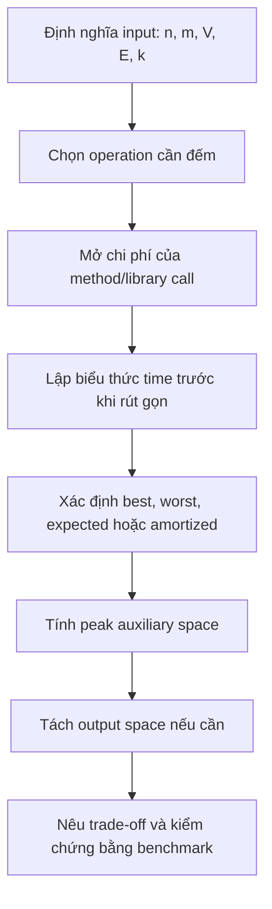

## Câu hỏi

> **Cho một hàm xử lý `n` phần tử: làm thế nào bạn xác định chính xác time complexity và space complexity, kể cả chi phí ẩn trong collection, recursion và output? Nếu có thể giảm thời gian từ `O(n²)` xuống expected `O(n)` bằng cách dùng thêm `O(n)` bộ nhớ, bạn sẽ quyết định thế nào?**

---

## Dành cho level

`Mid` `Senior`

Ở mức Mid, interviewer muốn bạn định nghĩa đúng `n`, phân tích được loop nối tiếp, loop lồng nhau, binary search, collection và recursion stack. Bạn phải luôn đưa ra **cả time lẫn auxiliary space**, thay vì chỉ nhìn số vòng `for`.

Ở mức Senior, interviewer muốn nghe rõ worst case, expected và amortized complexity; phân biệt peak memory với tổng allocation; đồng thời biết đặt Big O vào constraint thật như kích thước input, memory limit, p99 latency và chi phí GC.

**Điểm cộng:** trình bày được time–space trade-off bằng một phương án thay thế cụ thể, rồi đề xuất benchmark/profile thay vì kết luận chỉ từ ký hiệu Big O.

---

## Cốt lõi cần nhớ

**Time complexity đo tốc độ tăng của lượng công việc; space complexity đo tốc độ tăng của bộ nhớ cần dùng đồng thời.** Cả hai đều phải được biểu diễn theo input đã định nghĩa rõ, ví dụ `n` records, `V` vertices hay `L` characters.

**Không đếm syntax, hãy đếm operation thật.** Một vòng `for` có `List.contains()` bên trong có thể là `O(n × m)`; một hàm không tạo collection vẫn có thể dùng `O(n)` stack vì recursion.

**Space thường là peak memory, không phải tổng số byte từng được allocate trong suốt quá trình chạy.** Một object tạm được tạo rồi giải phóng ở mỗi iteration có thể tạo `O(n)` tổng allocation nhưng chỉ cần `O(1)` peak live space.

**Big O giúp loại phương án không chịu được scale; constraint và benchmark quyết định phương án nên dùng.** Giảm time bằng hash table, cache hoặc memoization thường phải đổi bằng memory, preprocessing và độ phức tạp vận hành.

---

## Câu trả lời mẫu

> “Tôi sẽ bắt đầu bằng việc định nghĩa input, chẳng hạn `n` là số phần tử trong danh sách, rồi xác định operation nào thực sự lặp lại. Với time complexity, tôi mở cả chi phí ẩn trong method call: một loop `n` lần gọi `List.contains()` trên list dài `m` có worst-case time `O(n × m)`, không phải `O(n)`. Với space complexity, tôi nói rõ đang tính auxiliary space, sau đó kiểm tra collection tạo thêm, bản copy dữ liệu, output và maximum recursion depth. Nếu chuyển list dùng để lookup thành `HashSet`, tôi phải tính cả expected `O(m)` để build set, expected `O(n)` để scan, nên tổng là expected `O(n + m)` và đổi lại dùng thêm `O(m)` memory. Tôi không kết luận phương án hash luôn tốt hơn: nếu input tối đa chỉ có vài phần tử hoặc service bị giới hạn heap, cách scan đơn giản có thể hợp lý hơn. Tôi sẽ dùng Big O để dự đoán đường tăng trưởng, rồi benchmark trên kích thước và phân bố dữ liệu gần production, đồng thời đo latency, peak memory và GC.”

---

## Phân tích chi tiết

### 1. Bài toán thực tế: nhanh hơn nhưng tốn RAM hơn

Giả sử cần kiểm tra một danh sách có phần tử trùng hay không.

Cách đầu tiên so sánh từng cặp:

```java
static boolean hasDuplicate(List<String> values) {
    for (int i = 0; i < values.size(); i++) {
        for (int j = i + 1; j < values.size(); j++) {
            if (values.get(i).equals(values.get(j))) {
                return true;
            }
        }
    }
    return false;
}
```

Nếu không có phần tử trùng, số lần so sánh là:

```text
(n - 1) + (n - 2) + ... + 1
= n(n - 1) / 2
= Θ(n²)
```

Kết quả phân tích:

- **Worst-case time:** `O(n²)`.
- **Best-case time:** `O(1)` nếu cặp đầu tiên đã trùng.
- **Auxiliary space:** `O(1)` vì chỉ dùng các biến `i`, `j`.

Có thể đổi sang `HashSet`:

```java
static boolean hasDuplicate(List<String> values) {
    Set<String> seen = new HashSet<>();

    for (String value : values) {
        if (!seen.add(value)) {
            return true;
        }
    }
    return false;
}
```

Kết quả mới:

- **Expected time:** `O(n)` nếu hash phân bố đủ tốt.
- **Auxiliary space:** `O(n)` trong trường hợp phải lưu toàn bộ phần tử.
- **Worst-case behavior:** phụ thuộc collision và implementation của hash table.

Đây là một **time–space trade-off**: giảm lượng so sánh bằng cách giữ thêm trạng thái trong memory.

| Phương án | Time | Auxiliary space | Phù hợp khi |
| --- | --- | --- | --- |
| So sánh từng cặp | Worst `O(n²)` | `O(1)` | `n` nhỏ, memory rất hạn chế |
| Dùng `HashSet` | Expected `O(n)` | `O(n)` | `n` có thể lớn, membership lookup là hot path |
| Sort rồi scan | `O(n log n)` | Tùy cách sort/copy | Cần deterministic bound hoặc muốn tránh hash table |

> [!IMPORTANT]
> Từ “expected” không phải trang trí. `HashSet` thường cho lookup expected `O(1)`, nhưng không nên mô tả là tuyệt đối `O(1)` cho mọi key và mọi implementation.

---

### 2. Time complexity là gì?

Time complexity mô tả **lượng công việc tăng như thế nào khi input lớn lên**. Nó không trực tiếp cho biết chương trình chạy bao nhiêu millisecond.

Nếu một hàm có số operation gần đúng:

```text
T(n) = 4n² + 10n + 200
```

Khi `n` đủ lớn, `n²` tăng nhanh hơn `n` và constant `200`. Ta mô tả growth rate bằng `Θ(n²)`; trong giao tiếp thông thường, nhiều người nói “Big O là `O(n²)`”.

Big O cố ý bỏ qua:

- Constant factor, ví dụ `4` trong `4n²`.
- Thành phần bậc thấp, ví dụ `10n` khi đã có `n²`.
- Đơn vị thời gian cụ thể.
- Chi tiết CPU, JVM hay operating system.

Nhưng các yếu tố đó vẫn quan trọng trong production. Hai hàm cùng `O(n)` có thể khác nhau rất lớn nếu một hàm thực hiện phép cộng trong RAM còn hàm kia gửi `n` HTTP requests.

#### Trước khi nói `O(...)`, phải trả lời ba câu

1. **Input nào tăng?** `n` là số item, số byte hay số node?
2. **Operation nào đang được tính?** Comparison, hash lookup, byte copy hay network call?
3. **Case nào đang xét?** Best, average, worst, expected hay amortized?

Ví dụ một câu trả lời đầy đủ:

```text
Với n user và m quyền, worst-case method thực hiện n × m phép so sánh,
nên time là O(n × m). Method chỉ dùng các biến tạm cố định,
nên auxiliary space là O(1), chưa tính output.
```

---

### 3. Space complexity là gì?

Space complexity mô tả **lượng memory cần dùng đồng thời** khi input tăng. Khi trả lời, cần nói rõ convention đang dùng.

#### Total space và auxiliary space

- **Total space:** input + output + memory được thuật toán tạo thêm.
- **Auxiliary space:** memory bổ sung ngoài input; output có thể được tách riêng nếu đã nói rõ.

Trong interview, “space complexity” thường ám chỉ auxiliary space. Câu trả lời an toàn là:

> “Auxiliary space là `O(n)` cho hash table; output space là `O(k)` nếu hàm trả `k` kết quả.”

#### Những phần memory thường bị bỏ quên

| Nguồn memory | Ví dụ | Cách tính |
| --- | --- | --- |
| Biến scalar | `int left`, `long sum` | Thường `O(1)` |
| Collection tạo thêm | `HashSet`, `HashMap`, queue | Theo số entry sống đồng thời |
| Bản copy input | `Arrays.copyOf(values, n)` | `O(n)` |
| Recursion stack | Một frame cho mỗi recursive call đang active | Theo maximum depth |
| Output | List chứa `k` kết quả | `O(k)` output space |
| Buffer | `StringBuilder`, byte buffer | Theo capacity/độ dài lớn nhất |
| Memoization | Cache một kết quả cho mỗi state | Theo số state được lưu |

#### Peak live memory khác tổng allocation

Xét đoạn code:

```java
for (Record record : records) {
    String normalized = normalize(record);
    send(normalized);
}
```

Giả sử mỗi `normalized` có kích thước bị chặn và không bị giữ sau `send()`:

- Có `n` strings được tạo trong cả vòng đời hàm.
- **Total allocation** có thể tăng `O(n)`.
- Chỉ một string cần sống tại một thời điểm, nên **peak live auxiliary space** có thể là `O(1)` theo số records.

Dù Big O peak space là `O(1)`, allocation rate vẫn có thể làm Garbage Collector (GC) hoạt động nhiều và tăng p99 latency. Vì vậy production analysis nên tách hai metric:

```text
Peak live memory: O(1) theo n
Total allocation: O(n)
```

---

### 4. Quy trình phân tích time và space

Dùng cùng một quy trình cho loop, recursion và library call:


```mermaid
flowchart TD
    A[Định nghĩa input: n, m, V, E, k] --> B[Chọn operation cần đếm]
    B --> C[Mở chi phí của method/library call]
    C --> D[Lập biểu thức time trước khi rút gọn]
    D --> E[Xác định best, worst, expected hoặc amortized]
    E --> F[Tính peak auxiliary space]
    F --> G[Tách output space nếu cần]
    G --> H[Nêu trade-off và kiểm chứng bằng benchmark]
```

#### Bước 1 — Định nghĩa input

| Bài toán | Biến nên dùng |
| --- | --- |
| Duyệt array | `n` = số phần tử |
| So sánh hai list độc lập | `n`, `m` = kích thước hai list |
| Duyệt matrix | `r`, `c` = số row và column |
| Duyệt graph | `V`, `E` = số vertex và edge |
| Xử lý chuỗi | `L` = tổng số character/code unit |
| Trả kết quả tìm kiếm | `n` = input, `k` = số kết quả |

Không được tự ý biến `O(n + m)` thành `O(n)` khi `m` tăng độc lập. Tương tự, matrix `r × c` có time `O(r × c)`, không mặc định là `O(n²)`.

#### Bước 2 — Chọn operation

Đừng chỉ nói “hàm chạy `n` lần”. Hãy nói nó thực hiện `n` comparisons, `n` hash lookups hay `n` database round trips. Cùng `O(n)`, nhưng chi phí thực tế hoàn toàn khác nhau.

#### Bước 3 — Mở chi phí ẩn

```java
for (String id : requestedIds) {       // n lần
    if (existingIds.contains(id)) {    // List scan tối đa m phần tử
        process(id);
    }
}
```

Nếu `existingIds` là `List`, worst-case time là `O(n × m)`. Nếu là `HashSet`, loop có expected time `O(n)`, nhưng phải cộng chi phí build set `O(m)` nếu set được tạo trong chính request này.

#### Bước 4 — Lập biểu thức rồi mới rút gọn

```text
Build HashSet: expected O(m)
Scan n items × expected O(1) lookup: expected O(n)
Tổng: expected O(n + m)
Auxiliary space: O(m)
```

Viết đầy đủ trước giúp tránh bỏ nhầm một input độc lập hoặc một operation đắt.

#### Bước 5 — Tính peak memory

Kiểm tra collection, copy, buffer, output và maximum recursion depth. Không cộng tất cả allocation nếu chúng không cùng sống một lúc.

---

### 5. Các growth rate cần nhận ra

| Complexity | Khi input tăng gấp đôi | Pattern thường gặp |
| --- | ---: | --- |
| `O(1)` | Gần như không đổi | Array access theo index |
| `O(log n)` | Chỉ tăng thêm một ít | Mỗi bước chia đôi search space |
| `O(n)` | Khoảng 2 lần | Scan toàn bộ input |
| `O(n log n)` | Hơn 2 lần một chút | Merge sort, comparison sort tốt |
| `O(n²)` | Khoảng 4 lần | So sánh mọi cặp |
| `O(n³)` | Khoảng 8 lần | Ba chiều cùng tăng |
| `O(2ⁿ)` | Tăng cực nhanh | Thử mọi subset |
| `O(n!)` | Tăng nhanh hơn exponential | Thử mọi permutation |

Bảng operation count dưới đây chỉ để cảm nhận growth, không phải thời gian chạy:

| `n` | `log₂ n` | `n` | `n log₂ n` | `n²` | `2ⁿ` |
| ---: | ---: | ---: | ---: | ---: | ---: |
| 10 | ~3,3 | 10 | ~33 | 100 | 1.024 |
| 100 | ~6,6 | 100 | ~664 | 10.000 | Rất lớn |
| 1.000 | ~10 | 1.000 | ~10.000 | 1.000.000 | Không thực tế |
| 1.000.000 | ~20 | 1.000.000 | ~20.000.000 | 10¹² | Không thực tế |

> [!NOTE]
> `O(n²)` không tự động là “xấu” nếu business rule chặn `n ≤ 10`. Ngược lại, `O(n)` remote calls vẫn có thể là bottleneck nghiêm trọng. Luôn đặt complexity cạnh constraint thật.

---

### 6. Quy tắc tính time complexity khi đọc loop

#### Loop nối tiếp: cộng

```java
for (Order order : orders) {       // O(n)
    validate(order);
}

for (Rule rule : rules) {          // O(m)
    validate(rule);
}
```

Tổng time là `O(n + m)`. Nếu cả hai loop đều chạy trên cùng input `n`, tổng là `O(2n) = O(n)`.

Auxiliary space vẫn có thể là `O(1)` nếu `validate()` không giữ thêm dữ liệu và không tính output.

#### Loop lồng nhau: thường nhân

```java
for (User user : users) {          // n
    for (Role role : roles) {      // m cho mỗi user
        check(user, role);
    }
}
```

Time là `O(n × m)`. Nếu `n = m`, có thể viết `O(n²)`.

#### Inner loop phụ thuộc outer loop: dùng summation

```java
for (int i = 0; i < n; i++) {
    for (int j = 0; j < i; j++) {
        consume(i, j);
    }
}
```

Số lần gọi `consume()` là:

```text
0 + 1 + 2 + ... + (n - 1) = n(n - 1) / 2 = Θ(n²)
```

#### Mỗi bước nhân hoặc chia: logarithmic

```java
for (int size = 1; size < n; size *= 2) {
    process(size);
}
```

Sau `k` bước, `size = 2ᵏ`. Loop dừng khi `2ᵏ ≥ n`, nên time là `O(log n)`.

#### Hai pointer không có nghĩa là quadratic

```java
int left = 0;
int right = values.length - 1;

while (left < right) {
    if (shouldMoveLeft(values[left])) {
        left++;
    } else {
        right--;
    }
}
```

Mỗi iteration làm khoảng cách giảm ít nhất một. Tổng số lần di chuyển của hai pointer không vượt quá `n`, nên time là `O(n)`, auxiliary space `O(1)`.

---

### 7. Các bẫy time complexity ẩn trong API

#### `contains()` trong loop

```java
for (Long userId : userIds) {              // n
    if (allowedIds.contains(userId)) {      // List: O(m)
        grant(userId);
    }
}
```

Nếu `allowedIds` là `List`, worst-case time là `O(n × m)`. Chuyển sang `HashSet` có thể đưa lookup về expected `O(1)`, nhưng cần thêm `O(m)` memory.

#### Sort rồi mới scan

```java
Arrays.sort(values);                       // O(n log n) điển hình
for (int value : values) {                 // O(n)
    consume(value);
}
```

Tổng là:

```text
O(n log n) + O(n) = O(n log n)
```

Loop cuối không xóa chi phí sort phía trước.

#### String concatenation trong loop

```java
String result = "";
for (String part : parts) {
    result = result + part;
}
```

`String` immutable. Mỗi lần nối có thể tạo string mới và copy toàn bộ prefix trước đó. Nếu có `n` phần có độ dài tương đương, lượng copy có thể là `Θ(n²)`.

Dùng `StringBuilder`:

```java
StringBuilder builder = new StringBuilder();
for (String part : parts) {
    builder.append(part);
}
return builder.toString();
```

Gọi `L` là tổng số character của output:

- Time thường là amortized `O(L)`.
- Buffer/output cần `O(L)` memory.
- Nói theo `L` chính xác hơn `n`, vì `n` strings có thể có độ dài rất khác nhau.

#### N+1 database queries

```java
List<Order> orders = orderRepository.findAll();
for (Order order : orders) {
    order.getItems().size(); // có thể phát sinh thêm một query cho mỗi order
}
```

Số query tăng `O(n)`, nhưng mỗi operation là một database round trip. Ký hiệu linear không phản ánh constant rất lớn của network, query execution và connection-pool wait. Vì vậy hãy kiểm tra query log và execution plan, không chỉ đọc loop.

---

### 8. Cách tính space complexity qua ví dụ

#### Ví dụ A — Scan in-place

```java
static int max(int[] values) {
    int best = Integer.MIN_VALUE;
    for (int value : values) {
        best = Math.max(best, value);
    }
    return best;
}
```

- Time: `O(n)`.
- Auxiliary space: `O(1)`.
- Total space nếu tính cả input: `O(n)`.

Đây là lý do phải nói rõ đang dùng total hay auxiliary space.

#### Ví dụ B — Copy rồi sort

```java
static int[] sortedCopy(int[] values) {
    int[] copy = Arrays.copyOf(values, values.length);
    Arrays.sort(copy);
    return copy;
}
```

Chỉ riêng `copy` đã dùng `O(n)` memory. Nếu tính output riêng, array trả về là `O(n)` output space; auxiliary space của sort còn phụ thuộc implementation.

#### Ví dụ C — Output-sensitive complexity

```java
static List<Pair> allMatchingPairs(List<Item> items) {
    List<Pair> result = new ArrayList<>();
    // Tìm và thêm mọi cặp phù hợp.
    return result;
}
```

Nếu có `k` cặp kết quả, chỉ việc materialize output đã cần:

```text
Output time:  Ω(k)
Output space: Ω(k)
```

Nếu `k` có thể đạt `Θ(n²)`, không thể tuyên bố toàn bộ hàm chỉ dùng `O(n)` total space. Một cách mô tả rõ hơn là `O(work + k)` time và `O(auxiliary + k)` total space.

#### Ví dụ D — Queue hoặc stack có peak size thay đổi

BFS trên graph dùng adjacency list:

```java
static void bfs(Graph graph, int start) {
    Queue<Integer> queue = new ArrayDeque<>();
    Set<Integer> visited = new HashSet<>();

    queue.add(start);
    visited.add(start);

    while (!queue.isEmpty()) {
        int node = queue.remove();
        for (int neighbor : graph.neighbors(node)) {
            if (visited.add(neighbor)) {
                queue.add(neighbor);
            }
        }
    }
}
```

- Time: `O(V + E)` vì mỗi vertex được visit một lần và mỗi edge được inspect một số lần constant.
- Auxiliary space: `O(V)` cho `visited` và queue trong worst case.
- Space của graph input không được tính vào auxiliary space nếu graph đã tồn tại trước khi gọi hàm.

---

### 9. Recursion: time có thể lớn hơn stack space rất nhiều

#### Factorial

```java
static long factorial(int n) {
    if (n <= 1) {
        return 1;
    }
    return n * factorial(n - 1);
}
```

Recurrence:

```text
T(n) = T(n - 1) + O(1)
```

Có `n` calls và maximum depth `n`:

- Time: `O(n)`.
- Auxiliary space: `O(n)` cho call stack.

Không tạo array hay collection không có nghĩa là space `O(1)`.

#### Binary search: iterative và recursive

Bản iterative:

```java
static int binarySearch(int[] values, int target) {
    int left = 0;
    int right = values.length - 1;

    while (left <= right) {
        int mid = left + (right - left) / 2;
        if (values[mid] == target) {
            return mid;
        }
        if (values[mid] < target) {
            left = mid + 1;
        } else {
            right = mid - 1;
        }
    }
    return -1;
}
```

- Time: `O(log n)`.
- Auxiliary space: `O(1)`.

Bản recursive vẫn có time `O(log n)`, nhưng dùng `O(log n)` stack. Hai implementation có cùng time complexity nhưng khác space complexity.

#### Naive Fibonacci

```java
static long fibonacci(int n) {
    if (n <= 1) {
        return n;
    }
    return fibonacci(n - 1) + fibonacci(n - 2);
}
```

Recurrence:

```text
T(n) = T(n - 1) + T(n - 2) + O(1)
```

- Time tăng exponential; tight bound gần `Θ(φⁿ)`, với `φ ≈ 1,618`.
- `O(2ⁿ)` là upper bound dễ nhớ nhưng lỏng hơn.
- Auxiliary space chỉ `O(n)` vì peak call stack phụ thuộc nhánh sâu nhất, không phải tổng số node trong recursion tree.

Memoization lưu kết quả mỗi state:

```java
static long fibonacci(int n, Long[] memo) {
    if (n <= 1) {
        return n;
    }
    if (memo[n] != null) {
        return memo[n];
    }
    memo[n] = fibonacci(n - 1, memo) + fibonacci(n - 2, memo);
    return memo[n];
}
```

- Time: `O(n)` vì mỗi state chỉ tính một lần.
- Space: `O(n)` cho memo và `O(n)` stack, tổng vẫn `O(n)`.

Memoization là ví dụ rõ nhất của việc dùng memory để loại repeated work.

---

### 10. Amortized, expected và average không giống nhau

#### Amortized complexity

Amortized analysis chia tổng chi phí của một chuỗi operations cho số operations, không cần giả định input ngẫu nhiên.

`ArrayList.add()` thường là amortized `O(1)`:

- Phần lớn lần append chỉ ghi vào slot kế tiếp: `O(1)`.
- Khi hết capacity, list phải allocate array lớn hơn và copy dữ liệu: một lần resize có thể là `O(n)`.
- Tổng chi phí của `n` appends vẫn là `O(n)`, nên mỗi append có amortized cost `O(1)`.

Điều đó không có nghĩa mọi lần `add()` đều có constant latency. Request rơi đúng lúc resize có thể chậm hơn và allocate nhiều memory hơn.

#### Expected complexity

Expected complexity thường dựa trên randomization hoặc assumption về phân bố. `HashMap.get()` được coi expected `O(1)` nếu hash phân bố tốt.

#### Average-case complexity

Average-case cần một distribution của input. Ví dụ linear search có average time `Θ(n)` nếu target có xác suất xuất hiện ở các vị trí theo một giả định hợp lý.

| Khái niệm | Trung bình trên cái gì? | Ví dụ |
| --- | --- | --- |
| Average case | Distribution của input | Vị trí target trong linear search |
| Expected | Randomness/hash distribution | Hash table lookup |
| Amortized | Chuỗi operations | Dynamic array append |

---

### 11. Big O, Big Theta và Big Omega — chỉ cần hiểu đủ dùng

| Ký hiệu | Ý nghĩa | Cách dùng thực tế |
| --- | --- | --- |
| `O(g(n))` | Upper bound | Chi phí không tăng nhanh hơn bound này sau một ngưỡng |
| `Ω(g(n))` | Lower bound | Chi phí không thể tăng chậm hơn bound này |
| `Θ(g(n))` | Tight bound | Upper và lower bound cùng growth rate |

Với `T(n) = 3n + 20`:

```text
T(n) ∈ O(n)
T(n) ∈ Ω(n)
Do đó T(n) ∈ Θ(n)
```

Về mặt formal, `3n + 20` cũng thuộc `O(n²)`, nhưng đó là bound lỏng. Trong interview, hãy đưa ra tightest useful bound và nói rõ case đang xét.

Big O cũng không đồng nghĩa với worst case. Hai trục này khác nhau:

- `O`, `Ω`, `Θ`: loại bound.
- Best, average, worst: tập input/case đang phân tích.

Ví dụ linear search có best-case `Θ(1)` và worst-case `Θ(n)`.

---

### 12. Time–space trade-off thường gặp

| Kỹ thuật | Time trước → sau | Memory thêm | Điều cần đánh đổi |
| --- | --- | ---: | --- |
| `List` scan → `HashSet` lookup | `O(n)` mỗi lookup → expected `O(1)` | `O(n)` | Hash cost, collision, không giữ sorted order |
| Naive recursion → memoization | Exponential → theo số state | `O(states)` | Cache lifecycle và invalidation |
| Range scan → prefix sum | `O(n)` mỗi query → `O(1)` | `O(n)` | Preprocessing và update cost |
| Sort tất cả → heap Top K | `O(n log n)` → `O(n log k)` | `O(k)` | Chỉ phù hợp khi cần `k` phần tử |
| Repeated DB scan → index | Gần `O(N)` → tree lookup gần `O(log N)` | Disk/RAM | Write amplification và maintenance |
| Materialize list → stream | Giữ toàn bộ output → xử lý từng phần | Thường giảm peak memory | Backpressure, retry và lifecycle phức tạp hơn |

Cache là phiên bản production của cùng trade-off: dùng memory và chấp nhận bài toán eviction/invalidation để tránh lặp lại I/O đắt đỏ. Bài [Redis hay Memcached](/caching/01-redis-vs-memcached) phân tích sâu hơn quyết định này ở tầng hệ thống.

#### Ví dụ: nhiều membership queries

Có dataset `n` IDs và `q` queries:

```text
Scan list cho mỗi query:
Time: O(q × n)
Extra space: O(1)

Build HashSet một lần:
Expected time: O(n + q)
Extra space: O(n)

Sort một lần rồi binary search:
Time: O(n log n + q log n)
Extra space: tùy sort/copy strategy
```

Không có lựa chọn thắng tuyệt đối:

- `q = 1` và `n` nhỏ: scan có thể đơn giản nhất.
- `q` lớn: preprocessing thường đáng giá.
- Memory hạn chế: sorted array có thể gọn hơn hash table.
- Dataset cập nhật liên tục: phải cộng chi phí update/rebuild.
- Cần worst-case deterministic: tree hoặc sorted structure có thể phù hợp hơn hash.

---

### 13. Khi nào complexity đẹp hơn vẫn chưa phải phương án tốt hơn?

#### Constant factor và input range

`O(n)` có thể chậm hơn `O(n log n)` trong vùng input nhỏ nếu mỗi operation của phương án linear rất đắt. Big O dự đoán xu hướng khi input tăng; nó không thay benchmark.

#### Cache locality

Array thường có locality tốt hơn linked structure. `ArrayList` có thể nhanh hơn `LinkedList` trong thực tế dù cả hai có một số operation cùng `O(n)`, vì linked nodes gây pointer chasing và tốn thêm object overhead.

#### Allocation và GC

Hai phương án cùng `O(n)` space theo asymptotic notation có thể dùng số byte thực tế rất khác nhau. `HashSet<Long>` với boxed `Long` có overhead lớn hơn nhiều so với `long[]`.

Để hiểu memory model của JVM sâu hơn, xem [Heap, off-heap và stack trong Java](/java/01-heap-vs-off-heap-vs-stack) — đặc biệt hữu ích khi Big O giống nhau nhưng GC/RSS khác nhau.

#### I/O và network

`O(n)` local reads khác hoàn toàn `O(n)` remote calls. Với xử lý dữ liệu lớn, vị trí đặt computation, batch size và số round trip thường quan trọng hơn việc tối ưu vài phép tính CPU. Bài [merge dữ liệu vào bảng hàng tỷ rows](/java/02-bulk-upsert-billion-rows) cho thấy complexity phải đi cùng index, batching và database I/O.

#### Tail latency

Operation amortized `O(1)` vẫn có rare slow path `O(n)`, như resize dynamic array. Nếu API có p99 SLO nghiêm, cần xem operation đắt có nằm trên request thread hay không.

---

### 14. Cách quyết định có nên đổi time lấy memory

Dùng bảng hỏi sau thay vì mặc định chọn Big O nhỏ nhất:

| Câu hỏi | Vì sao quan trọng |
| --- | --- |
| `n`, `m`, `q`, `k` tối đa là bao nhiêu? | Biết phương án hiện tại có thật sự chạm giới hạn không |
| Input tăng theo thời gian thế nào? | Dự đoán khi nào gặp complexity cliff |
| Memory budget mỗi process/container? | `O(n)` có thể gây OOM hoặc GC pressure |
| Operation chạy một lần hay lặp lại nhiều lần? | Quyết định preprocessing/cache có đáng không |
| Yêu cầu p50, p95, p99 là gì? | Average tốt chưa chắc tail tốt |
| Dữ liệu có skew/adversarial không? | Ảnh hưởng hash, cache hit và worst case |
| Output lớn nhất là bao nhiêu? | Output có thể chi phối cả time và memory |
| Có thể stream/paginate không? | Giảm peak memory dù total work không đổi |
| Độ phức tạp code/vận hành tăng bao nhiêu? | Optimization không nên tạo rủi ro lớn hơn lợi ích |

Một quy trình có kỷ luật:

```text
1. Đo baseline time và memory.
2. Xác định input hiện tại, input tối đa và tốc độ tăng.
3. Phân tích time/space của phương án hiện tại.
4. Đề xuất phương án thay thế cùng trade-off rõ ràng.
5. Benchmark trên nhiều kích thước và distribution đại diện.
6. Đo latency distribution, peak heap/RSS và allocation rate.
7. Chọn phương án đáp ứng SLO với margin an toàn.
8. Thêm regression benchmark hoặc guardrail nếu cần.
```

> [!WARNING]
> “Input hiện tại nhỏ” chỉ là lý do hợp lệ khi đó là invariant được xác minh. Nếu giới hạn có thể thay đổi, hãy document assumption, validate upper bound và theo dõi metric thay vì dựa vào hy vọng.

---

### 15. Checklist phân tích một đoạn code

Khi gặp câu hỏi interview hoặc review PR, đi lần lượt qua checklist này:

1. `n`, `m`, `V`, `E`, `L`, `k` đại diện cho gì?
2. Đang đếm comparison, allocation, byte copy, query hay network call?
3. Loop nối tiếp hay lồng nhau?
4. Bound của inner loop có phụ thuộc outer index không?
5. Body có `contains`, sort, regex, serialization, DB hoặc HTTP call không?
6. Đang nói best, worst, average, expected hay amortized?
7. Có early return làm best case khác worst case không?
8. Có tạo collection, copy input hoặc buffer không?
9. Maximum recursion depth là bao nhiêu?
10. Output tối đa có `k` phần tử hay có thể đạt `Θ(n²)` không?
11. Peak live memory khác total allocation như thế nào?
12. Có thể đổi repeated work thành preprocessing/cache không?
13. Time tốt hơn cần thêm bao nhiêu memory?
14. Input production có skew, duplicate hoặc adversarial pattern không?
15. Benchmark đã đo nhiều kích thước input, p95/p99 và memory chưa?

Nếu cần trả lời ngắn trong interview, dùng công thức nói sau:

```text
Gọi n là ... và m là ...
Worst/expected time là ... vì ...
Auxiliary space là ... do ...
Nếu tính output, cần thêm O(k).
Có thể đổi sang ... để giảm time từ ... xuống ...,
đổi lại dùng thêm ... memory.
Tôi sẽ chọn dựa trên input bound, memory budget và benchmark.
```

---

### Góc nhìn Senior: biến complexity thành guardrail

Senior engineer không dừng ở việc sửa một loop. Khi một service từng gặp complexity cliff, câu hỏi tiếp theo là làm sao ngăn cùng lớp lỗi quay lại:

- Đặt hard limit hoặc pagination cho input không được tăng vô hạn.
- Thêm metric theo input size, processing time, allocation rate và rejected requests.
- Benchmark ở `n` hiện tại, `2n`, `5n`, `10n` để nhìn growth trend.
- Thêm performance test cho hot path dễ bị regression từ `O(n)` thành `O(n²)`.
- Document complexity và memory assumption ở API có batch/list input.
- Review cả downstream calls, query count và output size, không chỉ CPU loop.

Khi scale hệ thống, một thuật toán tốt chỉ là một phần của bài toán. [Scale từ 1.000 lên 50.000 concurrent users](/system-design/03-scale-1k-to-50k-users) mở rộng góc nhìn sang queueing, database, cache và bottleneck toàn hệ thống.

---

## Bẫy thường gặp

❌ **“Có một vòng `for`, nên time chắc chắn là `O(n)`.”** → Tại sao sai: body có thể gọi `List.contains()`, sort, regex, database hoặc HTTP; nếu body là `O(m)`, tổng có thể là `O(n × m)`.
✅ Đúng hơn: mở chi phí của operation bên trong rồi mới nhân với số iteration.

---

❌ **“Hàm không tạo array hay collection, nên space là `O(1)`.”** → Tại sao sai: recursion depth `n` giữ `n` stack frames đang active và có auxiliary space `O(n)`.
✅ Đúng hơn: tính collection, copy, buffer, output và maximum call-stack depth.

---

❌ **“Tạo object trong mỗi iteration nghĩa là space `O(n)`.”** → Tại sao sai: space thường đo peak live memory; nếu object không bị giữ lại, chỉ một object cần sống tại một thời điểm dù tổng allocation tăng theo `n`.
✅ Đúng hơn: tách peak live space khỏi total allocation và GC pressure.

---

❌ **“HashMap lookup luôn là `O(1)`, nên phương án hash luôn tốt hơn.”** → Tại sao sai: lookup là expected `O(1)` dưới assumption phù hợp, đồng thời hash table tốn `O(n)` memory, có collision, resize và object overhead.
✅ Đúng hơn: nêu expected time, worst-case concern và memory trade-off; chọn theo workload thật.

---

❌ **“Big O nhỏ hơn nghĩa là code chắc chắn chạy nhanh hơn.”** → Tại sao sai: constant factor, cache locality, I/O, allocation và input range có thể khiến phương án có growth tốt hơn vẫn chậm hơn trong phạm vi thực tế.
✅ Đúng hơn: dùng complexity để dự đoán scale, sau đó benchmark các phương án còn hợp lệ trên dữ liệu đại diện.

---

## Câu hỏi follow-up

### 1. Một hàm tạo `n` object tạm nhưng không giữ chúng lại có space complexity là gì?

Nếu tại mỗi thời điểm chỉ có một object tạm sống và kích thước mỗi object bị chặn, peak auxiliary space có thể là `O(1)` theo `n`. Tuy nhiên tổng allocation qua toàn bộ hàm là `O(n)`, nên GC pressure vẫn có thể tăng tuyến tính. Trong production, nên báo cả peak live memory và allocation rate.

### 2. Vì sao naive Fibonacci có exponential time nhưng chỉ `O(n)` space?

Tổng số recursive calls là exponential vì nhiều subproblem bị tính lặp. Nhưng các nhánh không cùng nằm trên stack; chúng chạy lần lượt. Peak stack chỉ phụ thuộc đường đi sâu nhất, có depth `n`, nên auxiliary space là `O(n)`.

### 3. `ArrayList.add()` amortized `O(1)` có đảm bảo p99 tốt không?

Không. Phần lớn append là `O(1)`, nhưng lần resize phải allocate backing array mới và copy các phần tử cũ, có thể là `O(n)`. Amortized cost mô tả cả chuỗi operations, không đảm bảo latency của từng operation. Nếu biết kích thước gần đúng, pre-size list có thể giảm resize và allocation.

### 4. Khi nào nên chấp nhận `O(n²)` time để giữ `O(1)` space?

Khi `n` có upper bound nhỏ và được kiểm soát, code không nằm trên hot path, memory rất hạn chế, hoặc phương án `O(n)` memory tạo overhead/rủi ro không đáng có. Cần xác minh bound bằng validation hoặc business rule; không nên dựa vào câu “hiện tại data còn nhỏ”.

### 5. Binary search có time và space complexity gì?

Với sorted random-access array, cả bản iterative và recursive có time `O(log n)` vì mỗi bước loại một nửa search space. Bản iterative dùng `O(1)` auxiliary space; bản recursive dùng `O(log n)` stack. Nếu data chưa sorted và chỉ tìm một lần, phải cộng chi phí sort `O(n log n)`.

### 6. Output có được tính vào space complexity không?

Tùy convention, vì vậy phải nói rõ. Auxiliary space thường tách input và có thể tách output; total space thì tính cả output. Câu trả lời tốt nêu riêng: “Auxiliary space `O(n)` cho hash map và output space `O(k)` cho `k` kết quả.”

---

## Xem thêm

- [Heap, off-heap và stack trong Java](/java/01-heap-vs-off-heap-vs-stack) — hiểu memory thực tế phía sau auxiliary space, recursion stack và GC.
- [Merge 1 triệu bản ghi vào bảng 1 tỷ rows](/java/02-bulk-upsert-billion-rows) — áp dụng complexity cùng batching, index và database I/O.
- [Scale từ 1.000 lên 50.000 concurrent users](/system-design/03-scale-1k-to-50k-users) — đặt thuật toán vào bottleneck và constraint của toàn hệ thống.
- [Redis hay Memcached](/caching/01-redis-vs-memcached) — một ví dụ production về đổi memory lấy latency và giảm repeated work.
