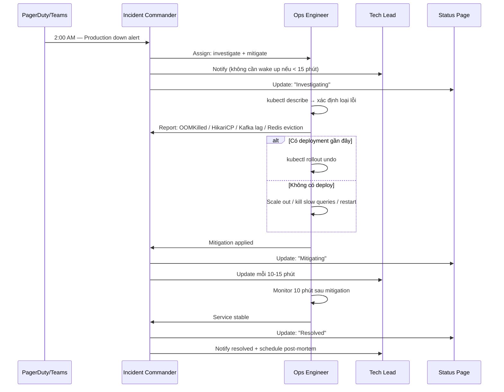

# 2h sáng — Server production sập, 10,000 users online

## Câu hỏi

> **2h sáng. Server production sập. 10,000 users đang online. Bạn làm gì NGAY LẬP TỨC?**

---

## Dành cho level

<Tabs items={["Mid", "Senior", "Staff"]}>

<Tab value="Mid">

Interviewer expect bạn biết **quy trình cơ bản**: xác nhận sự cố, alert team, rollback nếu có deploy gần đây, theo dõi logs. Không cần dẫn dắt — cần thực hiện được khi được giao việc.

Điểm cộng: biết dùng `kubectl`, đọc được Prometheus metrics, không panic.

</Tab>

<Tab value="Senior">

Interviewer expect bạn **tự dẫn dắt toàn bộ incident**: assign IC, triage parallel, quyết định mitigate hay rollback, communicate liên tục với stakeholders. Biết phân biệt các loại lỗi (OOMKilled vs HikariCP vs Kafka lag).

Điểm cộng: nhắc đến controlled ramp-up sau restore, blameless post-mortem, SLA impact.

</Tab>

<Tab value="Staff">

Interviewer expect bạn nghĩ ở tầng **process và prevention**: runbook đã có chưa, on-call rotation được thiết kế thế nào, chaos engineering phát hiện được class of problems này không, tại sao alert không kích hoạt sớm hơn.

Điểm cộng: đề xuất cải tiến hệ thống alert, thiết kế game day drill, giảm MTTR cho toàn team.

</Tab>

</Tabs>

---

## Cốt lõi cần nhớ

**Mitigate trước, root cause sau.** Đừng cố hiểu hết rồi mới hành động — bleeding phải dừng trước.

**Một người chỉ huy, không ai "freelance".** Khi nhiều engineer tự ý thay đổi production song song, outage kéo dài gấp đôi. (Google SRE gọi đây là "freelancing".)

**Im lặng là sai lầm lớn nhất.** Alert team ngay từ phút đầu, dù chưa biết gì.

---

## Câu trả lời mẫu

Khi interviewer hỏi câu này, đừng vội liệt kê các bước — hãy mở đầu bằng mindset, rồi mới đi vào action. Nghe tự nhiên hơn và cho thấy bạn đã từng xử lý thật sự:

> "Việc đầu tiên tôi làm không phải là mở terminal — mà là xác nhận sự cố có thật không, vì false alarm lúc 2h sáng thì tốn công hơn là nó đáng. Tôi check error rate trên Grafana và pod status trên kubectl trong vòng 1-2 phút. Nếu confirm down, tôi lập tức tạo incident channel trên Teams, tag on-call và assign một người làm Incident Commander — người này chỉ coordinate, không tự tay sửa gì. Tôi sẽ nhìn vào `kubectl describe` để biết pod chết vì lý do gì: OOMKilled, CrashLoopBackOff hay connection timeout — mỗi cái có cách xử lý khác nhau. Nếu vừa có deployment trong vài giờ qua, rollback là hành động đầu tiên tôi làm mà không cần suy nghĩ nhiều. Trong khi chờ rollback, tôi update team mỗi 10-15 phút dù chưa có kết quả — im lặng trong incident còn tệ hơn là nói 'tôi chưa biết'. Sau khi service ổn định, mới ngồi tìm root cause và viết post-mortem — tuyệt đối không làm việc đó lúc 3h sáng."

---

## Phân tích chi tiết

### Luồng xử lý tổng quan



---

### Tech stack trong ví dụ

```
Backend   : Spring Boot 3.x (Java 17) trên AWS EKS
Frontend  : React → CloudFront → ALB
Database  : RDS PostgreSQL (HikariCP connection pool)
Cache     : Redis (AWS ElastiCache)
Messaging : Apache Kafka (MSK)
Monitoring: Prometheus + Grafana + CloudWatch
Tracing   : OpenTelemetry → AWS X-Ray
Alerting  : Prometheus Alertmanager → Microsoft Teams webhook
CI/CD     : GitHub Actions → Jenkins → Amazon ECR → EKS
Tracking  : Jira (INC ticket tạo ngay khi confirm incident)
```

---

### Giai đoạn 1 — Xác nhận sự cố (0–2 phút)

```bash
# Pod status
kubectl get pods -n production --sort-by='.status.startTime'

# Error rate (Prometheus)
sum(rate(http_server_requests_seconds_count{status=~"5.."}[1m])) /
sum(rate(http_server_requests_seconds_count[1m]))

# ALB target health
aws elbv2 describe-target-health --target-group-arn $TG_ARN
```

Đồng thời: check **AWS Health Dashboard** (infra hay code?), check Jenkins/GitHub Actions history (có deploy gần đây không?).

> [!IMPORTANT]
> Alert phải đo **trải nghiệm người dùng** (error rate, latency p99) — không phải CPU/RAM. CPU spike chưa chắc là incident; user nhận 500 mới là incident.

---

### Giai đoạn 2 — Alert team + Assign IC (song song với giai đoạn 1)

```
🚨 [INCIDENT] Production API down — 2:03 AM
Impact  : ~10,000 users, error rate 87%
Symptoms: Pods CrashLoopBackOff / health check failing
Status  : Investigating
IC      : @nam (coordinate only, không sửa code)
Ops     : @hung (hands-on)
Jira    : INC-2024-0408
```

IC **không sửa code** — 100% tập trung điều phối, update mỗi 10–15 phút, quyết định go/no-go cho mọi thay đổi production.

---

### Giai đoạn 3 — Triage (2–10 phút)

```bash
# Lý do pod chết
kubectl describe pod <pod-name> -n production | grep -A5 "Last State"

# Events gần nhất
kubectl get events -n production --sort-by='.lastTimestamp' | tail -20

# Log trước khi crash
kubectl logs <pod-name> -n production --previous --tail=100
```

`kubectl describe` sẽ chỉ thẳng vào một trong 4 scenario bên dưới.

---

### Scenario 1 — OOMKilled: Spring Boot JVM vượt memory limit

**Nhận diện:**
```bash
kubectl describe pod <pod> -n production
# Last State: Terminated | Reason: OOMKilled | Exit Code: 137

kubectl top pods -n production
# api-server-xxx   120m   1.9Gi/2Gi  ← sát limit

# Prometheus:
container_memory_working_set_bytes{pod=~"api-server.*"}
jvm_memory_used_bytes{area="heap"} / jvm_memory_max_bytes{area="heap"} > 0.85
```

**Nguyên nhân phổ biến:**
- Thiếu `-XX:+UseContainerSupport` → JVM đọc RAM node (32GB) thay vì container limit (2GB) → heap vượt limit → kernel kill
- Session object tích lũy (~2MB/session), không expire
- Query trả về 100k+ rows load toàn bộ vào heap

**Mitigate ngay:**
```bash
# Rollback nếu có deploy gần đây
kubectl rollout undo deployment/api-server -n production

# Tăng limit tạm thời nếu cần thêm thời gian
kubectl set resources deployment/api-server -n production --limits=memory=4Gi

# Scale thêm pod để giảm tải mỗi instance
kubectl scale deployment/api-server --replicas=10 -n production
```

**Fix đúng:**
```yaml
env:
  - name: JAVA_OPTS
    value: >-
      -XX:+UseContainerSupport
      -XX:MaxRAMPercentage=75.0
      -XX:+HeapDumpOnOutOfMemoryError
      -XX:HeapDumpPath=/tmp/heapdump.hprof
      -XX:+ExitOnOutOfMemoryError
resources:
  requests:
    memory: "1Gi"
  limits:
    memory: "2Gi"   # JVM heap ≈ 1.5Gi, còn 0.5Gi cho Metaspace + threads
```

> [!TIP]
> Lấy heap dump trước khi pod restart:
> ```bash
> kubectl cp production/<pod>:/tmp/heapdump.hprof ./heapdump.hprof
> ```
> Phân tích bằng Eclipse MAT hoặc VisualVM để tìm memory leak.

---

### Scenario 2 — HikariCP Connection Pool Exhausted

**Nhận diện:**
```
# Spring Boot log:
HikariPool-1 - Connection is not available, request timed out after 30000ms
```

```bash
# Prometheus
hikaricp_connections_pending       # > 0 liên tục = đang exhausted
hikaricp_connection_timeout_total  # đang tăng
hikaricp_connections_active        # so với maximumPoolSize

# Connections thực tế trên RDS
SELECT count(*), state FROM pg_stat_activity GROUP BY state;
```

**Nguyên nhân phổ biến:**
- Default `maximumPoolSize=10`, 20 pods = 200 connections → vượt RDS `db.t3.medium` max (~170)
- `maxLifetime` trùng với TCP timeout RDS → connection "active" nhưng đã dead
- Slow query giữ connection suốt thời gian RDS Multi-AZ failover (30–60s)

**Mitigate ngay:**
```sql
-- Kill slow queries đang block
SELECT pg_terminate_backend(pid)
FROM pg_stat_activity
WHERE state = 'active'
  AND query_start < NOW() - INTERVAL '30 seconds'
  AND query NOT LIKE '%pg_stat_activity%';
```
```bash
kubectl rollout restart deployment/api-server -n production

# Giảm pod count tạm thời → giảm tổng connections đến RDS
kubectl scale deployment/api-server --replicas=3 -n production
```

**Fix đúng:**
```yaml
spring:
  datasource:
    hikari:
      maximum-pool-size: 10       # = (RDS_max_conn - 10) / pod_count
      connection-timeout: 3000    # fail fast 3s, không queue mãi
      max-lifetime: 270000        # 270s < RDS wait_timeout (300s) 30 giây
      keepalive-time: 60000       # tránh RDS kill idle connection
      connection-test-query: SELECT 1
```

> [!IMPORTANT]
> Công thức: `pool_size = (RDS_max_connections - 10) / số_pod`
> Ví dụ: RDS max 170, 15 pods → `(170 - 10) / 15 = ~10` mỗi pod.

---

### Scenario 3 — Kafka Consumer Lag Spike

**Nhận diện:**
```bash
kubectl exec -it kafka-client -n production -- \
  kafka-consumer-groups.sh \
    --bootstrap-server $KAFKA_BROKER \
    --describe --group order-processing-group
# LAG: 54800  ← và tăng nhanh, consumer ở trạng thái REBALANCING
```

```
# Prometheus alert:
kafka_consumergroup_lag{consumergroup="order-processing-group"} > 10000
```

**Nguyên nhân phổ biến:**
- Consumer không gọi `poll()` trong `max.poll.interval.ms` (default 5 phút) → Kafka kick khỏi group → rebalance storm → lag tăng không xử lý được
- Deploy thêm HTTP call chậm không có timeout → processing time tăng 50ms → 3s/message → lag tích lũy
- Số partitions ít hơn traffic yêu cầu

**Mitigate ngay:**
```bash
# Scale consumers = số partitions (max parallelism)
kubectl scale deployment/order-consumer --replicas=6 -n production

# Nếu backlog không còn business value (notification, analytics)
# Reset offset → bỏ qua backlog — phải có Product Owner sign-off
kafka-consumer-groups.sh --reset-offsets --to-latest \
  --group order-processing-group --topic order-events --execute
```

**Fix đúng:**
```yaml
spring:
  kafka:
    consumer:
      max-poll-records: 50
      properties:
        max.poll.interval.ms: 60000   # đủ cho logic xử lý
        session.timeout.ms: 30000
        heartbeat.interval.ms: 10000
```

```java
@KafkaListener(topics = "order-events", groupId = "order-processing-group")
public void consume(OrderEvent event) {
    // Enqueue ngay, không xử lý nặng trong listener thread
    processingQueue.offer(event); // non-blocking
}
```

> [!TIP]
> Dùng **KEDA** autoscale consumer theo lag:
> ```yaml
> triggers:
>   - type: kafka
>     metadata:
>       topic: order-events
>       consumerGroup: order-processing-group
>       lagThreshold: "1000"
> ```

---

### Scenario 4 — Redis Eviction Storm / Cache Miss Flood

**Nhận diện:**
```bash
redis-cli -h $REDIS_HOST info stats | grep -E "evicted_keys|keyspace_hits|keyspace_misses"
# evicted_keys:15420  ← tăng nhanh
# keyspace_hits:1200 / keyspace_misses:8900  → hit ratio 11.9% — thảm họa
```

```
# Prometheus alert:
rate(redis_keyspace_hits_total[1m]) /
(rate(redis_keyspace_hits_total[1m]) + rate(redis_keyspace_misses_total[1m])) < 0.90
```

RDS CPU và connections tăng vọt đồng thời — mọi cache miss hit thẳng DB.

**Nguyên nhân phổ biến:**
- `maxmemory-policy allkeys-lru` evict hot key silently khi Redis đầy → cache miss = 200ms DB thay vì 1ms Redis
- Deploy tăng memory consumption → Redis vượt `maxmemory` → evict đồng loạt → tất cả pods miss cùng lúc
- TTL đồng loạt: tất cả key expire cùng thời điểm → thundering herd (đây là lý do 1 outage 14 giờ được ghi lại trên Medium)

**Mitigate ngay:**
```bash
# Kiểm tra ElastiCache memory usage
aws cloudwatch get-metric-statistics \
  --namespace AWS/ElastiCache \
  --metric-name DatabaseMemoryUsagePercentage \
  --period 60 --statistics Average \
  --start-time $(date -u -d '1 hour ago' +%Y-%m-%dT%H:%M:%S) \
  --end-time $(date -u +%Y-%m-%dT%H:%M:%S)

# Scale ElastiCache lên node lớn hơn qua AWS Console (vài phút)
# Trong lúc chờ: bật read replica RDS để hấp thụ cache miss load
```

**Fix đúng:**
```java
// Jitter TTL — tránh đồng loạt expire
int base = 3600;
int jitter = ThreadLocalRandom.current().nextInt(base / 10); // ±10%
redisTemplate.expire(key, Duration.ofSeconds(base + jitter));
```

```yaml
# ElastiCache config
maxmemory: 3gb          # 75% RAM của node 4GB — không để 100%
maxmemory-policy: allkeys-lru
```

> [!IMPORTANT]
> **Controlled ramp-up sau restore**: khi Redis vừa phục hồi, warm cache dần với rate-limited preloader trước khi mở full traffic. Mở đột ngột = thundering herd tái diễn.
> Bài học từ Cloudflare 2023: flood reconnecting clients overload hệ thống vừa recover.

---

### Phân biệt lỗi của mình vs lỗi infra

| Dấu hiệu | Khả năng |
|----------|----------|
| Lỗi xảy ra đúng sau deployment | Code của mình |
| Nhiều service không liên quan cùng sập | Infra (AWS, network) |
| `OOMKilled` / `CrashLoopBackOff` | Code/config của mình |
| `connection refused`, `timeout` đến RDS/Redis | Infra hoặc pool exhausted |
| AWS Health Dashboard có incident active | Infra AWS |
| Chỉ 1 AZ bị, AZ khác bình thường | Infra AZ failure |

```bash
psql -h $RDS_HOST -U $DB_USER -c "SELECT 1"   # RDS còn sống?
redis-cli -h $REDIS_HOST ping                  # Redis còn sống?
kafka-topics.sh --bootstrap-server $BROKER --list  # Kafka còn sống?
aws elbv2 describe-target-health --target-group-arn $TG_ARN
```

---

### Communicate trong suốt incident

```
[UPDATE 02:15] Xác định OOMKilled do thiếu JVM flag.
Đang rollback về v2.3.0. ETA 5 phút.

[UPDATE 02:22] Rollback xong. Error rate về 2%, pods stable.
Monitor thêm 10 phút.

[RESOLVED 02:35] Service ổn định. Downtime: 32 phút.
Root cause: -XX:+UseContainerSupport thiếu trong deploy v2.3.1.
Jira: INC-2024-0408. Post-mortem: thứ 2, 10h sáng.
```

---

### Checklist 2h sáng

```
□ Confirm sự cố thật (error rate, pod status, ALB health)
□ Check AWS Health Dashboard — infra hay code?
□ Tạo Jira INC + Teams channel
□ Assign IC (coordinate) + Ops (hands-on)
□ kubectl describe → OOMKilled / HikariCP / Kafka lag / Redis?
□ Có deploy gần đây? → Rollback ngay
□ Update team mỗi 10-15 phút
□ Confirm stable → declare resolved
□ Schedule post-mortem (không làm 3h sáng)
```

---

## Bẫy thường gặp

❌ **"Tôi sẽ check logs trước để tìm nguyên nhân"**
→ Tại sao sai: logs giúp tìm root cause, không giúp service recover nhanh hơn. Trong khi bạn đọc logs, 10,000 users vẫn đang bị ảnh hưởng.
✅ Đúng hơn: rollback hoặc scale out trước, đọc logs song song hoặc sau.

---

❌ **"Tôi sẽ tự xử lý, không cần wake up ai lúc 2h sáng"**
→ Tại sao sai: nếu bạn bị block hoặc cần thông tin mà người khác biết, incident kéo dài hơn. Không ai muốn bị gọi lúc 2h, nhưng tất cả đều đồng ý đây là đúng khi có SLA.
✅ Đúng hơn: alert team ngay, ít nhất là thông báo — để họ quyết định có tham gia không.

---

❌ **"Restart server là xong"**
→ Tại sao sai: restart giải quyết triệu chứng, không giải quyết nguyên nhân. Pod sẽ OOMKilled lại sau vài phút nếu không fix JVM config.
✅ Đúng hơn: restart là mitigation tạm thời, phải theo sau bởi root cause investigation.

---

❌ **"Tôi báo cáo sau khi resolve xong"**
→ Tại sao sai: stakeholders cần biết đang xảy ra gì để quyết định (delay launch, thông báo khách hàng, escalate). Im lặng 45 phút rồi báo "xong rồi" là tệ hơn nhiều so với update liên tục.
✅ Đúng hơn: update mỗi 10–15 phút, kể cả khi chỉ nói "vẫn đang điều tra".

---

❌ **"Reset Kafka offset về latest để giải quyết lag"**
→ Tại sao sai: với order/payment topics, reset = mất data, business loss có thể lớn hơn downtime.
✅ Đúng hơn: quyết định reset phải có Product Owner sign-off, chỉ áp dụng với non-critical topics (notification, analytics).

---

## Câu hỏi follow-up

### 1. Làm sao bạn biết lúc nào cần escalate lên leadership?

Escalate khi: incident kéo dài > 30 phút chưa có mitigation rõ ràng, hoặc impact vượt ngưỡng SLA (revenue loss, data loss risk, số user bị ảnh hưởng lớn). Nguyên tắc: thà escalate sớm rồi update "đã ổn" còn hơn để leadership bị bất ngờ. Jira INC ticket đã tạo từ đầu giúp leadership tự theo dõi được status mà không cần hỏi.

### 2. Nếu rollback không được thì sao?

Theo thứ tự: feature flag kill switch → tắt tính năng bị lỗi qua config (không cần deploy) → maintenance mode (503 + thông báo) → scale out để giảm error rate từng pod. Bắt đầu hotfix song song nhưng không deploy cho đến khi test kỹ trên staging với load test mô phỏng production traffic.

### 3. Kafka consumer lag quá lớn — bỏ qua backlog hay xử lý hết?

Phụ thuộc hoàn toàn vào business: notification/analytics/recommendation → reset offset về latest, bỏ backlog (dữ liệu cũ không còn giá trị). Order/payment/inventory → phải xử lý hết, scale consumers + tăng throughput. Quyết định phải có Product Owner sign-off — kỹ sư không tự reset offset trên critical topics.

### 4. Post-mortem của bạn trông như thế nào?

Blameless post-mortem trong Confluence trong vòng 48 giờ sau incident: timeline từng phút, root cause (5 Whys), contributing factors, impact measurement (users bị ảnh hưởng, revenue loss ước tính, SLA breach). Action items phải cụ thể — có owner, có deadline, có Jira ticket — không để chung chung "cần cải thiện monitoring". Câu hỏi cốt lõi: "Hệ thống/process nào đã thất bại?" — không phải "Ai đã làm sai?".

---

## Xem thêm

- Thêm câu hỏi liên quan khi có nội dung mới về system design, on-call culture, SRE practices.
