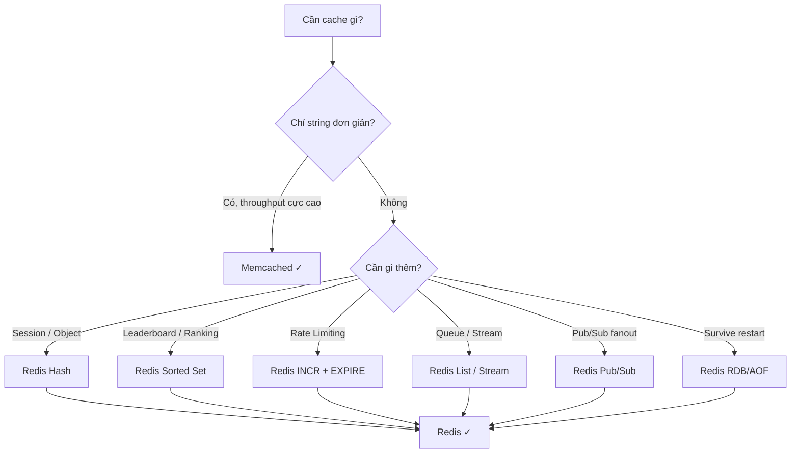

# Bạn dùng Redis. Tại sao không dùng Memcached?

## Câu hỏi

> **Bạn đang dùng Redis làm cache. Tại sao không dùng Memcached?**

---

## Dành cho level

<Tabs items={["Mid", "Senior", "Staff"]}>

<Tab value="Mid">

Interviewer expect bạn biết **sự khác biệt kỹ thuật cơ bản**: data structures, persistence, clustering. Trả lời được "Redis có gì Memcached không có" là đủ.

Điểm cộng: biết nêu use case cụ thể tại sao dự án mình cần Redis (session, rate limiting, sorted set leaderboard…).

</Tab>

<Tab value="Senior">

Interviewer expect bạn **biết trade-off hai chiều**: không chỉ "Redis tốt hơn" mà còn biết *khi nào Memcached lại phù hợp hơn*. Phải nhắc đến licensing thay đổi 2024 (Redis → Valkey) nếu bàn về long-term strategy.

Điểm cộng: kinh nghiệm thực tế — đã từng tune Redis memory, dùng Redis Cluster, hoặc dùng sorted set cho leaderboard/rate limiting.

</Tab>

<Tab value="Staff">

Interviewer expect bạn suy nghĩ ở tầng **organizational decision**: chọn caching layer ảnh hưởng đến toàn bộ stack, không chỉ một service. Phải nhắc đến Valkey fork (AWS ElastiCache đã default sang Valkey), chi phí operational, và khi nào nên re-evaluate.

Điểm cộng: đã thiết kế caching strategy cho nhiều team, biết khi nào dùng local cache (Caffeine) + distributed cache (Redis) theo kiểu two-level caching.

</Tab>

</Tabs>

---

## Cốt lõi cần nhớ

**Redis là một in-memory data structure store — không chỉ là cache.** Memcached chỉ là cache thuần túy (key-string), còn Redis hỗ trợ List, Set, Sorted Set, Hash, Stream, HyperLogLog — giúp implement nhiều pattern phức tạp ngay trên cache layer.

**Persistence và High Availability là lý do production quan trọng nhất.** Redis có RDB + AOF để survive restart; có native replication và Redis Cluster. Memcached mất toàn bộ data khi restart và không có clustering native — phải dùng proxy ngoài (Twemproxy, mcrouter).

**Câu trả lời trung thực hơn là: "Redis thắng 90% use case, nhưng Memcached vẫn có chỗ của nó."** Memcached đơn giản hơn, multi-threaded native, và tốt hơn cho pure-string caching throughput cực cao. Biết khi nào Memcached phù hợp sẽ khiến interviewer ấn tượng hơn.

---

## Câu trả lời mẫu

> "Chúng tôi chọn Redis vì project không chỉ cần cache string đơn thuần — chúng tôi dùng Sorted Set để implement rate limiting theo user ID, dùng Hash để lưu session object, và dùng Pub/Sub để broadcast invalidation event giữa các service. Những thứ đó làm được ngay trong Redis mà không cần thêm dependency. Nếu chỉ cần cache thuần — ví dụ cache HTML fragment hoặc API response là string — Memcached thực ra nhẹ hơn và multi-threaded native nên throughput raw có thể cao hơn trên cùng hardware. Nhưng với use case của chúng tôi, việc chỉ dùng một tool làm được nhiều thứ giảm complexity ops đáng kể. Một điểm nữa về long-term: năm 2024 Redis đổi license sang RSALv2+SSPLv1, Linux Foundation fork ra Valkey — AWS ElastiCache hiện default sang Valkey rồi. Chúng tôi đang theo dõi sát, nhưng Valkey vẫn drop-in compatible nên migration nếu cần cũng không phức tạp."

---

## Phân tích chi tiết

### So sánh tổng quan

| Tiêu chí | Redis | Memcached |
|----------|-------|-----------|
| Data structures | String, List, Set, Sorted Set, Hash, Stream, HyperLogLog, Geo | String only |
| Persistence | RDB snapshots + AOF | Không — mất khi restart |
| Replication | Native master-replica | Không native |
| Clustering | Redis Cluster (native) | Cần proxy ngoài (Twemproxy, mcrouter) |
| Threading model | Single-threaded commands (multi-threaded I/O từ Redis 6) | Multi-threaded |
| Pub/Sub | Có | Không |
| Transactions | MULTI/EXEC | Không |
| Lua scripting | Có | Không |
| Max value size | 512 MB | 1 MB |
| License (2024+) | RSALv2 + SSPLv1 (không OSS) | BSD (OSS) |
| AWS managed | ElastiCache for Redis / **Valkey** (default mới) | ElastiCache for Memcached |

---

### Tại sao Redis thắng phần lớn use case production



#### Use case 1 — Rate Limiting với Sorted Set

```java
// Spring Boot + Lettuce: sliding window rate limit
public boolean isAllowed(String userId, int maxRequests, Duration window) {
    String key = "rate_limit:" + userId;
    long now = System.currentTimeMillis();
    long windowStart = now - window.toMillis();

    return redisTemplate.execute(session -> {
        // Xóa requests cũ ngoài window
        session.zRemRangeByScore(key.getBytes(), 0, windowStart);
        Long count = session.zCard(key.getBytes());
        if (count == null || count < maxRequests) {
            session.zAdd(key.getBytes(), now, (now + "").getBytes());
            session.expire(key.getBytes(), window.getSeconds());
            return true;
        }
        return false;
    }, true);
}
```

Làm điều này với Memcached: không thể — không có Sorted Set, phải dùng thêm DB hoặc implement distributed counter phức tạp.

#### Use case 2 — Session Storage với Hash

```java
// Lưu nhiều field trong 1 key — không cần serialize/deserialize toàn bộ object
redisTemplate.opsForHash().putAll("session:" + sessionId, Map.of(
    "userId", user.getId(),
    "role", user.getRole(),
    "lastAccess", Instant.now().toString()
));
// Chỉ update 1 field — không cần đọc-ghi toàn bộ
redisTemplate.opsForHash().put("session:" + sessionId, "lastAccess", Instant.now().toString());
```

Với Memcached: phải serialize toàn bộ Java object → lưu string → đọc ra → deserialize → modify → serialize lại → ghi. Tốn CPU và network bandwidth hơn.

#### Use case 3 — Cache Invalidation Broadcast qua Pub/Sub

```java
// Publisher: khi product update
redisTemplate.convertAndSend("cache:invalidate:product", productId.toString());

// Subscriber: mỗi service instance tự clear local cache
@RedisListener(channel = "cache:invalidate:product")
public void onInvalidate(String productId) {
    localCaffeineCache.invalidate(productId);
}
```

Memcached không có Pub/Sub — phải dùng message broker riêng (Kafka, SNS) cho pattern này.

---

### Persistence — lý do quan trọng nhất trong production

```
Redis restart flow với AOF:
┌─────────────────────────────────────────────────────────┐
│  Redis server shutdown / crash                          │
│           ↓                                             │
│  AOF file trên disk (append-only, từng command)         │
│           ↓                                             │
│  Redis restart → replay AOF → data restored             │
│  (RPO: 1 giây nếu fsync=everysec)                       │
└─────────────────────────────────────────────────────────┘

Memcached restart flow:
┌─────────────────────────────────────────────────────────┐
│  Memcached server restart                               │
│           ↓                                             │
│  [ALL DATA GONE — cold start]                           │
│           ↓                                             │
│  Cache miss 100% → thundering herd → DB overload        │
└─────────────────────────────────────────────────────────┘
```

```yaml
# Redis persistence config (application.yml / redis.conf)
# RDB — snapshot định kỳ (tốt cho backup)
save: "900 1"   # 1 change trong 900 giây → snapshot
save: "300 10"  # 10 changes trong 300 giây → snapshot
save: "60 10000"

# AOF — ghi từng command (durability cao hơn)
appendonly: yes
appendfsync: everysec   # flush mỗi 1 giây — balance giữa performance và durability
```

---

### Khi nào Memcached vẫn là lựa chọn đúng

<Callout type="info">

**Đây là điểm phân biệt Senior vs Mid**: biết khi nào *không dùng* Redis mới là engineer tốt.

</Callout>

| Scenario | Tại sao Memcached phù hợp hơn |
|----------|-------------------------------|
| Cache HTML fragment / API response thuần string | Memcached multi-threaded native → throughput cao hơn cùng CPU |
| Cần scale horizontal đơn giản nhất | Memcached scale-out dễ hơn (client-side sharding đủ dùng) |
| Không cần persistence, không cần data structures phức tạp | Memcached ít ops overhead hơn — ít thứ phải tune |
| Stack đã có Memcached, team quen vận hành | Migration cost không justify nếu use case đơn giản |
| Compliance yêu cầu fully OSS license | Memcached là BSD — Redis 7.4+ không còn là OSS |

---

### Licensing thay đổi 2024 — điểm quan trọng không nên bỏ qua

```
Timeline:
Mar 2024 — Redis Labs đổi license từ BSD → RSALv2 + SSPLv1
           (không còn OSS theo định nghĩa Open Source Initiative)
           ↓
Mar 2024 — Linux Foundation fork Redis 7.2.4 → Valkey
           Contributors: AWS, Google Cloud, Oracle, Ericsson...
           ↓
2025     — AWS ElastiCache đặt Valkey làm default engine
           Google Cloud Memorystore thêm Valkey support
           ↓
2026     — Valkey 8.x production-ready, drop-in compatible với Redis
```

```yaml
# AWS ElastiCache — khi tạo cluster mới
# Valkey là drop-in replacement — application code không đổi
aws elasticache create-cache-cluster \
  --cache-cluster-id my-cache \
  --engine valkey \          # Trước đây là "redis"
  --engine-version 8.0 \
  --cache-node-type cache.r7g.large
```

> Nếu dùng Redis 7.4+ trên self-hosted, cần review license với legal team trước khi production. Valkey là lựa chọn an toàn hơn nếu cần fully OSS.

---

### Architecture pattern: Two-Level Caching

Pattern thực tế tại các công ty lớn: dùng **local cache (Caffeine) + Redis** thay vì chỉ dùng Redis.

```
Request flow:
┌────────────┐    L1 hit?    ┌──────────────┐    L2 hit?    ┌─────────┐
│  Service   │──────────────▶│   Caffeine   │──────────────▶│  Redis  │
│  Instance  │◀──────────────│  (local JVM) │◀──────────────│         │
└────────────┘   ~0.1ms      └──────────────┘    ~1ms       └────┬────┘
                                                                  │ miss
                                                             ┌────▼────┐
                                                             │   RDS   │
                                                             │  ~50ms  │
                                                             └─────────┘
```

```java
@Service
public class ProductService {
    // L1: local cache, 1000 entries, expire 30s
    private final Cache<String, Product> localCache = Caffeine.newBuilder()
        .maximumSize(1000)
        .expireAfterWrite(30, TimeUnit.SECONDS)
        .build();

    public Product getProduct(String id) {
        // L1 hit → trả về ngay, không qua network
        Product cached = localCache.getIfPresent(id);
        if (cached != null) return cached;

        // L2: Redis (~1ms)
        Product fromRedis = redisTemplate.opsForValue()
            .get("product:" + id, Product.class);
        if (fromRedis != null) {
            localCache.put(id, fromRedis);
            return fromRedis;
        }

        // L3: DB (~50ms)
        Product fromDb = productRepository.findById(id).orElseThrow();
        redisTemplate.opsForValue().set("product:" + id, fromDb, Duration.ofMinutes(10));
        localCache.put(id, fromDb);
        return fromDb;
    }
}
```

Memcached không hỗ trợ Pub/Sub → không thể broadcast L1 invalidation hiệu quả khi data thay đổi.

---

## Bẫy thường gặp

❌ **"Redis nhanh hơn Memcached"**

→ Tại sao sai: Không đúng cho mọi trường hợp. Với pure string throughput, Memcached multi-threaded native có thể nhanh hơn Redis trên workload cực cao vì Redis xử lý commands single-threaded (dù I/O đã multi-thread từ Redis 6).

✅ Đúng hơn: "Redis và Memcached đều sub-millisecond cho most use cases. Redis thắng về *feature richness và flexibility*, không nhất thiết về raw throughput."

---

❌ **"Memcached không dùng được nữa vì Redis tốt hơn"**

→ Tại sao sai: Memcached vẫn được dùng tại Facebook (mcrouter), Slack, và các hệ thống cần simple string cache throughput cực cao. Stack đơn giản là lợi thế khi ops resources hạn chế.

✅ Đúng hơn: "Redis là lựa chọn mặc định tốt hơn cho phần lớn use case, nhưng Memcached vẫn có chỗ đứng trong các workload pure caching string với throughput yêu cầu cực cao và không cần features nâng cao."

---

❌ **"Redis là open source nên không cần lo license"**

→ Tại sao sai: Từ tháng 3/2024, Redis 7.4+ dùng RSALv2+SSPLv1 — không còn là OSS theo định nghĩa của Open Source Initiative. Dùng Redis trong commercial product cần review legal.

✅ Đúng hơn: Nếu cần fully OSS, dùng **Valkey** (fork của Redis, license BSD, do Linux Foundation quản lý). AWS ElastiCache đã default sang Valkey.

---

❌ **"Thêm Redis là xong, không cần nghĩ gì thêm"**

→ Tại sao sai: Redis cần được tune: `maxmemory`, `maxmemory-policy`, connection pool size, serialization format. Không tune → eviction storm, connection exhaustion, hoặc high latency khi serializing large objects.

✅ Đúng hơn: Sau khi chọn Redis, cần define rõ: max memory, eviction policy (allkeys-lru vs volatile-lru), TTL strategy (jitter để tránh thundering herd), và monitoring (keyspace hits/misses ratio).

---

## Câu hỏi follow-up

### 1. Khi nào bạn dùng `allkeys-lru` vs `volatile-lru`?

`volatile-lru` chỉ evict key có TTL — an toàn hơn vì key không có TTL (session dài hạn) không bị xóa. Nhưng nếu tất cả key đều có TTL, hai policy này tương đương. `allkeys-lru` phù hợp khi Redis là pure cache (tất cả data có thể regenerate từ DB). `noeviction` (default) — Redis trả error khi đầy — không nên dùng trong production cache.

### 2. Redis Cluster vs Redis Sentinel khác gì?

**Sentinel**: High Availability cho single-shard Redis — tự động failover master → replica, nhưng data vẫn trên 1 node. **Cluster**: Sharding + HA — data phân tán trên nhiều node (16384 hash slots), mỗi shard có replica riêng. Cluster phù hợp khi dataset lớn hơn RAM của 1 node. Sentinel đủ dùng khi dataset nhỏ và chỉ cần HA.

### 3. Valkey có thật sự drop-in replacement cho Redis không?

Valkey fork từ Redis 7.2.4 — API, commands, protocol hoàn toàn tương thích. Application code không cần thay đổi. Chỉ cần đổi connection string endpoint. AWS ElastiCache và Google Cloud Memorystore đã hỗ trợ. Rủi ro migration rất thấp.

### 4. Làm sao tránh cache stampede (thundering herd) khi nhiều key expire cùng lúc?

Dùng **TTL jitter** — thêm random offset vào TTL: `TTL = baseTTL + random(0, baseTTL * 0.1)`. Và dùng **probabilistic early expiration** — trước khi key thật sự expire, xác suất cao refresh sớm để 1 request đủ làm ấm cache trước khi request khác bị miss.

---

## Xem thêm

- [2h sáng — Server production sập, 10,000 users online](/behavioral/01-production-server-down) — Scenario 4 trong câu đó là Redis Eviction Storm, liên quan trực tiếp đến caching strategy.
