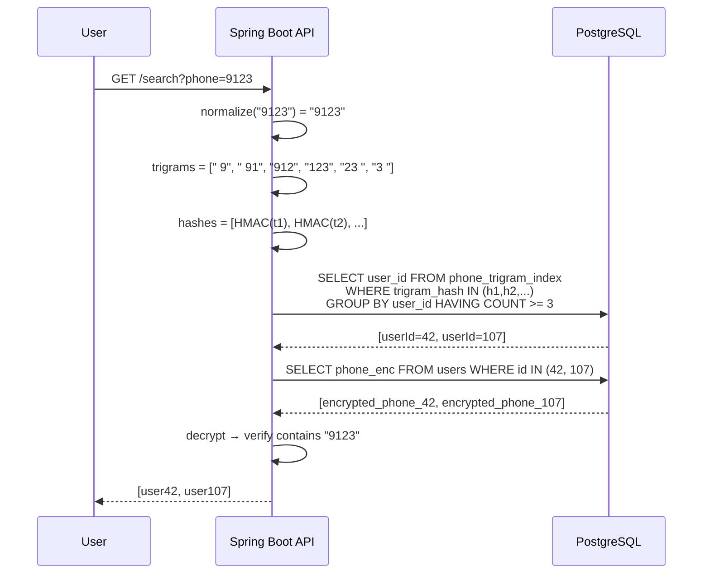

## Câu hỏi

> Cột `phone_number` trong DB được mã hoá để tránh lộ dữ liệu. Bây giờ có yêu cầu cho phép tìm kiếm **fuzzy search** (kiểu `LIKE '%9123%'`) trên cột đó — làm thế nào?

---

## Dành cho level

**Senior / Staff** — câu này test khả năng thiết kế trade-off giữa security và searchability, không phải chỉ biết "dùng AES encrypt".

---

## Cốt lõi cần nhớ

- Encrypted ciphertext hoàn toàn random → `LIKE` trên ciphertext **vô nghĩa**, không thể match.
- Giải pháp production-grade là **Trigram Blind Index**: tách phone thành các chuỗi 3 ký tự → HMAC từng chuỗi → lưu hash vào bảng index riêng → search qua hash, decrypt để verify kết quả.
- Mọi phương án đều có **leakage** (rò rỉ thông tin một phần) — điểm quan trọng interviewer hay hỏi là bạn aware điều này và biết cách giảm thiểu.

---

## Câu trả lời mẫu

Vấn đề cốt lõi là encryption biến phone number thành một chuỗi random hoàn toàn — `LIKE '%9123%'` trên ciphertext sẽ không match gì cả. Có vài hướng tiếp cận tùy theo yêu cầu bảo mật và performance.

Với fuzzy search thực sự, tôi sẽ dùng **Trigram Blind Index**: tách phone gốc thành các chuỗi 3 ký tự liên tiếp (trigram), HMAC từng trigram với một secret key riêng, rồi lưu hash vào bảng index phụ. Khi user tìm "9123", hệ thống cũng tách thành trigrams, hash chúng, tìm trong bảng index — DB chỉ thấy hash vô nghĩa, không biết đang tìm cái gì, nhưng vẫn match được. Sau đó decrypt các row candidate để verify chính xác.

Cách này cho phép substring search mà không expose plaintext trong DB, nhưng vẫn có **frequency leakage** — attacker biết những row nào chia sẻ trigram giống nhau. Để giảm thiểu, ta thêm per-column salt vào HMAC để trigram của cột `phone` khác với trigram của cột khác dù giá trị giống nhau.

Nếu chỉ cần exact match (tìm đúng số điện thoại), dùng **Exact Blind Index** là đủ — hash toàn bộ số đã chuẩn hóa, lưu riêng một cột, index cột đó. Đơn giản hơn và leakage ít hơn nhiều.

---

## Phân tích chi tiết

### Tại sao LIKE không hoạt động trên ciphertext

```
Plaintext:  0912345678
AES-256:    3f8a2c1d9e...  (hoàn toàn khác, random)
LIKE '%9123%' → không match
```

AES không giữ lại bất kỳ pattern nào của plaintext — đó chính là mục đích của encryption.

---

### Exact Blind Index — tìm chính xác

Dùng khi chỉ cần tìm **đúng một số điện thoại** (login bằng phone, dedup, v.v).

**Ý tưởng:** hash toàn bộ phone → lưu hash → search bằng hash.

**Flow INSERT:**

```
phone = "0912345678"

Bước 1: Normalize (bỏ +84, dấu cách, ký tự lạ)
        → "0912345678"

Bước 2: Encrypt để lưu plaintext khi cần
        AES("0912345678") → [rác mã hoá]

Bước 3: Hash toàn bộ để tạo blind index
        HMAC(key="secret", data="0912345678") → "f3a8c1d2..."

Bước 4: Lưu cả hai vào DB
        phone_enc   = [rác mã hoá]   ← đọc plaintext khi cần
        phone_blind = "f3a8c1d2..."  ← dùng để search
```

```sql
ALTER TABLE users ADD COLUMN phone_blind VARCHAR(64);
CREATE INDEX idx_phone_blind ON users(phone_blind);
```

**Flow SEARCH:**

```
User tìm: "0912345678"

Bước 1: Hash input với CÙNG key
        HMAC(key="secret", data="0912345678") → "f3a8c1d2..."
                                                    ↑ giống hệt lúc insert!
Bước 2: Query thẳng
        SELECT * FROM users WHERE phone_blind = "f3a8c1d2..."

Bước 3: Trả về kết quả — không cần decrypt, không cần verify thêm ✓
```

**Tại sao chỉ exact, không fuzzy được?**

```
phone  = "0912345678"  →  HMAC  →  "f3a8c1d2..."
search = "9123"        →  HMAC  →  "b7e2a9c1..."  ← hoàn toàn khác!
```

Hash của cả chuỗi và hash của substring không có liên quan gì nhau — không thể biết cái này là "con" của cái kia. Đó là tính chất cơ bản của hash function.

---

### Trigram Blind Index — fuzzy search

**Bước 1 — Trigram là gì?**

Tách chuỗi thành các đoạn **3 ký tự liên tiếp**:

```
"0912345678"
→ ["091", "912", "123", "234", "345", "456", "567", "678"]
```

Khi user tìm `"9123"`, cũng tách tương tự:
```
"9123" → ["912", "123"]
```

Nếu `"912"` và `"123"` đều có trong phone `0912345678` → khả năng cao là match.

**Bước 2 — Tại sao phải hash trigram (phần "Blind")?**

Nếu lưu trigram thẳng vào DB:

```
phone_trigram_index:
| user_id | trigram |
|---------|---------|
|   42    |  "091"  |  ← lộ mảnh số điện thoại
|   42    |  "912"  |  ← DBA/hacker ghép lại không khó
|   42    |  "123"  |
```

Mục đích encrypt ban đầu **bị phá vỡ hoàn toàn**. Vì vậy phải hash từng trigram:

```
HMAC(key="secret", "091") → "a1b2c3..."
HMAC(key="secret", "912") → "a7f3c8..."   ← DB chỉ thấy thế này
HMAC(key="secret", "123") → "2e9b1f..."
```

DB bị **"mù"** — nó thực hiện được việc tìm kiếm nhưng không biết đang tìm cái gì. Đó là lý do gọi là **Blind** Index.

**Flow INSERT:**

```
phone = "0912345678"

Bước 1: Encrypt phone → lưu vào cột phone_enc

Bước 2: Tách trigrams
        → ["091", "912", "123", "234", "345", "456", "567", "678"]

Bước 3: Hash từng trigram
        HMAC("091") → "a1b2c3..."
        HMAC("912") → "a7f3c8..."
        HMAC("123") → "2e9b1f..."
        ...

Bước 4: Lưu vào bảng index phụ
        phone_trigram_index:
        | user_id=42 | "a1b2c3..." |
        | user_id=42 | "a7f3c8..." |
        | user_id=42 | "2e9b1f..." |
        | ...                      |
```

**Flow SEARCH** với query `"9123"`:

```
Bước 1: Tách query thành trigrams
        "9123" → ["912", "123"]

Bước 2: Hash với CÙNG key
        HMAC("912") → "a7f3c8..."   ← giống hệt lúc insert!
        HMAC("123") → "2e9b1f..."   ← giống hệt lúc insert!

Bước 3: Tìm trong bảng index
        SELECT user_id FROM phone_trigram_index
        WHERE trigram_hash IN ("a7f3c8...", "2e9b1f...")
        GROUP BY user_id
        HAVING COUNT >= 2      ← phải match CẢ 2 trigram
        → trả về user_id = 42

Bước 4: Decrypt phone của user 42
        → "0912345678"
        → verify: contains("9123") = TRUE ✓
```

**Tại sao cần bước verify ở cuối?** Vì có thể có **false positive** — phone `0991230000` cũng chứa trigram `"912"` và `"123"` nhưng không theo thứ tự đúng. Decrypt + verify loại bỏ chúng.

**Schema và code:**

```sql
CREATE TABLE users (
    id          BIGINT PRIMARY KEY,
    phone_enc   BYTEA NOT NULL,
    created_at  TIMESTAMP
);

CREATE TABLE phone_trigram_index (
    user_id      BIGINT REFERENCES users(id),
    trigram_hash VARCHAR(64) NOT NULL
);

CREATE INDEX idx_phone_trigram ON phone_trigram_index(trigram_hash);
```

```java
@Service
public class PhoneEncryptionService {

    @Value("${encryption.phone.key}")
    private String aesKey;

    @Value("${encryption.phone.trigram-key}")
    private String trigramHmacKey;

    private static final String COLUMN_SALT = "phone_v1";

    public void saveUser(String phoneNumber, long userId) {
        String normalized = phoneNumber.replaceAll("[^0-9]", "");

        byte[] encrypted = aesEncrypt(normalized, aesKey);
        jdbcTemplate.update("INSERT INTO users(id, phone_enc) VALUES (?,?)",
            userId, encrypted);

        for (String trigram : generateTrigrams(normalized)) {
            String hash = hmacSha256(trigramHmacKey, trigram + COLUMN_SALT);
            jdbcTemplate.update(
                "INSERT INTO phone_trigram_index(user_id, trigram_hash) VALUES (?,?)",
                userId, hash);
        }
    }

    public List<User> searchByPhone(String query) {
        String normalized = query.replaceAll("[^0-9]", "");
        List<String> trigrams = generateTrigrams(normalized);

        List<String> hashes = trigrams.stream()
            .map(t -> hmacSha256(trigramHmacKey, t + COLUMN_SALT))
            .collect(toList());

        int minMatch = Math.max(1, trigrams.size() / 2);
        List<Long> candidateIds = jdbcTemplate.queryForList("""
            SELECT user_id FROM phone_trigram_index
            WHERE trigram_hash = ANY(?)
            GROUP BY user_id
            HAVING COUNT(DISTINCT trigram_hash) >= ?
            """, Long.class, hashes.toArray(), minMatch);

        // Decrypt và verify để loại false positives
        return candidateIds.stream()
            .map(id -> getUserById(id))
            .filter(user -> {
                String phone = aesDecrypt(user.getPhoneEnc(), aesKey);
                return phone.contains(normalized);
            })
            .collect(toList());
    }

    private List<String> generateTrigrams(String s) {
        List<String> result = new ArrayList<>();
        String padded = "  " + s + "  "; // padding để match prefix/suffix
        for (int i = 0; i <= padded.length() - 3; i++) {
            result.add(padded.substring(i, i + 3));
        }
        return result;
    }
}
```

---

### Pagination với Trigram Blind Index

Đây là điểm phức tạp thường bị bỏ qua. Ví dụ: lấy 10 user có phone LIKE `'123'` và name LIKE `'nam'`, sắp xếp theo `created_at`.

**Nếu name không encrypted** — tương đối đơn giản:

```sql
SELECT u.id, u.phone_enc, u.name, u.created_at
FROM users u
JOIN phone_trigram_index pti ON u.id = pti.user_id
WHERE pti.trigram_hash IN ('hash_123')
  AND u.name ILIKE '%nam%'          -- LIKE bình thường vì name không encrypt
GROUP BY u.id, u.name, u.phone_enc, u.created_at
HAVING COUNT(DISTINCT pti.trigram_hash) >= 1
ORDER BY u.created_at DESC
LIMIT 10 OFFSET 0;
```

Sau đó decrypt `phone_enc` và verify. Sort theo `created_at` hoạt động bình thường vì cột này không encrypted.

**Vấn đề: offset-based pagination bị vỡ do false positives**

```
Muốn page 2 (OFFSET 10, LIMIT 10)
→ DB trả về 20 candidates từ trigram index
→ Decrypt verify → chỉ 13 cái thật sự match (7 là false positive bị loại)
→ Page 2 chỉ có 3 kết quả thay vì 10  ❌
```

Số lượng false positives không đoán trước được → `OFFSET` không đáng tin cậy.

**Giải pháp — Cursor-based pagination:**

Thay vì `OFFSET`, dùng `created_at` của item cuối làm cursor:

```java
// Page 1: không có cursor
SELECT ... WHERE created_at < NOW() ORDER BY created_at DESC LIMIT 50
→ decrypt verify → lấy 10 đầu đủ điều kiện
→ cursor = created_at của item thứ 10

// Page 2: truyền cursor
SELECT ... WHERE created_at < {cursor} ORDER BY created_at DESC LIMIT 50
→ decrypt verify → lấy 10 tiếp theo
```

Fetch nhiều hơn cần (50 thay vì 10) để bù cho false positives bị loại sau verify.

**Tóm tắt pagination:**

| Yêu cầu | Làm được không |
|---------|---------------|
| Filter phone LIKE + name LIKE | ✅ Được |
| Sort theo `created_at` | ✅ Dễ (không encrypted) |
| Offset-based pagination | ⚠️ Không đáng tin — false positives làm lệch count |
| Cursor-based pagination | ✅ Recommended |
| `Total count` chính xác | ❌ Khó — phải decrypt hết để đếm |

---

### Luồng tổng thể



---

### So sánh các phương án

| Phương án | Fuzzy Search | Performance | Security | Độ phức tạp |
|-----------|-------------|-------------|----------|-------------|
| Trigram Blind Index | Substring đầy đủ | O(log n) via index | Tốt (có leakage) | Cao |
| Exact Blind Index | Chỉ exact | O(log n) | Tốt nhất | Thấp |
| FPE | Prefix (hạn chế) | O(log n) | Trung bình | Trung bình |
| Decrypt-all | Full text | O(n) — không scale | Tốt | Thấp |

---

### Security considerations

<Callout type="warn" title="Trigram Leakage">

Trigram Blind Index **lộ thông tin tần suất**: attacker biết hai user có cùng trigram "912". Với phone numbers, tần suất trigram có thể dùng để frequency analysis.

Giảm thiểu:
1. **Per-column salt** trong HMAC — trigram "912" của cột `phone` khác với cột khác.
2. **Padding noise** — thêm dummy trigrams vào index (tăng false positives, giảm precision).
3. **Rate limiting** trên search API — giới hạn số lần search.
4. **Audit log** mọi search query.

</Callout>

<Callout type="info" title="Key Management">

Secret keys (AES key + HMAC trigram key) phải được lưu trong **AWS Secrets Manager** hoặc **HashiCorp Vault**, không bao giờ hardcode hay lưu trong DB.

```yaml
# application.yml — chỉ reference, không chứa value thật
encryption:
  phone:
    key: ${PHONE_AES_KEY}           # from Secrets Manager
    trigram-key: ${PHONE_TRIGRAM_KEY}
```

</Callout>

---

## Bẫy thường gặp

❌ **"Decrypt toàn bộ rồi filter ở application"**
→ Tại sao sai: O(n) decrypt, không scale với triệu rows, gây timeout và memory spike.
✅ Đúng hơn: Cần index-based approach để search O(log n).

---

❌ **"Dùng LIKE trực tiếp trên cột encrypted"**
→ Tại sao sai: AES ciphertext là random bytes — `LIKE '%9123%'` sẽ không bao giờ match.
✅ Đúng hơn: Phải build searchable index từ plaintext trước khi encrypt.

---

❌ **"Trigram Blind Index hoàn toàn bảo mật, không lộ gì"**
→ Tại sao sai: Vẫn có frequency leakage — attacker có thể biết hai row chia sẻ trigram giống nhau.
✅ Đúng hơn: Blind index leaks set-membership — cần per-column salt và rate limiting để giảm thiểu.

---

❌ **"Hash phone rồi LIKE trên hash"**
→ Tại sao sai: Hash của `"0912345678"` và hash của `"9123"` hoàn toàn khác nhau — không có quan hệ gì. LIKE trên hash vô nghĩa.
✅ Đúng hơn: Phải hash từng trigram riêng lẻ, không hash toàn bộ string.

---

❌ **"Dùng OFFSET bình thường để phân trang"**
→ Tại sao sai: False positives từ trigram matching làm lệch số lượng kết quả sau verify — page 2 có thể trả về ít hơn expected.
✅ Đúng hơn: Dùng cursor-based pagination (dùng `created_at` làm cursor) và over-fetch để bù false positives.

---

## Câu hỏi follow-up

### 1. Index bị bloat khi data lớn, làm sao optimize?

Dùng Bloom Filter thay vì bảng index riêng: encode tất cả trigram hashes vào 1 Bloom Filter bitset, lưu thành 1 cột `BYTEA` trên bảng `users`. False positive cao hơn một chút nhưng storage nhỏ hơn nhiều — thay vì 500M rows (50M users × 10 trigrams) chỉ còn 50M rows với 1 cột bytes. Sau khi Bloom filter qua, decrypt verify chính xác như bình thường.

### 2. Nếu phone number thay đổi, update index thế nào?

Xoá toàn bộ trigram cũ (`DELETE FROM phone_trigram_index WHERE user_id = ?`), tính lại trigrams mới, insert lại. Wrap toàn bộ trong transaction cùng với update `phone_enc` để tránh trạng thái inconsistent.

### 3. Performance với 50 triệu rows?

Index `phone_trigram_index(trigram_hash)` xử lý tốt — lookup O(log n). Vấn đề là bảng index phình to (50M phones × 10 trigrams = 500M rows). Giải pháp: partition bảng index theo `user_id % 100`, hoặc chuyển sang Bloom Filter column như đề cập ở trên.

### 4. Khi nào dùng Exact Blind Index thay vì Trigram?

Khi requirement chỉ là "tìm đúng số điện thoại" — ví dụ login bằng phone, kiểm tra duplicate khi đăng ký. Exact Blind Index đơn giản hơn nhiều, leakage ít hơn, index nhỏ hơn. Chỉ dùng Trigram khi cần substring/prefix search thực sự.

---

## Xem thêm

- [Bulk upsert billion rows](/java/02-bulk-upsert-billion-rows) — xử lý volume lớn trong DB
- [Redis vs Memcached](/caching/01-redis-vs-memcached) — caching layer để giảm search latency
