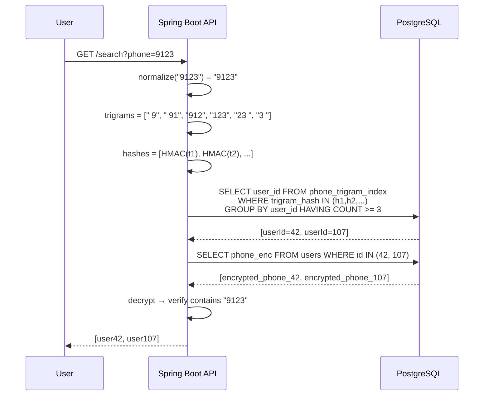

## Câu hỏi

> Cột `phone_number` trong DB được mã hoá để tránh lộ dữ liệu. Bây giờ có yêu cầu cho phép tìm kiếm **fuzzy search** (kiểu `LIKE '%9123%'`) trên cột đó — làm thế nào?

---

## Dành cho level

**Senior / Staff** — câu này test khả năng thiết kế trade-off giữa security và searchability, không phải chỉ biết "dùng AES encrypt".

---

## Cốt lõi cần nhớ

- Encrypted ciphertext hoàn toàn random → `LIKE` trên ciphertext **vô nghĩa**, không thể match.
- Giải pháp production-grade là **Trigram Blind Index**: tách phone thành n-gram → HMAC từng n-gram → lưu vào bảng index riêng → search qua index, decrypt kết quả.
- Mọi phương án đều có **leakage** (rò rỉ thông tin một phần) — điểm quan trọng interviewer hay hỏi là bạn aware điều này và biết cách giảm thiểu.

---

## Câu trả lời mẫu

Vấn đề cốt lõi là encryption biến phone number thành một chuỗi random hoàn toàn — `LIKE '%9123%'` trên ciphertext sẽ không match gì cả. Có vài hướng tiếp cận tùy theo yêu cầu bảo mật và performance.

Với fuzzy search thực sự, tôi sẽ dùng **Trigram Blind Index**: tách phone gốc thành các chuỗi 3 ký tự liên tiếp (trigram), HMAC từng trigram với một secret key riêng, rồi lưu vào bảng index phụ. Khi user tìm "9123", hệ thống cũng tách thành trigrams, hash chúng, tìm trong bảng index, sau đó decrypt các row match được để trả kết quả.

Cách này cho phép substring search mà không expose plaintext trong DB, nhưng vẫn có **frequency leakage** — attacker biết những row nào chia sẻ trigram giống nhau. Để giảm thiểu, ta thêm per-column salt vào HMAC để trigram của cột `phone` khác với trigram của cột khác dù giá trị giống nhau.

Nếu chỉ cần exact match (tìm đúng số điện thoại), dùng **Blind Index đơn giản** là đủ — hash toàn bộ số đã chuẩn hóa, lưu riêng một cột, index cột đó. Rẻ hơn và leakage ít hơn nhiều.

---

## Phân tích chi tiết

### Tại sao LIKE không hoạt động trên ciphertext

```
Plaintext:  0912345678
AES-256:    3f8a2c1d9e...  (hoàn toàn khác, random)
LIKE '%9123%' → không match
```

### Các phương án và trade-off

<Tabs items={["Trigram Blind Index", "Exact Blind Index", "FPE", "Decrypt-all (không dùng)"]}>

<Tab value="Trigram Blind Index">

**Cơ chế:**

```
phone = "0912345678"
trigrams = ["091", "912", "123", "234", "345", "456", "567", "678"]

# Với mỗi trigram:
hash = HMAC-SHA256(key=SECRET_TRIGRAM_KEY, msg=trigram + COLUMN_SALT)
```

**Schema:**

```sql
-- Bảng chính
CREATE TABLE users (
    id          BIGINT PRIMARY KEY,
    phone_enc   BYTEA NOT NULL,        -- AES-256-GCM encrypted
    created_at  TIMESTAMP
);

-- Bảng index phụ
CREATE TABLE phone_trigram_index (
    user_id     BIGINT REFERENCES users(id),
    trigram_hash VARCHAR(64) NOT NULL
);

CREATE INDEX idx_phone_trigram ON phone_trigram_index(trigram_hash);
```

**Insert flow:**

```java
// PhoneEncryptionService.java
@Service
public class PhoneEncryptionService {

    @Value("${encryption.phone.key}")
    private String aesKey;

    @Value("${encryption.phone.trigram-key}")
    private String trigramHmacKey;

    private static final String COLUMN_SALT = "phone_v1";

    public void saveUser(String phoneNumber, long userId) {
        // 1. Normalize: chỉ giữ digit
        String normalized = phoneNumber.replaceAll("[^0-9]", "");

        // 2. Encrypt phone để lưu
        byte[] encrypted = aesEncrypt(normalized, aesKey);
        jdbcTemplate.update("INSERT INTO users(id, phone_enc) VALUES (?,?)",
            userId, encrypted);

        // 3. Tạo trigrams và lưu index
        List<String> trigrams = generateTrigrams(normalized);
        for (String trigram : trigrams) {
            String hash = hmacSha256(trigramHmacKey, trigram + COLUMN_SALT);
            jdbcTemplate.update(
                "INSERT INTO phone_trigram_index(user_id, trigram_hash) VALUES (?,?)",
                userId, hash);
        }
    }

    private List<String> generateTrigrams(String s) {
        List<String> result = new ArrayList<>();
        // Thêm padding để match prefix/suffix
        String padded = "  " + s + "  ";
        for (int i = 0; i <= padded.length() - 3; i++) {
            result.add(padded.substring(i, i + 3));
        }
        return result;
    }
}
```

**Search flow:**

```java
public List<User> searchByPhone(String query) {
    String normalized = query.replaceAll("[^0-9]", "");
    List<String> queryTrigrams = generateTrigrams(normalized);

    // Hash query trigrams
    List<String> queryHashes = queryTrigrams.stream()
        .map(t -> hmacSha256(trigramHmacKey, t + COLUMN_SALT))
        .collect(toList());

    // Tìm user_id có match ít nhất K trigrams (reduce false positives)
    int minMatch = Math.max(1, queryTrigrams.size() / 2);
    List<Long> candidateIds = jdbcTemplate.queryForList("""
        SELECT user_id FROM phone_trigram_index
        WHERE trigram_hash = ANY(?)
        GROUP BY user_id
        HAVING COUNT(DISTINCT trigram_hash) >= ?
        """, Long.class, queryHashes.toArray(), minMatch);

    // Decrypt và verify từng candidate
    return candidateIds.stream()
        .map(id -> getUserById(id))
        .filter(user -> {
            String phone = aesDecrypt(user.getPhoneEnc(), aesKey);
            return phone.contains(normalized); // exact verify
        })
        .collect(toList());
}
```

</Tab>

<Tab value="Exact Blind Index">

Dùng khi chỉ cần tìm **chính xác** một số điện thoại (không cần substring/prefix).

```sql
ALTER TABLE users ADD COLUMN phone_blind_index VARCHAR(64);
CREATE INDEX idx_phone_blind ON users(phone_blind_index);
```

```java
// Khi insert
String blindIndex = hmacSha256(BLIND_INDEX_KEY, normalizedPhone + COLUMN_SALT);
user.setPhoneBlindIndex(blindIndex);

// Khi search exact
String searchHash = hmacSha256(BLIND_INDEX_KEY, searchPhone + COLUMN_SALT);
SELECT * FROM users WHERE phone_blind_index = ?
```

**Ưu điểm:** Đơn giản, ít leakage nhất, index nhỏ.

**Giới hạn:** Chỉ exact match — `WHERE phone = '0912345678'`, không search được `'912'`.

</Tab>

<Tab value="FPE">

**Format-Preserving Encryption (FPE / FF3-1)**: Mã hoá số điện thoại nhưng **giữ nguyên format chữ số**.

```
Plaintext:  0912345678  (10 chữ số)
FPE output: 4721839056  (vẫn 10 chữ số, nhưng mã hoá)
```

```java
// Dùng library như Bouncy Castle FF3-1
FF3_1 ff3 = new FF3_1(key, tweak, Alphabet.DIGITS);
String cipherPhone = ff3.encrypt("0912345678");
// → "4721839056"

// Có thể LIKE prefix nếu cần tìm theo đầu số
SELECT * FROM users WHERE phone_fpe LIKE '47%'
```

**Vấn đề:** FPE có các known weaknesses — nếu attacker có plaintext/ciphertext pairs, có thể crack. **Không khuyến nghị** cho dữ liệu rất nhạy cảm.

</Tab>

<Tab value="Decrypt-all (không dùng)">

```java
// ❌ KHÔNG làm thế này ở production
List<User> all = jdbcTemplate.query("SELECT * FROM users", userMapper);
return all.stream()
    .filter(u -> aesDecrypt(u.getPhoneEnc()).contains(query))
    .collect(toList());
```

**Tại sao không dùng:**
- 10 triệu users → decrypt 10M rows mỗi search
- CPU spike, timeout, OOM
- Không scale

</Tab>

</Tabs>

### So sánh các phương án

| Phương án | Fuzzy Search | Performance | Security | Độ phức tạp |
|-----------|-------------|-------------|----------|-------------|
| Trigram Blind Index | Substring đầy đủ | O(log n) via index | Tốt (có leakage) | Cao |
| Exact Blind Index | Chỉ exact | O(log n) | Tốt nhất | Thấp |
| FPE | Prefix (hạn chế) | O(log n) | Trung bình | Trung bình |
| Decrypt-all | Full text | O(n) — không scale | Tốt | Thấp |

### Luồng tổng thể



### Security considerations

<Callout type="warn" title="Trigram Leakage">

Trigram Blind Index **lộ thông tin tần suất**: attacker biết hai user có cùng trigram "912". Với phone numbers, tần suất trigram có thể dùng để frequency analysis.

Giảm thiểu:
1. **Per-column salt** trong HMAC — trigram "912" của cột `phone` khác với cột khác.
2. **Padding noise** — thêm dummy trigrams vào index (tăng false positives, giảm precision).
3. **Rate limiting** trên search API — giới hạn số lần search.
4. **Audit log** mọi search query.

</Callout>

<Callout type="info" title="Key Management">

Secret keys (AES key + HMAC trigram key) phải được lưu trong **AWS Secrets Manager** hoặc **HashiCorp Vault**, không bao giờ hardcode hay lưu trong DB.

```yaml
# application.yml — chỉ reference, không chứa value thật
encryption:
  phone:
    key: ${PHONE_AES_KEY}           # from Secrets Manager
    trigram-key: ${PHONE_TRIGRAM_KEY}
```

</Callout>

---

## Bẫy thường gặp

**[Sai] "Decrypt toàn bộ rồi filter ở application"**
→ Tại sao sai: O(n) decrypt, không scale với triệu rows, gây timeout và memory spike.
→ Câu đúng: Cần index-based approach để search O(log n).

---

**[Sai] "Dùng LIKE trực tiếp trên cột encrypted"**
→ Tại sao sai: AES ciphertext là random bytes — `LIKE '%9123%'` sẽ không bao giờ match.
→ Câu đúng: Phải build searchable index từ plaintext trước khi encrypt.

---

**[Sai] "Trigram Blind Index hoàn toàn bảo mật, không lộ gì"**
→ Tại sao sai: Vẫn có frequency leakage — attacker có thể biết hai row chia sẻ trigram giống nhau.
→ Câu đúng: Blind index leaks set-membership — cần per-column salt và rate limiting để giảm thiểu.

---

**[Sai] "Hash phone rồi LIKE trên hash"**
→ Tại sao sai: Hash của "0912345678" và hash của "912345" hoàn toàn khác nhau — LIKE trên hash vô nghĩa.
→ Câu đúng: Phải hash từng n-gram riêng lẻ, không hash toàn bộ string.

---

## Câu hỏi follow-up

**1. Index bị bloat khi phone nhiều digit, làm sao optimize?**

> Dùng Bloom Filter thay vì bảng index riêng: encode tất cả trigram hashes vào 1 Bloom Filter bitset, lưu thành 1 cột `BYTEA`. False positive cao hơn nhưng storage nhỏ hơn nhiều. Sau khi filter qua Bloom, decrypt verify chính xác.

**2. Nếu phone number thay đổi, update index thế nào?**

> Xoá toàn bộ trigram cũ của user đó (`DELETE FROM phone_trigram_index WHERE user_id = ?`), tính lại trigrams mới, insert lại. Wrap trong transaction cùng với update `phone_enc`.

**3. Performance với 50 triệu rows?**

> Index `phone_trigram_index(trigram_hash)` sẽ xử lý tốt — lookup là O(log n). Vấn đề là bảng index có thể rất lớn (1 phone ≈ 10 trigrams → 50M phones = 500M rows). Giải pháp: partition bảng index theo `user_id % 100`, hoặc dùng Bloom Filter column thay thế.

**4. Khi nào dùng Exact Blind Index thay vì Trigram?**

> Khi requirement chỉ là "tìm đúng số điện thoại" (ví dụ: đăng nhập bằng phone). Exact Blind Index đơn giản hơn, leakage ít hơn, index nhỏ hơn. Chỉ dùng Trigram khi cần substring/prefix search thực sự.

---

## Xem thêm

- [Bulk upsert billion rows](/java/02-bulk-upsert-billion-rows) — xử lý volume lớn trong DB
- [Redis vs Memcached](/caching/01-redis-vs-memcached) — caching layer để giảm search latency
