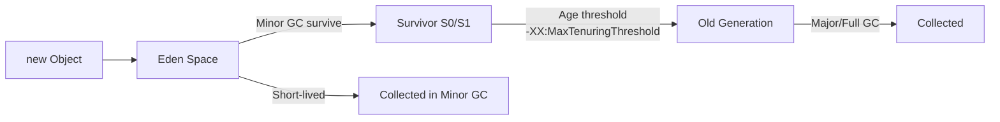

# Heap vs Off-Heap Memory vs Stack trong Java

## Câu hỏi

> **Giải thích sự khác nhau giữa Heap, Off-Heap Memory, và Stack trong JVM. Khi nào bạn nên dùng off-heap memory trong production?**

---

## Dành cho level

<Tabs items={["Mid", "Senior", "Staff"]}>

<Tab value="Mid">

Interviewer expect bạn phân biệt được **3 vùng nhớ cơ bản**: Stack lưu gì, Heap lưu gì, và biết GC chỉ quản lý Heap.

Điểm cộng: biết `new Object()` đi vào Heap, primitive local variable đi vào Stack, và `DirectByteBuffer` là off-heap.

</Tab>

<Tab value="Senior">

Interviewer expect bạn hiểu **trade-off production thực tế**: khi nào off-heap giảm GC pressure, `OutOfMemoryError: Direct buffer memory` là gì, và cách tune `-XX:MaxDirectMemorySize`.

Điểm cộng: từng debug memory leak off-heap, biết Netty/Kafka dùng off-heap như thế nào, hoặc profile RSS vs Xmx trong container.

</Tab>

<Tab value="Staff">

Interviewer expect bạn nghĩ ở tầm **architectural decision**: khi nào cả team nên dùng off-heap (large cache, high-throughput I/O), rủi ro manual memory management, và cách observability phân biệt heap leak vs native leak trong Kubernetes pod.

Điểm cộng: đã thiết kế memory budget cho containerized JVM app, biết Project Panama / Foreign Function & Memory API (Java 22+) thay thế Unsafe như thế nào.

</Tab>

</Tabs>

---

## Cốt lõi cần nhớ

**Stack là per-thread và tự giải phóng — không bao giờ bị GC đụng vào.** Mỗi thread có stack riêng, lưu frame method (local variables, parameters, return address). Method return → frame bị pop ngay lập tức, không cần GC.

**Heap là nơi GC sống — mọi `new Object()` đều đổ vào đây.** GC quản lý toàn bộ vòng đời object trên heap. GC pause tỉ lệ thuận với lượng object sống sót, không phải lượng rác — đây là lý do off-heap có giá trị.

**Off-heap (Native Memory) nằm ngoài tầm kiểm soát của GC.** JVM process sở hữu vùng nhớ OS này, nhưng không GC nó. Lợi ích: zero GC pressure; rủi ro: bạn phải tự giải phóng, nếu không → native memory leak, pod bị OOMKill dù heap còn trống.

---

## Câu trả lời mẫu

> "Câu hỏi này tôi thường trả lời qua một case thực tế: pod production bị OOMKill liên tục, nhìn Grafana thấy heap usage chỉ 40% — team ai cũng nghĩ 'không phải lỗi memory'. Nhưng thực tế vấn đề nằm ở off-heap — Kafka producer buffer, Netty direct buffers, thread stacks — những thứ GC không quản lý và heap metrics không hiện. Container memory limit áp lên tổng RSS của process, không chỉ heap. Đây là lý do tôi luôn phân biệt rõ 3 vùng: Heap là nơi GC sống — mọi `new Object()` đổ vào đây, GC lo dọn dẹp, nhưng heap lớn cũng có cái giá vì GC phải scan toàn bộ live objects nên cache 10 GB trên heap sẽ gây pause dài. Off-heap nằm ngoài GC — tốt cho large cache hoặc I/O buffer vì zero GC pressure, nhưng bạn phải tự giải phóng, quên thì leak âm thầm cho đến khi pod bị kill. Stack thì đơn giản nhất — per-thread, tự cleanup khi method return, hiếm khi gây vấn đề. Rule of thumb: set `Xmx` ≤ 75% container memory limit, luôn monitor RSS thay vì chỉ heap, và chỉ dùng off-heap khi có lý do production rõ ràng."

---

## Phân tích chi tiết

### Scenario: Pod bị OOMKill nhưng heap chỉ 40%

Trước khi đi vào lý thuyết, hãy bắt đầu bằng một case thực tế — đây là kiểu bug mà nếu không hiểu 3 vùng nhớ, bạn sẽ mất hàng giờ debug sai hướng:

```bash
# Pod restart liên tục
kubectl describe pod api-server-xxx -n production
# Last State: Terminated | Reason: OOMKilled | Exit Code: 137

# Nhưng heap metrics bình thường!
curl http://pod:8080/actuator/metrics/jvm.memory.used
# jvm.memory.used{area="heap"} = 1.6 GB  (Xmx = 4 GB → chỉ 40%)

# Vậy memory nào đang chiếm?
kubectl exec -it pod-name -- cat /proc/1/status | grep VmRSS
# VmRSS: 7,800,000 kB  → 7.8 GB >> container limit 8 GB → OOMKill!
```

**Root cause:** RSS = Heap (4 GB max) + Metaspace (~300 MB) + Thread stacks (500 threads × 1 MB = 500 MB) + Direct buffers (Kafka + Netty ~2 GB) + JVM internal (~500 MB) = **~7.3 GB**. Vượt container limit 8 GB khi traffic spike.

Hiểu vấn đề này đòi hỏi phải phân biệt rõ 3 vùng nhớ — đó là lý do interviewer hỏi câu này.

---

### JVM Memory Map tổng thể

```
JVM Process Memory (RSS)
├── Heap
│   ├── Young Generation (Eden + S0 + S1)   ← Minor GC
│   └── Old Generation (Tenured)            ← Major GC
├── Metaspace (off-heap)                    ← Class metadata
├── Thread Stacks (off-heap)                ← 1 stack / thread (~512KB default)
├── Direct Buffers (off-heap)               ← ByteBuffer.allocateDirect()
├── Native Libraries (JNI)
└── JVM Internal (Code Cache, Compiler...)
```

> **Quan trọng:** `Xmx` chỉ giới hạn Heap. Tổng RSS của process = Heap + tất cả off-heap. Container memory limit áp lên RSS → pod bị kill dù `Xmx` chưa đạt nếu off-heap bị leak.

---

### So sánh 3 vùng nhớ

| Đặc điểm | Stack | Heap | Off-Heap (Native) |
|-----------|-------|------|-------------------|
| Scope | Per-thread | Shared (all threads) | Shared (process-level) |
| Lưu gì | Local vars, method frames, primitives | Objects (`new`) | Direct buffers, Metaspace, thread stacks |
| GC quản lý | Không | Có | Không |
| Giải phóng | Tự động (method return) | GC | Thủ công (hoặc Cleaner/Finalizer) |
| Tốc độ alloc | Cực nhanh (pointer move) | Nhanh (Young Gen bump-the-pointer) | Chậm (`malloc` OS call) |
| Giới hạn | `-Xss` (default 512KB–1MB) | `-Xmx` | `-XX:MaxDirectMemorySize` |
| OOM error | `StackOverflowError` | `OutOfMemoryError: Java heap space` | `OutOfMemoryError: Direct buffer memory` |

---

### Heap — Vòng đời object và GC



**GC pause tỉ lệ với live objects**, không phải garbage:
- 10 GB heap, 9 GB rác → GC nhanh (chỉ copy 1 GB live)
- 10 GB heap, 9 GB live (ví dụ large in-memory cache) → GC chậm, pause dài

Đây là **root cause** khiến large in-heap cache gây GC pressure nặng — dù cache không "rác", GC vẫn phải scan để biết chúng không phải rác.

---

### Off-Heap — Khi nào và tại sao

#### Cách allocate

```java
// Direct ByteBuffer — phổ biến nhất
ByteBuffer buf = ByteBuffer.allocateDirect(1024 * 1024); // 1MB off-heap

// Netty PooledByteBufAllocator — pool tái sử dụng
ByteBuf nettyBuf = PooledByteBufAllocator.DEFAULT.directBuffer(1024);
nettyBuf.release(); // PHẢI release thủ công

// Java 22+ Foreign Memory API (thay thế Unsafe)
try (Arena arena = Arena.ofConfined()) {
    MemorySegment segment = arena.allocate(1024);
    // auto-released khi ra khỏi try block
}
```

#### Giải phóng off-heap

Direct ByteBuffer được giải phóng khi ByteBuffer object bị GC collect (qua `Cleaner`). Vấn đề: ByteBuffer object rất nhỏ → tồn tại lâu trên Old Gen → off-heap memory bị giữ lâu dù không còn dùng.

```java
// Nguy hiểm — dễ leak
ByteBuffer buf = ByteBuffer.allocateDirect(512 * 1024 * 1024); // 512MB off-heap
buf = null; // object eligible for GC, nhưng off-heap chưa được giải phóng
// cho đến khi GC chạy và collect ByteBuffer object này
```

---

### Use cases off-heap trong production thực tế

#### 1. High-throughput I/O — Netty / Kafka

```
Kernel Buffer → [copy] → JVM Heap Buffer → [copy] → App
Kernel Buffer → [zero-copy] → Direct Buffer → App   // off-heap, ít copy hơn
```

Kafka Network Layer dùng `ByteBuffer.allocateDirect()` cho network I/O. Netty mặc định `directBuffer` cho socket reads/writes → giảm copy giữa kernel space và JVM heap.

#### 2. Large Cache — Cassandra, Apache Ignite

```
Apache Cassandra row cache: dùng OHC (Off-Heap Cache)
- 30 GB cache → 0 GC impact
- Nếu dùng Heap: Full GC mỗi vài phút, pause 5-10 giây
```

#### 3. Spring Boot + Kafka trong production

```java
@Configuration
public class KafkaConfig {
    @Bean
    public ProducerFactory<String, String> producerFactory() {
        Map<String, Object> props = new HashMap<>();
        // Kafka internally uses DirectByteBuffer for send buffers
        props.put(ProducerConfig.BUFFER_MEMORY_CONFIG, 33554432L); // 32MB off-heap
        props.put(ProducerConfig.BATCH_SIZE_CONFIG, 16384);
        return new DefaultKafkaProducerFactory<>(props);
    }
}
```

---

### Stack — đơn giản nhất, ít gây vấn đề nhất

Stack hiếm khi là root cause của production incident, nhưng interviewer vẫn muốn bạn giải thích được mechanism.

Mỗi method call tạo một **stack frame** chứa:
- Local variable table (primitive values stored inline, object references → actual object ở Heap)
- Operand stack
- Return address

```java
void processOrder(int orderId) {        // orderId → Stack (primitive)
    Order order = orderRepo.find(id);   // order reference → Stack, Order object → Heap
    double total = order.getTotal();    // total → Stack (primitive double)
    // method return → frame bị pop, orderId + order ref + total biến mất
}
```

**Khi nào Stack gây vấn đề:** `StackOverflowError` xảy ra khi đệ quy quá sâu. Và nguy hiểm hơn: tạo quá nhiều thread cũng gây OOM — `Xss512k` × 10.000 threads = 5 GB chỉ cho stack, chưa tính heap. Đây là lý do trong Kubernetes nên dùng virtual threads (Java 21+) hoặc async I/O thay vì thread-per-request.

---

### Monitoring trong Kubernetes / AWS EKS

```bash
# Heap usage — JMX hoặc Actuator
curl http://pod:8080/actuator/metrics/jvm.memory.used

# Native memory — phải xem RSS của process
kubectl exec -it pod-name -- cat /proc/1/status | grep VmRSS

# Direct buffer pool
curl http://pod:8080/actuator/metrics/jvm.buffer.memory.used?tag=id:direct
```

```yaml
# Prometheus Alert — off-heap leak
- alert: JvmNativeMemoryLeak
  expr: |
    process_resident_memory_bytes - jvm_memory_used_bytes{area="heap"}
    > 2 * jvm_memory_max_bytes{area="heap"}
  for: 10m
  annotations:
    summary: "Native memory {{ $value | humanize }} >> heap max — possible off-heap leak"
```

---

### JVM flags quan trọng

```bash
# Heap
-Xms2g -Xmx4g

# Stack per thread
-Xss512k   # giảm nếu tạo nhiều thread (default 512k-1m tùy JVM)

# Off-heap direct memory
-XX:MaxDirectMemorySize=1g   # default = Xmx

# Native memory tracking (debug)
-XX:NativeMemoryTracking=summary
# Sau đó: jcmd <pid> VM.native_memory summary
```

---

## Bẫy thường gặp

❌ **"Heap càng lớn càng tốt"**
→ Tại sao sai: Heap lớn → GC scan nhiều hơn → pause dài hơn. Container với `Xmx=12g` trên node 16 GB có thể bị OOMKill vì off-heap (Metaspace + Direct + thread stacks) cộng thêm vài GB nữa.
✅ Đúng hơn: `Xmx` ≤ 75% container memory limit. Còn 25% cho Metaspace, thread stacks, direct buffers.

---

❌ **"Heap metrics bình thường → app ổn"**
→ Tại sao sai: Native memory leak không hiện trên heap metrics. Pod bị OOMKill trong khi heap usage 40% — đây là off-heap leak (xem Scenario đầu bài).
✅ Đúng hơn: Monitor RSS (`VmRSS` trong `/proc`), không chỉ heap. Alert khi RSS >> Xmx.

---

❌ **"DirectByteBuffer tự giải phóng khi không còn dùng"**
→ Tại sao sai: Đúng về mặt kỹ thuật nhưng nguy hiểm. Giải phóng phụ thuộc GC collect ByteBuffer object — có thể delay hàng phút trong Old Gen.
✅ Đúng hơn: Với Netty, **phải gọi `buf.release()` thủ công**. Với Java 22+ dùng `Arena` để auto-release theo scope.

---

❌ **"Off-heap luôn nhanh hơn Heap"**
→ Tại sao sai: Allocate off-heap (`malloc`) tốn kém hơn heap allocation (bump-the-pointer). Allocate nhiều small DirectByteBuffer → chậm hơn heap.
✅ Đúng hơn: Off-heap win khi tránh GC pause trên large persistent data, không phải throughput thuần túy.

---

## Câu hỏi follow-up

### 1. Làm sao debug `OutOfMemoryError: Direct buffer memory`?

Đầu tiên kiểm tra `-XX:MaxDirectMemorySize` — nếu không set, default bằng `Xmx`. Dùng `jcmd <pid> VM.native_memory summary` để xem direct memory đang dùng bao nhiêu. Tìm code tạo `ByteBuffer.allocateDirect()` mà không release — Netty thường là suspect số 1, check `PooledByteBufAllocator` stats qua Netty metrics. Nếu dùng Kafka, producer buffer cũng allocate off-heap — kiểm tra `buffer.memory` config.

### 2. Metaspace nằm ở đâu? Có liên quan GC không?

Metaspace là off-heap, từ Java 8 thay thế PermGen. GC có collect Metaspace nhưng chỉ khi class loader bị unload — thường xảy ra với dynamic class generation (CGLIB proxy, Reflection). Trong Spring Boot, CGLIB tạo proxy cho mỗi `@Service`, `@Repository` — nếu hot-reload class liên tục (dev mode) mà class loader cũ không bị GC, Metaspace sẽ grow. Set `-XX:MaxMetaspaceSize` để giới hạn; nếu không set, Metaspace grow vô hạn cho đến khi OS kill process.

### 3. Stack memory có thể bị OOM không?

Có — `StackOverflowError` khi một thread hết stack space (đệ quy sâu hoặc method chain quá dài). Nhưng nguy hiểm hơn: tạo quá nhiều thread cũng gây OOM — `Xss512k` × 10.000 threads = 5 GB chỉ cho stack, chưa tính heap. Lỗi sẽ là `OutOfMemoryError: unable to create native thread`. Trong Kubernetes, đây là lý do nên dùng virtual threads (Java 21+) hoặc async I/O thay vì thread-per-request.

### 4. Project Panama / Foreign Memory API thay đổi gì so với `DirectByteBuffer`?

`MemorySegment` (Java 22 stable) cho phép allocate off-heap với scope rõ ràng qua `Arena` — auto-release khi ra khỏi scope, không phụ thuộc GC. An toàn hơn `Unsafe` (bounds checking, no dangling pointer), hiệu năng tương đương. Đây là hướng Oracle muốn thay thế cả `DirectByteBuffer` lẫn `sun.misc.Unsafe` về lâu dài. Nếu project đang dùng Java 22+, ưu tiên `MemorySegment` cho off-heap allocation mới.

---

## Xem thêm

- [Redis vs Memcached — caching strategy](../caching/01-redis-vs-memcached)
