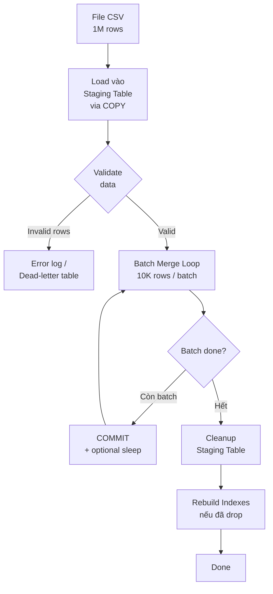

# Merge 1 triệu bản ghi vào bảng 1 tỷ rows

## Câu hỏi

> **Bạn có 1 file CSV chứa 1 triệu bản ghi. Bảng đích có 1 tỷ bản ghi. Yêu cầu: bản ghi nào đã tồn tại thì UPDATE, bản ghi nào chưa có thì INSERT. Bạn sẽ làm như thế nào?**

---

## Dành cho level

<Tabs items={["Mid", "Senior", "Staff"]}>

<Tab value="Mid">

Interviewer expect bạn biết **không nên làm row-by-row** và biết đến `INSERT ... ON CONFLICT DO UPDATE` hoặc tương đương.

Điểm cộng: đề xuất dùng staging table thay vì upsert trực tiếp, giải thích tại sao.

</Tab>

<Tab value="Senior">

Interviewer expect bạn **thiết kế được toàn bộ pipeline**: load file → staging → batch merge → cleanup, biết trade-off giữa tốc độ và lock contention, và đề phòng deadlock khi merge song song với production traffic.

Điểm cộng: biết khi nào nên drop index trước khi merge, cách monitor progress, và xử lý idempotency nếu job bị fail giữa chừng.

</Tab>

<Tab value="Staff">

Interviewer expect bạn quyết định được **architectural trade-off ở tầm tổ chức**: online vs offline merge, partition swap strategy cho zero-downtime, cost của window maintenance, và thiết kế pipeline idempotent để re-run an toàn.

Điểm cộng: đã từng xử lý merge quy mô này trên AWS RDS/Aurora, biết Read Replica để giảm tải, và biết khi nào nên migrate sang append-only + materialized view thay vì upsert.

</Tab>

</Tabs>

---

## Cốt lõi cần nhớ

**Staging table là chìa khóa — không upsert trực tiếp từ file vào bảng 1 tỷ rows.** Load file vào staging table trước (COPY nhanh nhất, không trigger, không index check), sau đó merge từ staging vào main trong batch nhỏ. Tách biệt giai đoạn load và giai đoạn merge giúp isolate lỗi, retry an toàn, và không lock main table trong khi đọc file.

**Batch là bắt buộc — một transaction merge 1 triệu rows sẽ giữ lock quá lâu.** Chia merge thành batch 5.000–20.000 rows/transaction, commit sau mỗi batch. Giảm lock duration, tránh lock escalation, và cho phép production traffic tiếp tục giữa các batch.

**Index là kẻ thù của tốc độ insert, nhưng là bạn của tốc độ lookup.** Trong quá trình merge, index trên main table phải được update cho mỗi row → overhead lớn. Nếu merge trong maintenance window, có thể drop index → merge → rebuild; nếu online thì phải giữ index và chấp nhận tốc độ thấp hơn để không ảnh hưởng query đang chạy.

---

## Câu trả lời mẫu

> "Đây là bài toán upsert quy mô lớn — điều đầu tiên tôi tránh là loop từng row hoặc upsert trực tiếp từ app lên bảng 1 tỷ rows, vì cả hai đều cực kỳ chậm và block production traffic. Cách tôi tiếp cận là dùng staging table pattern: load toàn bộ 1 triệu bản ghi từ file vào một bảng tạm bằng `COPY` command — không index, không trigger, không constraint, tốc độ tối đa. Sau đó tôi merge từ staging vào main table theo batch 10.000 rows một lần, dùng `INSERT ... ON CONFLICT DO UPDATE` trên PostgreSQL. Mỗi batch là một transaction riêng, commit xong rồi mới batch tiếp — vừa giảm lock duration, vừa có checkpoint để resume nếu job fail. Tôi cũng thêm delay nhỏ giữa các batch và monitor `pg_stat_activity` để không làm bão hòa I/O của production. Nếu đây là maintenance window thì tôi sẽ drop secondary indexes trước khi merge và rebuild sau — tốc độ tăng gấp 3–5 lần. Nếu cần online hoàn toàn thì giữ index nhưng throttle batch để response time không bị ảnh hưởng."

---

## Phân tích chi tiết

### Tổng quan pipeline



---

### Bước 1: Load file vào Staging Table

```sql
-- Tạo staging table — UNLOGGED để không ghi WAL, tăng tốc load
CREATE UNLOGGED TABLE orders_staging (
    order_id     BIGINT,
    customer_id  BIGINT,
    amount       NUMERIC(12,2),
    status       VARCHAR(50),
    updated_at   TIMESTAMPTZ
    -- Không có PRIMARY KEY, không có index, không có FK
);

-- Load file bằng COPY — nhanh nhất, không qua app layer
COPY orders_staging FROM '/data/orders_update.csv'
WITH (FORMAT csv, HEADER true, DELIMITER ',');
-- 1 triệu rows: ~30–60 giây tùy disk I/O
```

**Tại sao COPY thay vì INSERT từ app?**

| Phương pháp | Tốc độ | Ghi chú |
|-------------|--------|---------|
| Row-by-row INSERT | ~500 rows/s | N round trips mạng |
| Batch INSERT (1000/batch) | ~50.000 rows/s | Ít round trip hơn |
| `COPY` command | ~200.000–500.000 rows/s | Stream trực tiếp, bypass parser |

Nếu app Java phải đọc file trước, dùng `CopyManager` của JDBC:

```java
@Service
public class BulkLoader {

    private final DataSource dataSource;

    public long loadToStaging(Path csvFile) throws Exception {
        try (Connection conn = dataSource.getConnection();
             Reader reader = Files.newBufferedReader(csvFile)) {

            CopyManager copyManager = new CopyManager((BaseConnection) conn);
            return copyManager.copyIn(
                "COPY orders_staging FROM STDIN WITH (FORMAT csv, HEADER true)",
                reader
            );
        }
    }
}
```

---

### Bước 2: Validate staging data (tùy yêu cầu)

```sql
-- Loại row không hợp lệ trước khi merge
DELETE FROM orders_staging
WHERE order_id IS NULL
   OR amount < 0
   OR status NOT IN ('PENDING', 'PAID', 'CANCELLED', 'REFUNDED');

-- Log vào dead-letter table nếu cần audit
INSERT INTO orders_staging_errors
SELECT *, NOW(), 'INVALID_STATUS'
FROM orders_staging
WHERE status NOT IN ('PENDING', 'PAID', 'CANCELLED', 'REFUNDED');
```

---

### Bước 3: Batch Merge từ Staging → Main Table

Sau khi staging table đã sẵn sàng, bước tiếp theo là merge vào main table. Nhưng merge 1 triệu rows trong 1 transaction sẽ giữ lock quá lâu — production queries bị block, và nếu fail thì rollback toàn bộ. Vì vậy phải chia thành batch nhỏ.

**Tại sao batch 5.000–20.000 rows?** Quá nhỏ (100 rows) → overhead commit/transaction quá nhiều, tốc độ chậm. Quá lớn (500K rows) → lock duration dài, ảnh hưởng production. 10K là sweet spot phổ biến — mỗi batch merge trong 1–3 giây, lock vừa đủ ngắn để production queries xen vào giữa các batch. Con số cụ thể tuỳ hardware — bắt đầu 10K rồi adjust dựa trên lock wait time thực tế.

#### SQL Upsert pattern (PostgreSQL)

```sql
-- Merge một batch: rows từ offset đến offset + batch_size
INSERT INTO orders (order_id, customer_id, amount, status, updated_at)
SELECT order_id, customer_id, amount, status, updated_at
FROM orders_staging
ORDER BY order_id   -- consistent order tránh deadlock
LIMIT :batchSize OFFSET :offset
ON CONFLICT (order_id) DO UPDATE SET
    customer_id = EXCLUDED.customer_id,
    amount      = EXCLUDED.amount,
    status      = EXCLUDED.status,
    updated_at  = EXCLUDED.updated_at
WHERE orders.updated_at < EXCLUDED.updated_at;  -- chỉ update nếu staging mới hơn
```

#### Spring Boot batch merge job

```java
@Service
@Slf4j
public class BulkMergeService {

    private static final int BATCH_SIZE = 10_000;
    private static final long BATCH_DELAY_MS = 50; // throttle để không bão hòa I/O

    private final JdbcTemplate jdbc;

    public void mergeFromStaging() throws Exception {
        long totalRows = jdbc.queryForObject(
            "SELECT COUNT(*) FROM orders_staging", Long.class);

        log.info("Starting merge: {} rows in staging", totalRows);

        long offset = 0;
        int batchNum = 0;

        while (offset < totalRows) {
            int merged = mergeBatch(offset, BATCH_SIZE);
            offset += BATCH_SIZE;
            batchNum++;

            if (batchNum % 10 == 0) {
                log.info("Progress: {}/{} rows processed ({}%)",
                    offset, totalRows,
                    String.format("%.1f", 100.0 * offset / totalRows));
            }

            Thread.sleep(BATCH_DELAY_MS); // throttle
        }

        log.info("Merge complete: {} batches, {} rows", batchNum, totalRows);
    }

    @Transactional  // mỗi batch = 1 transaction
    public int mergeBatch(long offset, int batchSize) {
        return jdbc.update("""
            INSERT INTO orders (order_id, customer_id, amount, status, updated_at)
            SELECT order_id, customer_id, amount, status, updated_at
            FROM orders_staging
            ORDER BY order_id
            LIMIT ? OFFSET ?
            ON CONFLICT (order_id) DO UPDATE SET
                customer_id = EXCLUDED.customer_id,
                amount      = EXCLUDED.amount,
                status      = EXCLUDED.status,
                updated_at  = EXCLUDED.updated_at
            WHERE orders.updated_at < EXCLUDED.updated_at
            """, batchSize, offset);
    }
}
```

> **Tại sao `ORDER BY order_id` trong batch?** Nếu 2 batch chạy song song mà không có thứ tự nhất quán, chúng có thể lock cùng row theo thứ tự ngược nhau → deadlock. ORDER BY đảm bảo tất cả transaction lock rows theo cùng một thứ tự.

---

### Bước 4: Index Strategy

#### Online merge (production traffic vẫn chạy)

Giữ nguyên tất cả index. Tốc độ chậm hơn nhưng không ảnh hưởng query.

```sql
-- Thêm: rate limit batch, monitor query time song song
SELECT query, state, wait_event, now() - query_start AS duration
FROM pg_stat_activity
WHERE state != 'idle'
ORDER BY duration DESC;
```

#### Offline merge (maintenance window)

```sql
-- Drop secondary indexes trước khi merge
DROP INDEX CONCURRENTLY idx_orders_customer_id;
DROP INDEX CONCURRENTLY idx_orders_status;
DROP INDEX CONCURRENTLY idx_orders_updated_at;

-- Chạy merge (nhanh hơn 3–5x vì không update index mỗi row)
-- ...

-- Rebuild sau khi merge
CREATE INDEX CONCURRENTLY idx_orders_customer_id ON orders(customer_id);
CREATE INDEX CONCURRENTLY idx_orders_status ON orders(status);
CREATE INDEX CONCURRENTLY idx_orders_updated_at ON orders(updated_at);
-- CONCURRENTLY: build trong background, không lock bảng
```

**Giữ lại index nào?** PRIMARY KEY (`order_id`) phải giữ vì `ON CONFLICT` cần nó. Secondary indexes có thể drop nếu không có read query nào dùng chúng trong lúc merge.

---

### So sánh chiến lược theo scenario

| Scenario | Chiến lược | Trade-off |
|----------|-----------|-----------|
| Maintenance window có | Drop indexes → merge → rebuild | Nhanh nhất, không ảnh hưởng production |
| Production online, ít traffic | Batch 10K + throttle 50ms | Chậm hơn, an toàn |
| Production online, nhiều traffic | Batch 5K + throttle 200ms + Read Replica check | Rất chậm nhưng zero impact |
| Bảng được partition | Partition swap (xem bên dưới) | Phức tạp nhưng atomic |
| Cần re-run idempotent | Staging với `merge_status` column | Có thể resume từ điểm fail |

---

### Partition Swap — chiến lược advanced

Nếu bảng `orders` được partition theo thời gian (ví dụ `orders_2024_01`), và file chỉ update data của một partition:

```sql
-- 1. Tạo bảng mới với cấu trúc giống partition cũ
CREATE TABLE orders_2024_01_new (LIKE orders_2024_01 INCLUDING ALL);

-- 2. Copy toàn bộ partition cũ vào bảng mới
INSERT INTO orders_2024_01_new SELECT * FROM orders_2024_01;

-- 3. Merge staging vào bảng mới (không lock production)
INSERT INTO orders_2024_01_new
SELECT ... FROM orders_staging
ON CONFLICT (order_id) DO UPDATE SET ...;

-- 4. Atomic swap (cực nhanh, lock chỉ vài milliseconds)
BEGIN;
ALTER TABLE orders DETACH PARTITION orders_2024_01;
ALTER TABLE orders ATTACH PARTITION orders_2024_01_new
    FOR VALUES FROM ('2024-01-01') TO ('2024-02-01');
COMMIT;

-- 5. Drop partition cũ
DROP TABLE orders_2024_01;
```

---

### Idempotency — job fail giữa chừng

```sql
-- Thêm cột tracking vào staging table
ALTER TABLE orders_staging ADD COLUMN merged BOOLEAN DEFAULT FALSE;
ALTER TABLE orders_staging ADD COLUMN merged_at TIMESTAMPTZ;

-- Chỉ merge các row chưa được merge
INSERT INTO orders (...)
SELECT ... FROM orders_staging
WHERE merged = FALSE
ORDER BY order_id
LIMIT :batchSize
ON CONFLICT ...;

-- Đánh dấu sau khi merge xong batch
UPDATE orders_staging SET merged = TRUE, merged_at = NOW()
WHERE order_id IN (... -- ids vừa merge);
```

Với pattern này, job có thể restart từ đầu mà không merge trùng.

---

### Monitoring trong production

```sql
-- Progress real-time
SELECT
    COUNT(*) FILTER (WHERE merged = TRUE)  AS done,
    COUNT(*) FILTER (WHERE merged = FALSE) AS remaining,
    COUNT(*)                               AS total,
    ROUND(100.0 * COUNT(*) FILTER (WHERE merged) / COUNT(*), 1) AS pct
FROM orders_staging;

-- Lock contention — xem ai đang bị block
SELECT
    blocked.pid,
    blocked.query,
    blocking.pid   AS blocking_pid,
    blocking.query AS blocking_query
FROM pg_stat_activity blocked
JOIN pg_stat_activity blocking
    ON blocking.pid = ANY(pg_blocking_pids(blocked.pid));

-- I/O load trong lúc merge
SELECT * FROM pg_stat_bgwriter;
```

```yaml
# Prometheus alert — merge job stall
- alert: BulkMergeStalled
  expr: |
    increase(bulk_merge_rows_processed_total[5m]) == 0
    and bulk_merge_job_active == 1
  for: 5m
  annotations:
    summary: "Merge job không progress trong 5 phút — có thể bị deadlock hoặc lock wait"
```

---

## Bẫy thường gặp

❌ **"Dùng `INSERT ON CONFLICT` trực tiếp từ app, 1 row 1 request"**
→ Tại sao sai: Row-by-row là pattern chậm nhất: 1 triệu rows × 1 round-trip = hàng giờ, lock mỗi row riêng lẻ.
✅ Đúng hơn: Luôn batch. COPY vào staging trước, merge theo batch 5K–20K rows/transaction.

---

❌ **"Một transaction cho toàn bộ 1 triệu rows"**
→ Tại sao sai: Giữ lock trên hàng triệu rows trong hàng chục phút. Production queries bị block. Fail → rollback toàn bộ, mất công từ đầu.
✅ Đúng hơn: Batch nhỏ + commit thường xuyên. Mỗi batch là 1 transaction, fail chỉ mất 1 batch.

---

❌ **"Chạy nhiều thread merge song song để nhanh hơn"**
→ Tại sao sai: Hai thread lock cùng rows theo thứ tự khác nhau → deadlock.
✅ Đúng hơn: Nếu muốn song song, partition staging table theo key range không overlap — mỗi thread xử lý range riêng biệt.

---

❌ **"Không cần staging table, đọc file rồi upsert luôn"**
→ Tại sao sai: Mất khả năng validate trước, không có checkpoint để resume nếu fail, và đọc file chậm hơn COPY nhiều lần.
✅ Đúng hơn: Staging table là checkpoint thiết yếu — tách giai đoạn load và merge, retry an toàn.

---

❌ **"Drop toàn bộ index để tăng tốc"**
→ Tại sao sai: `ON CONFLICT` cần PRIMARY KEY để xác định conflict — drop PK thì merge không chạy được.
✅ Đúng hơn: Chỉ drop **secondary** indexes trong maintenance window. Giữ PK luôn.

---

## Câu hỏi follow-up

### 1. Nếu file CSV có thể có duplicate order_id (cùng một order xuất hiện nhiều lần trong file)?

Deduplicate trong staging trước khi merge — bắt buộc, không bỏ qua. Có 2 cách: dùng `DELETE ... USING` để xoá duplicate giữ lại row mới nhất, hoặc tạo bảng dedup riêng bằng `DISTINCT ON`. Cách thứ 2 an toàn hơn vì không sửa staging table gốc — có thể audit lại nếu cần.

```sql
CREATE TABLE orders_staging_dedup AS
SELECT DISTINCT ON (order_id) *
FROM orders_staging ORDER BY order_id, updated_at DESC;
```

### 2. Làm sao tính được số row thực sự INSERT vs UPDATE?

`ON CONFLICT DO UPDATE` không phân biệt insert/update trong affected rows count. Trick: dùng `xmax` system column trong `RETURNING` — `xmax = 0` nghĩa là row mới insert, `xmax > 0` nghĩa là row đã update. Đây là PostgreSQL internal — hoạt động tốt nhưng không portable sang database khác.

```sql
INSERT INTO orders (...) SELECT ... FROM orders_staging
ON CONFLICT (order_id) DO UPDATE SET ...
RETURNING order_id,
    (xmax = 0) AS is_insert,
    (xmax != 0) AS is_update;
```

### 3. Nếu bảng đích đang có write traffic cao trong lúc merge thì sao?

Tăng delay giữa batch (throttle 200ms+), giảm batch size xuống 1.000–2.000 rows. Monitor `pg_stat_activity` liên tục để xem lock wait time — nếu > 1 giây, giảm batch size tiếp. Nếu merge không khẩn cấp, schedule vào giờ thấp điểm. Với AWS RDS Aurora, route read-check query sang Read Replica để giảm tải primary.

### 4. Nếu cần làm điều này thường xuyên (daily batch)?

Cân nhắc chuyển sang CDC (Change Data Capture) với Kafka + Debezium: thay vì batch file hàng ngày, stream changes real-time → upsert liên tục với batch nhỏ. Giảm peak load, tăng data freshness, và không cần maintenance window. Trade-off: thêm complexity ops (Debezium connector, Kafka cluster), chỉ worth nếu batch frequency > 1 lần/ngày.

---

## Xem thêm

- [Heap vs Off-Heap Memory vs Stack trong Java](./01-heap-vs-off-heap-vs-stack)
