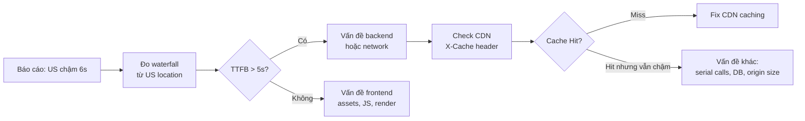

# Page 60ms ở Singapore nhưng 6s ở Mỹ

## Câu hỏi

> **Bạn nhận được báo cáo: một trang web load trong 60ms ở Singapore nhưng mất 6 giây ở Mỹ. Bạn sẽ debug và xử lý vấn đề này như thế nào?**

---

## Dành cho level

<Tabs items={["Mid", "Senior", "Staff"]}>

<Tab value="Mid">

Interviewer expect bạn biết **nguyên nhân đầu tiên cần kiểm tra là CDN và vị trí server**. Nói được "server đặt ở Singapore, user Mỹ phải request xuyên đại dương" là đủ baseline.

Điểm cộng: biết dùng `traceroute`, check `X-Cache` header, hoặc biết RTT Singapore→US ~150ms ảnh hưởng như thế nào.

</Tab>

<Tab value="Senior">

Interviewer expect bạn có **hệ thống tư duy debug**: không đoán mò nguyên nhân mà đi từ data — đo waterfall, check CDN cache hit ratio theo region, phân tích từng phase (DNS, TCP, TLS, TTFB, Transfer). Sau đó đề xuất fix đúng root cause.

Điểm cộng: biết **CDN cache miss là bẫy phổ biến nhất** — CDN đã bật nhưng content không được cache → mọi request vẫn origin pull từ Singapore. Biết cách fix từng layer: cache header, multi-region origin, edge function.

</Tab>

<Tab value="Staff">

Interviewer expect bạn **thiết kế chiến lược geo-distribution toàn diện**: khi nào multi-region active-active, khi nào active-passive, trade-off data consistency với latency, cost của thêm region, và cách monitor SLA per-region liên tục.

Điểm cộng: từng thiết kế hoặc vận hành hệ thống đa region, biết Route 53 Latency Routing + Health Check + Failover, hoặc đã xử lý incident geo-latency thực tế.

</Tab>

</Tabs>

---

## Cốt lõi cần nhớ

**Chênh lệch 100x (60ms vs 6s) gần như không bao giờ là 1 nguyên nhân đơn lẻ.** RTT Singapore→US ~150ms chỉ giải thích được 150–300ms overhead. 6 giây có nghĩa là nhiều round-trip bị nhân lên: TLS handshake, serial API calls, database queries — mỗi cái cộng thêm 1–2 RTT × 150ms.

**CDN bật chưa đủ — phải đảm bảo content thực sự được cache.** Nhiều team bật CloudFront rồi nghĩ xong, nhưng nếu `Cache-Control: no-cache` hoặc response có `Set-Cookie` → CDN không cache → mọi request đều origin pull từ Singapore. Check `X-Cache: Miss` là bước đầu tiên.

**Giải pháp lâu dài là multi-region origin, không chỉ CDN.** CDN tốt cho static content. Dynamic content (API response cá nhân hoá, authenticated data) không cache được → phải có origin server gần user: deploy thêm region US-East + Route 53 Latency-Based Routing.

---

## Câu trả lời mẫu

> "Tôi sẽ không đoán nguyên nhân mà bắt đầu bằng đo lường. Đầu tiên, tôi chạy waterfall analysis từ một máy ở US — dùng WebPageTest hoặc Chrome DevTools — để xem latency nằm ở phase nào: DNS lookup, TCP connect, TLS handshake, Time To First Byte, hay content transfer. Nếu TTFB đã là 5 giây thì vấn đề ở backend, không phải frontend. Tiếp theo tôi check header `X-Cache` từ CDN — nếu thấy `Miss` thì content không được serve từ edge, mọi request đang hit origin ở Singapore. Nguyên nhân phổ biến nhất của CDN miss là `Cache-Control: no-cache` hoặc response có cookie. Nếu CDN cache đúng nhưng vẫn chậm, tôi nhìn vào số lượng serial request: trang có chain N API calls không? Mỗi call thêm 1 RTT × 150ms = 150ms × N. Với 10 serial calls là 1.5 giây chỉ vì mạng. Fix ngay bằng cách song song hoá hoặc aggregate ở BFF layer. Giải pháp dài hạn là deploy origin server thêm ở US-East và dùng Route 53 Latency Routing để user Mỹ tự động hit region gần nhất."

---

## Phân tích chi tiết

### Bước 1: Đo — không đoán



**Tools để đo từ US location:**
- [WebPageTest](https://webpagetest.org) — chọn location "Virginia, USA", xem waterfall từng resource
- Chrome DevTools → Network tab → chạy từ VPN US hoặc cloud instance US-East
- `curl -w "@curl-format.txt" -o /dev/null -s https://your-domain.com` từ EC2 us-east-1

```bash
# curl timing breakdown
cat curl-format.txt
time_namelookup:    %{time_namelookup}s\n
time_connect:       %{time_connect}s\n
time_appconnect:    %{time_appconnect}s\n   # TLS done
time_pretransfer:   %{time_pretransfer}s\n
time_starttransfer: %{time_starttransfer}s\n # TTFB
time_total:         %{time_total}s\n
```

---

### Bước 2: Phân tích từng phase latency

Singapore → US round-trip time (RTT) baseline ~**150ms**.

| Phase | Singapore | US (không có CDN) | Lý do chênh |
|-------|-----------|-------------------|-------------|
| DNS lookup | 5ms | 5ms | DNS thường có edge resolver |
| TCP connect | 1ms | 150ms | 1 RTT xuyên đại dương |
| TLS handshake (1.2) | 2ms | 300ms | **2 RTT** × 150ms |
| TLS handshake (1.3) | 1ms | 150ms | 1 RTT (0-RTT resumption) |
| TTFB (server xử lý) | 20ms | 20ms | Server time không đổi |
| Transfer | 30ms | 30ms | Nếu nhỏ |
| **Tổng** | **~60ms** | **~650ms+** | Chưa tính serial calls |

> Vậy 650ms vẫn chưa đủ giải thích 6 giây. Phải có **nhân tố nhân lên** — serial API calls là suspect chính.

---

### Nguyên nhân 1: CDN không cache (phổ biến nhất)

CDN đã bật nhưng `X-Cache: Miss` → mọi request origin pull từ Singapore.

**Nguyên nhân CDN miss:**

```http
# Response có các header này → CDN từ chối cache
Cache-Control: no-cache, no-store
Set-Cookie: session=abc123   ← CloudFront mặc định không cache response có Set-Cookie
Vary: Cookie, Authorization  ← quá nhiều variation → cache không hiệu quả
```

**Fix:**

```http
# Static assets (JS, CSS, images)
Cache-Control: public, max-age=31536000, immutable

# API response có thể cache (không personalised)
Cache-Control: public, s-maxage=60, stale-while-revalidate=30

# Dynamic nhưng authenticated → không cache trên CDN
Cache-Control: private, no-store
```

```yaml
# CloudFront cache policy — tách cookie ra khỏi cache key
CachePolicy:
  Name: "api-cache-policy"
  DefaultTTL: 60
  CookiesConfig:
    CookieBehavior: none   # không đưa cookie vào cache key
  HeadersConfig:
    HeaderBehavior: whitelist
    Headers:
      - Accept-Language    # chỉ vary theo những header cần thiết
```

---

### Nguyên nhân 2: Serial API calls — latency nhân hệ số

```
User (US) → Server (Singapore) → 3rd API call 1 → 3rd API call 2 → 3rd API call 3
           ←──────────────────── 150ms ──────────── 150ms ─────── 150ms ──────────
Total: 150ms RTT × 3 hops = 450ms chỉ do mạng, chưa tính processing
```

**Ví dụ thực tế — Spring Boot service:**

```java
// BAD: serial calls — mỗi call chờ call trước
@GetMapping("/dashboard")
public DashboardResponse getDashboard(@RequestHeader("userId") Long userId) {
    UserProfile profile = userService.getProfile(userId);         // 150ms
    List<Order> orders = orderService.getRecentOrders(userId);    // 150ms
    AccountBalance balance = paymentService.getBalance(userId);   // 150ms
    List<Notification> notifs = notifService.getUnread(userId);   // 150ms
    // Total: 600ms chỉ từ serial calls
    return DashboardResponse.of(profile, orders, balance, notifs);
}

// GOOD: parallel với CompletableFuture
@GetMapping("/dashboard")
public DashboardResponse getDashboard(@RequestHeader("userId") Long userId) {
    CompletableFuture<UserProfile> profileF =
        CompletableFuture.supplyAsync(() -> userService.getProfile(userId));
    CompletableFuture<List<Order>> ordersF =
        CompletableFuture.supplyAsync(() -> orderService.getRecentOrders(userId));
    CompletableFuture<AccountBalance> balanceF =
        CompletableFuture.supplyAsync(() -> paymentService.getBalance(userId));
    CompletableFuture<List<Notification>> notifsF =
        CompletableFuture.supplyAsync(() -> notifService.getUnread(userId));

    CompletableFuture.allOf(profileF, ordersF, balanceF, notifsF).join();
    // Total: ~150ms (chạy song song, bottleneck là call chậm nhất)
    return DashboardResponse.of(
        profileF.join(), ordersF.join(), balanceF.join(), notifsF.join());
}
```

---

### Nguyên nhân 3: TLS handshake overhead × nhiều connection

HTTP/1.1: mỗi resource mở TCP connection mới → mỗi connection = 1 TCP + 1–2 TLS RTT.

```
Resource 1: TCP(150ms) + TLS(300ms) + Transfer = 470ms
Resource 2: TCP(150ms) + TLS(300ms) + Transfer = 470ms
Resource 3: TCP(150ms) + TLS(300ms) + Transfer = 470ms
→ 3 resources song song: ~470ms; nối tiếp: ~1.4s
```

**Fix:** HTTP/2 hoặc HTTP/3 multiplexing — nhiều request share 1 connection.

```nginx
# Nginx — bật HTTP/2
server {
    listen 443 ssl http2;
    ssl_protocols TLSv1.3;          # 1-RTT handshake
    ssl_session_cache shared:SSL:10m;  # session reuse → 0-RTT resumption
    ssl_session_timeout 1d;
}
```

---

### Giải pháp dài hạn: Multi-Region Origin

Đây là fix triệt để cho dynamic content không cache được.

```
                    ┌─────────────────────────────────────┐
                    │           Route 53                  │
                    │    Latency-Based Routing            │
                    └──────────┬──────────────────────────┘
                               │
              ┌────────────────┴───────────────┐
              │                                │
   ┌──────────▼──────────┐          ┌──────────▼──────────┐
   │   EKS ap-southeast-1│          │   EKS us-east-1     │
   │   (Singapore)       │          │   (Virginia)        │
   │   60ms cho SG users │          │   60ms cho US users │
   └──────────┬──────────┘          └──────────┬──────────┘
              │                                │
   ┌──────────▼──────────┐          ┌──────────▼──────────┐
   │  RDS ap-southeast-1 │◄─────────│  RDS us-east-1      │
   │  (Primary)          │ Replication  (Read Replica)    │
   └─────────────────────┘          └─────────────────────┘
```

```hcl
# Terraform — Route 53 Latency Routing
resource "aws_route53_record" "api_sg" {
  zone_id        = var.zone_id
  name           = "api.example.com"
  type           = "A"
  set_identifier = "singapore"

  latency_routing_policy {
    region = "ap-southeast-1"
  }

  alias {
    name    = aws_lb.alb_sg.dns_name
    zone_id = aws_lb.alb_sg.zone_id
    evaluate_target_health = true
  }
}

resource "aws_route53_record" "api_us" {
  zone_id        = var.zone_id
  name           = "api.example.com"
  type           = "A"
  set_identifier = "us-east"

  latency_routing_policy {
    region = "us-east-1"
  }

  alias {
    name    = aws_lb.alb_us.dns_name
    zone_id = aws_lb.alb_us.zone_id
    evaluate_target_health = true
  }
}
```

---

### Checklist debug geo-latency

```
□ 1. Đo waterfall từ US location (WebPageTest / curl timing)
□ 2. Check TTFB: > 500ms → vấn đề backend/network, không phải frontend
□ 3. Check X-Cache header: "Miss" → fix CDN cache
□ 4. Check Cache-Control response header: no-cache? Set-Cookie?
□ 5. Đếm số serial network calls trong 1 request: N calls × 150ms?
□ 6. Check HTTP version: HTTP/1.1 với nhiều resources → upgrade HTTP/2
□ 7. Check TLS version: TLS 1.2 → 2 RTTs; upgrade TLS 1.3 → 1 RTT
□ 8. Check DNS TTL: thấp quá → nhiều DNS lookup tốn thêm latency
□ 9. Check origin location: server chỉ ở Singapore? → cần multi-region
□ 10. Check static asset CDN: JS/CSS/images đi qua CloudFront chưa?
```

---

### CloudWatch metrics để monitor per-region

```bash
# CloudFront cache hit ratio theo region
aws cloudwatch get-metric-statistics \
  --namespace AWS/CloudFront \
  --metric-name CacheHitRate \
  --dimensions Name=DistributionId,Value=EXDISTID \
  --start-time 2026-04-08T00:00:00Z \
  --end-time 2026-04-08T23:59:59Z \
  --period 3600 \
  --statistics Average

# ALB target response time per AZ (proxy cho per-region)
aws cloudwatch get-metric-statistics \
  --namespace AWS/ApplicationELB \
  --metric-name TargetResponseTime \
  --dimensions Name=LoadBalancer,Value=... \
  --statistics p95 p99
```

```yaml
# Prometheus alert — latency cao theo region
- alert: HighLatencyUSRegion
  expr: |
    histogram_quantile(0.95,
      rate(http_request_duration_seconds_bucket{region="us-east-1"}[5m])
    ) > 2
  for: 5m
  annotations:
    summary: "p95 latency US-East = {{ $value }}s — kiểm tra CDN cache hit ratio"
    runbook: "https://wiki/runbooks/geo-latency-debug"
```

---

## Bẫy thường gặp

❌ **"Bật CDN là xong"**
→ Tại sao sai: CDN chỉ giúp nếu content thực sự được cache. `Cache-Control: no-cache` hoặc `Set-Cookie` → CloudFront vẫn origin pull từ Singapore cho mỗi request.
✅ Đúng hơn: Verify cache hit ratio theo region sau khi bật CDN. `X-Cache: Miss` = chưa xong.

---

❌ **"Tăng server spec để fix latency"**
→ Tại sao sai: Latency địa lý là do tốc độ ánh sáng, không phải server power. Server mạnh hơn giảm processing time (vài ms) nhưng không giải quyết 150ms RTT xuyên đại dương.
✅ Đúng hơn: Đưa server gần user — multi-region origin hoặc edge compute.

---

❌ **"Chỉ test bằng Postman từ máy local"**
→ Tại sao sai: Postman từ Singapore sẽ thấy nhanh vì server cùng region. Không reproduce được vấn đề user Mỹ gặp.
✅ Đúng hơn: Test từ đúng location có vấn đề — WebPageTest chọn location US, EC2 us-east-1, hoặc VPN.

---

❌ **"Vấn đề là database chậm"**
→ Tại sao sai: Database query chạy trong cùng datacenter Singapore — không bị ảnh hưởng bởi RTT US. DB chậm sẽ ảnh hưởng cả SG lẫn US.
✅ Đúng hơn: Nếu TTFB từ US cao nhưng SG bình thường, trace network latency trước — CDN miss hoặc serial calls là suspect chính.

---

## Câu hỏi follow-up

### 1. Nếu content là dynamic và authenticated (không cache được), làm sao giảm latency?

Ba hướng: (1) Multi-region origin + Route 53 Latency Routing — user Mỹ hit server Mỹ, latency giảm từ 6s về ~60ms; (2) Edge compute — Lambda@Edge hoặc Cloudflare Workers xử lý một phần logic tại edge gần user (auth check, personalization nhẹ); (3) Pre-fetch — dùng `<link rel="prefetch">` hoặc service worker dự đoán request tiếp theo và fetch trước khi user cần.

### 2. Nếu thêm region US-East thì data consistency xử lý như thế nào?

Tùy loại data: read-heavy data (profile, catalog) → RDS Read Replica tại US-East, chấp nhận replication lag vài giây; write operations → vẫn route về Singapore primary. Data cần strong consistency (payment, inventory) → không cache, luôn về primary, chấp nhận latency cao hơn cho consistency. Đây là trade-off CAP theorem trong thực tế — không có giải pháp nào giải quyết tất cả.

### 3. Làm sao phát hiện sớm vấn đề này trước khi user báo cáo?

Synthetic monitoring: CloudWatch Synthetics hoặc Datadog Synthetic Tests chạy canary từ nhiều location (US-East, EU-West, AP-Southeast) mỗi 1 phút. Alert khi p95 latency từ bất kỳ region nào vượt ngưỡng. Quan trọng: đừng chỉ monitor từ Singapore nơi server đặt — bạn sẽ không bao giờ thấy vấn đề mà user ở US đang gặp.

### 4. HTTP/3 có giải quyết được không?

Phần nào. HTTP/3 dùng QUIC (UDP) thay TCP, giảm handshake còn 0-RTT cho connection cũ và 1-RTT cho connection mới — tốt hơn TLS 1.2/TCP. Nhưng vẫn không vượt qua được 150ms RTT vật lý — tốc độ ánh sáng là hard limit. HTTP/3 giúp nhiều nhất trong môi trường packet loss cao (mobile, WiFi kém). Trong case Singapore→US, multi-region origin vẫn là fix chính.

---

## Xem thêm

- [Merge 1 triệu bản ghi vào bảng 1 tỷ rows](../java/02-bulk-upsert-billion-rows)
