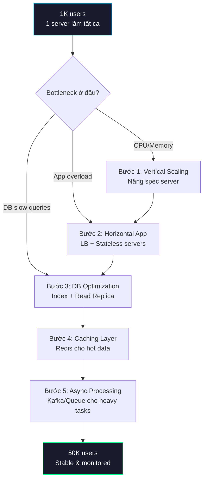
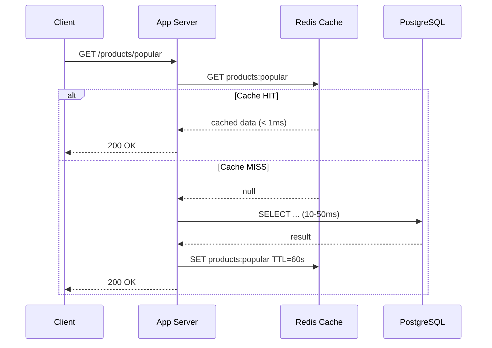

# Scale từ 1,000 lên 50,000 users

## Câu hỏi

> **Hệ thống của bạn đang phục vụ 1,000 users. Bây giờ cần scale lên 50,000 users. Bạn thay đổi gì?**

---

## Dành cho level

<Tabs items={["Mid", "Senior", "Staff"]}>

<Tab value="Mid">

Interviewer expect bạn biết **không thể để 1 server xử lý mọi thứ nữa** — cần load balancer, tách database riêng, và biết khái niệm horizontal scaling. Nói được "thêm server phía sau load balancer" và "tách database sang instance riêng" là đủ baseline.

Điểm cộng: biết stateless server là gì và tại sao session phải lưu vào Redis.

</Tab>

<Tab value="Senior">

Interviewer expect bạn có **hệ thống tư duy từ bottleneck**: không vội thêm infra mà đo trước — xem CPU, memory, DB connections, query latency. Sau đó đề xuất giải pháp đúng tầng: app tier, database tier, caching tier. Biết khi nào cần read replica, khi nào cần cache, trade-off của từng bước.

Điểm cộng: nói được "50K users không cần sharding — đó là premature optimization" và giải thích tại sao.

</Tab>

<Tab value="Staff">

Interviewer expect bạn **thiết kế scaling roadmap cho team**: không chỉ biết làm gì mà còn biết thứ tự ưu tiên, cost/benefit từng bước, và cách tránh over-engineering. Biết khi nào monolith vẫn đúng, khi nào mới cần tách service. Thiết kế monitoring để phát hiện bottleneck tiếp theo trước khi user bị ảnh hưởng.

Điểm cộng: dẫn chứng thực tế — Instagram scale 30 triệu users với 3 engineers trên PostgreSQL monolith, không sharding.

</Tab>

</Tabs>

---

## Cốt lõi cần nhớ

**50x users không có nghĩa là 50x infrastructure.** Phần lớn hệ thống ở mức 1K users chưa dùng hết capacity — một PostgreSQL instance xử lý thoải mái 5,000–10,000 QPS. Bước đầu tiên luôn là **đo bottleneck thật**, không phải thêm infra theo cảm tính.

**Scale theo đúng thứ tự: vertical → horizontal app → database read replica → caching → async processing.** Mỗi bước giải quyết một tầng bottleneck cụ thể. Nhảy bước (ví dụ sharding ở 50K users) là dấu hiệu over-engineering.

**Stateless là tiền đề cho mọi horizontal scaling.** Nếu server còn lưu session trong memory, thêm bao nhiêu server cũng vô nghĩa — user sẽ bị logout random khi request đến server khác.

---

## Câu trả lời mẫu

"Trước hết tôi sẽ không thêm infra theo phản xạ mà bắt đầu bằng đo lường — xem bottleneck hiện tại ở đâu: CPU, memory, database connection pool, hay slow queries. Ở mức 1K users, nhiều khả năng hệ thống chưa dùng hết capacity, nên bước đầu tiên có thể chỉ đơn giản là vertical scaling — nâng spec server lên, thêm RAM, SSD nhanh hơn. Khi traffic thật sự quá tải cho 1 server, tôi chuyển sang horizontal scaling cho app tier: triển khai stateless server phía sau load balancer, chuyển session sang Redis. Tiếp theo nhìn database — ở 50K users thường read nhiều hơn write, nên tôi thêm read replica và route read traffic sang đó. Song song, tôi bật caching layer với Redis cho hot data — user profile, product listing, config — nhắm cache hit rate trên 90% để giảm 10x load cho database. Cuối cùng, những task nặng như gửi email, generate report, process image tôi đẩy sang message queue với Kafka hoặc Sidekiq, không để user chờ. Toàn bộ quá trình này tôi sẽ không đụng đến sharding hay microservices — ở 50K users đó là premature optimization. Instagram từng scale đến 30 triệu users mà vẫn trên PostgreSQL monolith với 3 engineers."

---

## Phân tích chi tiết

### Scaling Roadmap: 1K → 50K users



---

### Bước 1: Vertical Scaling — giải pháp đầu tiên, rẻ nhất

Ở 1K users, server hiện tại thường dư capacity. Trước khi thay đổi architecture, **nâng spec trước**.

| Trước | Sau | Chi phí tăng |
|-------|-----|-------------|
| 2 vCPU, 4GB RAM | 8 vCPU, 32GB RAM | ~$100/tháng → ~$400/tháng |
| gp2 SSD | gp3 SSD (3000 IOPS) | +$20/tháng |
| db.t3.medium | db.r6g.xlarge | ~$200/tháng → ~$600/tháng |

```bash
# Check current resource usage trước khi quyết định
kubectl top pods -n production
kubectl top nodes

# Database connection usage
aws cloudwatch get-metric-statistics \
  --namespace AWS/RDS \
  --metric-name DatabaseConnections \
  --dimensions Name=DBInstanceIdentifier,Value=prod-db \
  --statistics Maximum Average \
  --period 3600 \
  --start-time 2026-04-07T00:00:00Z \
  --end-time 2026-04-08T00:00:00Z
```

> **Rule of thumb:** Nếu CPU < 50%, memory < 60%, DB connections < 50% max → chưa cần horizontal scaling. Vertical scaling mua thời gian rất tốt.

---

### Bước 2: Horizontal Scaling cho App Tier

Khi 1 server không đủ, thêm server phía sau load balancer. **Điều kiện tiên quyết: app phải stateless.**

```
                    ┌──────────────────────┐
                    │    ALB (AWS)          │
                    │  Round-Robin / Least  │
                    │    Connections        │
                    └──────────┬───────────┘
                               │
              ┌────────────────┼────────────────┐
              │                │                │
    ┌─────────▼──────┐ ┌──────▼────────┐ ┌─────▼─────────┐
    │  App Pod 1     │ │  App Pod 2    │ │  App Pod 3    │
    │  (stateless)   │ │  (stateless)  │ │  (stateless)  │
    └─────────┬──────┘ └──────┬────────┘ └─────┬─────────┘
              │                │                │
              └────────────────┼────────────────┘
                               │
                    ┌──────────▼───────────┐
                    │   Redis (Session +   │
                    │   Cache)             │
                    └──────────────────────┘
```

**Chuyển session sang Redis:**

```java
// Spring Boot — application.yml
spring:
  session:
    store-type: redis
    timeout: 30m
  data:
    redis:
      host: prod-redis.xxxxx.cache.amazonaws.com
      port: 6379

// Trước: session lưu local — user bị logout khi request đến server khác
// Sau: bất kỳ server nào cũng đọc được session từ Redis
```

**Kubernetes HPA — auto scale theo CPU:**

```yaml
apiVersion: autoscaling/v2
kind: HorizontalPodAutoscaler
metadata:
  name: api-hpa
spec:
  scaleTargetRef:
    apiVersion: apps/v1
    kind: Deployment
    name: api-deployment
  minReplicas: 3
  maxReplicas: 10
  metrics:
    - type: Resource
      resource:
        name: cpu
        target:
          type: Utilization
          averageUtilization: 60
    - type: Resource
      resource:
        name: memory
        target:
          type: Utilization
          averageUtilization: 70
```

---

### Bước 3: Database — Read Replica + Query Optimization

Ở 50K users, database thường là bottleneck đầu tiên. **80-90% traffic là read** → thêm read replica.

```
              App Servers
              /         \
      Write queries    Read queries
            |              |
    ┌───────▼──────┐  ┌───▼───────────┐
    │ RDS Primary  │  │ RDS Read      │
    │ (Write)      │──│ Replica       │
    │ db.r6g.xl    │  │ db.r6g.xl     │
    └──────────────┘  └───────────────┘
```

**Spring Boot — route read/write:**

```java
@Configuration
public class DataSourceConfig {

    @Bean
    @Primary
    public DataSource routingDataSource(
            @Qualifier("primaryDS") DataSource primary,
            @Qualifier("replicaDS") DataSource replica) {

        var routing = new AbstractRoutingDataSource() {
            @Override
            protected Object determineCurrentLookupKey() {
                return TransactionSynchronizationManager
                    .isCurrentTransactionReadOnly() ? "replica" : "primary";
            }
        };
        routing.setTargetDataSources(Map.of(
            "primary", primary,
            "replica", replica
        ));
        routing.setDefaultTargetDataSource(primary);
        return routing;
    }
}

// Service layer — đánh dấu read-only
@Service
public class ProductService {

    @Transactional(readOnly = true)  // → route sang replica
    public List<Product> findPopular(int limit) {
        return productRepository.findTopByOrderBySoldDesc(limit);
    }

    @Transactional  // → route sang primary
    public Product create(CreateProductRequest req) {
        return productRepository.save(Product.from(req));
    }
}
```

**Trước khi thêm replica — optimize query trước:**

```sql
-- Tìm slow queries
SELECT query, calls, mean_exec_time, total_exec_time
FROM pg_stat_statements
ORDER BY mean_exec_time DESC
LIMIT 20;

-- Thêm index cho query phổ biến
CREATE INDEX CONCURRENTLY idx_orders_user_created
ON orders(user_id, created_at DESC);

-- Kiểm tra index có được dùng không
EXPLAIN ANALYZE
SELECT * FROM orders WHERE user_id = 123 ORDER BY created_at DESC LIMIT 10;
```

---

### Bước 4: Caching Layer — giảm 10x database load



**Spring Boot caching với Redis:**

```java
@Service
public class ProductService {

    @Cacheable(value = "products", key = "#id", unless = "#result == null")
    public Product findById(Long id) {
        return productRepository.findById(id).orElse(null);
    }

    @CacheEvict(value = "products", key = "#product.id")
    public Product update(Product product) {
        return productRepository.save(product);
    }

    @Cacheable(value = "popular-products", key = "'top-' + #limit")
    @Transactional(readOnly = true)
    public List<Product> findPopular(int limit) {
        return productRepository.findTopByOrderBySoldDesc(limit);
    }
}
```

```yaml
# application.yml
spring:
  cache:
    type: redis
    redis:
      time-to-live: 60s      # TTL mặc định
      cache-null-values: false
```

**Cache gì, không cache gì:**

| Nên cache | Không nên cache |
|-----------|----------------|
| User profile | Real-time balance/inventory |
| Product listing | Payment transactions |
| Config/feature flags | One-time tokens (OTP) |
| API response aggregate | Data thay đổi mỗi request |
| Session data | Security-sensitive data |

> **Target: cache hit rate ≥ 90%.** Nếu chỉ 30% → kiểm tra TTL quá ngắn, cache key quá chi tiết (per-user thay vì shared), hoặc cache đang bị evict vì thiếu memory.

---

### Bước 5: Async Processing — không để user chờ task nặng

```
             User Request
                  │
    ┌─────────────▼──────────────┐
    │  App Server                │
    │  1. Validate & save order  │──── Response ngay (200ms)
    │  2. Publish event to Kafka │
    └─────────────┬──────────────┘
                  │ (async)
    ┌─────────────▼──────────────┐
    │  Kafka Topic: order-events │
    └─────────────┬──────────────┘
                  │
      ┌───────────┼────────────┐
      │           │            │
  ┌───▼───┐  ┌───▼───┐  ┌─────▼────┐
  │ Email │  │ Inven │  │ Analytics│
  │ Worker│  │ Worker│  │ Worker   │
  └───────┘  └───────┘  └──────────┘
```

```java
// Producer — publish event sau khi tạo order
@Service
@RequiredArgsConstructor
public class OrderService {

    private final KafkaTemplate<String, OrderEvent> kafkaTemplate;

    @Transactional
    public Order createOrder(CreateOrderRequest req) {
        Order order = orderRepository.save(Order.from(req));

        // Async — user không chờ email, inventory update, analytics
        kafkaTemplate.send("order-events",
            order.getId().toString(),
            new OrderEvent(order.getId(), OrderEventType.CREATED));

        return order;  // Response ngay cho user
    }
}

// Consumer — xử lý background
@Component
public class OrderEventConsumer {

    @KafkaListener(topics = "order-events", groupId = "email-service")
    public void handleOrderEvent(OrderEvent event) {
        if (event.type() == OrderEventType.CREATED) {
            emailService.sendOrderConfirmation(event.orderId());
        }
    }
}
```

---

### Những thứ KHÔNG cần ở 50K users

| Không cần | Lý do |
|-----------|-------|
| Database sharding | 50K users ≈ vài triệu rows — PostgreSQL xử lý thoải mái |
| Microservices | Tăng complexity 10x, team < 20 người không cần |
| Service mesh (Istio) | Over-engineering cho quy mô này |
| Multi-region | Trừ khi users phân tán toàn cầu |
| NoSQL migration | PostgreSQL + proper indexing đủ dùng |
| CQRS/Event sourcing | Trừ khi domain thực sự phức tạp |

> **Instagram case study:** 30 triệu users, 3 engineers, PostgreSQL monolith, Django, không sharding. Họ chỉ thêm read replica + Redis + Memcached. Bài học: **đừng giải quyết vấn đề bạn chưa có.**

---

### Monitoring — phát hiện bottleneck tiếp theo

```yaml
# Prometheus alerts cho hệ thống 50K users
groups:
  - name: scaling-alerts
    rules:
      # App tier
      - alert: HighCPUUsage
        expr: |
          avg(rate(container_cpu_usage_seconds_total{namespace="production"}[5m]))
            by (pod) > 0.8
        for: 10m
        annotations:
          summary: "Pod {{ $labels.pod }} CPU > 80% — cân nhắc scale out"

      # Database
      - alert: HighDBConnections
        expr: |
          pg_stat_activity_count{datname="production"}
            / pg_settings_max_connections > 0.7
        for: 5m
        annotations:
          summary: "DB connections > 70% max — cân nhắc connection pooling hoặc read replica"

      # Slow queries
      - alert: SlowQueries
        expr: |
          rate(pg_stat_statements_mean_exec_time_seconds{datname="production"}[5m]) > 0.5
        for: 5m
        annotations:
          summary: "Avg query time > 500ms — check slow query log"

      # Cache
      - alert: LowCacheHitRate
        expr: |
          redis_keyspace_hits_total
            / (redis_keyspace_hits_total + redis_keyspace_misses_total) < 0.85
        for: 15m
        annotations:
          summary: "Cache hit rate < 85% — review caching strategy"

      # Kafka consumer lag
      - alert: HighConsumerLag
        expr: kafka_consumergroup_lag_sum > 10000
        for: 10m
        annotations:
          summary: "Kafka consumer lag > 10K — cần thêm consumer instances"
```

---

## Bẫy thường gặp

❌ **"50K users thì phải chuyển sang microservices"**
→ Tại sao sai: Microservices là giải pháp cho organizational scaling (50+ engineers), không phải traffic scaling. Một startup có bài học đau thương: tách monolith thành 12 microservices, response time từ 100ms lên 3 giây, error rate tăng 40x, AWS bill gấp 3.
✅ Đúng hơn: Monolith + horizontal scaling + caching xử lý được hàng triệu users trước khi cần microservices.

❌ **"Sharding database ngay từ đầu để chuẩn bị cho tương lai"**
→ Tại sao sai: Sharding là giải pháp cuối cùng, mang theo complexity khổng lồ — cross-shard query, distributed transaction, rebalancing. PostgreSQL single instance xử lý tốt tới hàng chục triệu rows.
✅ Đúng hơn: Optimize query + index → read replica → caching → vertical scaling DB. Sharding chỉ khi write volume thực sự quá tải.

❌ **"Thêm server trước khi đo bottleneck"**
→ Tại sao sai: Nếu bottleneck ở database, thêm 10 app server chỉ có nghĩa 10 server cùng chờ 1 database chậm. Giống mở thêm 10 làn đường trước một cây cầu 2 làn.
✅ Đúng hơn: Luôn đo trước — `kubectl top`, CloudWatch, `pg_stat_statements`. Tìm đúng tầng bottleneck rồi mới fix.

❌ **"Session lưu trong server memory cũng được, dùng sticky session"**
→ Tại sao sai: Sticky session (session affinity) phá vỡ load balancing, tạo hotspot, và khi server die → tất cả session mất. Twitter từng gặp vấn đề users bị logout random vì lý do này.
✅ Đúng hơn: Stateless server + shared session store (Redis/ElastiCache). Bất kỳ server nào cũng handle được bất kỳ request nào.

---

## Câu hỏi follow-up

**1. Ở 50K users, connection pool của database nên config bao nhiêu?**

> Rule of thumb: `connections = (core_count * 2) + effective_spindle_count`. Với db.r6g.xlarge (4 vCPU): ~10 connections optimal per pool. Nếu có 5 app pods → tổng 50 connections. PostgreSQL default max_connections = 100 → vẫn thoải mái. Nếu cần nhiều hơn, dùng PgBouncer connection pooling thay vì tăng max_connections (mỗi connection tốn ~10MB RAM).

**2. Cache invalidation xử lý như thế nào khi user update data?**

> Ba chiến lược: (1) **TTL-based** — set TTL 60s, chấp nhận stale data tối đa 60s, đơn giản nhất; (2) **Write-through** — khi write vào DB thì đồng thời update cache, consistent nhưng phức tạp hơn; (3) **Cache-aside + evict on write** — khi write thì xoá cache entry, request tiếp theo sẽ cache miss và rebuild. Phổ biến nhất là (3) — dùng `@CacheEvict` trong Spring Boot.

**3. Nếu tiếp tục scale lên 500K users thì bước tiếp theo là gì?**

> CDN cho static assets (JS, CSS, images) → giảm bandwidth và latency. Database: thêm read replica thứ 2, partitioning bảng lớn (orders by month). Caching: nâng Redis lên cluster mode. Nếu team > 20 engineers → bắt đầu tách 1-2 bounded context thành service riêng (payment, notification) — nhưng vẫn không phải "full microservices".

**4. Làm sao biết monolith đã đến giới hạn và cần tách service?**

> Hai tín hiệu chính: (1) **Organizational** — team > 30 engineers, merge conflict liên tục, deploy phải coordinate quá nhiều team; (2) **Technical** — có component cần scale khác biệt hoàn toàn (ví dụ image processing cần GPU mà API thì không). Nếu chưa có 2 tín hiệu này → monolith vẫn là lựa chọn đúng.

---

## Xem thêm

- [Page 60ms ở Singapore nhưng 6s ở Mỹ — xử lý như thế nào?](../system-design/01-geo-latency-60ms-vs-6s)
