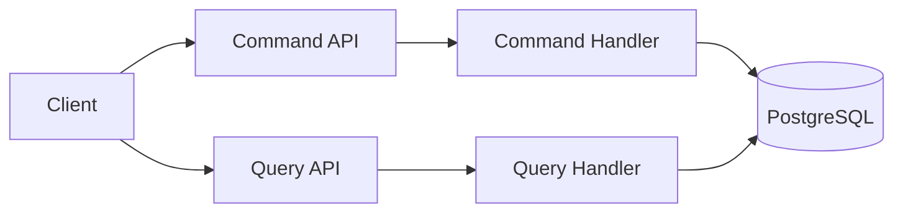
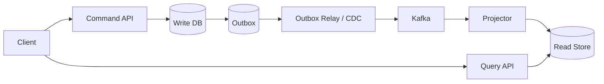
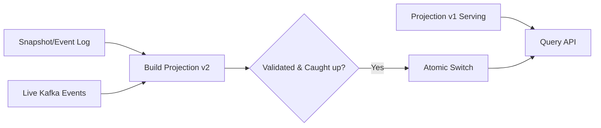

# CQRS là gì, khi nào nên dùng và triển khai an toàn như thế nào?

## Câu hỏi

> CQRS là gì? Nó khác CRUD, Event Sourcing và event-driven architecture như thế nào? Khi nào nên dùng, và nếu tách write model/read model sang hai data store thì xử lý consistency, duplicate event, read-your-write và rebuild projection ra sao?

---

## Dành cho level

<Tabs items={["Mid", "Senior", "Staff"]}>

<Tab value="Mid">

Interviewer expect bạn nói được **command thay đổi state, query chỉ đọc**, và CQRS có thể bắt đầu đơn giản trong cùng application/cùng database. Bạn cần tránh nhầm rằng dùng CQRS bắt buộc phải có Kafka, microservices, hai database hoặc Event Sourcing.

</Tab>

<Tab value="Senior">

Interviewer expect bạn chọn CQRS từ production pain cụ thể: read/write model khác nhau, read traffic áp đảo, query join nặng hoặc domain write có invariant phức tạp. Bạn phải giải thích được Outbox, at-least-once delivery, idempotent projector, ordering theo aggregate, eventual consistency, cách cho user thấy trạng thái vừa ghi và cách monitor projection lag.

</Tab>

<Tab value="Staff">

Interviewer expect bạn thiết kế adoption/migration theo từng mức, ownership giữa team, schema/event versioning, replay/backfill, blue-green projection, disaster recovery và cost vận hành. Quan trọng hơn, bạn phải biết **khi nào không dùng CQRS** và đặt exit criteria nếu complexity lớn hơn giá trị nó tạo ra.

</Tab>

</Tabs>

---

## Cốt lõi cần nhớ

- **CQRS là tách responsibility của write và read, không đồng nghĩa với tách infrastructure.** Mức đơn giản có command/query handlers và models riêng nhưng dùng cùng database; chỉ tách data store khi số liệu chứng minh cần independent scaling hoặc read shape khác hẳn write shape.
- Khi dùng hai data store, hệ thống đổi từ một transaction dễ hiểu sang pipeline bất đồng bộ: **write DB commit → outbox → broker → projector → read store**. Bạn phải thiết kế eventual consistency, duplicate, ordering, retry, DLQ, reconciliation và rebuild ngay từ đầu.
- CQRS đáng dùng khi domain/write invariants phức tạp hoặc read/write workload bất đối xứng rõ ràng. Với CRUD đơn giản, team nhỏ và yêu cầu strong read-after-write, CQRS thường là over-engineering.

---

## Câu trả lời mẫu

> Tôi không bắt đầu CQRS bằng Kafka hay hai database, mà bắt đầu bằng việc chứng minh read và write đang có hai nhu cầu thực sự khác nhau. Ở write side, tôi model command theo business intent như `PlaceOrder`, validate invariant và commit transaction vào PostgreSQL; ở read side, tôi trả DTO đúng shape màn hình, không kéo cả domain aggregate chỉ để render danh sách. Nếu cùng database đã đủ, tôi dừng ở đó vì đó vẫn là CQRS ở mức logical separation. Chỉ khi query join nặng, read traffic lớn hoặc cần scale/read schema độc lập, tôi tạo projection riêng và publish change qua Transactional Outbox để tránh dual-write giữa database với Kafka. Consumer phải idempotent vì delivery thực tế là at-least-once, event được partition theo aggregate ID để giữ ordering, còn projection lag phải có metric và SLO. Với flow người dùng vừa ghi xong, tôi trả command result hoặc operation ID, hiển thị `processing`, hay tạm đọc source of truth thay vì giả vờ read store luôn strong consistent. Tôi từng thấy team áp CQRS cho CRUD admin rồi phải vận hành broker, replay và reconciliation không tạo giá trị, nên tiêu chí quan trọng của tôi là production pain phải lớn hơn operational complexity.

---

## Phân tích chi tiết

### 1. Production scenario: một model bắt đầu phục vụ hai mục tiêu mâu thuẫn

Giả sử hệ thống e-commerce ban đầu có một Spring Boot service và PostgreSQL:

```txt
React -> Order API -> JPA entities -> PostgreSQL
```

`Order` entity được dùng cho tất cả:

- `POST /orders`: validate inventory, coupon, payment method, address.
- `PATCH /orders/{id}`: chuyển trạng thái theo business rules.
- `GET /orders/{id}`: trang chi tiết cho customer.
- `GET /admin/orders`: dashboard có customer name, payment status, shipment SLA.
- `GET /analytics/orders`: tổng hợp theo ngày, region, campaign.

Lúc nhỏ, CRUD là lựa chọn tốt: ít code, transaction dễ hiểu, debug một database. Sau đó production xuất hiện pain:

```txt
Read : write = 50 : 1
Admin query join 8 bảng, p95 = 2.4s
Index phục vụ dashboard làm write amplification tăng
JPA entity expose field không nên trả cho customer
Một thay đổi UI kéo theo sửa domain entity
Read replica vẫn phải chạy query join nặng
Team scale read nhưng phải scale cả write service
```

Write model muốn:

```txt
Normalized data
Constraints
Transaction boundary rõ
Domain invariants
Ít index để write ổn định
```

Read model muốn:

```txt
Denormalized shape đúng màn hình
Không join hoặc join tối thiểu
Nhiều index/search field
Scale replicas độc lập
Có thể chấp nhận stale vài giây
```

CQRS trở nên đáng cân nhắc vì **hai workload có mục tiêu khác nhau**, không phải vì pattern đang phổ biến.

---

### 2. CQRS ở tầng bản chất

CQRS viết tắt của **Command Query Responsibility Segregation**: tách model/flow xử lý thao tác làm thay đổi state khỏi model/flow chỉ đọc state.

```txt
Command
- diễn tả business intent
- có thể thay đổi state
- validate authorization + business invariant
- có thể fail vì conflict/rule
- thường không trả về một read graph lớn

Query
- không thay đổi business state
- tối ưu để trả DTO/view
- không chứa domain mutation
- có thể cache/replicate/denormalize
```

Ví dụ tên command tốt:

```txt
PlaceOrder
CancelOrder
ConfirmPayment
ShipOrder
ChangeDeliveryAddress
```

Tên command yếu, chỉ phản ánh database patch:

```txt
UpdateOrder
SetOrderStatus
PatchOrderRow
```

`CancelOrder` mang intent rõ: handler biết ai được cancel, status nào cancel được, refund ra sao và audit event nào cần phát. `SetOrderStatus(CANCELLED)` bỏ qua ngôn ngữ domain và dễ tạo đường tắt phá invariant.

Query có thể là:

```txt
GetOrderDetails
ListCustomerOrders
SearchAdminOrders
GetDailyOrderSummary
```

Query trả DTO đúng use case:

```java
public record OrderListItem(
    String orderId,
    String displayStatus,
    long totalAmount,
    String currency,
    String thumbnailUrl,
    String placedAt
) {}
```

Không cần hydrate đầy đủ `Order`, `OrderItem`, `Payment`, `Shipment` aggregate chỉ để render sáu field.

---

### 3. CQRS không phải những gì?

#### CQRS không bắt buộc hai databases

Logical separation đủ để gọi là CQRS:

```txt
CommandController -> CommandHandler -> WriteRepository ┐
                                                      ├-> PostgreSQL
QueryController   -> QueryHandler   -> ReadRepository  ┘
```

Hai side có model/code path khác nhau nhưng cùng data store. Đây thường là bước đầu an toàn nhất.

#### CQRS không bắt buộc microservices

Một modular monolith có package/module command và query riêng vẫn áp dụng CQRS tốt. Tách network service quá sớm thêm timeout, deployment, tracing và data ownership complexity mà không chắc có lợi.

#### CQRS không bắt buộc asynchronous command

Command có thể xử lý synchronous và trả `201 Created` sau khi write DB commit. Khi business process dài, command có thể trả `202 Accepted` cùng operation ID rồi xử lý async. CQRS không ép mọi command qua queue.

#### CQRS không đồng nghĩa Event Sourcing

- **CQRS**: tách read responsibility và write responsibility.
- **Event Sourcing**: lưu lịch sử event làm source of truth thay vì chỉ lưu current state.

Có thể dùng:

```txt
CQRS + state-based write DB + outbox          ✅
CQRS + Event Sourcing                         ✅
Event Sourcing không có read model phức tạp   có thể, dù thường kết hợp CQRS
CRUD + domain events                          ✅
```

#### CQRS không đồng nghĩa event-driven architecture

CQRS cùng database có thể hoàn toàn synchronous, không broker. Event-driven thường xuất hiện khi tách data stores vì cần cập nhật projection, nhưng đó là quyết định triển khai, không phải định nghĩa CQRS.

---

### 4. Ba mức triển khai: tăng complexity theo pain

#### Mức 1 — Tách code path, cùng model/cùng database



Bạn tách controller/handler nhưng vẫn có thể dùng chung schema. Lợi ích:

- Naming theo intent rõ hơn.
- Authorization/read-write concern tách nhau.
- Dễ test command invariant và query mapping.
- Hầu như chưa có eventual consistency.

Đây là mức phù hợp để cải thiện codebase mà chưa trả operational cost của messaging.

#### Mức 2 — Tách write model/read model, vẫn cùng database

```txt
Command -> Domain aggregate -> normalized write tables
Query   -> SQL/jOOQ/JdbcTemplate -> DTO/materialized view
                         cùng PostgreSQL
```

Write side có JPA aggregate và transaction. Read side không nhất thiết dùng JPA entity; có thể dùng SQL projection trực tiếp, database view hoặc materialized view.

Ví dụ:

```sql
SELECT
    o.id AS order_id,
    o.status,
    o.total_amount,
    c.display_name AS customer_name,
    p.status AS payment_status
FROM orders o
JOIN customers c ON c.id = o.customer_id
LEFT JOIN payments p ON p.order_id = o.id
WHERE o.customer_id = :customerId
ORDER BY o.created_at DESC
LIMIT :limit;
```

Mức này tránh domain model bị biến thành read DTO và giữ strong consistency của một database. Nếu performance đạt SLO, không cần đi xa hơn.

#### Mức 3 — Tách data stores và cập nhật projection bất đồng bộ



Write store có thể là PostgreSQL; read store có thể là:

- PostgreSQL schema/table denormalized.
- OpenSearch cho full-text/faceted search.
- Redis cho key lookup/low latency view.
- DynamoDB cho access pattern key-based ở scale lớn.

Mức 3 tạo independent scaling và read shape tối ưu, nhưng từ đây read side thường **eventually consistent**. Team phải sở hữu toàn bộ pipeline, không chỉ code handler.

---

### 5. Thiết kế write side: command, aggregate và invariant

Giả sử command đặt hàng:

```java
public record PlaceOrderCommand(
    UUID commandId,
    UUID customerId,
    List<Line> lines,
    UUID paymentMethodId
) {
    public record Line(UUID productId, int quantity) {}
}
```

`commandId` hỗ trợ idempotency ở boundary. Command handler không chỉ map request sang row; nó thực thi use case:

```java
@Service
public class PlaceOrderHandler {
    private final OrderRepository orderRepository;
    private final ProcessedCommandRepository processedCommandRepository;
    private final OutboxRepository outboxRepository;
    private final PricingService pricingService;

    public PlaceOrderHandler(
            OrderRepository orderRepository,
            ProcessedCommandRepository processedCommandRepository,
            OutboxRepository outboxRepository,
            PricingService pricingService) {
        this.orderRepository = orderRepository;
        this.processedCommandRepository = processedCommandRepository;
        this.outboxRepository = outboxRepository;
        this.pricingService = pricingService;
    }

    @Transactional
    public PlaceOrderResult handle(PlaceOrderCommand command) {
        return processedCommandRepository.findResult(command.commandId())
            .orElseGet(() -> processNewCommand(command));
    }

    private PlaceOrderResult processNewCommand(PlaceOrderCommand command) {
        PricingResult pricing = pricingService.calculate(command.lines());
        Order order = Order.place(
            UUID.randomUUID(),
            command.customerId(),
            command.lines(),
            pricing
        );

        orderRepository.save(order);

        OrderPlacedV1 event = OrderPlacedV1.from(order);
        outboxRepository.append(OutboxMessage.from(event));

        PlaceOrderResult result = new PlaceOrderResult(
            order.id(),
            order.version(),
            "ACCEPTED"
        );
        processedCommandRepository.save(command.commandId(), result);
        return result;
    }
}
```

Code trên minh họa ba điều quan trọng:

1. Business state và outbox event được lưu trong **cùng database transaction**.
2. Retry cùng `commandId` có thể trả kết quả cũ thay vì tạo order thứ hai.
3. Handler trả command result nhỏ, không cần đợi read model rebuild để query toàn bộ order view.

Trong code thật, cần enforce uniqueness ở database:

```sql
CREATE TABLE processed_commands (
    command_id UUID PRIMARY KEY,
    result_json JSONB NOT NULL,
    processed_at TIMESTAMPTZ NOT NULL DEFAULT now()
);
```

Chỉ check bằng `SELECT` trong application là chưa đủ vì hai request concurrent có thể cùng thấy “chưa tồn tại”. Unique constraint là hàng rào cuối; handler phải map conflict thành kết quả idempotent phù hợp.

#### Invariant nằm ở đâu?

Ví dụ:

```txt
- Order đã SHIPPED không được CANCEL trực tiếp.
- Tổng tiền phải bằng tổng line sau discount/tax theo pricing version.
- Một payment confirmation chỉ áp dụng một lần.
- Version command phải match aggregate version để tránh lost update.
```

Write side phải bảo vệ invariant trong transaction/aggregate và database constraint khi có thể. Read model không phải source để quyết định critical write vì nó có thể stale.

---

### 6. Thiết kế read side: projection theo access pattern

Read model không phải bản copy 1:1 của write tables. Nó là representation tối ưu cho một hoặc nhiều query cụ thể.

Ví dụ màn hình danh sách order cần:

```json
{
  "orderId": "ord-123",
  "displayStatus": "Đang giao",
  "total": "1.250.000 ₫",
  "itemCount": 3,
  "firstItemThumbnail": "https://cdn.example/...",
  "estimatedDelivery": "2026-05-12",
  "lastUpdatedAt": "2026-05-10T09:15:00Z"
}
```

Projection table có thể denormalize:

```sql
CREATE TABLE customer_order_view (
    order_id UUID PRIMARY KEY,
    customer_id UUID NOT NULL,
    display_status VARCHAR(50) NOT NULL,
    total_amount BIGINT NOT NULL,
    currency CHAR(3) NOT NULL,
    item_count INTEGER NOT NULL,
    first_item_thumbnail TEXT,
    estimated_delivery DATE,
    aggregate_version BIGINT NOT NULL,
    last_event_id UUID NOT NULL,
    updated_at TIMESTAMPTZ NOT NULL
);

CREATE INDEX idx_customer_order_view_customer_updated
    ON customer_order_view(customer_id, updated_at DESC);
```

Query path trở nên đơn giản:

```sql
SELECT *
FROM customer_order_view
WHERE customer_id = :customerId
ORDER BY updated_at DESC
LIMIT 20;
```

Trade-off là duplicate data. Duplicate không tự động xấu nếu có:

```txt
Source of truth rõ
Event contract rõ
Idempotent update
Lag metric
Reconciliation
Rebuild strategy
Ownership và retention rõ
```

Nếu không có sáu thứ này, “read model nhanh” dễ trở thành một database bí ẩn không ai dám sửa.

---

### 7. Dual-write problem: vì sao không save DB rồi publish Kafka trực tiếp?

Naive flow:

```java
@Transactional
public void placeOrder(...) {
    orderRepository.save(order);
    kafkaTemplate.send("order-events", event); // nguy hiểm nếu coi atomic
}
```

Database transaction và Kafka publish không tự động là một atomic transaction chung. Có các failure window:

```txt
Case A:
1. Publish event thành công
2. Database rollback
=> read model có order không tồn tại ở source

Case B:
1. Database commit thành công
2. Process crash trước publish
=> source có order nhưng read model không bao giờ biết

Case C:
1. Broker nhận event
2. Producer timeout, app không biết đã nhận chưa và retry
=> duplicate event
```

Không nên “fix” bằng try/catch đơn giản. Đây là distributed consistency problem.

#### Transactional Outbox

Lưu business row và event row trong cùng local DB transaction:

```sql
BEGIN;

INSERT INTO orders (...);

INSERT INTO outbox_events (
    event_id,
    aggregate_type,
    aggregate_id,
    aggregate_version,
    event_type,
    payload,
    occurred_at,
    published_at
) VALUES (...);

COMMIT;
```

Schema ví dụ:

```sql
CREATE TABLE outbox_events (
    event_id UUID PRIMARY KEY,
    aggregate_type VARCHAR(100) NOT NULL,
    aggregate_id UUID NOT NULL,
    aggregate_version BIGINT NOT NULL,
    event_type VARCHAR(150) NOT NULL,
    schema_version INTEGER NOT NULL,
    payload JSONB NOT NULL,
    occurred_at TIMESTAMPTZ NOT NULL,
    published_at TIMESTAMPTZ,
    retry_count INTEGER NOT NULL DEFAULT 0
);

CREATE INDEX idx_outbox_unpublished
    ON outbox_events(occurred_at)
    WHERE published_at IS NULL;

CREATE UNIQUE INDEX idx_outbox_aggregate_version
    ON outbox_events(aggregate_type, aggregate_id, aggregate_version);
```

Relay riêng đọc unpublished rows rồi gửi broker. Có hai hướng phổ biến:

1. **Polling publisher**: query batch rows, publish, mark published.
2. **Transaction log tailing/CDC**: Debezium đọc PostgreSQL WAL và publish thay đổi outbox.

Outbox đóng failure window giữa business commit và event creation, nhưng không tạo exactly-once end-to-end miễn phí. Relay có thể publish xong rồi crash trước khi mark row; do đó consumer vẫn phải idempotent.

#### Batch size và polling interval chọn thế nào?

Không có magic number. Ví dụ bắt đầu `100–500` rows/batch và polling `100–500 ms` có thể hợp với workload vừa, nhưng phải đo:

```txt
Event rate trung bình/peak
Payload size
Broker throughput
DB load/lock
Projection lag SLO
Số relay instances
Recovery time khi backlog
```

Batch quá nhỏ tăng round trips; quá lớn giữ lock lâu và tạo burst. Poll quá nhanh làm DB busy khi rỗng; quá chậm tăng lag. Điều chỉnh theo metric thay vì copy một con số từ blog.

---

### 8. At-least-once delivery và idempotent consumer

Trong distributed messaging, duplicate là bình thường:

```txt
Kafka delivers event
Projector updates read DB
Projector crashes before committing offset
Kafka redelivers event
```

Consumer cần xử lý cùng event nhiều lần mà final state không sai.

#### Cách 1 — Inbox/processed events table

```sql
CREATE TABLE projection_processed_events (
    projection_name VARCHAR(100) NOT NULL,
    event_id UUID NOT NULL,
    processed_at TIMESTAMPTZ NOT NULL DEFAULT now(),
    PRIMARY KEY (projection_name, event_id)
);
```

Trong cùng transaction với update projection:

```java
@Transactional
public void on(OrderPlacedV1 event) {
    boolean firstTime = processedEventRepository.tryInsert(
        "customer-order-view",
        event.eventId()
    );
    if (!firstTime) {
        return;
    }

    customerOrderViewRepository.insert(CustomerOrderView.from(event));
}
```

`tryInsert` phải dựa trên unique constraint/`INSERT ... ON CONFLICT DO NOTHING`, không phải check-then-insert không atomic.

#### Cách 2 — Version guard

Nếu event của mỗi aggregate có monotonic version:

```sql
UPDATE customer_order_view
SET
    display_status = :status,
    aggregate_version = :version,
    last_event_id = :eventId,
    updated_at = :occurredAt
WHERE order_id = :orderId
  AND aggregate_version < :version;
```

Version guard bỏ qua duplicate/older event, nhưng phải định nghĩa behavior khi nhận version `7` trước version `6`. Có thể buffer/retry, fetch source snapshot, hoặc thiết kế event đủ state để last-write projection an toàn. Không nên giả định “Kafka luôn đúng thứ tự” trên mọi key/topic/repartition path.

#### Idempotency của command khác idempotency của event

```txt
Command idempotency
→ client retry POST không tạo business action hai lần

Event idempotency
→ broker redelivery không apply projection/effect hai lần
```

Cả hai đều cần. Một `Idempotency-Key` ở API không tự bảo vệ consumer, và dedupe event không ngăn client tạo hai command ID khác nhau cho cùng ý định.

---

### 9. Ordering: giữ theo aggregate, không đòi global order

Với order `ord-123`:

```txt
v1 OrderPlaced
v2 PaymentConfirmed
v3 OrderPacked
v4 OrderShipped
```

Projector cần xử lý đúng thứ tự logic. Kafka chỉ đảm bảo order trong một partition, nên producer thường dùng `aggregateId` làm message key:

```java
kafkaTemplate.send(
    "order-events",
    event.aggregateId().toString(),
    event
);
```

Tất cả event của cùng order map về cùng partition trong điều kiện partitioning strategy ổn định. Không cần global order giữa `ord-123` và `ord-999`; yêu cầu global order làm giảm parallelism mà thường không mang giá trị business.

Cần cẩn thận khi:

- Tăng partition count có thể thay mapping key→partition cho event tương lai.
- Merge nhiều topics/sources không tự có total order.
- Retry topic có thể làm event sau đi trước event lỗi.
- Projector parallel processing bên trong consumer có thể phá order dù broker giao đúng.

Event nên có ít nhất:

```json
{
  "eventId": "019...",
  "eventType": "OrderShipped",
  "schemaVersion": 1,
  "aggregateType": "Order",
  "aggregateId": "ord-123",
  "aggregateVersion": 4,
  "occurredAt": "2026-05-10T09:15:00Z",
  "correlationId": "req-456",
  "payload": {}
}
```

`occurredAt` hữu ích cho audit nhưng không nên là ordering key duy nhất vì clock skew và cùng timestamp. `aggregateVersion` đáng tin cậy hơn cho order trong aggregate.

---

### 10. Eventual consistency: biến thành product behavior rõ ràng

Khi write store và read store tách nhau:

```txt
t0: Order DB commit
 t1: API trả success
  t2: Outbox relay publish
   t3: Projector consume
    t4: Read DB update
```

Khoảng `t1 → t4` là projection lag. User có thể tạo order thành công rồi reload danh sách nhưng chưa thấy order.

Không được chỉ nói “eventual consistency chấp nhận được”. Phải định nghĩa:

```txt
Data nào có thể stale?
Stale bao lâu ở p95/p99?
UX hiển thị thế nào?
Flow nào bắt buộc strong read-after-write?
Khi lag vượt SLO thì degrade/fallback ra sao?
```

#### Chiến lược 1 — Command response đủ để update UI tạm thời

`POST /orders` trả:

```json
{
  "orderId": "ord-123",
  "writeVersion": 1,
  "status": "ACCEPTED"
}
```

Frontend optimistic-insert item vào danh sách và reconcile sau. Phù hợp khi command hoàn tất nhanh và response có đủ identity/state tối thiểu.

#### Chiến lược 2 — Trạng thái `202 Accepted` + operation resource

```http
HTTP/1.1 202 Accepted
Location: /operations/op-789

{"operationId":"op-789","status":"PROCESSING"}
```

Client poll hoặc nhận WebSocket/SSE notification đến khi operation hoàn tất. Phù hợp cho workflow dài, nhưng cần operation retention, timeout và failure semantics.

#### Chiến lược 3 — Read-your-write token/version

Command trả `writeVersion`. Query gửi minimum version:

```http
GET /orders/ord-123
X-Minimum-Version: 3
```

Query service chỉ trả projection khi version ≥ 3; nếu chưa, nó có thể wait ngắn, trả `202`, hoặc fallback source. Đây là contract mạnh nhưng làm query path phức tạp, cần timeout rõ.

#### Chiến lược 4 — Query critical data từ write store

Sau một số command nhạy cảm, đọc trực tiếp source of truth trong một khoảng/context cụ thể. Ví dụ payment result hoặc inventory reservation không nên quyết định dựa trên stale projection. Đừng biến fallback thành mặc định cho mọi read, nếu không bạn trả complexity CQRS mà không nhận benefit.

#### Chiến lược 5 — Sticky/session overlay

Lưu command result gần client/BFF trong thời gian ngắn để merge với projection. Cách này cải thiện UX nhưng có edge case multi-device và cần cleanup. Chỉ dùng khi semantics đơn giản và test được.

---

### 11. Event contract và schema evolution

Event đã publish là contract giữa producer và consumers. Đổi field tùy tiện có thể làm projector cũ chết.

Nguyên tắc:

```txt
- Event type nói một fact đã xảy ra: OrderPlaced, không phải UpdateOrder.
- Có eventId, aggregateId, aggregateVersion, schemaVersion.
- Additive change ưu tiên hơn breaking change.
- Consumer bỏ qua field chưa biết.
- Không đổi semantics của field cũ trong im lặng.
- PII chỉ publish khi consumer thực sự cần; có retention/encryption policy.
```

Ví dụ evolution:

```json
// V1
{
  "eventType": "OrderPlaced",
  "schemaVersion": 1,
  "payload": {
    "orderId": "ord-123",
    "totalAmount": 1250000,
    "currency": "VND"
  }
}
```

Thêm `salesChannel` có thể là additive V2. Consumer cũ dùng default khi thiếu; consumer mới đọc cả V1/V2 trong migration window.

Không publish trực tiếp JPA entity serialized. Entity thay đổi theo persistence/domain refactor, có lazy relation và field nhạy cảm; event contract cần DTO riêng, immutable và có version.

#### Fat event hay thin event?

- **Thin event** chỉ có ID, projector gọi lại source: payload nhỏ nhưng tạo coupling, N+1 calls và source phải giữ historical semantics.
- **Fat event** mang data cần cho projection: projector độc lập/replay tốt hơn nhưng payload lớn, duplicate/PII và versioning phức tạp hơn.

Thường dùng event chứa fact cùng dữ liệu ổn định cần thiết để apply projection, không phải toàn aggregate. Quyết định theo replay, privacy, throughput và ownership.

---

### 12. Projection rebuild và backfill

Read model là derived data thì phải có khả năng rebuild. “Có Kafka” không tự động nghĩa là replay được mãi; topic có retention hữu hạn, event schema cũ có thể không còn handler, và external data có thể đã đổi.

Các nguồn rebuild:

1. Replay immutable event log nếu retention/history đầy đủ.
2. Export snapshot từ write DB rồi catch up events sau watermark.
3. Gọi bulk snapshot API có version/watermark.
4. Kết hợp snapshot định kỳ + events mới.

#### Blue-green projection

Không truncate read table đang phục vụ traffic rồi rebuild tại chỗ:

```txt
Current: customer_order_view_v1 -> serving
Build:   customer_order_view_v2 -> backfill/replay
Validate: count/checksum/sample/business totals/lag
Switch alias/view/query config atomically sang v2
Keep v1 một thời gian để rollback
```

Flow:



#### Tránh mất event giữa snapshot và live stream

Cần watermark rõ, ví dụ database LSN, outbox sequence hoặc aggregate version:

```txt
1. Ghi nhận watermark W
2. Export snapshot nhất quán tại W
3. Build projection từ snapshot
4. Consume event sau W
5. Khi lag = 0 và validation pass, switch
```

Nếu không có consistent watermark, event xảy ra trong lúc export có thể bị mất hoặc apply hai lần. Idempotency xử lý duplicate, nhưng mất event cần protocol đúng để tránh.

#### Validation trước switch

Không chỉ so row count:

```txt
Row count theo partition/date
Sum order amount theo ngày/currency
Sample aggregate version
Null/constraint violations
Checksum bucket
Query latency/error rate
Kafka lag và event failure count
Business reconciliation với source
```

---

### 13. Failure modes và runbook

#### Broker down

Write API vẫn có thể commit business transaction và outbox row nếu DB khỏe. Outbox backlog tăng; read model stale. Cần outbox retention/capacity, backlog alert và policy xem write có tiếp tục bao lâu trước khi degraded mode.

#### Projector bug ghi dữ liệu sai

Pause consumer, giữ events, deploy fix, rebuild projection mới hoặc replay từ safe offset. Không sửa tay hàng triệu rows nếu không có audit và reproducible logic; manual patch dễ bị event tiếp theo overwrite.

#### Poison event

Một event schema/data lỗi khiến consumer retry vô hạn và chặn partition. Retry có backoff và giới hạn, sau đó đưa vào DLQ/quarantine cùng error context; nhưng chuyển DLQ có thể phá ordering, nên runbook phải biết các event sau có được xử lý hay phải pause aggregate/partition.

#### Read store down

Query API có thể fail fast, trả degraded cached response hoặc fallback cho một số critical query. Không tự động route mọi query sang write DB vì có thể tạo thundering herd làm source of truth sập theo. Fallback phải có rate limit/circuit breaker và được capacity-test.

#### Event bị duplicate/out-of-order

Idempotency + aggregate version guard. Nếu gap version, metric `projection_version_gap_total` và route event vào retry/quarantine; không silent apply rồi hy vọng đúng.

#### Outbox phình lớn

Archive/delete published rows theo retention sau khi chắc rằng audit/replay source không phụ thuộc table này. Index partial cho unpublished rows, partition theo thời gian nếu volume lớn, và monitor vacuum/storage. Cleanup job cũng phải batch để tránh lock/I/O spike.

---

### 14. Observability: đo freshness chứ không chỉ đo uptime

Một CQRS pipeline có thể “tất cả service đều green” nhưng data stale 30 phút. Metric quan trọng:

```txt
Command side
- command throughput/error/latency theo type
- optimistic lock/business rejection
- idempotency hit/conflict

Outbox
- unpublished row count
- oldest unpublished event age
- relay publish latency/error

Broker
- produce error
- consumer lag theo partition
- retry/DLQ rate

Projection
- end-to-end event age: now - occurredAt
- apply latency/error
- duplicate ignored
- version gap/out-of-order
- reconciliation mismatch

Query side
- p50/p95/p99 latency
- cache hit
- stale/fallback/202 rate
- read store error
```

**Oldest event age** thường trực quan hơn chỉ nhìn Kafka offset lag. `10.000` messages có thể xử lý trong một giây hoặc một giờ tùy throughput/payload; age cho biết user đang nhìn data cũ bao lâu.

SLO ví dụ, phải xác nhận với Product:

```txt
99% customer order projections xuất hiện trong 5 giây sau write commit.
99.9% payment status projections xuất hiện trong 2 giây.
Không có projection mismatch critical tồn tại quá 15 phút.
```

Vì sao payment `2 giây` còn order list `5 giây`? Không phải kỹ thuật tự chọn; payment feedback ảnh hưởng user trust/support ticket cao hơn, nên business có thể trả thêm cost để freshness tốt hơn. Mọi con số cần load test và capacity plan.

Tracing nên truyền:

```txt
correlationId / traceId
commandId
aggregateId
aggregateVersion
eventId
```

Nhờ đó có thể đi từ HTTP command → DB/outbox → Kafka → projector → query view. Không đưa payload PII vào log chỉ để debug thuận tiện.

---

### 15. Security và data governance

CQRS nhân bản dữ liệu, nên security không đơn giản hơn tự động.

```txt
Write side:
- authorization theo business action
- không cho client set status tùy ý
- audit actor/reason

Read side:
- row/tenant filtering
- field-level exposure theo audience
- cache key có tenant/user scope
- projection không chứa field không cần

Event pipeline:
- topic ACL
- encryption in transit/at rest
- schema review cho PII/secrets
- retention/deletion policy
```

Nếu user yêu cầu xóa dữ liệu theo policy, phải xóa/anonymize ở write store, read projections, search index, caches, replay snapshots và xử lý event log theo legal basis. Immutable event không có nghĩa là được miễn data privacy requirement; cần thiết kế tokenization/crypto-shredding hoặc tách PII khỏi immutable fact tùy compliance.

Multi-tenant read model phải chứa `tenant_id` và enforce filter/index. Một projector bug quên tenant scope có blast radius lớn vì read store thường denormalize data để query nhanh.

---

### 16. Testing strategy

#### Unit test command invariant

```java
@Test
void shippedOrderCannotBeCancelled() {
    Order order = anOrder().withStatus(SHIPPED).build();

    assertThatThrownBy(() -> order.cancel("customer request"))
        .isInstanceOf(OrderCannotBeCancelled.class);
}
```

#### Command idempotency integration test

Gửi cùng `commandId` concurrent nhiều lần; assert chỉ có một order, một aggregate version/event logical, và các response cùng business result. Test này phải chạy với database constraint thật, không chỉ mock repository.

#### Projector idempotency test

Apply cùng event 2–10 lần; final projection giống apply một lần. Apply event cũ sau event mới; version không lùi.

#### Contract test event schema

Producer event phải compatible với registered schema/fixtures của consumer. Test cả missing optional field, unknown field và old version, không chỉ happy current version.

#### Failure injection

```txt
- Crash relay sau broker ACK nhưng trước mark published
- Crash projector sau DB commit nhưng trước offset commit
- Broker unavailable 15 phút rồi recover
- One poison event giữa partition
- Read DB unavailable khi lag tăng
- Duplicate và out-of-order events
```

Nếu architecture hứa chịu được at-least-once nhưng chưa từng test crash window, lời hứa đó chưa được kiểm chứng.

#### Rebuild drill

Định kỳ rebuild một projection staging/canary từ snapshot/event history và đo thời gian. Nếu 2 TB projection mất 5 ngày để rebuild nhưng RTO yêu cầu 4 giờ, architecture chưa đạt yêu cầu dù runbook viết đẹp.

---

### 17. Migration từ CRUD sang CQRS không big-bang

#### Bước 0 — Đo pain

```txt
Query nào vi phạm SLO?
Read/write ratio?
Join/index cost?
Domain invariant nào làm model rối?
Team đang deploy/own module thế nào?
Freshness requirement?
```

Nếu chỉ một query chậm, index/materialized view/cache có thể đủ.

#### Bước 1 — Logical separation trong monolith

Tạo command/query DTO/handlers riêng. Không tách DB, không Kafka. Mục tiêu là boundaries rõ và tests tốt.

#### Bước 2 — Tối ưu query model cùng database

Dùng SQL DTO, view/materialized view hoặc read replica. Đo lại SLO và write impact. Dừng nếu đã đủ.

#### Bước 3 — Chọn một bounded context/query có ROI cao

Ví dụ admin order search, không migrate toàn hệ thống. Xác định source, event contract, projection owner, freshness SLO và fallback.

#### Bước 4 — Thêm outbox và shadow projection

Build read store song song nhưng chưa serve user. So kết quả với query cũ bằng shadow read/sampling.

```txt
Old query result ─┐
                  ├-> diff metrics/log sampled
New projection ───┘
```

#### Bước 5 — Canary query traffic

Route 1%, 10%, 50%, 100%; theo dõi correctness, latency, lag, cost. Có feature flag để rollback về query cũ, nhưng capacity của old path phải còn đủ trong migration window.

#### Bước 6 — Operationalize rồi mới mở rộng

Hoàn thiện dashboard, on-call runbook, replay tool, DLQ handling, schema governance. Chỉ migrate bounded context tiếp theo nếu lợi ích đã được đo.

---

### 18. Decision framework: khi nào nên và không nên dùng

#### Tín hiệu nên cân nhắc

- Read và write có model rất khác nhau.
- Read volume/scale lớn hơn write nhiều và cần scale độc lập.
- Read query cần denormalization/search/materialized view rõ ràng.
- Write domain có workflow/invariant phức tạp, task-based UI.
- Nhiều read representations từ cùng business facts.
- Eventual consistency được product chấp nhận cho read path.
- Team có năng lực vận hành broker, replay, reconciliation và observability.

#### Tín hiệu không nên dùng mức tách store

- CRUD admin đơn giản, traffic nhỏ.
- Một model/database đáp ứng latency/cost.
- Strong read-after-write cho hầu hết flow.
- Team chưa có on-call/messaging/data pipeline experience.
- Requirement thay đổi nhanh nhưng event contract/governance chưa ổn.
- Không có cách rebuild/reconcile derived data.
- Chỉ áp dụng vì “microservices best practice”.

#### Những giải pháp đơn giản hơn cần thử trước

```txt
Slow query          -> EXPLAIN, index, query rewrite
Read nhiều          -> read replica, cache
Shape UI khác entity-> dedicated DTO/query SQL
Aggregation         -> materialized view/warehouse
Full-text search    -> search index như một projection cục bộ
Team coupling       -> modular monolith/bounded context
```

CQRS không phải binary. Có thể dùng cho một bounded context hoặc vài queries, không cần áp dụng toàn bộ platform.

---

### 19. So sánh CRUD và CQRS theo trade-off

| Khía cạnh | CRUD truyền thống | CQRS logical, cùng DB | CQRS tách stores |
|---|---|---|---|
| Số model | Thường một model chung | Command/query model riêng | Write/read model và schema riêng |
| Consistency | Dễ strong trong DB | Dễ strong trong DB | Read thường eventual |
| Deploy/ops | Đơn giản nhất | Tăng code structure | Broker, projector, replay, reconciliation |
| Scale read/write | Thường cùng nhau | Có thể tối ưu query riêng | Scale infrastructure độc lập |
| Query shape | Dễ kéo domain/entity | DTO/query tối ưu | Denormalized projection |
| Failure modes | DB/app | DB/app + mapping | Outbox, broker, lag, duplicate, DLQ |
| Phù hợp | Domain đơn giản | Domain/query bắt đầu khác | Scale/asymmetry/complexity rõ |

Architecture tốt không phải architecture nhiều box nhất. Nó là mức đơn giản nhất đáp ứng invariant, SLO, growth và team capability.

---

### 20. Review checklist trước production

```txt
Business & UX
[ ] Command names thể hiện intent
[ ] Freshness SLO được Product chấp nhận
[ ] UX cho processing/stale/failure rõ
[ ] Critical flow không quyết định từ stale projection

Write path
[ ] Transaction boundary và invariants rõ
[ ] Command idempotency có DB constraint
[ ] Optimistic/concurrency conflict được xử lý
[ ] Business write + outbox atomic trong local transaction

Events & broker
[ ] Event ID/type/schema/aggregate version/correlation ID
[ ] Partition key và ordering semantics rõ
[ ] Retry/backoff/DLQ policy
[ ] Schema compatibility và PII review

Projection
[ ] Idempotent consumer
[ ] Duplicate/out-of-order/version gap handling
[ ] Reconciliation job
[ ] Blue-green rebuild + validated switch

Operations
[ ] Oldest outbox/event age metrics
[ ] End-to-end projection lag SLO/alert
[ ] Capacity khi broker/read DB down
[ ] Runbook poison event/replay/rollback
[ ] Rebuild RTO đã drill
```

---

## Bẫy thường gặp

❌ **"CQRS nghĩa là phải có hai microservices, hai database và Kafka."**
→ Tại sao sai: Đó chỉ là một implementation mức cao. CQRS có thể là command/query handlers và models riêng trong cùng monolith/cùng database.
✅ Đúng hơn: Bắt đầu logical separation, chỉ tách infrastructure khi workload và SLO chứng minh lợi ích.

---

❌ **"CQRS và Event Sourcing là một."**
→ Tại sao sai: CQRS tách read/write responsibility; Event Sourcing lưu event history làm source of truth. Chúng thường đi cùng nhưng độc lập.
✅ Đúng hơn: Nói rõ source of truth là current-state database hay event store, rồi giải thích read model được tạo thế nào.

---

❌ **"Save database xong publish Kafka là đủ, lỗi thì retry."**
→ Tại sao sai: Crash giữa hai thao tác tạo missing event; publish trước commit có thể tạo phantom event; retry tạo duplicate.
✅ Đúng hơn: Dùng Transactional Outbox/CDC cho atomic business write + event creation, và idempotent consumer cho redelivery.

---

❌ **"Kafka exactly-once nên consumer không cần idempotency."**
→ Tại sao sai: Exactly-once có scope/điều kiện cụ thể và không tự làm transaction với mọi external read database. App crash, replay, operator reset offset hoặc side effect ngoài Kafka vẫn tạo duplicate risk.
✅ Đúng hơn: Thiết kế event ID, unique constraint/inbox và version guard; coi duplicate là normal failure mode.

---

❌ **"Read model là source để validate write vì query nhanh hơn."**
→ Tại sao sai: Read model có thể stale. Dùng nó để quyết định inventory/payment/authorization có thể phá invariant.
✅ Đúng hơn: Critical invariant đọc/lock/validate ở write side hoặc một consistency boundary được định nghĩa rõ.

---

❌ **"Eventual consistency nghĩa là dữ liệu rồi sẽ đúng, không cần SLO."**
→ Tại sao sai: “Eventually” có thể là 200 ms hoặc 2 ngày nếu projector kẹt. User và on-call cần biết mức stale chấp nhận được.
✅ Đúng hơn: Đặt end-to-end freshness SLO, đo oldest event age, thiết kế UX/fallback và alert khi vi phạm.

---

❌ **"Có event log nên rebuild projection lúc nào cũng dễ."**
→ Tại sao sai: Retention có thể thiếu, schema cũ không còn compatible, replay quá chậm, PII/reference data đã đổi hoặc không có watermark nhất quán.
✅ Đúng hơn: Thiết kế snapshot/watermark/blue-green rebuild, version handlers và chạy rebuild drill định kỳ.

---

❌ **"Denormalize read model thì mọi query đều nhanh."**
→ Tại sao sai: Mỗi projection tối ưu cho access pattern cụ thể; query mới có thể cần index/projection khác. Duplicate data còn tăng storage, sync và privacy cost.
✅ Đúng hơn: Thiết kế projection từ query/SLO thật, giới hạn responsibility và theo dõi cost/correctness.

---

❌ **"Áp CQRS toàn hệ thống để architecture đồng nhất."**
→ Tại sao sai: Bounded context đơn giản phải gánh complexity không cần thiết, làm onboarding/debug/deploy chậm hơn.
✅ Đúng hơn: Dùng CQRS có chọn lọc ở nơi read/write asymmetry hoặc domain complexity đủ lớn; phần còn lại giữ CRUD.

---

## Câu hỏi follow-up

### 1. Command có được trả dữ liệu không?

CQRS không cấm command trả bất kỳ dữ liệu nào. Command thường trả identity, version, status hoặc operation ID cần để client tiếp tục flow, thay vì trả một read graph lớn như query. Trả `orderId` sau `PlaceOrder` là hợp lý; gọi read model ngầm rồi trả dashboard đầy đủ làm boundary mờ và có thể bị projection lag.

### 2. Làm sao đảm bảo read-your-write?

Chọn theo business flow: trả command result để frontend optimistic update, dùng operation status, truyền minimum aggregate version, wait ngắn cho projection hoặc fallback source ở critical path. Không có chiến lược miễn phí; wait/fallback tăng coupling và load, còn optimistic UI cần reconcile lỗi. Hãy ghi rõ timeout và behavior khi projection không catch up.

### 3. Có cần một database technology khác cho read side không?

Không. PostgreSQL denormalized table/schema có thể đủ và dễ vận hành hơn; cùng technology vẫn có thể là store/instance riêng. Chỉ chọn OpenSearch, Redis, DynamoDB hoặc database khác khi access pattern và số liệu chứng minh lợi ích lớn hơn polyglot persistence cost.

### 4. Outbox có bảo đảm exactly-once không?

Outbox bảo đảm event record được tạo nếu và chỉ nếu local business transaction commit, nhưng relay vẫn có thể publish cùng row nhiều lần. End-to-end thường là at-least-once, nên consumer phải idempotent. “Exactly-once business effect” đạt được bằng combination của unique business key, event ID, transaction và idempotent side effects, không chỉ một broker setting.

### 5. Nếu event đến sai thứ tự thì làm gì?

Partition theo aggregate ID và giữ processing tuần tự là lớp đầu. Event có `aggregateVersion`; projector bỏ duplicate/older version và phát hiện gap. Với gap, retry/buffer hoặc fetch snapshot tùy SLO, nhưng không silent apply nếu event delta phụ thuộc state trước.

### 6. Khi nào dùng Event Sourcing cùng CQRS?

Cân nhắc khi lịch sử/intent là source of truth có giá trị cao, cần temporal query/audit/replay, domain có behavior phức tạp hoặc cần tạo nhiều projection từ lịch sử. Không dùng chỉ vì đã có Kafka; event store cần concurrency, snapshot, upcasting/versioning, retention và tooling riêng. Với phần lớn CRUD/business system, state-based write DB + outbox đơn giản hơn.

### 7. Xử lý transaction qua nhiều aggregates/services thế nào?

CQRS không tự giải quyết distributed transaction. Giữ invariant strong trong một aggregate/local transaction nếu có thể; workflow qua services thường dùng Saga/process manager, idempotent commands, timeout và compensating action. Đừng mở rộng aggregate chỉ để có một transaction khổng lồ hoặc giả vờ eventual consistency phù hợp với mọi invariant.

### 8. Read model có nên dùng cache không?

Có thể, nhưng read model bản thân đã là derived/denormalized data nên thêm cache tạo thêm một lớp stale/invalidation. Chỉ cache query có traffic/latency cần thiết, định nghĩa TTL và cache key theo tenant/user/version. Trước tiên đo read store và index; không thêm Redis theo phản xạ.

### 9. Reconciliation job hoạt động ra sao?

Job so source of truth với projection theo partition/time bucket hoặc sample, dùng aggregate ID/version, count, checksum và business totals để phát hiện lệch. Khi phát hiện mismatch, có thể enqueue rebuild cho aggregate/partition thay vì sửa tay. Job phải rate-limit để không làm write DB quá tải và metric hóa số mismatch cùng tuổi của mismatch.

### 10. Làm sao rollback release có event schema mới?

Ưu tiên backward/forward-compatible additive change để producer mới và cũ cùng chạy trong deployment window. Consumer nên hiểu cả old/new version trước khi producer bắt đầu phát version mới; đây là expand-and-contract. Nếu breaking change bắt buộc, dùng event type/version mới và dual-publish hoặc migration plan rõ, không đổi semantics cũ trong im lặng.

### 11. Có nên cho query gọi write database khi projection lag cao?

Chỉ với query critical, giới hạn traffic và đã capacity-test. Fallback toàn bộ có thể biến read incident thành write database incident, làm command path cũng sập. Thường tốt hơn là trả trạng thái degraded/stale có timestamp, circuit breaker fallback và ưu tiên khôi phục projector.

### 12. CQRS có giúp scale team không?

Có thể nếu boundaries và ownership khớp bounded context, nhưng cũng có thể tăng coordination qua event contracts và data ownership. Tách read/write team không nên khiến không ai chịu trách nhiệm end-to-end freshness. Mỗi flow cần owner từ command đến projection/query, schema review và on-call rõ ràng.

---

## Xem thêm

- [Cluster, Sharding, Replication, Primary/Replica là gì?](/system-design/01-distributed-system-terms) — nền tảng về replication lag, partition, failover và consistency.
- [Scale từ 1,000 lên 50,000 users](/system-design/03-scale-1k-to-50k-users) — cách đo bottleneck trước khi tách thêm infrastructure.
- [SQL vs NoSQL: chọn database như thế nào?](/database/01-sql-vs-nosql) — chọn write/read store theo invariant và access pattern.
