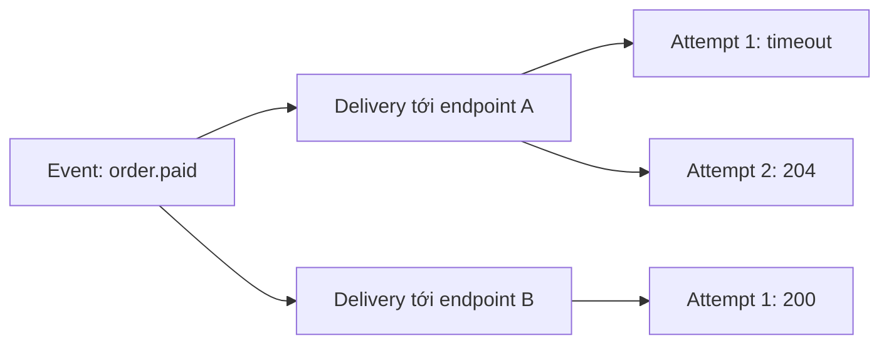
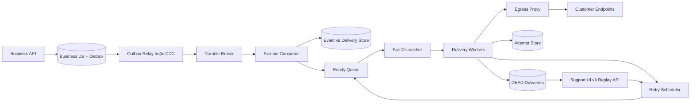
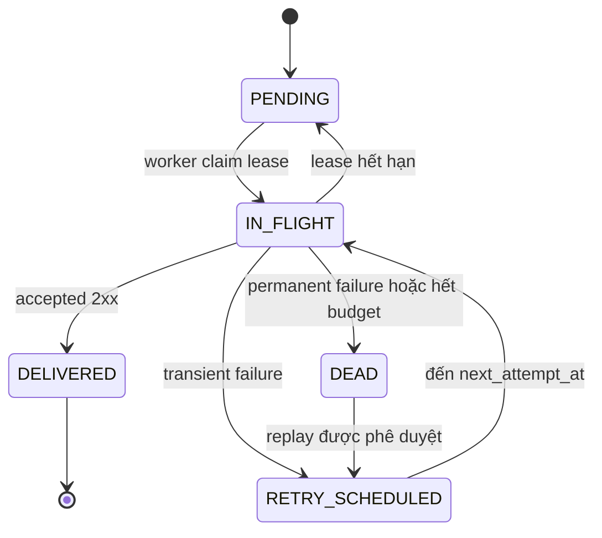
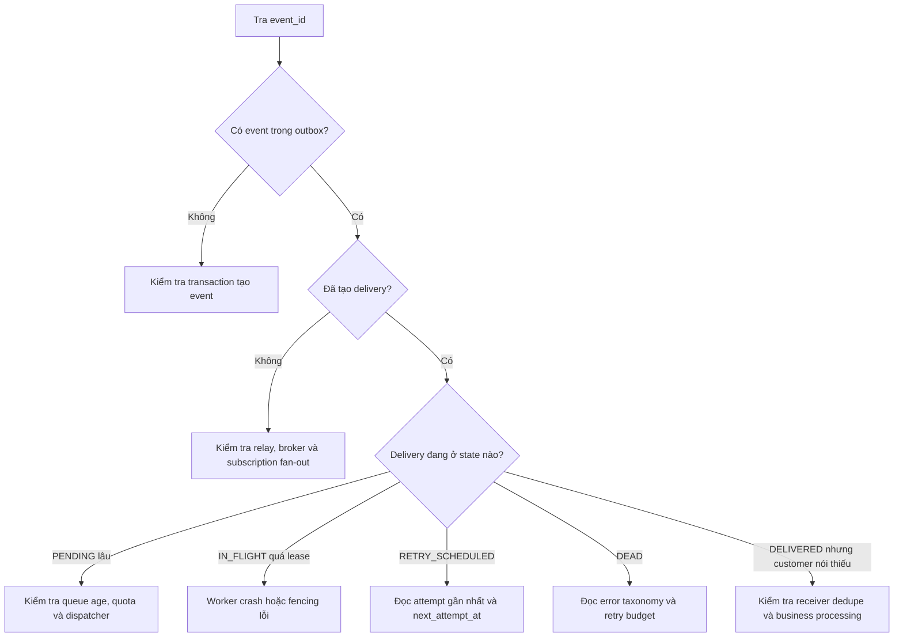
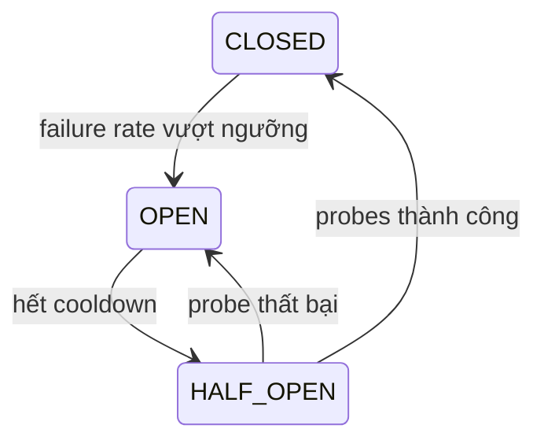
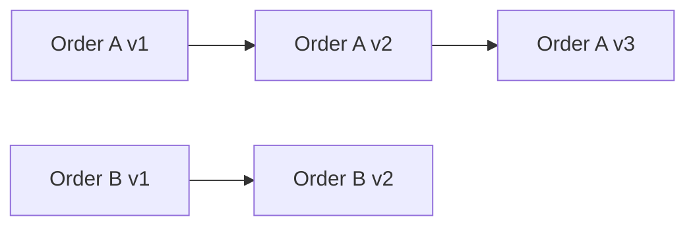

## Câu hỏi

> **Hãy thiết kế một Webhook Delivery System gửi 10 triệu deliveries mỗi ngày tới các endpoint do khách hàng đăng ký. Business request không được chờ endpoint bên ngoài; event đã commit không được mất; endpoint chậm phải được cô lập; hệ thống phải retry, chống duplicate, ký request, chống SSRF và cho phép support điều tra hoặc replay từng delivery.**

---

## Dành cho level

`Senior` `Staff`

Ở mức Senior, interviewer kỳ vọng bạn làm rõ requirement, ước lượng tải, chọn delivery semantics và thiết kế được đường đi từ business transaction đến từng HTTP attempt. Bạn phải xử lý được dual-write, retry storm, duplicate, noisy neighbor, worker crash và endpoint không đáng tin cậy.

Ở mức Staff, câu trả lời cần đi xa hơn component diagram: xác định product contract, SLO, tenant isolation, security boundary, retention, replay governance, disaster recovery và chi phí vận hành. Phần **Góc nhìn Staff** ở cuối phân tích sẽ mở rộng các quyết định này ở cấp tổ chức.

Điểm cộng: không hứa “exactly-once”, không mặc định Kafka giải quyết mọi thứ, và biết rằng một nút **Replay all** thiếu rate limit có thể tạo incident thứ hai.

---

## Cốt lõi cần nhớ

**Webhook là bài toán quản lý một kết quả không chắc chắn, không phải bài toán gửi `POST`.** Receiver có thể đã commit nhưng response bị mất, nên duplicate là tình huống bình thường.

**Đường đi đáng tin cậy là business transaction → outbox → durable queue → fair dispatcher → worker → retry scheduler.** Mỗi chặng giải quyết một failure window khác nhau.

**Cam kết thực tế là at-least-once với stable event ID.** Side effect chỉ an toàn khi receiver deduplicate trong cùng transaction với business mutation.

**Reliability và security phải đi cùng nhau.** Retry cần backoff + jitter; request cần HMAC + timestamp; URL do khách hàng nhập cần được chặn SSRF ở cả application lẫn network layer.

---

## Câu trả lời mẫu

> "Trước tiên tôi sẽ xác nhận 10 triệu là số deliveries sau fan-out hay số domain events trước fan-out, vì một event có thể gửi tới nhiều endpoint. Nếu là 10 triệu deliveries mỗi ngày thì average chỉ khoảng 116 request/giây, nhưng tôi sẽ capacity theo peak, latency của endpoint và retry amplification chứ không theo average. Business service không gọi endpoint khách hàng trực tiếp; nó ghi business state và outbox trong cùng database transaction. Relay publish event sang durable broker, webhook service fan-out thành delivery, rồi fair dispatcher chỉ cấp việc cho endpoint còn quota. Worker gửi HTTPS request có connect và total timeout, không follow redirect, ký raw body bằng HMAC, coi mọi `2xx` hợp lệ là thành công. Với timeout, `429` hoặc `5xx`, worker ghi attempt rồi schedule lần sau bằng exponential backoff có jitter; worker không sleep. Tôi cam kết at-least-once: event ID giữ nguyên qua retry và replay, vì receiver có thể xử lý xong nhưng response 200 bị mất. Endpoint nhận cần deduplicate bằng unique constraint trong cùng transaction với side effect. Endpoint lỗi lâu sẽ bị circuit breaker cô lập; hết retry budget thì delivery chuyển sang `DEAD`, có audit và replay qua cùng limiter như live traffic. Tôi theo dõi oldest pending age, first-attempt latency, retry rate, dead rate, outbox lag và health theo từng endpoint. Cuối cùng, vì URL là input không tin cậy, worker chỉ đi qua egress proxy chặn private IP, metadata service, redirect và DNS rebinding."

---

## Phân tích chi tiết

### 1. Chốt thuật ngữ trước khi vẽ kiến trúc

“Webhook event” thường bị dùng cho ba đối tượng khác nhau:

| Đối tượng | Ý nghĩa | Identity nên ổn định |
| --- | --- | --- |
| **Event** | Một business fact đã xảy ra, ví dụ `order.paid` | `event_id` |
| **Delivery** | Nghĩa vụ giao một event tới một endpoint cụ thể | `(event_id, endpoint_id)` hoặc `delivery_id` |
| **Attempt** | Một lần HTTP request của delivery | `attempt_id` mới mỗi lần |

Một event có thể fan-out thành nhiều deliveries, và một delivery có thể cần nhiều attempts:



Nếu đề bài nói 10 triệu **events trước fan-out**, capacity phải nhân thêm số subscription trung bình. Trong phần còn lại, ta giả định 10 triệu là **deliveries sau fan-out**.

### 2. Requirement cần hỏi và contract cần chốt

Một câu trả lời mạnh không tự phát minh requirement rồi giấu chúng trong sơ đồ. Hãy nói rõ assumption:

| Nhóm | Câu hỏi cần chốt | Baseline dùng trong bài |
| --- | --- | --- |
| Volume | 10 triệu là event hay delivery? Peak/average bao nhiêu? | 10 triệu deliveries/ngày, peak `10x` average |
| Latency | Đo từ lúc nào? Áp dụng cho endpoint khỏe hay mọi endpoint? | 99% first attempt bắt đầu trong 5 giây với endpoint khỏe |
| Success | Status nào được chấp nhận? | Mọi `2xx`; không tự follow `3xx` |
| Timeout | Receiver được phép giữ request bao lâu? | Connect 2 giây, total 10 giây làm baseline để test |
| Retry | Lỗi nào retry, trong bao lâu? | Backoff + jitter, tối đa 24 giờ; policy theo event type |
| Ordering | Global, theo endpoint hay theo aggregate? | Không global order; chỉ serialize lane thật sự cần |
| Retention | Payload, attempt và audit giữ bao lâu? | Payload 30 ngày; audit có thể lâu hơn |
| Recovery | RPO/RTO và multi-region? | Multi-AZ trước; multi-region chỉ khi business yêu cầu |

Các con số trên không phải “best practice” áp dụng cho mọi công ty. Chúng là baseline có thể đo, load test và thay đổi khi Product đưa ra contract khác.

> [!IMPORTANT]
> Không đưa endpoint lỗi vào cùng latency SLO với endpoint khỏe. Hệ thống không thể bảo đảm giao trong 5 giây nếu server của khách hàng đang tắt; nó chỉ có thể bảo đảm event không mất, retry đúng policy và tenant khác không bị ảnh hưởng.

### 3. Ước lượng tải: average nhỏ, tail latency mới đắt

Throughput trung bình:

```text
10.000.000 / 86.400 ≈ 116 deliveries/giây
```

Nếu peak gấp 10 lần:

```text
Peak ≈ 1.160 deliveries/giây
```

Với endpoint khỏe có latency trung bình 300 ms, Little's Law cho số request đang bay:

```text
Concurrency ≈ throughput × latency
            ≈ 1.160 × 0,3
            ≈ 348 requests in-flight
```

Nhưng chỉ cần 5% request chờ hết timeout 10 giây:

```text
Weighted latency = 95% × 0,3 + 5% × 10 = 0,785 giây
Concurrency      ≈ 1.160 × 0,785 ≈ 911 requests in-flight
```

Chưa kể retry. Nếu tỷ lệ first-attempt failure là `r` và mọi lỗi đều được thử thêm một lần, traffic gần đúng sẽ nhân với `1 + r`. Khi đối tác outage diện rộng, retry có thể lớn hơn live traffic nếu không có budget riêng.

Payload trung bình 5 KB tạo khoảng:

```text
10.000.000 × 5 KB ≈ 50 GB/ngày
30 ngày ≈ 1,5 TB raw payload
```

Do đó không copy payload vào mỗi attempt row. Event giữ payload một lần; delivery giữ state; attempt chỉ giữ metadata và response body đã truncate.

### 4. Kiến trúc tổng thể và trách nhiệm từng chặng



Mỗi box phải có một lý do:

| Chặng | Trách nhiệm | Failure nếu bỏ qua |
| --- | --- | --- |
| Business DB + Outbox | Atomic giữa business state và event cần phát | Commit order nhưng mất webhook event |
| Relay / CDC | Chuyển outbox sang broker, chấp nhận publish duplicate | Producer bị buộc dual-write DB và broker |
| Durable broker | Hấp thụ burst, tách producer khỏi delivery fleet | Worker outage tạo mất event hoặc ép business request chờ |
| Fan-out | Tạo đúng một delivery cho mỗi subscription | Kafka redelivery tạo delivery trùng |
| Fair dispatcher | Chia capacity theo tenant/endpoint | Một endpoint timeout chiếm hết worker |
| Worker | Claim, ký, gửi, phân loại kết quả, ghi attempt | Không có lifecycle rõ để recovery |
| Retry scheduler | Đưa delivery quay lại đúng thời điểm | Worker phải `sleep` hoặc retry storm |
| DEAD + Replay | Cho support điều tra và khôi phục có kiểm soát | Failure bị chôn trong DLQ không owner |
| Egress proxy | Enforce network policy cho URL không tin cậy | SSRF vào metadata hoặc internal service |

Kafka là một lựa chọn, không phải requirement. Ở quy mô vừa, PostgreSQL với `FOR UPDATE SKIP LOCKED` hoặc managed queue như SQS cũng có thể đủ. Cách chọn database và queue phải dựa trên access pattern, consistency và năng lực vận hành; xem thêm [SQL vs NoSQL: chọn database như thế nào?](/database/01-sql-vs-nosql).

### 5. Data model: event, delivery và attempt phải tách nhau

Schema rút gọn:

```sql
CREATE TABLE webhook_events (
    event_id        UUID PRIMARY KEY,
    tenant_id       UUID NOT NULL,
    event_type      VARCHAR(120) NOT NULL,
    schema_version  INTEGER NOT NULL,
    payload         JSONB NOT NULL,
    occurred_at     TIMESTAMPTZ NOT NULL,
    expires_at      TIMESTAMPTZ NOT NULL
);

CREATE TABLE webhook_deliveries (
    delivery_id         UUID PRIMARY KEY,
    event_id            UUID NOT NULL REFERENCES webhook_events(event_id),
    endpoint_id         UUID NOT NULL,
    status              VARCHAR(30) NOT NULL,
    attempt_count       INTEGER NOT NULL DEFAULT 0,
    next_attempt_at     TIMESTAMPTZ,
    leased_by           VARCHAR(120),
    leased_until        TIMESTAMPTZ,
    last_error_category VARCHAR(50),
    delivered_at        TIMESTAMPTZ,
    dead_at             TIMESTAMPTZ,
    created_at          TIMESTAMPTZ NOT NULL DEFAULT now(),
    UNIQUE (event_id, endpoint_id)
);

CREATE TABLE webhook_attempts (
    attempt_id       UUID PRIMARY KEY,
    delivery_id      UUID NOT NULL REFERENCES webhook_deliveries(delivery_id),
    attempt_number   INTEGER NOT NULL,
    started_at       TIMESTAMPTZ NOT NULL,
    finished_at      TIMESTAMPTZ,
    outcome          VARCHAR(40) NOT NULL,
    http_status      INTEGER,
    latency_ms       INTEGER,
    response_excerpt VARCHAR(4096),
    UNIQUE (delivery_id, attempt_number)
);

CREATE INDEX idx_webhook_deliveries_due
ON webhook_deliveries (next_attempt_at, delivery_id)
WHERE status IN ('PENDING', 'RETRY_SCHEDULED');
```

`UNIQUE(event_id, endpoint_id)` làm fan-out idempotent khi broker redeliver. Partial index cho due deliveries giữ index nhỏ vì không chứa rows đã `DELIVERED`; [partial index trên cột nullable và outbox](/database/02-index-on-nullable-column) giải thích kỹ hơn trade-off này.

State machine:



`Attempt` nên append-only để phục vụ audit. `Delivery` là snapshot trạng thái hiện tại để query nhanh. Không ghi đè lịch sử attempt bằng một cột `last_error` duy nhất.

### 6. Triage một delivery lỗi trước khi đọc sâu từng kịch bản

Khi support đưa một `event_id`, đường chẩn đoán nên nhất quán:



Bảng lookup nhanh phải nằm trước các kịch bản để người vận hành biết nên nhảy đến đâu:

| Triệu chứng | Khả năng cao | Metric / dữ liệu xác nhận | Kịch bản |
| --- | --- | --- | --- |
| Business state có nhưng không có event | Dual-write hoặc transaction boundary sai | Outbox row, application trace | 1 |
| Nhiều attempts cùng `event_id` | Kết quả HTTP không chắc chắn | Timeout, reset, worker crash sau POST | 2 hoặc 4 |
| Một endpoint backlog tăng, endpoint khác bình thường | Receiver outage / rate limit | `429`, `5xx`, timeout, breaker state | 3 |
| Nhiều rows `IN_FLIGHT` quá `leased_until` | Worker chết hoặc mất DB connectivity | Lease age, pod restart, worker logs | 4 |
| Delivery vào `DEAD` ngay | Permanent error hoặc payload/config sai | `4xx`, policy version, response excerpt | 5 |
| Request chạm private IP hoặc signature fail hàng loạt | SSRF attempt / secret rotation lỗi | DNS result, egress deny, signature version | 6 |

> [!WARNING]
> Support không nên “retry thử” trước khi biết delivery đã ở state nào. Một retry thủ công có thể lặp side effect ở receiver hoặc biến endpoint đang phục hồi thành quá tải lần nữa.

### 7. Kịch bản 1 — Business transaction đã commit nhưng webhook event biến mất

#### Nhận diện

Order đã chuyển sang `PAID`, nhưng không tìm thấy `event_id` trong outbox, broker hay webhook store. Trace thường dừng ngay sau DB commit hoặc cho thấy publish broker lỗi.

#### Nguyên nhân phổ biến

- Application commit business state rồi mới publish sang broker bằng một network call riêng.
- Process crash trong khoảng giữa DB commit và publish.
- Publish thành công nhưng business transaction rollback, tạo ra event không phản ánh source of truth.
- Code chỉ `catch` lỗi publish; process kill hoặc machine failure không chạy được nhánh retry.

#### Mitigate ngay

Chạy reconciliation có giới hạn: tìm business records đã commit nhưng thiếu outbox event, tạo lại event bằng stable business key, rồi publish qua đường bình thường. Không quét toàn bộ database không throttle trong giờ cao điểm.

Nếu lỗi xuất hiện sau một deployment, pause rollout và rollback producer trước khi backlog inconsistency tăng thêm.

#### Fix đúng

Dùng **Transactional Outbox**: update business state và insert outbox row trong cùng local database transaction.

```sql
BEGIN;

UPDATE orders
SET status = 'PAID', version = version + 1
WHERE id = :order_id
  AND status = 'PENDING_PAYMENT';

INSERT INTO outbox_events (
    event_id,
    aggregate_id,
    aggregate_version,
    event_type,
    payload,
    occurred_at
) VALUES (
    :event_id,
    :order_id,
    :aggregate_version,
    'order.paid',
    CAST(:payload AS jsonb),
    now()
);

COMMIT;
```

Relay có thể poll hoặc dùng Change Data Capture (CDC) để đọc transaction log. Nếu relay publish thành công rồi crash trước khi đánh dấu outbox row đã xử lý, nó sẽ publish lại. Vì vậy outbox đóng cửa sổ **mất event**, nhưng downstream vẫn phải idempotent.

Pattern này cũng xuất hiện trong pipeline CQRS; xem [CQRS với Outbox, at-least-once và projection idempotent](/system-design/04-cqrs) tại đúng failure boundary tương tự.

**Takeaway:** atomicity phải nằm giữa business state và outbox trong cùng database; không thể tạo atomicity bằng `try/catch` quanh DB và Kafka.

### 8. Kịch bản 2 — Receiver đã xử lý nhưng sender vẫn retry

#### Nhận diện

Sender ghi timeout hoặc connection reset, nhưng customer khẳng định business action đã xảy ra. Cùng `event_id` xuất hiện ở nhiều attempts; receiver có thể tạo duplicate invoice, shipment hoặc notification.

#### Nguyên nhân phổ biến

- Receiver commit xong nhưng response `200` bị mất trên network.
- Sender nhận `2xx` rồi crash trước khi update delivery thành `DELIVERED`.
- Load balancer đóng connection sau khi request đã tới application.
- Manual replay tạo `event_id` mới cho cùng business fact, khiến receiver không nhận ra duplicate.

#### Mitigate ngay

Giữ nguyên `event_id` khi retry hoặc resend cùng một business fact. Thông báo customer bật deduplication trước khi bulk replay những event có side effect quan trọng.

Nếu receiver chưa idempotent, replay theo batch nhỏ và reconcile business records sau mỗi batch. Không thể loại bỏ hoàn toàn rủi ro chỉ từ phía sender.

#### Fix đúng

Contract phải nói rõ **at-least-once**. Sender gửi các identity khác nhau cho từng lớp:

```http
Webhook-Id: evt_01JQ8YV8K9
Webhook-Delivery-Id: del_01JQ8YW3H2
Webhook-Attempt: 3
Webhook-Timestamp: 1773561000
```

- `Webhook-Id` giữ nguyên qua retry và normal replay.
- `Webhook-Delivery-Id` định danh cặp event-endpoint.
- Attempt number tăng ở mỗi HTTP request.

Receiver deduplicate bằng unique constraint trong **cùng transaction** với side effect:

```sql
BEGIN;

INSERT INTO processed_webhook_events (provider, event_id, processed_at)
VALUES ('our-platform', :event_id, now())
ON CONFLICT DO NOTHING;

-- Chỉ chạy mutation nếu INSERT phía trên thực sự tạo row mới.
UPDATE merchant_orders
SET paid = true
WHERE external_order_id = :order_id;

COMMIT;
```

Implementation phải kiểm tra affected row của `INSERT`. Nếu bằng `0`, receiver trả `2xx` nhưng không chạy mutation lần nữa. Dùng Redis `SETNX` riêng lẻ cho critical side effect có thể sai: dedupe key thành công nhưng DB mutation thất bại sẽ khiến retry bị bỏ qua.

Dedupe key phải được giữ ít nhất lâu hơn automatic retry window cộng manual replay window. Nếu platform cho replay sau 30 ngày nhưng receiver xóa key sau 24 giờ, duplicate business effect vẫn có thể xảy ra.

**Takeaway:** sender không thể biết chắc receiver đã commit hay chưa; stable ID và atomic dedupe ở receiver mới làm retry an toàn.

### 9. Kịch bản 3 — Một endpoint down làm backlog toàn hệ thống tăng

#### Nhận diện

Một endpoint có tỷ lệ timeout, `429` hoặc `5xx` cao; số request in-flight của nó tăng; backlog của tenant đó rất lớn. Nếu isolation kém, `oldest_pending_age` của endpoint khỏe cũng tăng theo.

#### Nguyên nhân phổ biến

- Global FIFO đưa hàng trăm nghìn jobs của một tenant lên đầu queue.
- Worker pool chung không có per-endpoint concurrency limit.
- Retry chạy ngay lập tức hoặc theo lịch cố định, tạo thundering herd.
- Worker gọi `Thread.sleep` để chờ retry, làm slot bị giữ vô ích.
- Circuit breaker đặt global thay vì theo endpoint.

#### Mitigate ngay

Mở circuit breaker cho endpoint lỗi, giảm concurrency/rate của tenant đó và reserve capacity cho live traffic của endpoint khỏe. Delivery không bị drop; chúng được schedule sang tương lai.

Tôn trọng `Retry-After` khi receiver trả `429`. Nếu backlog tiếp tục tăng, pause admission của bulk replay và giảm broker consumption về mức worker fleet có thể xử lý bền vững.

#### Fix đúng

Dispatcher dùng logical lanes thay vì tạo một queue vật lý cho mỗi customer:

```text
Global concurrency
└── Per-tenant concurrency / token bucket
    └── Per-endpoint concurrency / token bucket
```

Ví dụ minh họa, không phải default:

```text
Global in-flight: 2.000
Mỗi tenant: tối đa 50
Mỗi endpoint: tối đa 5
Retry traffic: tối đa 20% fleet
Replay traffic: tối đa 10% fleet
```

Fair scheduling có thể dùng round-robin, Deficit Round Robin hoặc weighted fairness theo product tier. Invariant cần giữ là tenant A backlog lớn không làm queue age của tenant B tăng vô hạn. Đây là cùng tư duy scale theo bottleneck và backpressure trong [lộ trình scale từ 1.000 lên 50.000 users](/system-design/03-scale-1k-to-50k-users), không phải chỉ tăng replica theo CPU.

HTTP result phải được phân loại thay vì retry mọi non-`200`:

| Kết quả | Xử lý mặc định | Lý do |
| --- | --- | --- |
| `2xx` | `DELIVERED` | Receiver đã chấp nhận |
| `3xx` | Không follow; config error | Redirect mở thêm SSRF và ownership ambiguity |
| `400`, `405`, `413`, `422` | Không retry tự động | Payload hoặc contract không tự sửa theo thời gian |
| `401`, `403` | Pause/retry rất hạn chế, notify | Secret hoặc permission cần sửa |
| `404` | Retry ngắn theo contract | Có thể là deploy tạm thời, nhưng retry dài thường lãng phí |
| `408`, `425`, `429` | Retry | Transient hoặc receiver đang backpressure |
| `5xx` | Retry | Server-side failure thường tạm thời |
| DNS/connect/TLS timeout | Retry có giới hạn | Network hoặc certificate có thể phục hồi |
| `410` | Disable/dead theo contract | Receiver thông báo endpoint không còn tồn tại |

Backoff dùng full jitter:

```text
maxDelay = min(cap, base × 2^(attempt - 1))
delay    = random(0, maxDelay)
```

Nếu có `Retry-After`, lần tiếp theo không được sớm hơn giá trị hợp lệ đó, nhưng vẫn cần cap theo retention và retry window.

Worker chỉ ghi lịch rồi trả slot:

```sql
UPDATE webhook_deliveries
SET status = 'RETRY_SCHEDULED',
    next_attempt_at = :next_attempt_at,
    last_error_category = :category
WHERE delivery_id = :delivery_id
  AND status = 'IN_FLIGHT'
  AND leased_by = :worker_id;
```

Circuit breaker theo endpoint có ba trạng thái:



Breaker bảo vệ fleet; retry quản lý lifecycle từng delivery. Hai cơ chế bổ sung cho nhau, không thay thế nhau.

**Takeaway:** queue bảo đảm durability, còn fairness, quota, jitter và circuit breaker mới bảo đảm isolation.

### 10. Kịch bản 4 — Worker chết khi delivery đang `IN_FLIGHT`

#### Nhận diện

Nhiều rows ở `IN_FLIGHT` lâu hơn request timeout. Pod restart hoặc mất network đúng lúc các attempts bắt đầu, nhưng không có kết quả cuối cùng. Một số delivery chỉ được gửi lại sau khi operator sửa state bằng tay.

#### Nguyên nhân phổ biến

- Worker claim job nhưng không có lease expiry.
- Queue acknowledgement xảy ra trước khi delivery state được cập nhật an toàn.
- Worker cũ ghi kết quả sau khi lease đã được worker mới claim.
- Lease ngắn hơn total HTTP timeout, làm hai workers cùng gửi một delivery.

#### Mitigate ngay

Requeue các rows có `leased_until < now()` theo batch nhỏ. Giữ nguyên event và delivery identity; chấp nhận rằng request cũ có thể đã tới receiver nên duplicate vẫn có thể xảy ra.

Tạm tăng lease nếu telemetry cho thấy request hợp lệ thường hoàn thành sau lease hiện tại. Đây chỉ là mitigation; lease quá dài lại làm recovery chậm.

#### Fix đúng

Claim bằng lease có điều kiện:

```sql
UPDATE webhook_deliveries
SET status = 'IN_FLIGHT',
    leased_by = :worker_id,
    leased_until = now() + interval '30 seconds',
    attempt_count = attempt_count + 1
WHERE delivery_id = :delivery_id
  AND (
      status IN ('PENDING', 'RETRY_SCHEDULED')
      OR (status = 'IN_FLIGHT' AND leased_until < now())
  )
RETURNING *;
```

Lease 30 giây chỉ hợp lý nếu lớn hơn total HTTP timeout 10 giây cộng thời gian ghi DB và network jitter. Request dài hơn cần lease dài hơn hoặc heartbeat có giới hạn.

Khi complete, worker dùng fencing condition để chỉ owner hiện tại được cập nhật:

```sql
UPDATE webhook_deliveries
SET status = 'DELIVERED',
    delivered_at = now(),
    leased_by = NULL,
    leased_until = NULL
WHERE delivery_id = :delivery_id
  AND status = 'IN_FLIGHT'
  AND leased_by = :worker_id;
```

Nếu affected rows bằng `0`, worker đã mất quyền sở hữu và không được ghi đè state. Tốt hơn nữa, dùng `lease_token` tăng dần thay vì chỉ `worker_id` để phân biệt hai lần claim của cùng một process identity.

**Takeaway:** lease giúp recovery khi worker chết; fencing ngăn worker cũ ghi đè worker mới; cả hai vẫn không loại bỏ duplicate HTTP.

### 11. Kịch bản 5 — Poison delivery vào `DEAD`, support muốn replay hàng loạt

#### Nhận diện

Delivery thất bại lặp lại với cùng lỗi `4xx`, payload không hợp schema hoặc endpoint đã bị xóa. `DEAD` tăng nhanh sau một deployment. Support chuẩn bị replay hàng trăm nghìn events ngay khi customer báo đã sửa endpoint.

#### Nguyên nhân phổ biến

- Retry policy không phân biệt lỗi permanent và transient.
- Schema hoặc secret mới được rollout nhưng customer chưa cập nhật.
- DLQ chỉ chứa raw message, không có event/delivery/attempt history.
- Replay publish thẳng vào queue ưu tiên cao, bỏ qua endpoint limiter.
- Replay tạo event ID mới dù vẫn là business fact cũ.

#### Mitigate ngay

Dừng auto-retry cho error category rõ ràng là permanent. Xác nhận endpoint bằng một test event, sau đó replay canary một batch nhỏ qua normal dispatcher.

Giới hạn tốc độ replay và giữ capacity riêng cho live traffic. Cho operator xem trước số deliveries, event types, payload age và estimated drain time trước khi xác nhận.

#### Fix đúng

Một delivery chuyển `DEAD` khi đạt điều kiện nào đến trước:

```text
attempt_count >= max_attempts
OR now - first_attempt_at >= max_retry_age
OR event đã hết giá trị business / retention
OR lỗi được phân loại permanent
```

Replay là một operation có governance:

```text
1. Actor có RBAC chọn filter và nhập reason.
2. Hệ thống hiển thị count, endpoint health và estimated traffic.
3. Tạo replay job có audit ID.
4. Giữ nguyên event_id và delivery_id nếu resend cùng fact.
5. Tạo attempt mới với timestamp và signature mới.
6. Đi qua fair dispatcher, limiter và circuit breaker.
7. Theo dõi progress, error rate; cho phép pause/cancel.
```

`DEAD` không phải một “bãi rác Kafka”. Nó cần owner, alert, attempt history, retention và runbook. Nếu payload đã bị xóa theo privacy policy, dashboard phải nói rõ không thể replay thay vì dựng lại payload từ current state rồi giả vờ đó là event cũ.

**Takeaway:** replay là production traffic có rủi ro, không phải thao tác copy message; nó cần admission control và audit như một deployment.

### 12. Kịch bản 6 — Endpoint hợp lệ về cú pháp nhưng là một SSRF target

#### Nhận diện

Customer đăng ký URL trỏ tới loopback, private subnet, link-local address hoặc cloud metadata service. Một hostname public resolve sang IP private ở lần delivery; hoặc endpoint trả redirect sang internal service. Ở chiều ngược lại, customer báo signature fail sau khi secret rotation.

#### Nguyên nhân phổ biến

- Chỉ validate URL bằng regex lúc đăng ký.
- Tin hostname mà không kiểm tra IP sau DNS resolution.
- HTTP client tự follow redirect.
- Worker có network route tới database, control plane hoặc metadata endpoint.
- HMAC chỉ ký parsed JSON thay vì raw bytes.
- Dùng một global secret cho mọi tenants hoặc rotate secret không có overlap.

#### Mitigate ngay

Disable endpoint đáng ngờ, thu hồi egress credential nếu cần và kiểm tra access logs của metadata/internal services. Chặn ngay private, loopback, link-local và metadata ranges ở egress firewall/proxy, không chỉ trong application.

Với signature failure hàng loạt, dừng rotation, cho verifier chấp nhận cả key cũ và mới trong overlap window, rồi kiểm tra canonical bytes trước khi replay.

#### Fix đúng

SSRF (Server-Side Request Forgery) cần nhiều lớp:

```text
Khi đăng ký endpoint
- Chỉ cho HTTPS.
- Parse bằng URL library chuẩn; cấm userinfo.
- Resolve DNS và reject private, loopback, link-local, multicast, metadata ranges.
- Có thể yêu cầu ownership verification bằng challenge.

Mỗi lần delivery
- Resolve lại và validate mọi A/AAAA result.
- Kết nối tới đúng IP đã validate, vẫn verify TLS hostname.
- Không tự follow redirect; nếu bắt buộc thì validate lại từng hop.
- Giới hạn port, response bytes, connect timeout và total timeout.

Network layer
- Worker đi qua egress proxy/NAT có allow policy.
- Không có route tới cluster control plane, database hoặc metadata service.
- Log quyết định deny mà không làm lộ secret/payload.
```

TLS bảo vệ kênh truyền nhưng không chứng minh body đến từ provider. Nền tảng [SSL/TLS](/security/02-ssl-tls) và [HMAC khác gì hashing/encryption](/security/01-encoding-vs-encryption) là hai lớp khác nhau.

Canonical content nên gồm event identity, timestamp và **raw body**:

```text
signed_content = event_id + "." + timestamp + "." + raw_body
signature      = HMAC-SHA256(endpoint_secret, signed_content)
```

Headers:

```http
Webhook-Id: evt_01JQ8YV8K9
Webhook-Timestamp: 1773561000
Webhook-Signature: v1=13c8f6...
```

Receiver verify theo thứ tự:

```text
1. Đọc raw bytes, chưa parse rồi serialize lại.
2. Kiểm tra timestamp nằm trong tolerance đã document.
3. Chọn key theo version/key ID.
4. Tính HMAC trên đúng canonical content.
5. So sánh bằng constant-time API.
6. Deduplicate event_id.
7. Durable enqueue hoặc commit rồi mới trả 2xx.
```

Secret riêng theo endpoint, được encrypt bằng KMS hoặc envelope encryption. Rotation có overlap; một request có thể mang chữ ký của key cũ và mới trong thời gian chuyển đổi.

> [!CAUTION]
> HMAC bảo vệ receiver khỏi request giả mạo. SSRF-safe egress bảo vệ sender khỏi URL độc hại. Có một lớp không đồng nghĩa đã có lớp còn lại.

**Takeaway:** URL của customer là untrusted input; application validation chỉ giảm rủi ro, network egress policy mới là hàng rào cuối.

### 13. HTTP contract phải đủ rõ để hai bên cùng implement

Payload mẫu:

```json
{
  "id": "evt_01JQ8YV8K9",
  "type": "order.paid",
  "schemaVersion": 1,
  "occurredAt": "2026-03-15T10:30:00Z",
  "data": {
    "orderId": "ord_123",
    "amount": 1250000,
    "currency": "VND"
  }
}
```

Contract nên document:

- Mọi accepted `2xx`, không chỉ `200`, đều là success.
- Receiver nên verify, dedupe, durable enqueue rồi trả `2xx` nhanh.
- Sender có connect timeout và total timeout rõ ràng.
- Redirect mặc định không được follow.
- Response body chỉ được đọc/lưu tối đa một kích thước nhỏ và phải redact.
- Event có `schemaVersion`; field mới là additive khi có thể.
- Duplicate và out-of-order là tình huống hợp lệ theo contract.
- Retry window, replay window và dedupe retention phải khớp nhau.

Snapshot payload nên phản ánh fact tại thời điểm event xảy ra. Nếu worker chỉ lưu `orderId` rồi fetch current order sau ba ngày, event `order.paid` có thể mang trạng thái hiện tại là `refunded`, làm mất ý nghĩa lịch sử.

### 14. Ordering: chỉ bảo đảm ở boundary business thật sự cần

Kafka giữ order trong một partition, nhưng HTTP requests concurrent vẫn có thể hoàn tất ngược thứ tự. Retry còn làm event cũ quay lại sau event mới.

Ba lựa chọn:

| Semantics | Ưu điểm | Giá phải trả |
| --- | --- | --- |
| Không guarantee order | Throughput và isolation tốt nhất | Receiver cần version hoặc đọc current state |
| Order theo endpoint | Contract dễ hiểu | Một poison event chặn toàn endpoint |
| Order theo `(endpoint_id, aggregate_id)` | Cùng order có thứ tự, order khác chạy song song | Scheduler và recovery phức tạp hơn |

Default hợp lý là không hứa global order. Với event type cần strict order, thêm `aggregate_id` và `aggregate_version`, rồi chỉ cho một delivery in-flight trong lane `(endpoint_id, aggregate_id)`.



Hai lane A và B chạy song song. Nếu A v1 retry, A v2 chờ; B không bị chặn. Đây là trade-off head-of-line blocking có chủ đích, không phải “Kafka đã lo ordering”.

### 15. Observability: support phải lần được một delivery end-to-end

Mỗi log/trace cần correlation keys:

```text
event_id
delivery_id
attempt_id
tenant_id
endpoint_id
worker_id
policy_version
lease_token
```

Không dùng endpoint URL đầy đủ làm metric label vì cardinality cao và có thể chứa dữ liệu nhạy cảm. Dashboard nên aggregate theo tenant/endpoint ID đã chuẩn hóa.

Các metric quan trọng:

| Metric | Điều nó trả lời |
| --- | --- |
| `outbox_oldest_unpublished_age` | Business event có bị kẹt trước broker không? |
| `delivery_oldest_pending_age` | Hệ thống có theo kịp SLO không? |
| `first_attempt_latency` | Event khỏe được bắt đầu gửi nhanh không? |
| `attempt_latency` theo phase | Chậm ở DNS, connect, TLS hay receiver? |
| `success_rate` theo endpoint | Endpoint nào đang suy giảm? |
| `retry_rate` theo category | Lỗi nào đang khuếch đại traffic? |
| `dead_delivery_rate` | Contract, payload hay endpoint nào gây poison? |
| `in_flight` theo endpoint | Quota/fairness có hoạt động không? |
| `lease_expired_total` | Worker crash hoặc timeout/lease đang lệch? |
| `replay_queue_age` | Replay có lấn live traffic không? |

SLO nên tách ít nhất ba lớp:

```text
Platform durability SLO
- Event đã commit không bị mất.

Healthy-endpoint first-attempt SLO
- Ví dụ 99% bắt đầu attempt đầu trong 5 giây.

Delivery outcome reporting SLO
- Attempt result và trạng thái support hiển thị trong một khoảng xác định.
```

Không đo availability của customer như lỗi availability của chính platform. Tuy nhiên nếu dispatcher để một endpoint hỏng kéo endpoint khỏe trễ theo, đó là lỗi của platform.

### 16. Test failure path, không chỉ load test happy path

Một test plan production-grade cần có:

```text
Durability
- Kill process sau business commit nhưng trước relay publish.
- Cho relay publish thành công rồi crash trước khi mark outbox.
- Redeliver cùng broker message nhiều lần.

Ambiguous outcome
- Receiver commit rồi drop response.
- Worker nhận 2xx rồi crash trước khi update delivery.
- Hai workers cạnh tranh sau khi lease hết.

Isolation
- 10% endpoints timeout đủ 10 giây.
- Một tenant tạo 50% toàn bộ backlog.
- Bulk replay chạy đồng thời với live traffic.

Retry
- 429 với Retry-After dạng seconds và HTTP-date.
- 5xx outage hai giờ rồi phục hồi.
- Retry policy đổi version khi deliveries cũ vẫn pending.

Security
- IPv4/IPv6 private, loopback, link-local và metadata addresses.
- DNS rebinding và redirect sang private IP.
- Signature sai raw bytes, timestamp cũ và secret rotation overlap.

Recovery
- Mất ready queue rồi rebuild từ delivery store.
- Database failover khi workers đang in-flight.
- Restore backup và kiểm tra RPO/RTO thực tế.
```

Success criterion không chỉ là “không crash”. Phải chứng minh endpoint khỏe giữ SLO, duplicate không lặp side effect, replay không starvation live traffic và recovery không tạo retry storm.

### 17. Góc nhìn Staff — biến hệ thống thành một product có thể vận hành lâu dài

> [!NOTE]
> Senior thường chứng minh đường delivery đúng dưới failure. Staff phải chứng minh tổ chức có thể sở hữu contract, chi phí và rủi ro của nó trong nhiều năm.

Một câu trả lời Staff nên bổ sung:

**Định lượng business impact.** Phân loại event theo mức quan trọng. `payment.settled` có retry/reconciliation khác `user.typing`; không nên áp một retention và retry policy cho mọi event.

**Đặt ownership rõ ràng.** Platform team sở hữu delivery SLO và egress security; domain team sở hữu schema; Support sở hữu quy trình replay; Security phê duyệt network boundary; Product định nghĩa retention và customer contract.

**Thiết kế governance.** Bulk replay, secret access và payload inspection cần RBAC, audit, approval threshold và break-glass procedure. Schema breaking change cần compatibility check và staged rollout.

**Theo dõi cost theo tenant.** Chi phí không chỉ là request thành công mà còn gồm attempt amplification, payload retention, response logs, egress, support và endpoint xấu giữ connection lâu. Có thể cần quota hoặc pricing theo deliveries/attempts/storage.

**Ưu tiên build hay buy.** Nếu webhook không tạo lợi thế cạnh tranh, managed platform có thể giảm thời gian xây dashboard, retry scheduler và SDK. Quyết định phải tính total cost of ownership, data residency, compliance, egress control và khả năng thoát khỏi vendor.

**Lập lộ trình thay vì over-engineer.** Với 116 deliveries/giây trung bình, có thể bắt đầu PostgreSQL HA + managed queue + bounded worker fleet. Chỉ thêm Kafka, CDC, distributed fair scheduler hoặc multi-region active-active khi SLO, peak và failure data chứng minh cần.

---

## Bẫy thường gặp

❌ **"10 triệu/ngày rất lớn, tôi sẽ shard database và chạy active-active multi-region ngay."** → Tại sao sai: 10 triệu/ngày chỉ khoảng 116 deliveries/giây trung bình; tail latency, retry amplification và endpoint outage mới quyết định capacity, còn active-active làm ordering và ownership phức tạp hơn.
✅ Đúng hơn: tính peak, in-flight concurrency và queue-age SLO; bắt đầu với kiến trúc nhỏ nhất đáp ứng RPO/RTO rồi scale theo số liệu.

---

❌ **"Publish Kafka ngay sau khi commit DB, lỗi thì catch và retry."** → Tại sao sai: process có thể chết giữa commit và publish; `try/catch` không tạo atomic transaction qua database và broker.
✅ Đúng hơn: ghi business state và outbox trong cùng local transaction, relay sau và làm downstream idempotent với duplicate.

---

❌ **"Kafka exactly-once nên webhook cũng exactly-once."** → Tại sao sai: Kafka transaction không bao trùm database của receiver qua HTTP; receiver có thể commit nhưng response bị mất.
✅ Đúng hơn: cam kết at-least-once, giữ stable event ID và yêu cầu receiver deduplicate trong cùng transaction với side effect.

---

❌ **"Retry mọi non-200 ba lần, mỗi lần sleep lâu hơn."** → Tại sao sai: `202` và `204` là success; nhiều `4xx` là permanent; `sleep` giữ worker; lịch cố định tạo retry storm.
✅ Đúng hơn: phân loại status/network error, tôn trọng `Retry-After`, schedule durable bằng backoff + jitter và giới hạn retry theo attempts, age lẫn capacity budget.

---

❌ **"Validate URL lúc đăng ký và ký HMAC là đủ an toàn."** → Tại sao sai: DNS có thể đổi, redirect có thể sang private IP, và HMAC chỉ bảo vệ receiver chứ không chặn worker truy cập internal network.
✅ Đúng hơn: validate lại khi delivery, không follow redirect, chặn private/metadata ranges ở egress layer, đồng thời ký event ID + timestamp + raw body bằng secret riêng theo endpoint.

---

## Câu hỏi follow-up

### 1. Có bắt buộc phải dùng Kafka không?

Không. Kafka hữu ích khi cần hấp thụ burst lớn, có nhiều consumers, replay stream hoặc công ty đã vận hành Kafka tốt. Với throughput vừa, PostgreSQL `SKIP LOCKED`, SQS hoặc một managed durable queue có thể đơn giản hơn. Dù dùng Kafka, business DB và broker vẫn là dual-write nên Transactional Outbox vẫn có giá trị; Kafka cũng không tự cung cấp arbitrary delayed delivery cho retry.

### 2. Tại sao không thể bảo đảm exactly-once end-to-end?

Sender không thể atomically commit cả delivery state của mình và business transaction trong database của receiver qua một HTTP request. Nếu receiver commit rồi response bị mất, sender phải chọn giữa không retry và có nguy cơ mất event, hoặc retry và có nguy cơ duplicate. Hệ thống thường chọn at-least-once, còn “exactly-once business effect” được tạo trong một boundary hẹp bằng stable key, unique constraint và transaction ở receiver.

### 3. Nên retry bao nhiêu lần và bao lâu?

Không có một con số đúng cho mọi event. Policy phải dựa trên độ tươi có giá trị của event, thời gian outage thường gặp, support contract, storage và capacity. Nên giới hạn đồng thời bằng `max_attempts`, `max_retry_age`, per-endpoint retry rate và tỷ lệ fleet dành cho retry; một event hết giá trị sau 10 phút không nên retry 24 giờ chỉ vì đó là default toàn hệ thống.

### 4. Nếu business bắt buộc giữ thứ tự thì làm thế nào?

Trước tiên thu hẹp boundary: thường business cần order theo một aggregate như `order_id`, không cần order toàn tenant. Route theo `(endpoint_id, aggregate_id)`, gắn `aggregate_version` và chỉ cho một attempt in-flight trong lane đó. Aggregate khác vẫn chạy song song. Cần chấp nhận rằng một poison event sẽ chặn các event sau trong cùng lane và phải có policy skip/dead/reconciliation rõ ràng.

### 5. Replay nên giữ event ID cũ hay tạo ID mới?

Nếu chỉ gửi lại cùng business fact, phải giữ `event_id` và `delivery_id`, nhưng tạo attempt mới, timestamp/signature mới và audit actor/reason. Như vậy receiver có thể deduplicate an toàn. Nếu Product thật sự muốn chạy business action lần nữa, đó là một command hoặc event mới với identity mới; UI không nên gọi cả hai hành vi bằng cùng một nút “Replay”.

---

## Xem thêm

- [CQRS là gì, khi nào nên dùng và triển khai an toàn?](/system-design/04-cqrs) — mở rộng Transactional Outbox, at-least-once, ordering và idempotent consumer.
- [Scale từ 1.000 lên 50.000 users](/system-design/03-scale-1k-to-50k-users) — cách capacity theo bottleneck, queue age và backpressure thay vì chỉ nhìn CPU.
- [Column nullable có sử dụng index được không?](/database/02-index-on-nullable-column) — giải thích partial index cho outbox và hàng đợi delivery chưa xử lý.
- [Phân biệt Encoding, Encryption và Hashing](/security/01-encoding-vs-encryption) — nền tảng để chọn HMAC đúng cho webhook signature.
- [SSL/TLS hoạt động như thế nào?](/security/02-ssl-tls) — hiểu certificate, hostname verification và mTLS trong đường delivery HTTPS.
- [SQL vs NoSQL: chọn database như thế nào?](/database/01-sql-vs-nosql) — đánh giá storage theo consistency, access pattern và năng lực vận hành.
