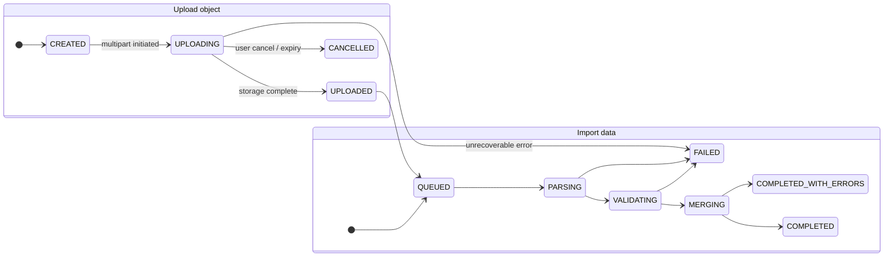
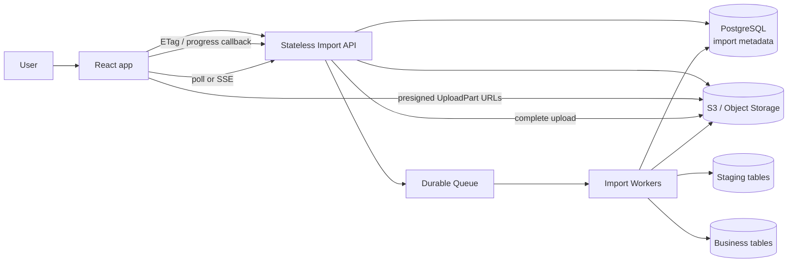
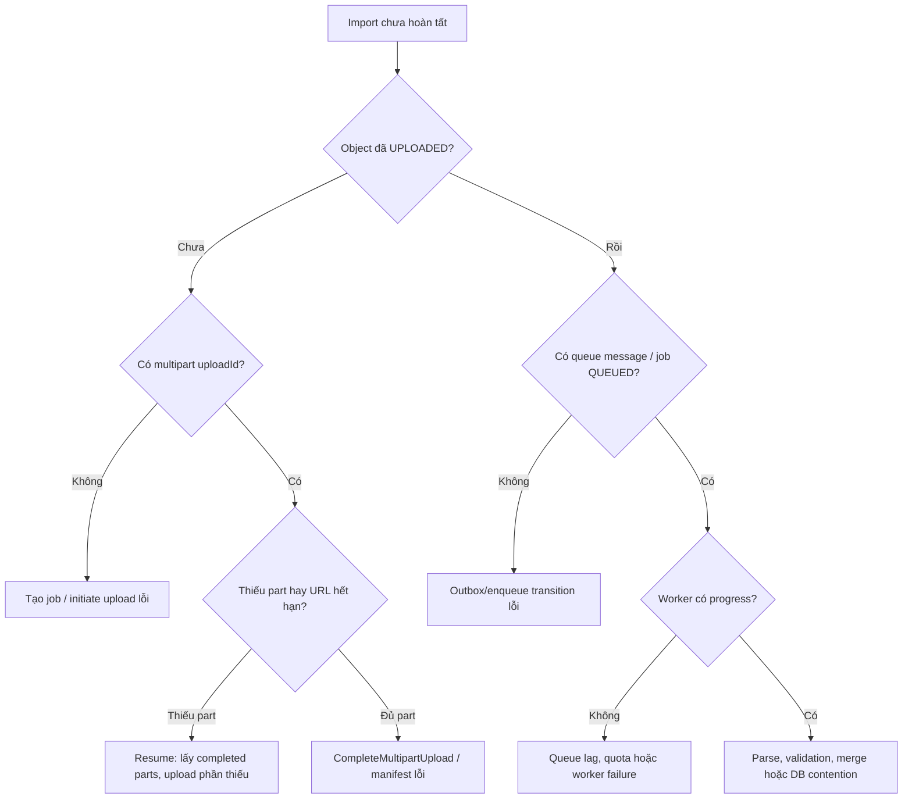
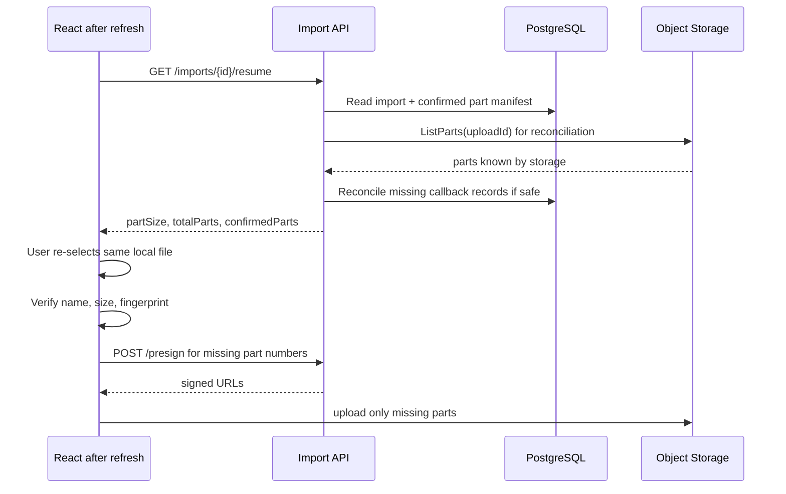
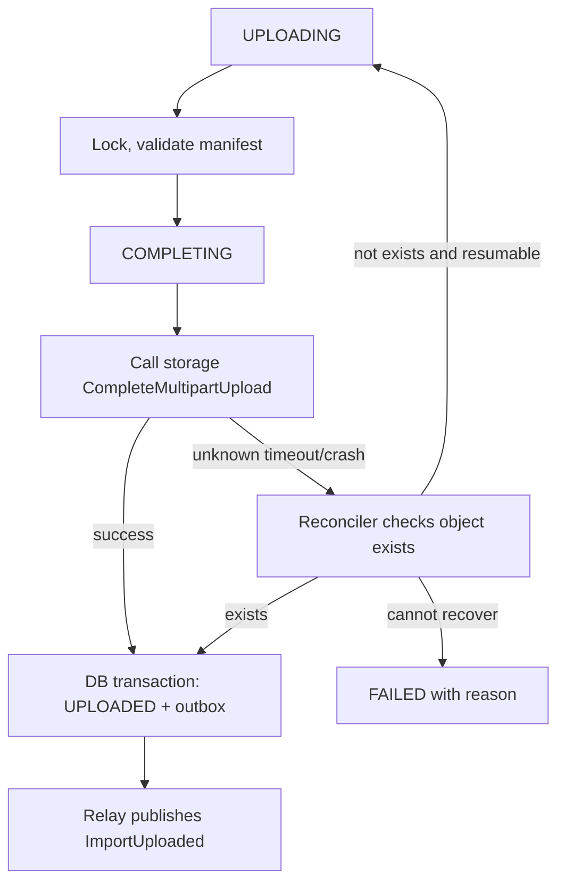
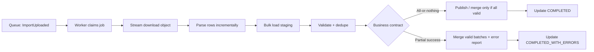
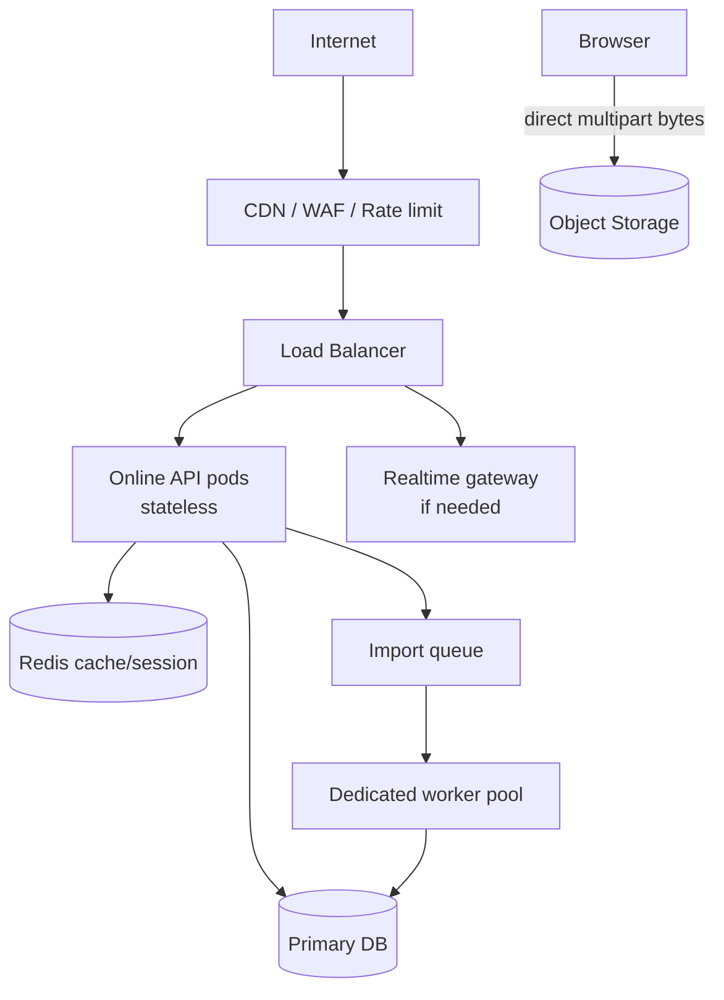

## Câu hỏi

> **Hệ thống có 1 triệu users đang online. Một user upload file Excel chứa 1 triệu records. Hãy thiết kế luồng từ React frontend, backend, database đến infrastructure: upload không đứt giữa chừng, resume được, import không làm nghẽn API, dữ liệu không duplicate và concurrent imports không làm sai dữ liệu.**

---

## Dành cho level

`Senior` `Staff`

Ở mức Senior, interviewer kỳ vọng bạn tách đúng hai workload: request phục vụ user online và một batch import nặng. Bạn cần giải thích được vì sao React không parse/gửi 1 triệu dòng JSON qua API, vì sao file đi thẳng vào object storage, và vì sao import phải chạy qua queue + worker thay vì giữ HTTP request mở. Câu trả lời phải có upload state, retry/resume, idempotency, transaction boundary và cách merge dữ liệu an toàn.

Ở mức Staff, câu trả lời cần thêm product contract, capacity isolation giữa tenant, data-retention/security, operational SLO, giới hạn chi phí, chiến lược recovery và cách rollout pipeline không làm hỏng production traffic.

Điểm cộng: nói rõ **atomicity của cả file là một business decision**, không phải mặc định kỹ thuật; đồng thời phân biệt idempotency của request, multipart upload, worker message và row dữ liệu đích.

---

## Cốt lõi cần nhớ

**React chỉ điều phối upload, không phải nơi xử lý 1 triệu records.** Browser cắt logic `File` thành part, upload trực tiếp tới object storage bằng presigned URL, rồi hiển thị tiến độ của một import job.

**File upload và data import là hai state machine khác nhau.** Upload xong chỉ tạo một object hoàn chỉnh; worker bất đồng bộ mới parse, validate, staging và merge vào database.

**Retry an toàn cần nhiều lớp idempotency.** `Idempotency-Key` bảo vệ tạo import; `(import_id, part_number)` bảo vệ part; unique business key/conditional upsert bảo vệ dữ liệu đích; worker phải chịu được queue redelivery.

**Không giữ transaction hay database lock trong lúc upload hoặc parse Excel.** Đưa file vào staging, xử lý theo batch ngắn, và chỉ lock đúng invariant cần bảo vệ.

---

## Câu trả lời mẫu

> “Tôi sẽ tách bài toán thành online traffic và bulk import. React không gửi file Excel một triệu dòng vào API rồi chờ xử lý, vì request sẽ dài, app server thành bottleneck và browser dễ treo nếu parse toàn bộ file. Khi user chọn file, frontend gọi API tạo `import job` với idempotency key. Backend lưu metadata, khởi tạo multipart upload trên object storage và trả về `importId`, `partSize` cùng presigned URL theo batch. Browser dùng `File.slice()` để lấy từng vùng byte, upload 3–5 parts song song trực tiếp lên storage, lưu ETag của part và có thể resume sau refresh bằng cách hỏi backend những part nào đã xác nhận. Khi đủ parts, backend tự gọi Complete Multipart Upload; chỉ lúc đó object hoàn chỉnh mới tồn tại và job được đưa vào queue.
>
> Worker đọc file theo stream, không nạp một triệu rows vào RAM. Nó load dữ liệu vào staging table, validate và deduplicate, rồi merge theo batch ngắn với unique constraint và upsert có điều kiện. Tôi hỏi Product trước: cần all-or-nothing hay chấp nhận import một phần. Nếu cần all-or-nothing, dữ liệu chỉ được public sau validation và một commit/swap hợp lý; nếu chấp nhận partial success, mỗi batch có checkpoint và file lỗi theo dòng. Tôi dùng idempotency key cho create request, manifest part với `(import_id, part_number)` cho upload, và business key ở bảng đích để worker retry không tạo duplicate. API phục vụ user online vẫn stateless và autoscale riêng; object storage hấp thụ bandwidth, queue hấp thụ spike, worker autoscale theo lag. Tôi theo dõi queue age, import duration, error rows, DB lock wait và chi phí incomplete multipart uploads; đồng thời có lifecycle abort cho upload dang dở.”

---

## Phân tích chi tiết

### 1. Chốt requirement trước khi chọn công nghệ

Câu “1 triệu users online, upload Excel 1 triệu records” thiếu vài thông tin quyết định thiết kế. Không cần chờ đủ mọi số mới bắt đầu, nhưng cần nêu rõ assumption để interviewer thấy bạn không chọn architecture theo cảm tính.

| Câu hỏi cần chốt | Vì sao quan trọng | Baseline trong bài |
| --- | --- | --- |
| 1 triệu users là concurrent WebSocket connections, active sessions hay requests/second? | 1 triệu kết nối không đồng nghĩa 1 triệu API requests đồng thời | API traffic và import worker được scale/capacity độc lập |
| File lớn bao nhiêu MB/GB? Excel hay CSV? | Quyết định multipart, part size, memory và parser | Multipart từ khoảng 100 MB; khuyến khích CSV cho batch lớn |
| Một row lỗi có làm fail toàn file? | Quyết định atomicity, UX và staging strategy | Hỗ trợ cả strict và partial, Product chọn contract |
| Record có business key nào? | Cần cho dedupe, upsert, conflict resolution | `(tenant_id, external_id)` là key minh họa |
| File cùng tenant có được chạy song song? | Quyết định quota, fairness và concurrency policy | Có, nhưng giới hạn tenant/worker; conflict được DB bảo vệ |
| Bao lâu user cần thấy kết quả? | Quyết định queue SLO, poll/SSE và capacity | Upload hiển thị realtime; import là async, trạng thái observable |
| File/data được giữ bao lâu? | Quyết định lifecycle, audit, privacy và cost | Raw file có retention rõ ràng, không giữ vô hạn |

<Callout type="info" title="Một điều cần nói ngay">
1 triệu users online không làm một file import “nhanh hơn” hay “chậm hơn” trực tiếp. Nó yêu cầu **isolation**: bulk import không được chiếm CPU, connection pool, bandwidth hay database lock làm request bình thường của 1 triệu users bị ảnh hưởng.
</Callout>

### 2. Hai state machine: upload object và import data

Một lỗi hay gặp là gọi toàn bộ flow là “upload”. Thực tế có hai quá trình độc lập:



- `UPLOADED` chỉ có nghĩa object file đã ghép xong trên S3/MinIO/GCS.
- `COMPLETED` mới có nghĩa business data đã được import.
- User có thể đóng browser sau `UPLOADED`; worker vẫn tiếp tục vì trạng thái nằm ở backend, không nằm trong tab React.

### 3. Kiến trúc end-to-end



| Thành phần | Trách nhiệm | Không nên làm |
| --- | --- | --- |
| React | Chọn file, cắt byte range, giới hạn concurrency, retry/resume, hiển thị job | Parse/render toàn bộ 1 triệu rows trên main thread; gửi file qua JSON |
| Import API | Authorization, quota, tạo job, presign, confirm/complete, trả status | Proxy từng byte file qua app server khi không cần scan inline |
| Object storage | Lưu part tạm và object hoàn chỉnh | Lưu business status hoặc thay database làm source of truth |
| Queue | Durable handoff từ upload sang xử lý, hấp thụ burst | Đảm bảo exactly-once hoặc thay idempotency database |
| Worker | Stream parse, validate, staging, merge, checkpoint, error report | Giữ transaction mở khi đọc file hoặc gọi external service |
| PostgreSQL | Metadata, idempotency, state transition, staging và source of truth | Lưu binary Excel lớn bằng BLOB như default |

### 4. Triage nhanh: lỗi đang ở upload hay import?

Trước khi debug sâu, cần xác định user đang mắc ở chặng nào.



| Triệu chứng | Nguyên nhân thường gặp | Kiểm tra ngay | Hướng xử lý |
| --- | --- | --- | --- |
| Refresh trang, progress về 0% | FE chỉ giữ state trong memory | Có `importId` trong IndexedDB/local storage không? | Gọi resume API, user chọn lại file nếu browser không còn `File` handle |
| Part 2 xong, part 1 lỗi | Network/URL part 1 lỗi | `import_parts` và storage part list | Retry part 1; giữ part 2, không restart file |
| Upload xong nhưng job không chạy | Complete thành công nhưng enqueue bị mất | `upload_status=UPLOADED`, không có queue/outbox record | Transactional outbox hoặc reconciliation enqueue |
| Worker OOM | Parser load cả workbook vào RAM | Worker RSS/heap và file type | Streaming parser/convert CSV, row batch nhỏ |
| Import chạy rất chậm, API cũng chậm | Worker bão hòa DB/I/O hoặc pool chung | queue lag, DB CPU, lock wait, pool pending | Throttle worker, tách pool/quota, optimize staging/merge |
| Rerun tạo row trùng | Không có unique business key/idempotent write | duplicate key và `processed_job` state | Unique constraint + upsert/checkpoint |
| Resume báo xong part nhưng complete fail | DB manifest và storage không khớp | ETag/part number từ DB và `ListParts` | Reconcile, chỉ complete bằng manifest đã xác nhận |

### 5. Multipart upload: ai cắt part, ai giữ state?

Browser cắt **logic** file bằng `File.slice(start, end)`. Điều này không tạo ra 10 file mới trên ổ đĩa; nó tạo `Blob` đại diện cho một range byte của file gốc.

Ví dụ `customer.xlsx` 100 MiB, `partSize = 10 MiB`:

```text
Part 1: byte 0 MiB  → 10 MiB
Part 2: byte 10 MiB → 20 MiB
...
Part 10: byte 90 MiB → 100 MiB
```

Với Amazon S3, multipart upload có part number từ `1` đến `10,000`; các part có thể upload độc lập và không theo thứ tự. Mỗi part, trừ part cuối, có kích thước tối thiểu 5 MiB. Backend phải chọn part size sao cho file không vượt 10,000 parts; không để React tự chọn bừa.

Một công thức baseline:

```text
partSize = max(10 MiB, ceil(fileSize / 9,500))
partSize = roundUpToMiB(partSize)
```

Dùng `9,500` thay vì sát `10,000` để còn margin; giới hạn chính xác và part size cần được kiểm tra theo provider đang dùng. Với file nhỏ, single PUT đơn giản hơn multipart.

#### Sequence: tạo upload rồi upload parts song song

```mermaid
sequenceDiagram
    participant FE as React / Browser
    participant API as Import API
    participant DB as PostgreSQL
    participant S3 as Object Storage

    FE->>API: POST /imports + Idempotency-Key
    API->>DB: Insert import status=CREATED
    API->>S3: CreateMultipartUpload(storageKey)
    S3-->>API: uploadId
    API->>DB: Save uploadId, partSize, totalParts
    API-->>FE: importId, partSize

    loop Request a small URL batch
        FE->>API: POST /imports/{id}/presign {partNumbers}
        API-->>FE: one signed URL per part
    end

    par limited concurrency, e.g. 3 parts
        FE->>FE: file.slice(range for part 1)
        FE->>S3: PUT UploadPart(uploadId, partNumber=1)
        S3-->>FE: ETag-1
        FE->>API: POST /imports/{id}/parts {partNumber:1, etag:ETag-1}
        API->>DB: Upsert completed part 1
    and
        FE->>FE: file.slice(range for part 2)
        FE->>S3: PUT UploadPart(uploadId, partNumber=2)
        S3-->>FE: ETag-2
        FE->>API: POST /imports/{id}/parts {partNumber:2, etag:ETag-2}
        API->>DB: Upsert completed part 2
    end

    FE->>API: POST /imports/{id}/complete
    API->>DB: Lock import; verify every expected part
    API->>S3: CompleteMultipartUpload(uploadId, ordered ETags)
    S3-->>API: completed object
    API->>DB: status=UPLOADED + outbox event
```

Một presigned URL chỉ ký cho một operation cụ thể, gồm `uploadId` và `partNumber`, vì vậy **mỗi part có URL riêng**. Nhưng FE không phải xin một URL rồi upload xong mới xin URL tiếp theo. Thường xin 3–20 URLs theo batch, song song giới hạn 3–5 PUTs tùy network/memory, rồi xin tiếp. Nó giảm response URL khổng lồ với file nhiều part và xử lý tốt URL hết hạn.

<Callout type="warn" title="Không gửi ETag đi mà quên CORS">
Với direct upload từ browser, bucket CORS phải cho phép `PUT` từ origin hợp lệ và expose header `ETag`; nếu không `fetch()` upload thành công nhưng JavaScript không đọc được ETag để confirm part. Không dùng CORS wildcard cho bucket production có dữ liệu nhạy cảm.
</Callout>

#### React: upload part có giới hạn concurrency

Đây là ví dụ minh họa; production cần thêm progress, cancellation và error mapping.

```tsx
const MAX_PARALLEL_PARTS = 4;

type UploadPart = {
  partNumber: number;
  url: string;
};

async function uploadOnePart(
  file: File,
  part: UploadPart,
  partSize: number,
  importId: string,
) {
  const start = (part.partNumber - 1) * partSize;
  const end = Math.min(start + partSize, file.size);
  const body = file.slice(start, end);

  const response = await fetch(part.url, {
    method: 'PUT',
    body,
  });

  if (!response.ok) {
    throw new Error(`Part ${part.partNumber} failed: ${response.status}`);
  }

  const etag = response.headers.get('ETag');
  if (!etag) throw new Error('Storage response did not expose ETag');

  await api.confirmPart(importId, {
    partNumber: part.partNumber,
    etag,
    size: body.size,
  });
}

async function runWithLimit<T>(
  items: T[],
  limit: number,
  task: (item: T) => Promise<void>,
) {
  const pending = [...items];
  const workers = Array.from({ length: limit }, async () => {
    while (pending.length > 0) {
      const item = pending.shift();
      if (item) await task(item);
    }
  });
  await Promise.all(workers);
}

async function uploadMissingParts(
  file: File,
  parts: UploadPart[],
  partSize: number,
  importId: string,
) {
  await runWithLimit(parts, MAX_PARALLEL_PARTS, (part) =>
    uploadOnePart(file, part, partSize, importId),
  );
}
```

Không dùng `Promise.all(parts.map(upload))` cho hàng nghìn parts: browser mở quá nhiều request, tốn memory và có thể làm network các tab khác kém đi. Concurrency limit là một policy cần tune theo part size, client network và upload SLO; `4` chỉ là số minh họa.

### 6. Database metadata: lưu manifest, không lưu binary file

Object storage là nơi chứa binary. PostgreSQL giữ metadata, ownership, state transition, idempotency và manifest ETag cần để complete/resume.

```sql
CREATE TABLE import_jobs (
    id                  UUID PRIMARY KEY,
    tenant_id           UUID NOT NULL,
    created_by          UUID NOT NULL,
    idempotency_key     TEXT NOT NULL,

    original_file_name  TEXT NOT NULL,
    content_type        TEXT NOT NULL,
    declared_file_size  BIGINT NOT NULL CHECK (declared_file_size > 0),
    file_fingerprint    TEXT,
    object_key          TEXT NOT NULL UNIQUE,

    storage_provider    TEXT NOT NULL,
    multipart_upload_id TEXT,
    part_size_bytes     BIGINT NOT NULL,
    total_parts         INTEGER NOT NULL,

    upload_status       TEXT NOT NULL,
    import_status       TEXT NOT NULL,
    processed_rows      BIGINT NOT NULL DEFAULT 0,
    valid_rows          BIGINT NOT NULL DEFAULT 0,
    invalid_rows        BIGINT NOT NULL DEFAULT 0,
    error_report_key    TEXT,

    version             BIGINT NOT NULL DEFAULT 0,
    created_at          TIMESTAMPTZ NOT NULL DEFAULT now(),
    uploaded_at         TIMESTAMPTZ,
    expires_at          TIMESTAMPTZ,
    completed_at        TIMESTAMPTZ,

    UNIQUE (tenant_id, created_by, idempotency_key)
);

CREATE TABLE import_upload_parts (
    import_id       UUID NOT NULL REFERENCES import_jobs(id) ON DELETE CASCADE,
    part_number     INTEGER NOT NULL CHECK (part_number BETWEEN 1 AND 10000),
    etag            TEXT NOT NULL,
    size_bytes      BIGINT NOT NULL CHECK (size_bytes > 0),
    checksum        TEXT,
    confirmed_at    TIMESTAMPTZ NOT NULL DEFAULT now(),

    PRIMARY KEY (import_id, part_number)
);

CREATE INDEX idx_import_jobs_expiring_upload
ON import_jobs (expires_at)
WHERE upload_status = 'UPLOADING';
```

`import_upload_parts` làm manifest do backend sở hữu. React báo `ETag` sau khi PUT, backend upsert `(import_id, part_number)` nên callback retry an toàn. Khi upload cùng part number lại, object storage thay part cũ bằng part mới và trả ETag mới; backend phải ghi đè ETag cũ.

```sql
INSERT INTO import_upload_parts (import_id, part_number, etag, size_bytes)
VALUES (:import_id, :part_number, :etag, :size_bytes)
ON CONFLICT (import_id, part_number)
DO UPDATE SET
    etag = EXCLUDED.etag,
    size_bytes = EXCLUDED.size_bytes,
    confirmed_at = now();
```

`uploaded_bytes` có thể là cache phục vụ UI, nhưng **không được** dùng giá trị FE báo làm điều kiện complete. Backend phải kiểm tra đủ các part number dự kiến và ETag trước khi gọi storage complete.

#### Idempotency không phải một unique key duy nhất

| Boundary | Duplicate thực tế | Cách xử lý |
| --- | --- | --- |
| `POST /imports` | Browser/API gateway retry vì timeout | `UNIQUE(tenant_id, created_by, idempotency_key)`, trả job cũ |
| `POST /parts` | FE retry callback hoặc upload lại cùng part | PK `(import_id, part_number)`, upsert ETag mới nhất |
| `POST /complete` | User double click, FE retry timeout | State transition/row lock; complete chỉ một winner |
| Queue message | Worker crash sau DB commit trước ack | Job checkpoint + idempotent merge |
| Business row | Cùng record có mặt trong file/re-run | unique business key + upsert/version rule |

Đây là lý do câu “em dùng idempotent” chưa đủ trong interview. Hãy luôn nói **idempotent ở boundary nào, key nào, và duplicate được xử lý ra sao**.

### 7. Resume sau refresh hoặc mất mạng

Server không thể tự đọc lại local file của user. Sau refresh, React có thể nhớ `importId`, file name, size, part size và fingerprint trong IndexedDB/local storage, nhưng browser thường yêu cầu user chọn lại file để có `File` object mới.

```text
User upload part 1, 2, 3, 5 thành công
Part 4 đang bay thì mất mạng
User refresh

React nhớ importId=imp_123
→ GET /imports/imp_123/resume
→ backend trả confirmed parts: 1, 2, 3, 5
→ user chọn lại customer.xlsx
→ FE verify file identity
→ FE chỉ upload 4, 6, 7, 8, 9, 10
```



`ListParts` hữu ích vì có failure window sau:

```text
S3 đã nhận part 4 và trả ETag
→ browser/network chết trước POST /parts callback tới API
→ DB nói thiếu part 4, storage thực tế đã có part 4
```

Backend dùng `ListParts` để **reconcile** metadata. Tuy nhiên manifest database vẫn phải được duy trì có chủ đích: storage listing có pagination (S3 trả tối đa 1,000 parts/lần) và không phải nơi để application phó mặc trạng thái workflow. Sau reconcile, backend dùng manifest đã kiểm tra để complete.

File fingerprint không nên chỉ là tên file. Baseline nhẹ có thể gồm:

```text
file name + byte size + lastModified + hash vài MiB đầu/cuối
```

Hash toàn file chặt chẽ hơn nhưng tốn CPU/I/O trên browser. Nếu import có compliance/security cao, yêu cầu full checksum hoặc server-side checksum verification thay vì chỉ dựa vào fingerprint UX.

#### Part 2 xong nhưng part 1 lỗi

Multipart không yêu cầu thứ tự upload. Trạng thái hợp lệ là:

```text
part 1: PENDING / FAILED
part 2: UPLOADED, ETag-2
part 3: UPLOADED, ETag-3
...
import upload_status: UPLOADING
```

React retry riêng part 1. Không gọi complete cho đến khi backend có đủ part `1..totalParts`. Nếu user cancel hoặc retry vượt ngân sách, backend gọi `AbortMultipartUpload`; object storage xoá parts tạm. Nếu bỏ quên incomplete uploads, provider vẫn tính phí storage cho các part đã upload, nên cần cả cancel API lẫn lifecycle cleanup theo thời hạn.

### 8. Complete upload: ngăn double complete và lost enqueue

`POST /imports/{id}/complete` phải idempotent và serialized. Một implementation ý tưởng:

```sql
BEGIN;

SELECT *
FROM import_jobs
WHERE id = :import_id
FOR UPDATE;

-- Verify caller owns this import and status is UPLOADING.
-- Verify count + every expected part number exists in import_upload_parts.
-- Build an ordered {partNumber, etag} manifest.

UPDATE import_jobs
SET upload_status = 'COMPLETING', version = version + 1
WHERE id = :import_id
  AND upload_status = 'UPLOADING';

COMMIT;
```

Sau đó backend gọi `CompleteMultipartUpload`. Không nên giữ database transaction/row lock trong cả network call nếu provider latency không chắc chắn. Thay vào đó:

1. Lock ngắn, validate và chuyển sang `COMPLETING` với compare-and-set.
2. Gọi storage complete bằng manifest ordered theo `part_number`.
3. Lock ngắn lần nữa, ghi `UPLOADED` và outbox row trong cùng DB transaction.
4. Outbox relay gửi `ImportUploaded(importId)` vào durable queue.

Nếu process chết ở giữa, reconciliation worker tìm jobs `COMPLETING` quá hạn, kiểm tra `HeadObject`/storage state rồi repair transition. Đây là cùng tư duy xử lý dual-write: storage complete và DB update không có shared distributed transaction.



<Callout type="warn" title="Đừng publish queue message bằng fire-and-forget sau DB update">
Nếu DB đổi sang `UPLOADED` rồi process chết trước khi enqueue, file hoàn chỉnh nhưng không worker nào import. Ghi outbox event cùng transaction với state `UPLOADED`; relay có thể publish lại an toàn vì consumer idempotent. Xem thêm [CQRS với Outbox, at-least-once và projection idempotent](/system-design/04-cqrs) cho failure window này.
</Callout>

### 9. React UX: upload progress khác processing progress

UI nên hiển thị hai thanh progress khác nhau:

```text
Upload file:       72%  (72 MiB / 100 MiB)     ← bytes/parts đã confirm
Đang import data:  43%  (430,000 / 1,000,000)  ← worker checkpoint
```

Không dùng percent import như một lời hứa quá chính xác nếu phase validation/merge có cost khác parse. Tối thiểu hiển thị phase rõ ràng:

```text
Uploading → Verifying upload → Waiting in queue → Reading file
→ Validating rows → Importing valid rows → Completed / Completed with errors
```

React Query polling là đủ để bắt đầu; SSE/WebSocket phù hợp khi muốn update mượt hơn. Dù dùng transport nào, status API phải là source of truth để refresh/reconnect không mất state.

```tsx
const { data: job } = useQuery({
  queryKey: ['import-job', importId],
  queryFn: () => api.getImport(importId),
  refetchInterval: (current) =>
    ['COMPLETED', 'FAILED', 'CANCELLED'].includes(current?.importStatus ?? '')
      ? false
      : 1_500,
});
```

Nếu cần preview, chỉ parse header hoặc vài chục rows đầu trong Web Worker. Không đưa 1 triệu rows vào React state hay render bảng lỗi 1 triệu dòng. Error list cần pagination/filter phía server và virtualized rendering ở client.

### 10. Worker import pipeline: stream → staging → validate → merge

Sau khi upload hoàn chỉnh, worker nhận `importId`, tải object qua stream và xử lý độc lập với web request.



#### Vì sao không parse toàn file trong app memory?

Một Excel `.xlsx` là ZIP chứa XML. File 100 MB có thể phình RAM nhiều lần khi parser materialize workbook/cell strings. Nếu worker đọc cả file thành object graph, chỉ vài concurrent imports có thể OOM. Cần:

- parser hỗ trợ streaming/SAX nếu thư viện và file format cho phép;
- row buffer hữu hạn, ví dụ 1,000–10,000 rows tùy kích thước row;
- giới hạn số import workers/processes theo RAM/CPU thực tế;
- time limit, file-size limit, sheet/row/column limit chống zip bomb và malformed file;
- cân nhắc yêu cầu CSV cho bulk import lớn: dễ stream, dễ `COPY`, ít memory hơn Excel.

`Excel` là format tiện cho người dùng, không phải format ingest hiệu năng tối ưu. Senior answer nên nói trade-off này thay vì hứa parser nào cũng stream hoàn hảo.

#### Staging table tách file parsing khỏi business write

Ví dụ input import customer:

```sql
CREATE UNLOGGED TABLE customer_import_staging (
    import_id      UUID NOT NULL,
    row_number     BIGINT NOT NULL,
    external_id    TEXT,
    name           TEXT,
    email          TEXT,
    source_version TIMESTAMPTZ,
    validation_err TEXT,
    merged_at      TIMESTAMPTZ,
    PRIMARY KEY (import_id, row_number)
);

CREATE INDEX idx_customer_import_staging_valid
ON customer_import_staging (import_id, row_number)
WHERE validation_err IS NULL AND merged_at IS NULL;
```

Worker bulk-load vào staging bằng `COPY`/batch insert, không upsert từng row business qua ORM. Sau đó validate syntax, required field, duplicate in-file, ownership và business rule.

```sql
UPDATE customer_import_staging
SET validation_err = 'INVALID_EMAIL'
WHERE import_id = :import_id
  AND email IS NOT NULL
  AND email !~ '^[^@[:space:]]+@[^@[:space:]]+\.[^@[:space:]]+$';

UPDATE customer_import_staging s
SET validation_err = 'DUPLICATE_EXTERNAL_ID_IN_FILE'
FROM (
    SELECT import_id, external_id
    FROM customer_import_staging
    WHERE import_id = :import_id
      AND external_id IS NOT NULL
    GROUP BY import_id, external_id
    HAVING COUNT(*) > 1
) duplicates
WHERE s.import_id = duplicates.import_id
  AND s.external_id = duplicates.external_id;
```

Validation regex chỉ minh họa; email/business validation thật cần contract rõ hơn. Điều quan trọng là lỗi theo row có thể xuất report, còn business tables chưa bị thay đổi trong lúc file còn đang được đọc.

### 11. Atomicity: cả file hay từng batch là quyết định Product

Đây là câu cần hỏi interviewer, không tự quyết.

| Contract | Ý nghĩa user thấy | Cách làm | Trade-off |
| --- | --- | --- | --- |
| Strict / all-or-nothing | Có một row lỗi thì không record nào của file xuất hiện | Validate staging trước; chỉ merge/publish khi toàn file đạt yêu cầu | Feedback chậm hơn, cần staging capacity |
| Partial success | Row hợp lệ xuất hiện, row lỗi có report | Merge valid rows theo batch; giữ checkpoint/error rows | User phải hiểu file được xử lý một phần |
| Replace snapshot | File là state hoàn chỉnh của một partition/tenant | Build shadow data, validate, atomic swap/pointer switch | Phức tạp nhưng có read consistency mạnh |

#### Strict mode không có nghĩa giữ một transaction 1 triệu rows

Một transaction rất dài cho cả parse + merge dễ làm WAL, lock duration và rollback cost tăng mạnh. Các lựa chọn tốt hơn:

1. **Staging trước, merge sau**: tất cả row được validate ở staging. Với data nhỏ/vừa, merge trong một transaction ngắn nếu benchmark chứng minh ổn.
2. **Shadow version**: ghi dữ liệu import vào `dataset_version = new_version`, validate đầy đủ, sau đó một transaction nhỏ đổi active version/pointer. Reader chỉ đọc active version.
3. **Partition swap**: nếu import thay nguyên một partition, build partition mới offline rồi attach/detach nhanh.

Mục tiêu business là “reader không thấy dữ liệu nửa file”, không bắt buộc cách làm phải là một transaction khổng lồ.

#### Partial mode: checkpoint theo batch

Với partial success, mỗi merge batch cần transaction ngắn và checkpoint durable:

```sql
INSERT INTO customers (
    tenant_id,
    external_id,
    name,
    email,
    source_updated_at
)
SELECT
    :tenant_id,
    external_id,
    name,
    email,
    source_version
FROM customer_import_staging
WHERE import_id = :import_id
  AND validation_err IS NULL
  AND merged_at IS NULL
ORDER BY external_id
LIMIT :batch_size
ON CONFLICT (tenant_id, external_id)
DO UPDATE SET
    name = EXCLUDED.name,
    email = EXCLUDED.email,
    source_updated_at = EXCLUDED.source_updated_at
WHERE customers.source_updated_at IS NULL
   OR customers.source_updated_at <= EXCLUDED.source_updated_at;
```

Trong **cùng transaction**, đánh dấu chính xác staging rows của batch đã xử lý. Đừng dùng `OFFSET` cho checkpoint của table đang thay đổi; dùng stable key/range hoặc `merged_at IS NULL` với thứ tự xác định.

```sql
UPDATE customer_import_staging
SET merged_at = now()
WHERE import_id = :import_id
  AND row_number = ANY(:merged_row_numbers);
```

Mỗi retry message sẽ thấy `merged_at`/unique constraint và không chạy effect hai lần. [Merge 1 triệu bản ghi vào bảng 1 tỷ rows](/java/02-bulk-upsert-billion-rows) phân tích sâu hơn staging, batching, index và lock contention.

### 12. Concurrency: idempotency, optimistic lock và pessimistic lock giải bài toán khác nhau

Ba khái niệm hay bị trộn vào một câu trả lời:

| Khái niệm | Nó ngăn điều gì? | Ví dụ trong import |
| --- | --- | --- |
| Idempotency | Cùng command/message chạy lại tạo side effect lặp | Queue redeliver import job không insert duplicate customer |
| Optimistic concurrency | Không ghi đè state đã thay đổi từ lúc đọc | Import có `source_version` cũ không overwrite người vừa sửa customer |
| Pessimistic lock | Serialize access vào resource đang tranh chấp | Claim đúng một import job hoặc update quota hot row ngắn |

#### Mặc định: database constraint là hàng rào cuối

```sql
CREATE UNIQUE INDEX uq_customers_tenant_external_id
ON customers (tenant_id, external_id);
```

Application check “record này chưa tồn tại” không đủ: hai workers có thể cùng check trước khi insert. Unique constraint và `ON CONFLICT` mới bảo vệ được giữa nhiều pods/processes/scripts.

#### Optimistic rule cho record bị user và import cùng sửa

Nếu file có `source_version`/`updated_at` từ hệ thống nguồn, import chỉ update nếu input không cũ hơn row hiện tại. Đây là policy phải được Product đồng ý: “file thắng”, “UI thắng”, “last write wins” hay “report conflict” là các semantics khác nhau.

```sql
UPDATE customers
SET name = :name,
    email = :email,
    source_updated_at = :source_updated_at,
    version = version + 1
WHERE tenant_id = :tenant_id
  AND external_id = :external_id
  AND version = :expected_version;
```

Affected rows `0` nghĩa là stale/conflict; worker có thể re-read rồi apply policy, hoặc ghi row conflict vào error report. Không retry mù nếu retry có thể ghi đè chỉnh sửa mới của user.

#### Pessimistic lock chỉ cho critical section ngắn

Dùng `SELECT ... FOR UPDATE` để claim một job hoặc cập nhật quota theo tenant là hợp lý nếu transaction chỉ đọc/kiểm tra/ghi DB trong vài milliseconds. Không lock `import_jobs` trong 30 phút worker parse file, và không lock tất cả customer rows của một file.

```sql
WITH candidate AS (
    SELECT id
    FROM import_jobs
    WHERE import_status = 'QUEUED'
    ORDER BY created_at
    FOR UPDATE SKIP LOCKED
    LIMIT 1
)
UPDATE import_jobs j
SET import_status = 'PARSING',
    version = version + 1
FROM candidate
WHERE j.id = candidate.id
RETURNING j.*;
```

`SKIP LOCKED` phù hợp nhiều worker claim **những job khác nhau**. Nó không phù hợp nếu API cần đọc chính xác một resource cụ thể rồi âm thầm “skip” vì đang lock. Xem [Optimistic Lock vs Pessimistic Lock](/database/03-optimistic-vs-pessimistic-locking) để đi sâu về lost update, retry và deadlock.

#### Tránh deadlock lúc merge

Nếu nhiều workers có thể update cùng business records, lock theo thứ tự ổn định như `(tenant_id, external_id)` và chia range không overlap. Đừng “tăng threads cho nhanh” trên cùng key space: throughput có thể giảm vì lock wait, retry và deadlock.

### 13. Scale và isolation cho 1 triệu users online

Không có một con số “1M users cần Kafka”. Cần capacity theo requests/second, WebSocket connection count, object upload bandwidth, import arrival rate, file distribution, parse throughput và database write budget.

#### Tách resource pools



| Loại resource | Isolation nên có |
| --- | --- |
| API pods và worker pods | Deployment/HPA riêng; worker CPU/memory limit riêng |
| Database connection pool | Pool/role quota cho worker; không để batch dùng hết pool API |
| Queue | Separate queue hoặc priority/concurrency budget cho import |
| Tenant | Max concurrent uploads, total file size, worker slots và merge rate theo tenant |
| Object storage | Prefix theo tenant/import, bucket policy, lifecycle, KMS policy |
| Network | Direct upload không đi qua API pods; WAF/rate limit ở control-plane API |

`1 million users` có thể tạo thundering herd ở `POST /imports` hoặc polling status. Mitigation gồm:

- API stateless sau load balancer; session/cache dùng shared store nếu cần.
- CDN cho bundle React; không để static asset qua app tier.
- rate limit theo user/tenant và quota file size ngay khi tạo import.
- status poll interval có jitter/backoff; không poll 1 giây cho mọi completed job.
- SSE/WebSocket gateway scale theo connection, tách khỏi REST API nếu realtime volume lớn.
- direct-to-storage upload để app servers không trở thành bandwidth proxy.

#### Worker autoscaling theo queue age, không chỉ CPU

CPU 20% có thể vẫn là incident nếu worker đang chờ database lock và queue age tăng. Metrics tốt hơn:

```text
queue oldest message age
queued imports by tenant / priority
imports started and completed per minute
rows parsed / validated / merged per second
import end-to-end duration percentiles
worker memory, CPU, restart/OOM count
DB lock wait, transaction duration, I/O, connection pool pending
```

Autoscale theo queue depth/oldest age có guardrail max replicas để không tự tạo DB write storm. Worker concurrency phải được load-test với production-like data; 100 workers không luôn nhanh hơn 10 workers nếu primary DB là bottleneck.

### 14. Security và data governance

Upload endpoint là bề mặt tấn công, không chỉ là UX.

| Risk | Control |
| --- | --- |
| User upload file không thuộc tenant | Authorization ở create/presign/complete/status; object key server-generated |
| User ghi đè object của người khác | Presigned URL chỉ cho key/uploadId/partNumber đúng job, TTL ngắn |
| File quá lớn hoặc part count abuse | Server validate declared size, quota; part size và total parts do server tính |
| Malware / macro / zip bomb | Content-type chỉ là hint; scan/quarantine nếu policy yêu cầu; giới hạn compressed/uncompressed size, sheets, cells, parser timeout |
| PII trong raw file / error report | Encrypt at rest, least-privilege IAM, retention, audit download, redact logs |
| Incomplete parts gây cost | Cancel endpoint + scheduled abort + bucket lifecycle cleanup |
| Parser exploit | Patch library, run worker sandbox/container, no broad network credentials |

Không log raw row data, presigned URLs, ETags kèm PII hay full error payload tùy tiện. `importId`, `tenantId`, correlation ID và aggregate counts thường đủ để trace. Raw file/error report download cần authorization như dữ liệu business bình thường.

### 15. Observability và operation runbook

Mỗi request/job nên mang correlation:

```text
request_id
import_id
idempotency_key hash (không log secret raw)
tenant_id
storage upload_id (masked nếu cần)
worker_id
queue message_id
```

Dashboard tối thiểu:

| Metric | Câu hỏi nó trả lời |
| --- | --- |
| `import_create_rate`, rejected by quota | Có abuse hay tenant spike không? |
| `multipart_active_age`, abort count | Upload nào bị bỏ quên, cost leak ở đâu? |
| part retry/failure rate | Network/presign/CORS/provider có vấn đề? |
| upload completion latency | User chờ upload bao lâu? |
| queue oldest age | File đã upload có được xử lý đúng SLO? |
| parse/validation/merge duration | Bottleneck ở phase nào? |
| rows/s, invalid row ratio | Template/source data có regression? |
| DB lock wait / deadlock / pool pending | Import có làm ảnh hưởng online traffic? |
| duplicate/idempotency hit | Retry có bình thường hay client bug? |
| completed-with-errors / failed reason | Support cần ưu tiên khắc phục gì? |

Một operational flow khi import bị kẹt:

```text
1. Xác định state: UPLOADING, COMPLETING, QUEUED, PARSING, MERGING?
2. Nếu UPLOADING: inspect missing parts/URL expiry, đề nghị resume hoặc abort.
3. Nếu COMPLETING quá lâu: reconciler kiểm tra completed object ở storage.
4. Nếu QUEUED: xem oldest queue age, tenant quota và worker fleet.
5. Nếu PARSING: xem parser timeout/OOM/file safety rejection.
6. Nếu MERGING: xem batch checkpoint, DB lock wait và business conflicts.
7. Không chạy lại file từ đầu trước khi biết idempotency/checkpoint semantics.
```

### 16. CI/CD và test plan: test failure window, không chỉ happy path

| Layer | Case cần test |
| --- | --- |
| React unit/component | File range đúng; part cuối nhỏ hơn; retry UI; cancel; progress; không render all errors |
| API integration | Cùng `Idempotency-Key` concurrent trả cùng job; unauthorized user không presign/resume được |
| Multipart integration | Out-of-order parts; part 1 fail/part 2 success; expired URL; ETag missing; double complete; abort |
| Resume integration | S3 nhận part nhưng callback API mất; refresh + chọn lại file; paginated part list > 1,000 parts |
| Worker integration | File malformed; 1M-row-like streaming; duplicate in file; retry queue after DB commit; error report |
| Database concurrency | Hai imports cùng external ID; stale source version; deadlock/order; unique constraint |
| Load test | Online API traffic + concurrent uploads + worker merge; measure p95/p99 and DB lock/pool impact |
| Security | Oversize, wrong content type, zip bomb fixture, tenant boundary, leaked URL expiry, retention cleanup |
| Disaster drill | Worker kill mid-parse/mid-merge; DB failover; storage timeout at complete; queue redelivery |

Canary deploy workers với concurrency thấp, feature flag import template/version mới, và migration database backward-compatible. Không rollout parser hay merge policy mới cho toàn bộ tenant nếu chưa chạy shadow/canary file representative.

### 17. Góc nhìn Staff — biến bulk import thành platform, không thành “cron job khó debug”

<Callout type="info" title="Góc nhìn Staff">
Senior chứng minh một import đúng và recover được. Staff phải bảo đảm mười tenant lớn import đồng thời không biến capability này thành incident chung, không làm chi phí storage/DB tăng không kiểm soát, và Support có công cụ giải thích rõ trạng thái dữ liệu cho khách hàng.
</Callout>

Một câu trả lời Staff nên thêm các điểm sau:

**Product contract theo loại import.** Import master data nhỏ, replace snapshot hàng ngày và migration một lần có consistency/retention/retry policy khác nhau. Không ép mọi use case qua một `status=COMPLETED` mơ hồ.

**Fairness và pricing.** Dùng quota theo bytes, rows, concurrent jobs, worker minutes và error report storage. Một tenant upload file sai lặp lại không được chiếm toàn queue/DB I/O của tenant khác.

**Data ownership.** Xác định source of truth: import ghi thẳng vào record hay tạo change set chờ review? Nếu UI và import cùng sửa customer, policy conflict phải được Product sở hữu, không để engineer tự chọn `last write wins` trong SQL.

**Reconciliation.** Định kỳ kiểm tra job `COMPLETING`, object nhưng thiếu queue event, staging bị orphan, raw object hết retention nhưng job còn running, và count/checksum giữa source file với staging/merge. Reconciliation phải rate-limit và audit, không phải script chạy tay lúc incident.

**Build vs buy.** Managed transfer/import product có thể giảm time-to-market, nhưng cần đánh giá data residency, access control, custom validation, cost egress, retry semantics và khả năng export/exit. Không phải mọi team cần tự xây scheduler/multipart UX.

**SLO và capacity planning.** Đặt SLO riêng cho control plane (create/presign), upload, queue admission và import completion. Capacity plan từ dữ liệu file-size/rows distribution và worst-case retry, không lấy average 1M users làm một con số mơ hồ.

---

## Bẫy thường gặp

❌ **“React đọc Excel rồi gửi từng record JSON lên API.”** → Tại sao sai: browser dễ treo, request cực lớn, app server bị biến thành file proxy/parser và retry phải bắt đầu lại hoặc khó dedupe.
✅ Đúng hơn: React chỉ validate nhẹ và điều phối multipart direct-to-storage; worker backend stream/parse/import bất đồng bộ.

---

❌ **“Multipart là backend tự cắt file.”** → Tại sao sai: nếu file nằm ở browser, backend không có bytes để cắt trừ khi client upload toàn bộ qua backend trước; làm vậy mất lợi ích direct upload.
✅ Đúng hơn: backend tính `partSize`, tạo `uploadId`/presigned URLs; FE dùng `File.slice()` upload từng byte range; backend lưu manifest ETag và gọi complete.

---

❌ **“Part 1 fail thì restart từ đầu vì parts phải theo thứ tự.”** → Tại sao sai: multipart cho phép part upload độc lập, part 2 thành công vẫn dùng được; restart lãng phí bandwidth và UX kém.
✅ Đúng hơn: lưu/đối soát completed parts, retry riêng part lỗi, chỉ complete khi đủ manifest; abort khi cancel/expiry.

---

❌ **“Lưu progress và ETag trong local storage là đã resume được.”** → Tại sao sai: local storage có thể bị xóa/stale và không phản ánh part đã tới storage nhưng callback chưa về backend; browser cũng không tự giữ `File` sau reload một cách tin cậy.
✅ Đúng hơn: backend/DB là workflow source of truth, reconcile với storage khi cần; FE chỉ lưu `importId`/fingerprint để hướng dẫn user chọn lại đúng file.

---

❌ **“Bọc parse + merge 1 triệu rows trong một transaction để atomic.”** → Tại sao sai: transaction dài giữ connection/locks/WAL quá lâu, rollback đắt và có thể làm online traffic nghẽn.
✅ Đúng hơn: staging + validation trước; dùng shadow version/partition swap hoặc merge batch có checkpoint tùy contract all-or-nothing/partial success.

---

❌ **“Dùng Kafka/queue là automatically exactly-once.”** → Tại sao sai: worker có thể commit DB rồi crash trước ack, queue sẽ redeliver; manual replay và timeout cũng tạo duplicate.
✅ Đúng hơn: coi queue là at-least-once, thiết kế idempotent job/row write bằng stable key, constraint, checkpoint và outbox.

---

❌ **“Concurrent import thì `synchronized` service method là đủ.”** → Tại sao sai: `synchronized` chỉ có hiệu lực trong một JVM; nhiều pod, worker, admin script vẫn chạy song song.
✅ Đúng hơn: bảo vệ invariant ở database bằng unique/conditional write/transaction; dùng distributed coordination hoặc queue-by-key chỉ khi cần và hiểu failure semantics.

---

## Câu hỏi follow-up

### 1. Presigned URL có phải một URL dùng cho toàn bộ file không?

Không. Với multipart upload, mỗi `UploadPart` thường được ký riêng với `uploadId` và `partNumber`, nên mỗi part có presigned URL riêng. Backend có thể trả toàn bộ URLs với file nhỏ hoặc trả theo batch/on-demand với file lớn. URL có TTL ngắn; khi hết hạn, FE xin URL mới cho part chưa hoàn tất mà không cần tạo import mới.

### 2. Nếu user đóng browser sau khi upload đủ parts nhưng trước khi gọi complete thì sao?

Upload vẫn là `UPLOADING`; object hoàn chỉnh chưa tồn tại. Có thể cho user resume và bấm hoàn tất, hoặc backend có scheduled reconciler kiểm tra jobs đủ manifest/parts rồi complete theo policy an toàn. Không auto-complete chỉ dựa vào byte count FE báo. Nếu job hết hạn, abort multipart upload để giải phóng part storage.

### 3. Có nên upload file qua backend để virus scan không?

Tùy risk/compliance. Direct-to-storage vẫn có thể an toàn nếu object ban đầu vào quarantine prefix/bucket, worker scan/validate trước khi job được queue/import, và IAM không cho object chưa scan đi vào business flow. Proxy file qua backend chỉ để scan thường tăng bandwidth/cost và tạo bottleneck; chỉ chọn nếu policy hoặc scanner architecture thật sự yêu cầu inline inspection.

### 4. Nếu file có 1 triệu rows nhưng 30% lỗi thì trả lỗi về React thế nào?

Không trả 300,000 lỗi trong HTTP response hay render tất cả trên browser. Lưu error rows/code/reason vào bảng/report object, trả summary (`valid`, `invalid`, top error codes) qua job status, cung cấp paginated error API và file CSV/XLSX lỗi để user tải. Giới hạn error report để tránh chính report trở thành file khổng lồ không dùng được.

### 5. Khi nào dùng optimistic và khi nào dùng pessimistic locking trong import?

Dùng optimistic/conditional update khi conflict hiếm và có thể phát hiện file input stale so với record hiện tại. Dùng pessimistic lock cho critical section DB ngắn, ví dụ nhiều worker claim cùng một queued job hoặc update quota hot row. Không dùng pessimistic lock để “giữ file độc quyền” trong lúc upload/parse vì nó kéo dài transaction và block dây chuyền.

### 6. Worker có cần xử lý Excel trực tiếp không?

Không bắt buộc. Nếu Product kiểm soát template, có thể convert/khuyến khích CSV để stream và bulk load đơn giản hơn. Nếu phải nhận Excel, dùng parser có giới hạn memory/time/sheet/cell và test với file xấu. Không tin extension hay `Content-Type` do browser gửi là validation bảo mật đủ.

### 7. Làm sao đảm bảo job `UPLOADED` luôn được enqueue dù API crash?

Trong transaction chuyển job sang `UPLOADED`, đồng thời insert một outbox row `ImportUploaded`. Relay publish outbox sang queue và đánh dấu đã publish. Relay có thể publish duplicate khi crash, vì vậy worker vẫn cần idempotency. Reconciliation tìm `UPLOADED` thiếu outbox/queue checkpoint để repair.

### 8. Thay vì polling status, có nên dùng WebSocket không?

Có thể dùng SSE/WebSocket để UX realtime hơn, nhưng không thay thế status API durable. Connection có thể rớt, user có thể refresh và event có thể bị miss; client luôn cần fetch trạng thái hiện tại theo `importId` khi reconnect. Với rất nhiều users, realtime gateway phải scale theo connection và tách resource pool khỏi API/worker.

---

## Xem thêm

- [Merge 1 triệu bản ghi vào bảng 1 tỷ rows](/java/02-bulk-upsert-billion-rows) — staging table, batch merge, index và checkpoint cho phase dữ liệu đích.
- [Optimistic Lock vs Pessimistic Lock: chọn thế nào?](/database/03-optimistic-vs-pessimistic-locking) — chọn concurrency primitive theo invariant thay vì dùng lock theo phản xạ.
- [CQRS là gì, khi nào nên dùng và triển khai an toàn như thế nào?](/system-design/04-cqrs) — Transactional Outbox và at-least-once consumer cho handoff từ upload sang worker.
- [Scale từ 1,000 lên 50,000 users](/system-design/03-scale-1k-to-50k-users) — tư duy tách bottleneck, autoscale và backpressure áp dụng trực tiếp cho import worker.
- [SQL vs NoSQL: chọn database như thế nào?](/database/01-sql-vs-nosql) — chọn source of truth, index và storage theo consistency/access pattern.
