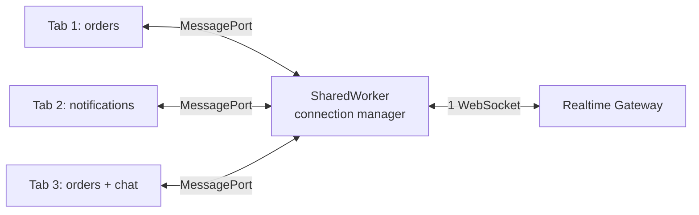
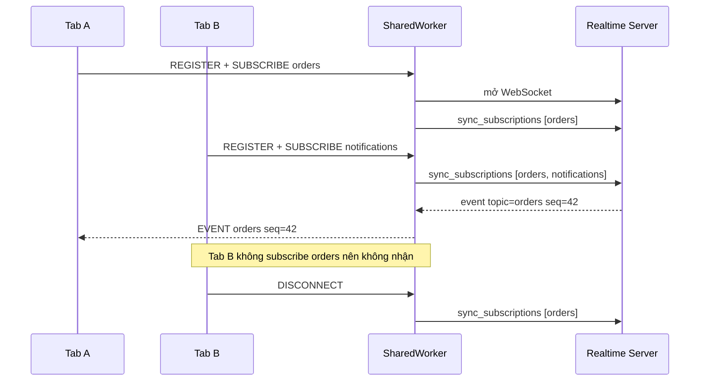
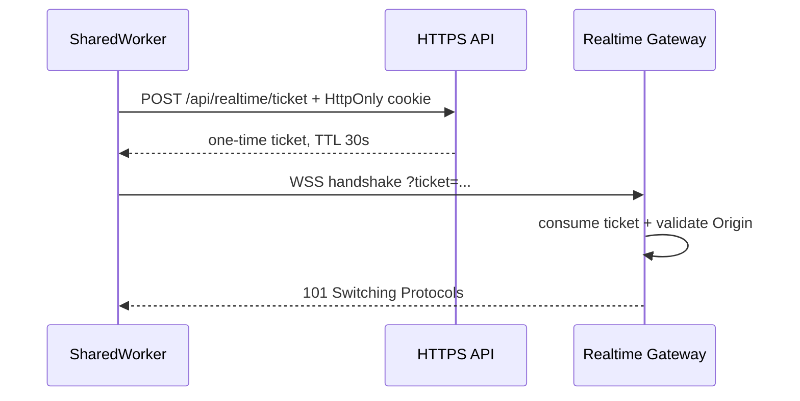
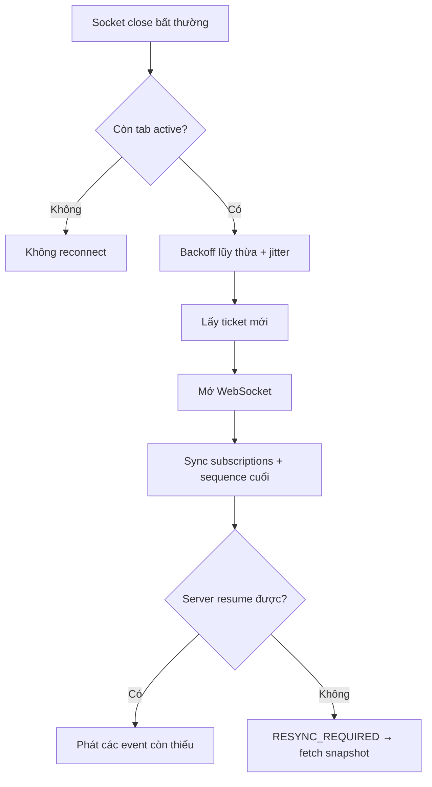

## Câu hỏi

> **Một user có thể mở 5-10 tab của cùng ứng dụng. Nếu mỗi tab tự tạo WebSocket, server phải giữ 5-10 connections cho cùng một user và mỗi event bị gửi lặp lại. Bạn sẽ dùng SharedWorker để các tab dùng chung một WebSocket như thế nào? Hãy xử lý cả subscription, authentication, reconnect, tab đóng đột ngột và browser không hỗ trợ SharedWorker.**

---

## Dành cho level

<Tabs items={["Mid", "Senior"]}>

<Tab value="Mid">

Interviewer kỳ vọng bạn phân biệt được `SharedWorker`, `DedicatedWorker`, `ServiceWorker` và `BroadcastChannel`; biết mỗi tab giao tiếp với worker qua một `MessagePort`, còn worker là nơi duy nhất tạo `WebSocket`. Bạn cần nói được giới hạn same-origin và có fallback khi API không tồn tại.

Điểm cộng: không nhầm `SharedWorker` với `SharedArrayBuffer`, và biết worker không được thao tác DOM.

</Tab>

<Tab value="Senior">

Interviewer kỳ vọng bạn thiết kế được protocol giữa tab ↔ worker ↔ server, quản lý subscription theo từng tab, reconnect có exponential backoff + **jitter** (thêm một khoảng ngẫu nhiên vào thời gian chờ), resync sau reconnect, authentication không làm lộ token, và cleanup client không phụ thuộc hoàn toàn vào `unload`. Bạn cũng cần xử lý backpressure, duplicate/gap sau reconnect, rollout worker mới và quan sát được số logical clients trên mỗi physical socket.

Điểm cộng: chỉ ra rằng “một WebSocket” chỉ đúng trong phạm vi một SharedWorker instance của cùng origin/browser profile, không phải một connection toàn cầu cho mọi thiết bị.

</Tab>

</Tabs>

---

## Cốt lõi cần nhớ

**SharedWorker phải là owner duy nhất của WebSocket; các tab chỉ gửi command và nhận event qua `MessagePort`.** Nếu một tab vẫn âm thầm mở socket riêng, kiến trúc đã mất single-owner invariant.

**Dùng subscription hợp nhất, không broadcast mù mọi event tới mọi tab.** Worker giữ `topic -> các ports quan tâm`, còn server chỉ cần biết hợp của toàn bộ topics.

**Reconnect phải resync state, không chỉ mở lại TCP connection.** Socket mới chưa biết các subscription cũ và client có thể đã bỏ lỡ event trong khoảng mất kết nối.

**Luôn có fallback và giới hạn lifecycle rõ ràng.** SharedWorker chỉ sống khi còn context tham chiếu tới nó; đây không phải cơ chế nhận push khi mọi tab đã đóng.

---

## Câu trả lời mẫu

> "Tôi sẽ đặt WebSocket trong một SharedWorker và coi worker là connection manager duy nhất. Mỗi tab tạo cùng worker URL và worker name, nhận một MessagePort, rồi gửi REGISTER cùng danh sách topic nó cần. Worker giữ subscription theo từng client, lấy hợp các topic và đồng bộ tập đó lên server qua một WebSocket. Khi server gửi event, worker chỉ forward tới các ports đã subscribe topic tương ứng, thay vì broadcast toàn bộ dữ liệu. Tôi không cho tab gửi trực tiếp khi socket đang reconnect; worker trả lỗi tạm thời để caller retry bằng idempotency key, tránh queue mù rồi tạo duplicate. Khi socket đóng bất thường, worker reconnect bằng exponential backoff có jitter, lấy lại ticket đăng nhập ngắn hạn, gửi lại toàn bộ subscriptions và yêu cầu server resume từ sequence cuối hoặc fetch snapshot nếu có gap. Vì `unload` không đáng tin cậy, mỗi tab có lease/heartbeat và worker dọn client stale. Với browser cũ không có SharedWorker, tôi ưu tiên fallback mỗi tab một WebSocket để giữ correctness; nếu connection cost thật sự lớn mới thêm leader election bằng BroadcastChannel. Tôi cũng validate Origin ở WebSocket server, giới hạn message size và theo dõi `bufferedAmount`, vì WebSocket API không có backpressure tự động."

---

## Phân tích chi tiết

### 1. Vấn đề thực tế: 10 tab tạo 10 physical connections

Cách đơn giản nhất là để mỗi tab tự mở socket:

```ts
const socket = new WebSocket("wss://api.example.com/realtime");
```

Nó đúng về chức năng, nhưng chi phí tăng theo số tab:

```txt
1 user × 10 tabs = 10 WebSocket connections
10 tabs subscribe "orders" = cùng event được server serialize và gửi 10 lần
10 tabs mất mạng = 10 reconnect loops cùng chạy
```

Server phải giữ thêm file descriptor, session state, heartbeat và outbound buffer. Client cũng parse cùng payload nhiều lần. **Jitter** là việc thêm một khoảng ngẫu nhiên vào thời gian chờ reconnect. Nếu không có jitter, hàng nghìn tab có thể cùng reconnect đúng giây thứ 1, 2, 4, 8 và đồng loạt dồn tải lên server — hiện tượng này gọi là **reconnect storm**.

Mục tiêu của SharedWorker là đổi topology thành:



Worker không chỉ “giữ socket hộ”. Nó trở thành một broker nhỏ trong browser với bốn trách nhiệm:

1. Quản lý các tab đang kết nối.
2. Hợp nhất và định tuyến subscription.
3. Quản lý lifecycle của WebSocket.
4. Chuẩn hóa authentication, retry và observability.

> [!IMPORTANT]
> “Một WebSocket” ở đây nghĩa là **một socket trên mỗi SharedWorker instance**. Khác origin, browser profile, private mode, thiết bị hoặc phiên worker khác vẫn tạo socket riêng.

---

### 2. SharedWorker hoạt động như thế nào?

`SharedWorker` là worker có thể được nhiều window, tab hoặc iframe truy cập nếu các context đó có **cùng origin chính xác**: scheme + host + port.

Mỗi tab tạo cùng worker:

```ts
const worker = new SharedWorker("/workers/realtime.shared-worker.js", {
  name: "realtime-v1",
  type: "module",
});
```

Tab không giao tiếp qua `worker.postMessage()` như `DedicatedWorker`. Nó dùng `worker.port`:

```ts
worker.port.start();
worker.port.postMessage({ type: "REGISTER", clientId: crypto.randomUUID() });
```

Phía worker nhận mỗi tab trong event `connect`:

```ts
self.onconnect = (event: MessageEvent) => {
  const port = event.ports[0];
  port.start();

  port.onmessage = (message) => {
    console.log("Message từ một tab", message.data);
  };
};
```

Các tab dùng chung worker khi identity của worker match. Trong thực tế nên kiểm soát cả **script URL** và **name**. Khi deploy protocol mới không tương thích, đổi version có chủ đích:

```ts
new SharedWorker("/workers/realtime.v2.js", {
  name: "realtime-v2",
  type: "module",
});
```

Trong một khoảng rollout, tab cũ và tab mới có thể giữ hai workers, tức hai sockets. Đây là trạng thái chuyển tiếp chấp nhận được; đừng cố ép hai version không tương thích dùng chung một worker.

---

### 3. Chọn công cụ nào?

| Phương án | Ai sở hữu WebSocket? | Ưu điểm | Rủi ro / khi không nên dùng |
| --- | --- | --- | --- |
| Mỗi tab một socket | Từng tab | Đơn giản nhất, support rộng | N connections/user, event và reconnect bị nhân bản |
| `SharedWorker` | Worker dùng chung | Single owner tự nhiên, state tập trung | Same-origin; browser cũ/WebView cần fallback |
| `BroadcastChannel` + leader election | Một tab được bầu leader | Support rộng hơn trong nhiều môi trường | Split-brain, race khi leader chết, tab leader có thể bị freeze |
| `ServiceWorker` | Service worker | Có thể nhận push/background event | Lifecycle event-driven; browser có thể terminate, không phù hợp giữ socket lâu dài |
| Backend fan-out khác | Server/gateway | Client đơn giản | Không giải quyết số connections do nhiều tab tự mở |

`BroadcastChannel` chỉ truyền message giữa tabs. Nó **không tự chọn leader** và không tự sở hữu WebSocket. Muốn dùng nó làm fallback một socket, bạn còn phải giải quyết lock, lease, fencing token và chuyển leader.

`ServiceWorker` cũng không phải bản nâng cấp của SharedWorker. Service worker được tối ưu cho fetch interception, cache, push và background events. Browser được quyền dừng nó khi event kết thúc, nên một WebSocket dài hạn đặt ở đó không có lifecycle đáng tin cậy.

> [!TIP]
> Fallback tốt đầu tiên thường là **mỗi tab một socket**. Nó tốn tài nguyên hơn nhưng dễ giữ correctness. Chỉ xây leader election khi metric chứng minh connection cost đáng để đổi lấy độ phức tạp đó.

---

### 4. Protocol tab ↔ worker ↔ server

Không gửi object tùy ý rồi xử lý bằng nhiều `if` rời rạc. Hãy version hóa một protocol nhỏ.

#### Message từ tab sang worker

```ts
type TabToWorker =
  | { type: "REGISTER"; clientId: string; protocolVersion: 1 }
  | { type: "HEARTBEAT"; clientId: string }
  | { type: "SUBSCRIBE"; clientId: string; topic: string }
  | { type: "UNSUBSCRIBE"; clientId: string; topic: string }
  | {
      type: "COMMAND";
      clientId: string;
      requestId: string;
      idempotencyKey: string;
      payload: unknown;
    }
  | { type: "AUTH_CHANGED"; clientId: string }
  | { type: "DISCONNECT"; clientId: string };
```

#### Message từ worker về tab

```ts
type WorkerToTab =
  | { type: "STATUS"; state: "connecting" | "open" | "closed" }
  | { type: "EVENT"; topic: string; eventId: string; sequence: number; payload: unknown }
  | { type: "COMMAND_REJECTED"; requestId: string; reason: string }
  | { type: "AUTH_REQUIRED" }
  | { type: "RESYNC_REQUIRED"; topic: string };
```

#### Message giữa worker và realtime server

```ts
type ClientToServer =
  | { type: "sync_subscriptions"; topics: string[]; resumeFrom: Record<string, number> }
  | { type: "command"; requestId: string; idempotencyKey: string; payload: unknown };

type ServerToClient =
  | { type: "event"; topic: string; eventId: string; sequence: number; payload: unknown }
  | { type: "resync_required"; topic: string }
  | { type: "heartbeat"; serverTime: string };
```

Dùng `sync_subscriptions` chứa toàn bộ tập topic thường dễ làm idempotent hơn một chuỗi `subscribe/unsubscribe` delta. Sau reconnect, worker chỉ cần gửi lại snapshot hiện tại.

Luồng chính:



---

### 5. Code phía tab

Một wrapper nhỏ giúp component không biết chi tiết `MessagePort`:

```ts
// realtime-client.ts
export type RealtimeEvent = {
  topic: string;
  eventId: string;
  sequence: number;
  payload: unknown;
};

export class SharedRealtimeClient {
  private readonly clientId = crypto.randomUUID();
  private readonly worker: SharedWorker;
  private readonly listeners = new Map<string, Set<(event: RealtimeEvent) => void>>();
  private heartbeatId: number;

  constructor() {
    this.worker = new SharedWorker(
      new URL("./realtime.shared-worker.ts", import.meta.url),
      { name: "realtime-v1", type: "module" },
    );

    this.worker.port.addEventListener("message", (event) => {
      const message = event.data;

      if (message.type === "EVENT") {
        for (const listener of this.listeners.get(message.topic) ?? []) {
          listener(message);
        }
      }

      if (message.type === "RESYNC_REQUIRED") {
        // Fetch snapshot bằng HTTPS rồi thay state local.
        void this.resync(message.topic);
      }
    });

    this.worker.port.start();
    this.register();

    this.heartbeatId = window.setInterval(() => {
      this.worker.port.postMessage({
        type: "HEARTBEAT",
        clientId: this.clientId,
      });
    }, 30_000);

    // pagehide hữu ích nhưng không được coi là guaranteed delivery.
    // Không đóng port nếu page đang đi vào back/forward cache (BFCache),
    // vì page có thể được khôi phục cùng object client hiện tại.
    window.addEventListener("pagehide", (event) => {
      if (!event.persisted) this.close();
    });

    // Tab có thể ở BFCache hoặc bị freeze lâu hơn lease. Khi hoạt động lại,
    // đăng ký và gửi lại subscription snapshot.
    window.addEventListener("pageshow", () => this.register());
  }

  subscribe(topic: string, listener: (event: RealtimeEvent) => void) {
    const topicListeners = this.listeners.get(topic) ?? new Set();
    const wasEmpty = topicListeners.size === 0;
    topicListeners.add(listener);
    this.listeners.set(topic, topicListeners);

    if (wasEmpty) {
      this.worker.port.postMessage({
        type: "SUBSCRIBE",
        clientId: this.clientId,
        topic,
      });
    }

    return () => {
      topicListeners.delete(listener);
      if (topicListeners.size === 0) {
        this.listeners.delete(topic);
        this.worker.port.postMessage({
          type: "UNSUBSCRIBE",
          clientId: this.clientId,
          topic,
        });
      }
    };
  }

  sendCommand(payload: unknown, idempotencyKey: string) {
    const requestId = crypto.randomUUID();
    this.worker.port.postMessage({
      type: "COMMAND",
      clientId: this.clientId,
      requestId,
      idempotencyKey,
      payload,
    });
    return requestId;
  }

  close() {
    window.clearInterval(this.heartbeatId);
    this.worker.port.postMessage({
      type: "DISCONNECT",
      clientId: this.clientId,
    });
    this.worker.port.close();
  }

  private register() {
    this.worker.port.postMessage({
      type: "REGISTER",
      clientId: this.clientId,
      protocolVersion: 1,
    });

    for (const topic of this.listeners.keys()) {
      this.worker.port.postMessage({
        type: "SUBSCRIBE",
        clientId: this.clientId,
        topic,
      });
    }
  }

  private async resync(topic: string) {
    await fetch(`/api/realtime/snapshot?topic=${encodeURIComponent(topic)}`, {
      credentials: "include",
    });
  }
}
```

Nếu worker được đặt thẳng trong thư mục static thay vì đi qua bundler, dùng URL ổn định:

```ts
new SharedWorker("/workers/realtime.shared-worker.js", {
  name: "realtime-v1",
  type: "module",
});
```

Không tạo một `SharedRealtimeClient` mới sau mỗi React render. Hãy đặt nó trong module singleton, context provider hoặc lifecycle của application shell.

---

### 6. Code SharedWorker: một socket, nhiều clients

Ví dụ sau tập trung vào các invariant production quan trọng:

- Chỉ worker tạo `WebSocket`.
- Mỗi tab có tập topics riêng.
- Worker sync hợp của topics lên server.
- Client stale bị cleanup bằng lease.
- Reconnect có backoff + jitter.
- Command không bị queue vô hạn khi offline.
- `bufferedAmount` được giới hạn.

```ts
// realtime.shared-worker.ts
/// <reference lib="webworker" />

type ClientState = {
  port: MessagePort;
  topics: Set<string>;
  lastSeenAt: number;
};

const clients = new Map<string, ClientState>();
const lastSequence = new Map<string, number>();

const CLIENT_LEASE_MS = 5 * 60_000;
const MAX_BUFFERED_BYTES = 1_000_000;

let socket: WebSocket | null = null;
let connectPromise: Promise<void> | null = null;
let reconnectTimer: ReturnType<typeof setTimeout> | null = null;
let reconnectAttempt = 0;
let authGeneration = 0;

const workerScope = self as unknown as SharedWorkerGlobalScope;

workerScope.onconnect = (event: MessageEvent) => {
  const port = event.ports[0];
  let boundClientId: string | null = null;

  port.addEventListener("message", (messageEvent) => {
    const message = messageEvent.data;

    if (message?.type === "REGISTER") {
      if (message.protocolVersion !== 1 || typeof message.clientId !== "string") {
        port.postMessage({ type: "PROTOCOL_ERROR" });
        return;
      }

      boundClientId = message.clientId;
      clients.set(boundClientId, {
        port,
        topics: clients.get(boundClientId)?.topics ?? new Set(),
        lastSeenAt: Date.now(),
      });

      postStatus(port);
      void ensureSocket();
      return;
    }

    if (!boundClientId || message?.clientId !== boundClientId) {
      port.postMessage({ type: "PROTOCOL_ERROR" });
      return;
    }

    const client = clients.get(boundClientId);
    if (!client) return;
    client.lastSeenAt = Date.now();

    switch (message.type) {
      case "HEARTBEAT":
        break;

      case "SUBSCRIBE":
        if (isAllowedTopic(message.topic)) {
          client.topics.add(message.topic);
          syncSubscriptions();
        }
        break;

      case "UNSUBSCRIBE":
        client.topics.delete(message.topic);
        syncSubscriptions();
        break;

      case "COMMAND":
        forwardCommand(client, message);
        break;

      case "AUTH_CHANGED":
        // Cookie/session đã đổi: hủy ticket/socket thuộc identity cũ.
        resetAuthentication();
        break;

      case "DISCONNECT":
        removeClient(boundClientId);
        boundClientId = null;
        break;
    }
  });

  port.start();
};

async function ensureSocket() {
  if (clients.size === 0) return;
  if (socket?.readyState === WebSocket.OPEN) return;
  if (socket?.readyState === WebSocket.CONNECTING) return;
  if (connectPromise) return connectPromise;

  connectPromise = openSocket().finally(() => {
    connectPromise = null;
  });

  return connectPromise;
}

async function openSocket() {
  broadcast({ type: "STATUS", state: "connecting" });
  const openingForGeneration = authGeneration;

  let ticketResponse: Response;
  try {
    ticketResponse = await fetch("/api/realtime/ticket", {
      method: "POST",
      credentials: "include",
      headers: { "Content-Type": "application/json" },
      body: JSON.stringify({ protocolVersion: 1 }),
    });
  } catch {
    if (openingForGeneration === authGeneration) scheduleReconnect();
    return;
  }

  // Bỏ toàn bộ response/ticket thuộc auth generation cũ.
  if (openingForGeneration !== authGeneration) return;

  if (ticketResponse.status === 401) {
    broadcast({ type: "AUTH_REQUIRED" });
    return;
  }

  if (!ticketResponse.ok || clients.size === 0) {
    scheduleReconnect();
    return;
  }

  const { url, ticket } = await ticketResponse.json();
  if (openingForGeneration !== authGeneration) return;
  const current = new WebSocket(
    `${url}?ticket=${encodeURIComponent(ticket)}`,
    ["realtime.v1"],
  );
  socket = current;

  current.addEventListener("open", () => {
    if (socket !== current) return;
    reconnectAttempt = 0;
    broadcast({ type: "STATUS", state: "open" });
    syncSubscriptions();
  });

  current.addEventListener("message", (event) => {
    if (socket !== current) return;
    handleServerMessage(event.data);
  });

  current.addEventListener("close", (event) => {
    if (socket !== current) return;
    socket = null;
    broadcast({
      type: "STATUS",
      state: "closed",
      code: event.code,
    });

    if (clients.size === 0 || event.code === 1000) return;

    // Ví dụ: server dùng private close code 4401 cho session hết hạn.
    if (event.code === 4401) {
      broadcast({ type: "AUTH_REQUIRED" });
      return;
    }

    scheduleReconnect();
  });
}

function resetAuthentication() {
  authGeneration += 1;
  reconnectAttempt = 0;
  lastSequence.clear();

  if (reconnectTimer) clearTimeout(reconnectTimer);
  reconnectTimer = null;

  const previous = socket;
  socket = null;
  previous?.close(4000, "auth changed");
  broadcast({ type: "STATUS", state: "closed" });

  // Nếu ticket cũ đang được fetch, chờ attempt đó kết thúc rồi mới mở lại.
  // Logout sẽ nhận 401; login/switch account sẽ lấy ticket identity mới.
  const pendingAttempt = connectPromise;
  void (pendingAttempt ?? Promise.resolve()).finally(() => ensureSocket());
}

function scheduleReconnect() {
  if (reconnectTimer || clients.size === 0) return;

  const capMs = 30_000;
  const exponentialMs = Math.min(1_000 * 2 ** reconnectAttempt, capMs);
  const delayMs = Math.floor(exponentialMs * (0.5 + Math.random()));
  reconnectAttempt += 1;

  reconnectTimer = setTimeout(() => {
    reconnectTimer = null;
    void ensureSocket();
  }, delayMs);
}

function syncSubscriptions() {
  if (socket?.readyState !== WebSocket.OPEN) return;

  const topics = new Set<string>();
  for (const client of clients.values()) {
    for (const topic of client.topics) topics.add(topic);
  }

  sendToServer({
    type: "sync_subscriptions",
    topics: [...topics],
    resumeFrom: Object.fromEntries(lastSequence),
  });
}

function handleServerMessage(raw: string | ArrayBuffer | Blob) {
  if (typeof raw !== "string") return;

  let message: any;
  try {
    message = JSON.parse(raw);
  } catch {
    return;
  }

  if (message.type === "event" && isAllowedTopic(message.topic)) {
    const previous = lastSequence.get(message.topic) ?? 0;

    if (message.sequence > previous + 1) {
      broadcastToTopic(message.topic, {
        type: "RESYNC_REQUIRED",
        topic: message.topic,
      });
    }

    // Bỏ event cũ/trùng. Server vẫn phải hỗ trợ idempotency theo eventId.
    if (message.sequence <= previous) return;

    lastSequence.set(message.topic, message.sequence);
    broadcastToTopic(message.topic, {
      type: "EVENT",
      topic: message.topic,
      eventId: message.eventId,
      sequence: message.sequence,
      payload: message.payload,
    });
  }

  if (message.type === "resync_required") {
    broadcastToTopic(message.topic, message);
  }
}

function forwardCommand(client: ClientState, message: any) {
  if (socket?.readyState !== WebSocket.OPEN) {
    client.port.postMessage({
      type: "COMMAND_REJECTED",
      requestId: message.requestId,
      reason: "socket_not_open",
    });
    return;
  }

  if (socket.bufferedAmount > MAX_BUFFERED_BYTES) {
    client.port.postMessage({
      type: "COMMAND_REJECTED",
      requestId: message.requestId,
      reason: "backpressure",
    });
    return;
  }

  sendToServer({
    type: "command",
    requestId: message.requestId,
    idempotencyKey: message.idempotencyKey,
    payload: message.payload,
  });
}

function sendToServer(message: unknown) {
  if (socket?.readyState !== WebSocket.OPEN) return false;
  if (socket.bufferedAmount > MAX_BUFFERED_BYTES) return false;
  socket.send(JSON.stringify(message));
  return true;
}

function broadcastToTopic(topic: string, message: unknown) {
  for (const client of clients.values()) {
    if (client.topics.has(topic)) client.port.postMessage(message);
  }
}

function broadcast(message: unknown) {
  for (const client of clients.values()) {
    client.port.postMessage(message);
  }
}

function postStatus(port: MessagePort) {
  const state =
    socket?.readyState === WebSocket.OPEN
      ? "open"
      : socket?.readyState === WebSocket.CONNECTING
        ? "connecting"
        : "closed";
  port.postMessage({ type: "STATUS", state });
}

function removeClient(clientId: string) {
  clients.delete(clientId);
  syncSubscriptions();

  if (clients.size === 0) {
    if (reconnectTimer) clearTimeout(reconnectTimer);
    reconnectTimer = null;
    socket?.close(1000, "no clients");
  }
}

function isAllowedTopic(topic: unknown): topic is string {
  return typeof topic === "string" && /^[a-z0-9:_-]{1,100}$/i.test(topic);
}

setInterval(() => {
  const expiredBefore = Date.now() - CLIENT_LEASE_MS;
  for (const [clientId, client] of clients) {
    if (client.lastSeenAt < expiredBefore) removeClient(clientId);
  }
}, 60_000);
```

Đây vẫn là skeleton, không phải thư viện drop-in. Production code cần schema validation chặt hơn cho cả hai chiều, giới hạn payload, logging đã redact, test protocol compatibility và policy cụ thể cho từng close code.

---

### 7. Subscription routing: ref-count thay vì unsubscribe mù

Giả sử:

```txt
Tab A subscribe orders
Tab B subscribe orders
Tab C subscribe notifications
```

Worker phải gửi server:

```json
{
  "type": "sync_subscriptions",
  "topics": ["orders", "notifications"]
}
```

Nếu Tab A đóng, topic `orders` vẫn còn vì Tab B đang dùng. Chỉ khi client cuối cùng bỏ topic đó thì worker mới loại nó khỏi snapshot.

Có hai cách lưu state:

| Cách | Cấu trúc | Phù hợp khi |
| --- | --- | --- |
| Theo client | `clientId -> Set<topic>` | Dễ cleanup toàn bộ state khi tab chết |
| Theo topic | `topic -> Set<clientId>` | Dễ route event và tính ref-count |

Hệ thống nhỏ có thể lưu theo client rồi iterate như code trên. Nếu có hàng nghìn subscriptions trong một browser session, giữ cả hai index và cập nhật chúng atomically trong một function.

Không cho client tùy ý subscribe topic nhạy cảm như `user:123` rồi tin rằng frontend đã phân quyền. Worker chỉ là code phía client và có thể bị sửa. Realtime server phải authorize từng topic dựa trên identity của socket.

---

### 8. Authentication: đừng nhét access token dài hạn vào URL

Browser `WebSocket` constructor không cho JavaScript tùy ý đặt header `Authorization`. Các lựa chọn thường gặp:

| Cách | Ưu điểm | Rủi ro / lưu ý |
| --- | --- | --- |
| Session cookie `HttpOnly` | Token không lộ cho JavaScript | Cần chống Cross-Site WebSocket Hijacking và validate `Origin` |
| Short-lived WebSocket ticket | Giảm blast radius nếu URL bị log | Cần HTTPS endpoint cấp ticket, one-time use, TTL ngắn |
| Token trong query string | Dễ làm | URL có thể vào access log, proxy, tracing và error report |
| Token trong subprotocol | Có thể truyền khi handshake | Dễ lạm dụng semantics và vẫn có thể xuất hiện trong log/header |
| Message `authenticate` sau connect | URL sạch | Socket tồn tại unauthenticated; phải timeout và chặn mọi command trước auth |

Flow khuyến nghị cho ứng dụng web dùng session cookie:



Ticket xuất hiện trong URL nhưng chỉ dùng một lần, hết hạn rất nhanh và phải được redact khỏi log. Không đưa refresh token hoặc access token sống hàng giờ vào query string.

WebSocket handshake không dùng CORS preflight và không dựa vào `Access-Control-Allow-Origin` như `fetch`. Tuy nhiên browser vẫn gửi `Origin`; server phải exact-match origin tin cậy. Đây là điểm liên quan nhưng khác với [CORS và Same-Origin Policy](/web/01-cors).

> [!WARNING]
> Cookie được browser tự gắn vào WebSocket handshake. Nếu server không kiểm tra `Origin`, một website độc hại có thể mở socket tới domain của bạn bằng session cookie của nạn nhân. CORS allowlist của API HTTP không tự bảo vệ WebSocket endpoint.

Khi user logout hoặc switch account, mọi tab và worker phải thống nhất identity mới:

1. Tab hoàn tất logout qua HTTPS.
2. Tab gửi `AUTH_CHANGED` cho SharedWorker.
3. Worker đóng socket cũ.
4. Worker không reuse subscription/sequence thuộc identity cũ nếu authorization scope đã thay đổi.
5. Sau login mới, worker lấy ticket mới và resync dữ liệu từ server.

---

### 9. Reconnect đúng: backoff, jitter và state recovery

Flow reconnect nên là:



Không reconnect ngay lập tức trong vòng lặp. Công thức đơn giản:

```ts
const exponential = Math.min(1_000 * 2 ** attempt, 30_000);
const delay = exponential * (0.5 + Math.random());
```

Jitter làm các browser không đồng loạt reconnect tại giây thứ 1, 2, 4, 8. Server restart code `1012` hoặc overload code `1013` thường là tín hiệu retry; auth failure thì cần dừng và yêu cầu login thay vì retry vô hạn.

Mở lại socket chưa đủ. Worker phải phục hồi:

- Tập subscription hiện tại.
- Sequence/event ID cuối đã xử lý theo topic.
- Snapshot mới nếu retention window không đủ để replay.
- Pending command theo policy rõ ràng.

Không queue mọi command trong RAM rồi gửi lại sau reconnect. Nếu command như “đặt hàng” đã tới server nhưng ACK bị mất, replay mù có thể tạo hai đơn. Caller phải gửi `idempotencyKey`; server deduplicate trong transaction với business mutation. Đây là cùng nguyên tắc delivery bất định được phân tích trong [Webhook Delivery System](/system-design/05-webhook-delivery-system).

---

### 10. Lifecycle tab và worker: `unload` không phải cleanup contract

SharedWorker còn sống khi vẫn có page/iframe/worker giữ tham chiếu. Khi không còn reference, browser có thể shutdown worker. Browser cũng có quyền tối ưu lifecycle khi điều hướng.

Ba hệ quả:

1. Không lưu state duy nhất trong RAM của worker nếu không thể khôi phục.
2. Không giả định worker chạy khi mọi tab đã đóng.
3. Không phụ thuộc riêng vào `beforeunload`/`unload` để decrement subscription.

Tab có thể crash, process có thể bị kill, laptop sleep hoặc page bị freeze mà không gửi `DISCONNECT`. Vì worker đang giữ `MessagePort` trong map, cần một cơ chế lease để tránh client ma giữ socket sống mãi.

Lease trong ví dụ dùng heartbeat 30 giây và TTL 5 phút. Các con số này không phải magic number. Background timer có thể bị throttled; TTL quá ngắn sẽ xóa nhầm tab bị freeze. Khi tab trở lại qua `pageshow`, nó phải REGISTER và subscribe lại, sau đó fetch snapshot nếu cần.

Nếu yêu cầu là “nhận notification dù tất cả tabs đã đóng”, SharedWorker sai công cụ. Dùng Web Push + Service Worker, rồi kết nối realtime lại khi người dùng mở app.

---

### 11. Backpressure và slow consumers

WebSocket API truyền thống không có backpressure tự động. Nếu server gửi nhanh hơn worker và tabs xử lý, memory hoặc CPU có thể tăng không giới hạn.

Ở chiều gửi, theo dõi:

```ts
socket.bufferedAmount
```

Nếu vượt threshold:

- Reject command mới với lỗi retryable.
- Không tiếp tục append vào một queue RAM vô hạn.
- Ghi metric và đóng socket nếu protocol đã mất kiểm soát.

Ở chiều nhận:

- Giới hạn kích thước frame/message ở gateway.
- Batch các update có thể gộp, ví dụ presence hoặc price ticker.
- Coalesce theo entity: chỉ giữ trạng thái mới nhất nếu intermediate state không có giá trị.
- Không gửi payload lớn tới tab không subscribe.
- Dùng snapshot + cursor cho stream lớn thay vì replay vô hạn qua socket.

Một socket dùng chung giảm connection count nhưng cũng tạo shared fate: một topic spam có thể làm chậm notifications của mọi tab. Server cần quota theo topic/tenant và worker cần đo message rate theo loại event.

---

### 12. Ordering, duplicate và gap

WebSocket giữ thứ tự message trên **một connection**, nhưng reconnect tạo một connection mới. Nó không tự bảo đảm end-to-end exactly-once.

Mỗi event nên có:

```json
{
  "eventId": "evt_01J...",
  "topic": "orders",
  "sequence": 42,
  "payload": {}
}
```

Client xử lý theo rule:

```txt
sequence <= lastSequence      -> duplicate/cũ, bỏ qua
sequence == lastSequence + 1  -> xử lý bình thường
sequence > lastSequence + 1   -> có gap, yêu cầu replay hoặc fetch snapshot
```

Sequence toàn cục có thể thành bottleneck. Thường sequence theo user, topic, aggregate hoặc partition là đủ. Nếu UI chỉ cần state mới nhất, fetch snapshot đáng tin cậy hơn cố replay mọi intermediate event.

Không lưu `lastSequence` chỉ trong SharedWorker nếu mất nó gây sai business. Có thể persist cursor phù hợp vào IndexedDB, hoặc luôn thiết kế snapshot endpoint để recovery.

---

### 13. Browser support và fallback

SharedWorker đã có mặt trên các browser hiện đại, nhưng trong năm 2026 vẫn nên coi đây là feature mới đạt baseline; browser cũ, embedded WebView hoặc policy môi trường có thể khác. Luôn feature-detect:

```ts
export function createRealtimeClient() {
  if ("SharedWorker" in window) {
    return new SharedRealtimeClient();
  }

  return new PerTabWebSocketClient();
}
```

Fallback ladder hợp lý:

```txt
SharedWorker
  -> mỗi tab một WebSocket (đơn giản, đúng chức năng)
  -> polling/SSE nếu WebSocket cũng không dùng được
```

Nếu bắt buộc chỉ một socket cả ở browser không có SharedWorker, có thể dùng:

```txt
Web Locks hoặc lease trong storage
        +
BroadcastChannel
        +
leader tab sở hữu WebSocket
        +
fencing token chống hai leaders cùng tồn tại
```

Đây là một distributed system thu nhỏ. Leader có thể bị freeze mà lock/lease chưa được release; follower có thể tự promote; trong khoảng giao nhau có hai sockets. Nếu server không chấp nhận fencing token hoặc session generation, split-brain sẽ gây duplicate.

---

### 14. Security boundaries

Checklist tối thiểu:

```txt
[ ] Worker script chỉ được load từ origin tin cậy
[ ] CSP của worker script được cấu hình rõ
[ ] WebSocket dùng wss:// trong production
[ ] Gateway exact-match Origin, không allow mù mọi origin
[ ] Ticket one-time, TTL ngắn, redact khỏi logs
[ ] Server authorize từng subscription/topic
[ ] Validate schema và giới hạn kích thước message hai chiều
[ ] Command có idempotency key và authorization phía server
[ ] Không log cookie, access token hoặc payload nhạy cảm
[ ] Logout/account switch đóng socket của identity cũ
[ ] Rate limit theo user, connection, topic và command type
```

SharedWorker là shared state trong cùng origin. Nếu ứng dụng chứa nhiều micro-frontends có mức tin cậy khác nhau trên cùng origin, bất kỳ script nào cùng origin đều có thể cố kết nối worker và gửi protocol message. Worker phải validate message, nhưng authorization thật vẫn phải nằm ở server.

---

### 15. Observability: chứng minh rằng việc share thực sự hoạt động

Client/worker nên log hoặc emit metric đã giới hạn cardinality:

```txt
realtime_worker_clients
realtime_worker_topics
realtime_socket_state
realtime_reconnect_attempts_total{reason}
realtime_resync_total{topic_type}
realtime_command_rejected_total{reason}
realtime_socket_buffered_bytes
realtime_messages_total{direction,type}
```

Server nên theo dõi:

```txt
physical WebSocket connections / authenticated users
logical tabs / physical connection
subscriptions / connection
reconnect rate theo release/browser
resume success rate và resync rate
outbound buffered bytes và slow-consumer disconnects
```

Metric quyết định thành công không chỉ là “socket connected”. Với user mở nhiều tab, tỷ lệ `physical connections / user` phải giảm gần 1 trong nhóm browser hỗ trợ. Khi rollout worker version mới, tỷ lệ này có thể tạm tăng vì tab cũ và tab mới cùng tồn tại.

Đặt correlation fields trong log:

```json
{
  "connectionId": "conn_123",
  "sessionGeneration": 7,
  "workerProtocol": 1,
  "logicalClientCount": 4,
  "topicCount": 6
}
```

Không dùng `clientId`, `eventId` hoặc topic động làm Prometheus label nếu cardinality không bị chặn.

---

### 16. Test plan cho nhiều tabs và failure modes

#### Functional

```txt
[ ] Mở 3 tabs cùng origin -> server chỉ thấy 1 physical connection
[ ] Hai tabs subscribe cùng topic -> mỗi tab nhận đúng một event
[ ] Tab không subscribe -> không nhận payload của topic khác
[ ] Một tab unsubscribe -> topic vẫn tồn tại nếu tab khác còn dùng
[ ] Tab cuối rời đi -> socket đóng và worker có thể kết thúc
```

#### Failure

```txt
[ ] Kill realtime server -> chỉ một reconnect loop chạy
[ ] 1000 clients reconnect -> delay có jitter, không cùng một nhịp
[ ] Mất event giữa reconnect -> resume hoặc RESYNC_REQUIRED hoạt động
[ ] Ticket hết hạn -> worker lấy ticket mới
[ ] Session hết hạn -> dừng retry và phát AUTH_REQUIRED
[ ] Tab crash không gửi DISCONNECT -> lease dọn client stale
[ ] Laptop sleep > lease -> tab đăng ký lại và fetch snapshot
```

#### Security và load

```txt
[ ] Origin lạ bị WebSocket gateway từ chối
[ ] Client subscribe topic không có quyền -> server từ chối
[ ] Payload quá lớn/JSON sai -> connection bị xử lý theo protocol
[ ] Slow consumer -> bufferedAmount bị chặn, memory không tăng vô hạn
[ ] Command retry cùng idempotency key -> chỉ một business mutation
[ ] Browser không có SharedWorker -> fallback vẫn hoạt động
[ ] Deploy v1 -> v2 khi tab cũ còn mở -> không crash do protocol mismatch
```

Dùng Playwright hoặc Cypress multi-page test để mở nhiều pages trong cùng browser context, đồng thời assert connection count ở test realtime server. Unit test một tab không thể chứng minh invariant “N tabs chỉ có một socket”.

---

### 17. Khi nào không nên dùng SharedWorker?

Không dùng chỉ vì “worker nghe có vẻ tối ưu”. Mỗi tab một WebSocket vẫn là lựa chọn đúng khi:

- User hiếm khi mở nhiều tab.
- Server đã multiplex tốt và connection cost thấp.
- Ứng dụng cần support WebView/browser cũ rộng.
- Mỗi tab thực sự có identity hoặc isolation khác nhau.
- Team chưa có khả năng test lifecycle/reconnect phức tạp.

Dùng SharedWorker khi metric cho thấy nhiều tab tạo chi phí đáng kể, các tab cùng origin và cùng auth session, event có thể multiplex theo topic, và team chấp nhận duy trì một client-side connection manager.

Nó giúp giảm tải ở edge/realtime gateway, nhưng không thay thế capacity planning phía server. Realtime backend vẫn phải scale connection state, fan-out, heartbeat và retry theo cách được phân tích trong [Scale từ 1,000 lên 50,000 users](/system-design/03-scale-1k-to-50k-users).

---

## Bẫy thường gặp

❌ **"Chỉ cần chuyển đoạn `new WebSocket()` vào SharedWorker là xong."**
→ Tại sao sai: nhiều tab còn cần routing subscription, cleanup, auth refresh, reconnect và state recovery; nếu thiếu protocol, mọi event dễ bị broadcast mù hoặc mất sau reconnect.
✅ Đúng hơn: coi worker là connection manager với protocol versioned, subscription registry và lifecycle rõ ràng.

---

❌ **"Dùng ServiceWorker để giữ WebSocket vì nó chạy background."**
→ Tại sao sai: service worker có lifecycle event-driven và browser có thể terminate khi không xử lý event; nó không phải owner đáng tin cậy cho connection dài hạn.
✅ Đúng hơn: dùng SharedWorker khi còn tabs cùng origin; dùng Web Push nếu cần notification sau khi mọi tab đã đóng.

---

❌ **"Tab đóng chắc chắn chạy `unload`, nên chỉ cần gửi UNSUBSCRIBE ở đó."**
→ Tại sao sai: crash, process kill, navigation và page freeze có thể làm cleanup event không chạy hoặc message không được giao.
✅ Đúng hơn: cleanup best-effort bằng `pagehide`, cộng lease/heartbeat và resync khi tab quay lại.

---

❌ **"WebSocket không bị CORS nên không cần kiểm tra Origin."**
→ Tại sao sai: cookie có thể tự đi cùng handshake từ website độc hại, tạo Cross-Site WebSocket Hijacking nếu server chấp nhận mọi Origin.
✅ Đúng hơn: dùng `wss://`, exact-match Origin, authenticate handshake/ticket và authorize từng topic.

---

❌ **"Socket mất kết nối thì queue mọi command và gửi lại khi online."**
→ Tại sao sai: server có thể đã commit command nhưng ACK bị mất; replay mù tạo duplicate side effect và queue RAM có thể tăng vô hạn.
✅ Đúng hơn: reject hoặc queue có giới hạn theo business policy, dùng idempotency key và deduplicate phía server.

---

❌ **"Một socket bảo đảm không duplicate và luôn đúng thứ tự."**
→ Tại sao sai: guarantee thứ tự chỉ áp dụng trong một connection; reconnect, replay và snapshot có thể tạo duplicate hoặc gap.
✅ Đúng hơn: event có stable ID + sequence, client phát hiện gap và server hỗ trợ resume hoặc snapshot.

---

## Câu hỏi follow-up

### 1. SharedWorker khác DedicatedWorker ở đâu?

`DedicatedWorker` chỉ thuộc về context tạo nó và giao tiếp trực tiếp qua object `Worker`. `SharedWorker` có thể phục vụ nhiều contexts cùng origin; mỗi context nhận một `MessagePort`, còn worker nhận từng port qua event `connect`. Vì vậy DedicatedWorker không tự giải quyết bài toán nhiều tabs dùng chung một WebSocket.

### 2. Nếu hai tab đăng nhập hai tài khoản khác nhau thì sao?

Với cookie cùng origin, các tab bình thường chia sẻ cookie jar nên account switch ở một tab thường ảnh hưởng các tab còn lại. Worker phải coi auth identity là một session generation và đóng socket cũ khi auth thay đổi. Nếu sản phẩm thật sự hỗ trợ nhiều identity độc lập cùng origin, không được gộp chúng vào một socket; partition worker/socket theo identity không chứa secret, hoặc dùng isolation bằng origin/profile phù hợp.

### 3. Có nên lưu access token trong SharedWorker không?

SharedWorker giảm số nơi giữ token nhưng không biến token thành bí mật trước code cùng origin. Ưu tiên `HttpOnly` cookie để gọi endpoint cấp one-time ticket; worker chỉ giữ ticket ngắn hạn đủ cho handshake. Không persist refresh token vào worker state, localStorage hoặc query URL dài hạn.

### 4. Làm sao server biết tab nào gửi command nếu chỉ có một socket?

Worker gắn `clientId` hoặc logical channel ID vào envelope, nhưng ID này chỉ phục vụ routing/audit, không phải bằng chứng authorization. Server authenticate socket theo user/session, authorize command theo resource, và dùng `requestId` + `idempotencyKey` để correlate và deduplicate. Response có thể mang `clientId` để worker trả đúng port thay vì broadcast.

### 5. SharedWorker có tiếp tục nhận event khi tất cả tabs đóng không?

Không nên dựa vào điều đó. Khi không còn context tham chiếu, worker có thể bị shutdown và socket biến mất. Nếu cần background notification, dùng Web Push qua Service Worker; khi app mở lại, fetch snapshot rồi nối WebSocket mới.

### 6. Vì sao không chỉ dùng BroadcastChannel?

BroadcastChannel chỉ broadcast message giữa contexts cùng origin; nó không sở hữu connection. Bạn vẫn cần chọn một leader tab để mở socket, phát hiện leader chết, chống split-brain và chuyển leadership. SharedWorker cung cấp một owner dùng chung tự nhiên hơn khi được hỗ trợ.

### 7. Một topic có 100 events/giây nhưng UI chỉ render giá trị cuối thì làm gì?

Không forward đủ 100 state updates nếu intermediate values không có business value. Worker có thể coalesce theo entity trong một cửa sổ ngắn, ví dụ giữ price mới nhất rồi flush mỗi animation/update interval; server cũng có thể batch. Nhưng audit events hoặc transaction events không được coalesce nếu mỗi event đều mang nghĩa nghiệp vụ.

### 8. Làm sao deploy worker mới mà tab cũ không lỗi?

Version cả worker name, script URL và message protocol. Duy trì backward compatibility trong một khoảng grace period hoặc để v1/v2 chạy song song. Theo dõi connections theo protocol version, rồi chỉ gỡ server support v1 sau khi số tab cũ xuống dưới ngưỡng và có kế hoạch force refresh hợp lý.

---

## Xem thêm

- [CORS là gì và debug lỗi CORS trong production như thế nào?](/web/01-cors) — phân biệt CORS của HTTP request với việc validate `Origin` ở WebSocket handshake.
- [Hệ thống đang phục vụ 1,000 users, scale lên 50,000 — thay đổi gì?](/system-design/03-scale-1k-to-50k-users) — đặt connection optimization vào bức tranh capacity planning tổng thể.
- [10 triệu webhook/ngày, một endpoint chậm không được kéo sập cả hệ thống](/system-design/05-webhook-delivery-system) — đào sâu retry, backoff, idempotency và delivery bất định sau network failure.
